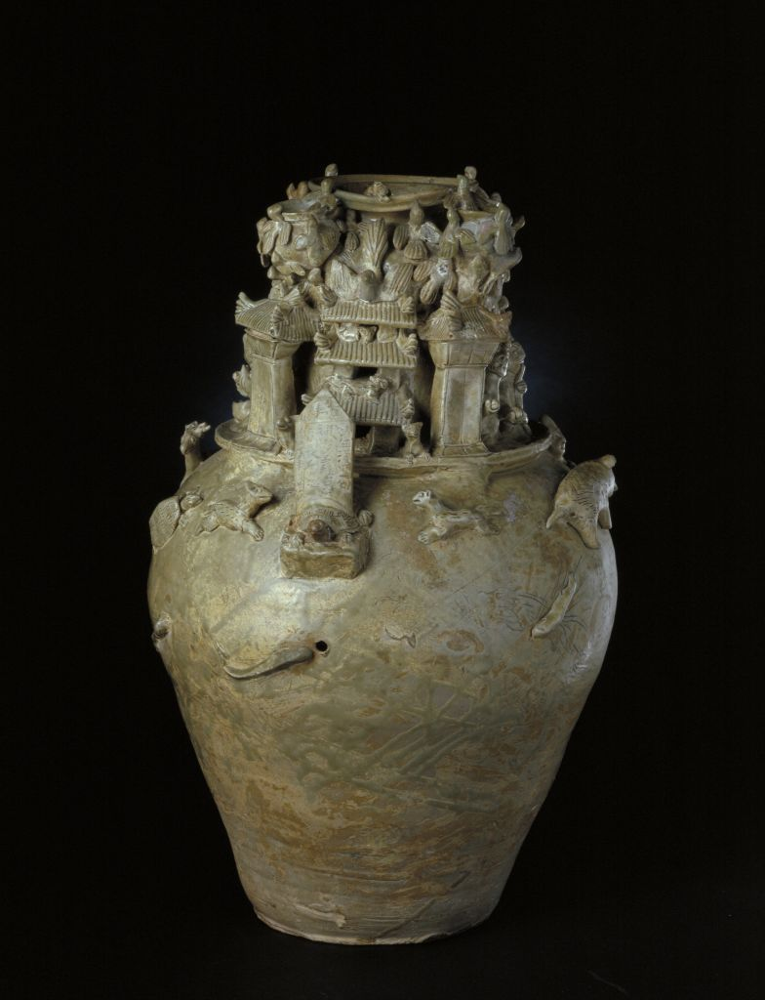

# 中外工艺美术史史论

> 历史 -> 文化 -> 好尚 -> 风格

------------------------------------------

- ## [中国工艺美术史](#中国工艺美术史)

	- ### [前言](#前言-中)
	- ### [重点素材](#重点素材-中)

	- ### [原始社会](#原始社会)
		- ### [旧石器时代](#旧石器时代)
		- ### [新石器时代](#新石器时代)
		- ### [图腾*](#图腾*)
		- ### [陶器*](#陶器*)
		- ### [马家窑彩陶](#马家窑彩陶)
		- ### [河姆渡文化](#河姆渡文化)
		- ### [良渚文化](#良渚文化)
		- ### [龙山文化*](#龙山文化*)
		- ### [蛋壳陶***](#蛋壳陶***)
		- ### [玉C龙***](#玉C龙***)
		- ### [良渚玉琮**](#良渚玉琮**)
		- ### [原始陶器的适用性原则*](#原始陶器的适用性原则*)
		- ### [中国原始陶器的成型方法与造型之间的关系*](#中国原始陶器的成型方法与造型之间的关系*)
	
	- ### [夏商西周](#夏商西周)
		- ### [二里头文化](#二里头文化)
		- ### [殷墟](#殷墟)
		- ### [妇好墓](#妇好墓)
		- ### [青铜器之酒器](#青铜器之酒器)
		- ### [青铜器之鼎](#青铜器之鼎)
		- ### [合范法](#合范法)
		- ### [青铜器装饰高潮**](#青铜器装饰高潮**)
		- ### [三层花纹](#三层花纹)
		- ### [兽面纹**](#兽面纹**)
		- ### [云雷纹*](#云雷纹*)
		- ### [窃曲纹](#窃曲纹)
		- ### [巧色](#巧色)
		- ### [原始瓷器](#原始瓷器)
		- ### [瓷器定义](#瓷器定义)
		- ### [青铜器在夏商周的发展和变化](#青铜器在夏商周的发展和变化)
		- ### [青铜器在夏商周的演进](#青铜器在夏商周的演进)
		- ### [原始社会夏商西周工艺美术总结](#原始社会夏商西周工艺美术总结)
	
	- ### [春秋战国](#春秋战国)
		- ### [曾侯乙墓](#曾侯乙墓)
		- ### [莲鹤方壶](#莲鹤方壶)
		- ### [金银错**](#金银错**)
		- ### [失蜡法**](#失蜡法**)
		- ### [鎏金](#鎏金)
		- ### [铜镜**](#铜镜**)
		- ### [带钩**](#带钩**)
		- ### [漆器**](#漆器**)
		- ### [夹纻](#夹纻)
		- ### [耳杯](#耳杯)
		- ### [彩绘陶](#彩绘陶)
		- ### [砑花陶](#砑花陶)
		- ### [考工记***](#考工记***)
		- ### [对考工记天有时地有气材有美工有巧合此四者然后可以为良的看法](#对考工记天有时地有气材有美工有巧合此四者然后可以为良的看法)
		- ### [春秋战国时期的丝绸](#春秋战国时期的丝绸)
		- ### [春秋战国时期的玉器](#春秋战国时期的玉器)
		- ### [春秋战国时期的金银器](#春秋战国时期的金银器)
		- ### [夏-秦汉青铜器艺术演进*](#夏-秦汉青铜器艺术演进*)
	
	- ### [秦汉工艺美术](#秦汉工艺美术)
		- ### [青铜器没落原因](#青铜器没落原因)	
		- ### [博山炉**](#博山炉**)	
		- ### [铜奔马](#铜奔马)	
		- ### [两汉铜镜](#两汉铜镜)	
		- ### [规矩纹](#规矩纹)	
		- ### [四神纹*](#四神纹*)	
		- ### [釭灯](#釭灯)	
		- ### [长信宫灯](#长信宫灯)	
		- ### [云气纹***](#云气纹***)	
		- ### [素纱褝衣](#素纱褝衣)	
		- ### [丝绸图案](#丝绸图案)	
		- ### [多子奁盒*](#多子奁盒*)	
		- ### [瓷器](#瓷器)	
		- ### [汉代装饰艺术风格](#汉代装饰艺术风格)
		- ### [两汉丝绸](#两汉丝绸)	
		- ### [两汉漆器的特点](#两汉漆器的特点)	
		- ### [春秋战国到秦汉工艺美术总结](#春秋战国到秦汉工艺美术总结)	

	- ### [魏晋南北朝工艺美术](#魏晋南北朝工艺美术)
		
		- ### [联珠纹***](#联珠纹***)	
		- ### [化妆土](#化妆土)	
		- ### [堆塑罐](#堆塑罐)	
		- ### [黄釉扁壶](#黄釉扁壶)	
		- ### [北方白瓷的影响和意义](#北方白瓷的影响和意义)	
		- ### [南北朝装饰纹样的变化**](#南北朝装饰纹样的变化**)	
		
	- ### [隋唐五代工艺美术](#隋唐五代工艺美术)
		- ### [何稠](#何稠)	
		- ### [窦师纶](#窦师纶)	
		- ### [凌阳公样**](#凌阳公样*)	
		- ### [绞缬](#绞缬)	
		- ### [夹缬](#夹缬)	
		- ### [蜡缬](#蜡缬)	
		- ### [唐代刺绣](#唐代刺绣)	
		- ### [宝相花](#宝相花)
		- ### [唐三彩**](#唐三彩**)	
		- ### [越窑**](#越窑**)	
		- ### [秘色瓷](#秘色瓷)	
		- ### [邢窑*](#邢窑*)	
		- ### [长沙窑*](#长沙窑*)	
		- ### [花瓷](#花瓷)	
		- ### [绞胎](#绞胎)	
		- ### [香囊***](#香囊***)	
		- ### [鎏金舞马衔杯皮囊银壶](#鎏金舞马衔杯皮囊银壶)	
		- ### [隋唐铜镜](#隋唐铜镜)	
		- ### [瑞兽葡萄镜](#瑞兽葡萄镜)	
		- ### [千秋镜](#千秋镜)	
		- ### [锤揲](#锤揲)	
		- ### [錾刻](#錾刻)	
		- ### [金银平脱](#金银平脱)	
		- ### [螺钿](#螺钿)	
		- ### [螺钿紫檀五弦琵琶](#螺钿紫檀五弦琵琶)	
		- ### [锦](#锦)	
		- ### [唐代丝绸的特点](#唐代丝绸的特点)	
		- ### [唐代丝绸的特点](#唐代丝绸的特点)	
		- ### [唐代装饰纹样的演变](#唐代装饰纹样的演变)	
		- ### [唐代金银器](#唐代金银器)	

	- ### [辽宋夏金工艺美术](#辽宋夏金工艺美术)
		- ### [刻丝](#刻丝)	
		- ### [吉祥图案](#吉祥图案)	
		- ### [定窑](#定窑)	
		- ### [汝窑](#汝窑)	
		- ### [宋代官窑](#宋代官窑)	
		- ### [均窑](#均窑)	
		- ### [龙泉窑](#龙泉窑)	
		- ### [景德镇窑](#景德镇窑)	
		- ### [建窑](#建窑)	
		- ### [吉州窑](#吉州窑)	
		- ### [磁州窑](#磁州窑)	
		- ### [皮囊壶](#皮囊壶)	
		- ### [青白瓷](#青白瓷)	
		- ### [辽代春水秋山玉](#辽代春水秋山玉)	
		- ### [两宋瓷器艺术总结](#两宋瓷器艺术总结)	

	- ### [元代工艺美术](#元代工艺美术)	
		- ### [织金锦](#织金锦)	
		- ### [满池娇](#满池娇**)	
		- ### [元代棉织业](#元代棉织业)	
		- ### [浮梁磁局](#浮梁磁局)	
		- ### [青花瓷***](#青花瓷***)	
		- ### [釉里红](#釉里红)	
		- ### [蓝釉瓷和红釉瓷](#蓝釉瓷和红釉瓷)	
		- ### [卵白釉瓷](#卵白釉瓷)	
		- ### [哥窑](#哥窑)	
		- ### [雕漆](#雕漆)	
		- ### [元代金银器](#元代金银器)	
		- ### [朱碧山和朱碧山小银塑](#朱碧山和朱碧山小银塑)	
		- ### [戗金银](#戗金银)	
		- ### [青白瓷](#青白瓷)	
		- ### [渎山大玉海**](#渎山大玉海**)	
		- ### [中国青花瓷的起源与发展](#中国青花瓷的起源与发展)	
		- ### [元青花与蒙古族的关系](#元青花与蒙古族的关系)	
		- ### [华夏文化对青花瓷的影响](#华夏文化对青花瓷的影响)	
		- ### [元青花与伊斯兰文化艺术的关系](#元青花与伊斯兰文化艺术的关系)	
		- ### [宋元工艺美术的比较](#宋元工艺美术的比较)	

	- ### [明代工艺美术](#明代工艺美术)
		- ### [顾绣](#顾绣)	
		- ### [斗彩](#斗彩**)	
		- ### [五彩](#五彩)	
		- ### [甜白釉](#甜白釉**)	
		- ### [德化白瓷](#德化白瓷**)	
		- ### [明代陶瓷不同时代特点](#明代陶瓷不同时代特点**)	
		- ### [宜兴紫砂](#宜兴紫砂)	
		- ### [螺钿](#螺钿)	
		- ### [百宝嵌](#百宝嵌)	
		- ### [髹饰录](#髹饰录)	
		- ### [掐丝珐琅](#掐丝珐琅)	
		- ### [宣德炉](#宣德炉)	
		- ### [竹刻](#竹刻**)	
		- ### [天工开物](#天工开物**)	
		- ### [明式家具***](#明式家具***)	
		- ### [明式家具艺术特点***](#明式家具艺术特点)	
		- ### [明式家具特点和成就***](#明式家具特点和成就)	

	- ### [清代工艺美术](#清代工艺美术)
		- ### [云锦](#云锦)	
		- ### [清代刺绣](#清代刺绣)	
		- ### [苏绣](#苏绣)	
		- ### [雪宧绣谱](#雪宧绣谱)	
		- ### [清代丝绸图案](#清代丝绸图案)	
		- ### [唐英](#唐英)	
		- ### [清代青花](#清代青花)	
		- ### [粉彩](#粉彩)	
		- ### [珐琅彩](#珐琅彩)	
		- ### 	
		- ### 	

- ## [外国工艺美术史](#外国工艺美术史)

	- ### [前言](#前言-外)
	- ### [重点素材](#重点素材-外)

	- ### [古代埃及工艺美术](#古代埃及工艺美术)
		- ### [旧石器时代](#旧石器时代)
		- ### [新石器时代](#新石器时代)
		- ### [陶器](#陶器)
		- ### [陶器的制坯方法](#陶器的制坯方法)

		- ### [黑顶陶器**](#黑顶陶器**)
		- ### [外工美彩绘陶](#外工美彩绘陶)
		- ### [化妆石板***](#化妆石板***)
		- ### [正面侧身律***](#正面侧身律***)
		- ### [沙芯法**](#沙芯法**)
		- ### [鱼形容器](#鱼形容器)
		- ### [古埃及玻璃制品的艺术特征](#古埃及玻璃制品的艺术特征)
		- ### [黄金王棺**](#黄金王棺**)
		
	- ### [古代两河流域工艺美术](#古代两河流域工艺美术)
		- ### [汉谟拉比法典](#汉谟拉比法典)
		- ### [翼狮与牡鹿](#翼狮与牡鹿)
		- ### [两河流域与古代埃及工美的比较](#两河流域与古代埃及工美的比较)

	- ### [古代波斯工艺美术](#古代波斯工艺美术)
		- ### [翼狮形角杯](#翼狮形角杯)
		- ### [萨珊银器](#萨珊银器)
		- ### [八曲长杯](#八曲长杯)
		- ### [联珠纹](#联珠纹)
		- ### [波斯织毯](#波斯织毯)

	- ### [伊斯兰工艺美术](#伊斯兰工艺美术)
		- ### [米奈型陶瓷](#米奈型陶瓷)
		- ### [华丽彩陶器](#华丽彩陶器)
		- ### [锡白釉陶器](#锡白釉陶器)
		- ### [白地多彩釉陶器](#白地多彩釉陶器)
		- ### [伊斯兰金属工艺突出发展的条件和原因](#伊斯兰金属工艺突出发展的条件和原因)
		- ### [大马士革波纹](#大马士革波纹)
		- ### [伊斯兰织毯](#伊斯兰织毯)
		- ### [伊斯兰工艺美术的特点](#伊斯兰工艺美术的特点)

	- ### [日本工艺美术](#日本工艺美术)
		- ### [绳纹式陶器](#绳纹式陶器)
		- ### [弥生式陶器](#弥生式陶器)
		- ### [埴轮](#埴轮)
		- ### [莳绘](#莳绘)
		- ### [乐烧茶碗](#乐烧茶碗)
		- ### [浮世绘](#浮世绘)
		- ### [友禅染](#友禅染)

	- ### [古希腊工艺美术](#古希腊工艺美术)
		- ### [古希腊陶艺](#古希腊陶艺)
		- ### 
		- ### 
		- ### 
		- ### 
		- ### 
		- ### 
		
		
-------------------------------------------

## 中国工艺美术史

## 前言-中
> 工艺美术的标准(最关心)：合宜 `适用性原则`  
> 工艺美术分为`造型`和`装饰`两部分，造型和装饰往往体现着功能的需要，造型的变化总小于装饰，比如碗的装饰变化各异，但是造型却变化不大。  
> 装饰与功能的联系不及造型密切，但是日用容器的`装饰有从立体向平面发展`的明显趋势(平面更易清洗)。元代以来的陶瓷装饰已经大体是彩绘的一统天下。  
> 工艺美术影响最广的装饰：`丝绸`装饰，`丝绸`和`陶器`曾是华夏文明传播的主要载体
> 日用品和欣赏品之间没有绝对的界限。 且普遍存在低贱的材料模仿高贵的材质的情况。官府制作的高档品往往成为其他工艺品雷标榜的对象。比如瓷器模仿玉的质地。
> 工艺美术的材料：材料主要三大类(陶瓷、金属、漆木), 材料限制形状，也对大小形状等其他细微的方面都有影响。  
> 工美的发展往往是伴随着材料的不断精炼挑选，和技术的不断发展改进。 比如中西方陶瓷和玻璃。 史论材料：瓷器的主要原料是磁石，磁石是绢云母和石英石的混合体，相当于高岭土、长石、石英石三者的混合矿物。但是西方因为材料一直不到位，直到18世纪初，博蒂格尔才烧造出欧洲第一件名副其实的硬质瓷器。史论材料：中国玻璃一直属于铅钡玻璃，西方玻璃一直属于铅钙玻璃。中国玻璃虽然是独立发明，但发展缓慢，因为主要成分是铅钡，所有烧造温度低，虽然绚丽多彩，晶莹璀璨但是不适用骤冷骤热，且透明度差。
> 工美创造的`出发点`大多是满足使用对象的`审美趣味`的功能要求。  
> 工艺美术史也是`技术的历史` 比如快轮成就了蛋壳陶，失蜡法使器物玲珑剔透
> 工艺美术建有`物质`和`精神`的双重属性。  
> 古工艺美术是`等级制度`的物质体现，官府的生产是时代`主导`，所以在不违制的前提下，民间产品常常`以官府为楷模`  
> 入宋开始兴盛非主流的士大夫情趣风格的工艺品，明清大盛。  
> 中国工艺美术始终绵延相承，自成体系。是长期传播中华文明的主要载体。
> 中国工美的文化特质
>> 1. 含蓄典雅：中国工艺美术含蓄典雅。这同西方的错金镂彩对比鲜明。优秀的作品强调意蕴，形象大多夸张变化，即使写实也重在神韵，不拘泥形似，观念的表达迂回曲折，注重渲染气氛，讲求象外之意。意蕴绵长，引诱欣赏者浮想联翩。含蓄典雅不仅是中工美的高明之处，也是其他不具备或者欠缺的最大艺术特色。
>> 2. 大而能化：中华文化丰富博大善于吸收学习，善于消化改造，不会轻易被外来文明产生根本性的影响，而是取精华去糟粕，滋补自己的发展。其他很多古文明却因为军事或政治原因，彻底改变或者中断了自己的传统。中国工美虽几度收到强烈的西方冲击，而外类因素不久又马上融入传统之中，工美一直都是绵延相继，自成体系。

## 重点素材-中
> 这些最好都找到图片材料  
> 64件不可出国展品
> 中国国家博物馆 每次展览展词介绍
> 原始：蛋壳陶，良渚玉琮，仰韶文化彩陶，玉C龙，神人纹彩陶双耳壶(蛙纹)，最早陶画 
> 春秋战国: 青铜器失蜡法和合范法，莲鹤方壶  失蜡法曾侯乙墓的尊盘 山字纹镜 错金银狩猎纹铜镜 镂空多节玉佩 彩绘窃曲纹漆豆 彩绘乐舞漆鸳鸯形盒, 暗纹陶鸭形尊
> 汉代：宫灯长信宫灯  绢地茱萸纹
> 唐代：香囊、绫锦  伊斯兰银壶清真食品logo
> 清代：金瓯永固杯* 

**原始社会**
----------------------------------------------------------------------------------------

> 已知`最早`的中国人类活动遗址发现在山西芮城的`西侯度`，距今约`180`万年。  
> 原始工艺美术往往带有`功利目的`，`自然崇拜`和`图腾信仰`的作用尤其突出。如仰韶文化大河村类型彩陶一再表现的太阳纹月亮纹，以及他们认为保佑族氏的图腾：半坡鱼纹和庙底沟鸟纹。  
> 古人没有软玉硬玉之分，他们认为`美石即为玉`
> `总结`：
>
> > 1. 功能和美观的统一：明确的功利性质，美退居其次
> > 2. 技术对艺术的制约：比如原始陶器捏塑适于制作小型器物，泥条盘筑适于制作较大器物，轮制可使造型规整，胎体薄厚均匀，快轮更成就了蛋壳陶。
> > 3. 形式法则的创造：造型已有对称、均衡和对比等，甚至已经熟练运用单独、散点、二方连续等图案构成。
> > 4. 经济原则的发明：比如多数彩陶装饰集中在视线能看到的地方，其他地方往往光素无纹。节约资源，经济适用
> `影响`：兽面纹被商周青铜器所沿用，陶盆陶碗比例尺寸仍在沿用，丝绸和陶器的发明。

#### 旧石器时代
> 以`打制`方式制成，最早的石工具称为`旧石器`

#### 新石器时代
> 距今约8000年开始进入新石器时代, `农耕`标志着新石器时代的开始。  
> 以`磨制`方式制成，`陶器`、玉器、纺织品、牙骨器、漆器日益发达。

#### 图腾*
> 图腾一词出自印第安奥基华斯部落的语言，意为氏族的标志。可以是动物植物甚至无生物  
> 母系社会中，人们认为图腾不仅不本氏族有亲缘，甚至还是氏族的祖先和保护神。因此表现图腾是礼敬，也是氏族兴旺生存无忧的保障。  
> 原始艺术中，图腾是重要的主体。例如仰韶文化半坡类型的彩陶中，鱼纹地位突出

#### 陶器*
> 以调水的黏土制坯，经800~1000 甚至>1000 高温烧制的器物，借助水和火焰，将松软的黏土制为坚硬的器物  
> 是人类最早的创造性劳动，其见证了人类从游牧到定居，标志着农耕文明的开始。  
> 陶器的制坯方法有按出现先后顺序有捏塑、泥条盘筑、轮制  
> 原始陶器的造型之美体现于黑陶，装饰之美体现于彩陶。
+ 红陶 (最早，氧化环境)
+ 灰陶 (还原坏境)
	+ 彩陶** 
	> 体现`装饰之美`。多为泥质红陶，先在坯体上以矿物质颜料绘制图案后烧，颜色不易褪脱，彩绘陶先烧后画 
	> 繁荣于新石器时代中期，彩绘题材以几何纹为主，如鱼纹、鸟纹、蛙纹、舞蹈人纹等。
	> 中国彩陶以黄河流域最为发达。中游仰韶文化(河南)、上游马家窑文化(甘肃马家窑，达到巅峰)出土的彩陶最为精美。
+ 黑陶 (强还原坏境)
	> 体现`造型之美`。在强还原气体的窑炉里烧成，温度高于同时的红陶和灰陶，精品为蛋壳陶  
	> 多数里外皆黑，所谓黑衣陶则是在灰陶和红陶外施加黑色陶衣，说白了就是熏黑的。
	> 晚期黑陶普遍采用轮制法成型，多以劲挺的造型取胜，素面器居多。造型周正、器壁均薄，漆黑光亮.
	> 河姆渡文化、良渚文化、龙山文化，下面有介绍，代表器为 猪纹黑陶锛。
	+ 蛋壳陶**
	> 下面有详细介绍
+ 白陶 (对原料要求很高)
	
	> 以白色黏土或者氧化铁仅为1.6percent的高岭土制作，故烧成后是白色的。因为商人尚白，故商代白陶尝尝是上层人物的礼器或殉葬品。且造型装饰都受当时青铜器的影响。
+ 原始瓷器
	
	> 原始青瓷出现于商代中期，烧成温度1200，比陶更坚固	

#### 马家窑彩陶
> 马家窑文化彩陶众多，装饰丰富，中国彩陶艺术致此达到巅峰。此类彩陶器表打磨光滑，多以色浓如漆的黑彩绘画。盆锛碗内壁常有精美图案，壶瓶常在外壁通体装饰。花纹主要以弧线构成点缀以圆点，流畅富有节奏，其中舞蹈人纹备受瞩目。

#### 河姆渡文化
> 年代约公元前5000-前3300年，发现于浙江余姚河姆渡。早期黑陶较为精美，出现了颇为写实的猪纹

#### 良渚文化
> 年代约公元前3300-前2200年，发现于浙江余杭良渚。分布在太湖南到钱塘江，北至江苏常州一带。  
> 黑陶出现在晚期，灰胎黑皮陶，常以快轮成型，造型规整，胎体一般比较薄，素面磨光，也伴有刻划和镂空彩绘装饰
> 良渚文化玉器特别精良出土量大。重选材而轻制作，良渚玉器最突出的装饰当属神人兽面纹。兽面纹仍为商周青铜器主要装饰题材。

#### 龙山文化*
> 年代约公元前2500-前2000年，发现于浙江余杭良渚。分布在山东东部江苏淮北
> 黑陶晚期较多，`普遍以快轮成型`，造型规整，胎壁薄厚均匀，工艺水平极高，素面磨光，偶有刻划和镂空彩绘装饰
> 蛋壳黑陶高柄杯出自此文化，

#### 红山文化
> 年代约公元前4000-前3000年，发现于内蒙古赤峰红山后遗址。分布在内蒙古东部、辽东西部、河北北部一带，红山文化玉器颜色多样，原始玉器多为透闪石，材料主要来自辽宁，作品多为动物造型，器型多样，风格刚健质朴。

#### 蛋壳陶***
> 新石器晚期出现的一种黑陶，以山东龙山文化出产的最精，代表着原始陶器的造型和工艺成就，占有者都是上层人。
> 采用快轮成型，器壁薄如蛋壳，造型周正，表面打磨精细，漆黑光亮。高度一般在25cm以下，重量仅50-70g。为焙烧时不塌陷且较坚实，陶瓷壁通常上薄下厚。
> `蛋壳黑陶高柄`：高26.5cm，厚不足1mm，口沿薄至0.2mm，底部厚度不足1-2mm。因底座太小，易倾倒，虽精美却不适用

#### 玉C龙***
> 出产自红山文化，材料是红山岫岩玉。由于中国人自认为是龙的传人，故红山文化里，玉龙最受推崇。
> 他们体型较大，高多在25cm以上，卷曲呈C形。若立置，则造型腾跃飞舞，颇有架云凌波，上天入海的气势。 被誉为华夏第一龙。
> 史论材料：中国华夏银行logo来源于中国国宝玉龙(C形龙)，玉龙是中国古代红山文化的典型器物，取材自辽宁岫岩玉，距今五千多年，被誉为华夏远古第一龙。龙是华夏文明图腾，此logo也凸显了华夏之意，而且此标志的外部造型釉毛笔书成并做图案化处理，更加简洁鲜明凸显了浓厚的中华文化底蕴。里面信用卡的造型代表了华夏银行符合当代电子化发展趋势，此标志内外形内方外圆，类似于中国古币，将华夏、银行、经济、文化、现代从视觉上融为一体。

#### 良渚玉琮**
> 出产自良渚文化，属于透闪石，玉琮是良渚玉器的典型器，外方而中有圆形孔洞。常常用来作礼地祭祀。造型一般粗矮，鲜有细长，最重有6500g。最典型器物是琮王，形制硕大，装饰精细，常可见装饰神人兽面纹。

#### 原始陶器的适用性原则*
> 1. 工艺美术讲求适用，陶器虽是中国原始艺术的早期样式，但对适用的原则，已经体现明确。
> 2. 原始陶器在造型上的适用：原始陶器之中，锛碗盆罐壶瓶之类最多，造型都和圆关系密切。例如锛碗盆基本都是圆的横切，罐壶瓶大体是圆的拉长。这大概是因为圆没有棱角，不论携行使用都难碰伤。圆还最容易制作，将坯料放置在陶轮上，用手提拉便可制得器物。圆可以承受最大的压力，使容器具有耐用性。圆的造型还最节省材料，同等规格，容积最大。圆的妙处还在于能遮掩变形，可令人获得更大的审美愉悦。
> 3. 原始陶器的适用性原则还表现在器物的尺度和比例。陶盆口径通常在30-40cm之间，小于人的肩膀，可以使端持省力。陶碗口径大多与今日相当，多在12-20cm之间，15cm最为常见，这样的大小不仅方便端持，更使其容量的重量适宜。为了视觉舒适，端持方便，放置安稳，今日的碗的口径、足径与高之比大体在2：1：1，而这样的比例早已被原始陶碗所采用。
> 4. 最能代表原始陶器装饰成就的就是彩陶。装饰纹样最常见的是几何纹和动物纹，几何纹是从写实的动物演变而来，而动物纹在原始社会是保佑氏族的图腾，因此，原始陶器的装饰往往带有`功利目的`。学者指出盆的装饰往往出现于内壁上部及口唇，外壁通常不加装饰，因为当时无椅登类的家具，陶器通常放置于地面，所以人无论立、蹲、坐器物总是在视平线以下，`彩陶装饰最常出现的部分恰恰最宜观赏`，一些彩陶图案因人的视线高低变化产生不同的艺术效果，这种做法就是今日的立体设计。

#### 中国原始陶器的成型方法与造型之间的关系*
> 按出现的先后，陶器的制坯方法有捏塑、泥条盘筑、轮制三种  
- 捏塑(早期)
	
	> 手捏成小器物，造型一般不规整。  
- 泥条盘筑(新石器中期)
	
	> 较大器物，用手把黏土搓成条由下而上层层盘成器物再用泥浆抹平填沟，大多胎壁比较厚
- 轮制
	> 快轮：快轮可以是器物胎体极薄，出现晚于慢轮。将坯料置于淘车旋转面的中央，旋转坯轮，用手提拉成型。黑陶就是以此手法制作所以一般比较规整，技艺最精当属蛋壳陶，蛋壳陶是新石器时代晚期的一种黑陶，蛋壳陶的名词解释。
	> 慢轮：蛋壳陶就是快轮，器壁薄如蛋壳。慢轮修整 快轮成形拉坯
	
**夏商西周**
----------------------------------------------------------------------------------------

> 也称先秦 公元前2070~公元前221，汉代之后衰落  
> 中国`奴隶社会`从夏延续到春秋战国之交，这个时期以使用青铜器为标志也叫`青铜时代`  
| 朝代 | 朝代时间 | 社会性质 |
| :----  | :----: |:----: |
| 夏 | 公元前2070年 - 前1600年 | 奴隶社会 |
| 商 | 公元前1600年 - 前1046年 | 奴隶社会 |
| 西周 | 公元前1046年 - 前771年 | 奴隶社会 |
| 春秋 | 公元前771年 - 前475年 | 奴隶社会 |
| 战国 | 公元前475年 - 前221年 | 封建社会 |
> - 夏不重要也没什么文字记载，商至少还有个甲骨文，铭文啥的。  
> - 商：礼记表记里面写到：`殷人尊神，率民以事神，先鬼而后礼`。商人杀人殉葬，衣着尚白，奉玄鸟为始祖。尊鬼神而轻礼义。祭祀`庄严又诡异`，`青铜器`是统治阶层炫耀财富显示权威的宝物，还是他们沟通天地，联络神人的法器，此时的青铜器充满了`威严诡异`的色彩。  
> - 西周：尚鬼神的观念逐渐淡薄，奢靡风气被压，酗酒被禁，以嫡长继承为核心的`宗法制度`确立。周人`崇尚礼乐`，处处体现着`森严的等级`，乐虽为音乐舞蹈，但终极目的却是`协调贵贱尊卑，维护上下秩序`。此时工艺美术仍然以`青铜器`为代表，装饰转向平朴，纹样有单纯化，几何化的趋向，神秘诡异的色彩逐渐隐退，创建了`严整规矩`的新风貌，酒器数量锐减，食器增加。`列鼎制度`形成并开始铸造编钟。
> - 商周青铜器造型装饰对同时期其他工艺美术品类影响很大，其主要原因是`青铜器所占据的文化核心地位`。从商晚期到西周早期，中国青铜器登上了第一个高峰。
> - 青铜器虽然美观耐用，但是材料难得不易制作，所有夏商西周`陶器`仍然是主要的容器类型。
> - 对于工艺美术来说，延续并不重要，重要的是继承
> - 两宋对于商周青铜器造型的模仿尤盛
> - 西周的礼仪通常是各王朝制度的模板。
> - 西周就已经出现铁器了。

#### 二里头文化
> 二里头遗址(河南洛阳)和二里头文化成为公认的探索`夏`文化的关键性研究对象。
> 对于夏文华，二里头文化和河南龙山文化是主要研究对象

#### 青铜时代
> 青铜时代是史前三代的第二阶段，在欧洲的起止时间是公元前3750-前600年，在中国的起止时间是公元前3000-前700年

#### 殷墟
> 是中国`商朝后期都城`遗址，位于河南省安阳市,殷墟因发掘甲骨文而闻名于世。
> `宫殿宗庙遗址`是殷墟最重要的遗址和组成部分，包括宫殿、宗庙等建筑基址80余座，妇好墓就在这里

#### 妇好墓
> 这是迄今为止发现的唯一一座保存完整的商王室成员墓葬，也是唯一能与甲骨文联系并断定年代、墓主人及其身份的商代王室成员墓葬

#### 青铜器之酒器
> 酒器最多种类最繁，商晚期达到巅峰，入周以后因为政府禁酒so地位下降。
> 商晚期觚是青铜酒器甚至青铜器的主体。尊是大中型的盛酒器物，有名的青铜双羊尊。
> 造型往往联系着功用，因为需要手持，酒器通常小而轻便，贮酒器则体量较大而且常有盖。  

#### 青铜器之鼎
> 鼎作为礼器的中心，烹饪仅仅是日常生活中的功用，祭祀时鼎不可或缺，很早就被赋予了‘明尊卑别上下’，的意义。
> 西周时代，大小有序的列鼎出现，其等级礼法意义更加突出。
> 鼎无论大小，造型通常规矩周正，装饰设计追求庄重肃穆。
> 因为禁酒令，西周青铜器主要为食器的组合。钟的出现已经晚到西周中期。
> 商代代表为后母戊鼎

#### 后母戊方鼎
> 是商代晚期的青铜器，是商王为祭祀其母后戊铸造的方鼎  
> 1939年出土于河南安阳，高133cm，重800多kg。后母戊鼎鼎身四周有精巧的蟠螭纹和兽面纹，让此鼎显得格外庄重。  
> 是现存中国已知最大的青铜容器，现藏于中国国家博物馆中。

#### 合范法
> 合范法是青铜器具`最早期`的制作方法。  
> 其工序要经过如下六道工序。  
> 1. `制内模`：先刻成刻线纹饰的泥制内模
> 2. `制外范`：再用泥于内模上压出外范，并切为几块
> 3. `制内范`：把内模刮去一层，成为内范，刮下的厚度即将铸器物的厚度
> 4. `合范`：内外范经阴干、烘烤后，固定合范，用泥加固，留出浇口，铸造大型器物还要留出排气、排渣口
> 5. `浇铸`：为防止铸造中的冷隔，模范须烘烤预热，而后浇注铜液
> 6. `修整`：铜液冷却后，打碎外范，取出内范，再对铸件打磨修整

#### 青铜器装饰高潮
> 青铜器装饰高潮出现在`商晚到西周早`。
> 器物装饰满密，动物纹是装饰的主体，相对现实动物虚幻的题材更多比如龙凤，其中狞厉威严的兽面纹最风靡。
> `强调立体效果`是此时期装饰的突出现象，比如，三层花纹(如下) 或 凸起的扉棱和圆雕的动物附件。

#### 三层花纹
> 三层花纹常以云雷纹做地，主纹是高出地纹的动物纹样，其上再加饰纤细线纹，形成了商晚期极盛的三层花纹。三层花纹强调`立体`的装饰效果，风行与商晚期到西周早期。

#### 兽面纹**
> 兽面纹是商代到西周早期最重要的装饰题材，通常用为主题，总是单独纹样出现在最醒目的位置
> 主要根据角或耳的形状，有牛头羊头虎头等不同类型，皆以鼻梁居中，左右严格对称，双目炯炯震人心魄。兽面纹有着重要的象征意义，或以为是图腾观念的遗留，或相信是祭祀的牺牲，也有人认为是被神化和改造的动物形象
> 宋代以来一般称饕餮，认为在表现一种有首无身且贪婪的食人怪物.

#### 其他动物纹
> 龙纹盛行于商和西周早期，或作兽面纹的组成部分，或以二方连续等形式作为独立的装饰。有的躯体延展，有的则卷曲，还有双龙纠缠等多种形式。
> 鸟纹最初只是青铜器的辅助装饰，商晚期变为装饰主题之一，西周早中期成为重要的装饰主题并以圆雕的形式成为造型的重要因素。鸟纹往往较大，形象富丽华美。大家都知道凤鸣岐山的典故，周人崇尚凤鸟，专家认为鸟纹就是在表现凤。

#### 云雷纹*
> 常见于商代中晚期~西周早期的几何纹样。
> two type：曲线的云纹 & 折角直线的雷文，他们由回旋的线条组成，通常用作主题纹样的地纹，间或大面积的出现在器物上，甚至作为装饰的主题

#### 窃曲纹
> 西周典型的青铜器装饰纹样，流行于周代早期~春秋早期, 原本也是一种动物纹样，应由兽面纹、龙纹、鸟纹演化而来。
> 窃曲纹如一横向的S，中央有目。通常左右排列，取二方连续的构图，显得严整有序。

#### 巧色
> 也称俏色，是玉石器雕琢的特殊手法，是衡量玉工巧拙的标尺。玉材很贵又常带杂色，将杂色设计制作为作品所需的部分，这就是巧色。

#### 原始瓷器
> 出现在商代中期，以粉碎后的瓷石制坯，烧成温度约1200，器表多施釉
> 原始瓷器在表面施有一层玻璃质的釉。此釉含草木灰和石灰石以及少量黏土，在入窑烧焙时熔化，形成玻璃状物质覆盖于坯体表面，不同烧造氛围烧出的颜色略有不同，釉色常为青或青黄，统称为青釉
> 多为容器，比陶器坚固，吸水性很低。

#### 瓷器定义
> 1. 胎料必须是瓷土，瓷土的成分主要是`高岭土`，并含有长石、石英石和莫来石成分；含铁量低。经过高温烧成之后，胎色白，具有透明或半透明性，胎体`几乎不吸水` 胎体质地坚实，叩击声音清脆
> 2. 瓷器的胎体必须经过`1200℃～1300℃的高温`焙烧，才具备瓷器的物理性能。各地瓷土不同，烧成温度也有差异，要以烧结为准。
> 3. 瓷器表面必须是在高温之下和瓷器一道烧成的玻璃质釉
> 陶器用陶土烧造，有吸水性，而且烧造温度低于瓷器800-900，很少有超过1000度，瓷器比陶器坚固

#### 青铜器在夏商周的发展和变化
> - 夏鼎是德行的象征、军权的化身，直至商周秦汉依然备受推崇。夏青铜器装饰较少，兽面纹是流行的主体，神秘诡异的风格特征已经显露。
> - 商代`酒器`众多。`商中期`器物明显较夏`厚重`，礼器更加丰富，装饰转为满密繁缛开始趋于`立体化`，`动物纹`是装饰的主体，渲染`神秘诡异`的气氛，胎体往往`极厚重`。   
> - 商晚期到西周早期(青铜器装饰高潮)：商代晚期因为酷爱饮酒所以酒器更加繁荣发达，大型器物数量颇多，作为礼器的中心，`鼎`尤其巨大，最著名的`后母戊方鼎`。
> - 西周中晚期：西周进入`中期`青铜器的新风貌也发展成熟。青铜器`酒器锐减而食器增多`，以食器为中心的礼器组合逐渐完备，列鼎制度产生，又开始铸造成组配套的编钟。
	>> + 装饰：渐渐主要变为牛头和作为周族图腾的`凤鸟`。与`薄鬼神而重礼仪`的观念想关联，趋于`简素平整`，兽面纹慢慢`简化`，`窃曲`和多种`几何纹`样成为时代的典型。与题材的变化相适应，`二方连续`则是最具有代表性的构图方式
	>> + 造型：不再追求复杂的空间变化，而是`趋向规矩整齐`，`器壁趋于轻薄`。
> - `总结`：造型单纯装饰平朴器类减少都意味着`艺术的衰落`，从`西周中期`开始，青铜器走下了第一个艺术巅峰。夏商西周青铜器的`装饰`走过了一个由`简陋到繁丽，再趋向单纯`的历程。由平实质朴到繁缛诡奇再到严肃规整，这是夏商西周的青铜艺术发展历程。
> - `启发`： 工艺美术是为人生产的，而人的喜恶受时代各个因素的影响。体现统治集团意志的官府制作一直都是主流。朝代的更迭并不意味着工艺美术的风貌会被迅速扭转，前代的造型装饰会被延续和继承。新统治集团的新意志新政策会引发新风格的诞生和成熟。

#### 青铜器在夏商周的演进
> - 青铜器基本都是红铜和锡的合金铸造的器物，加锡可以降低熔点和提高硬度增加美感 制作方法有合范法和失蜡法。青铜器在夏商西周时期代表了当时最顶尖的生产技术，是最重要的人造物品，是当时工艺美术的核心品类。大致跨越了中国古代的奴隶社会，有着一千多年的发展历史，被称之为青铜时代。夏青铜器装饰较少，兽面纹是流行的主体，神秘诡异的风格特征已经显露。  
> - 夏代 青铜器开始萌芽，体现出平实质朴的风格，青铜器装饰较少，器物类型普遍为工具兵器和牌示等。出现了绿松石镶嵌的兽面纹，神秘诡异的风格特征已经显露，青铜艺术走出原始阶段  
> - 商代由于殷人尊神，率民以事神，先鬼而后礼，青铜器用来沟通天地，显示权威，所以青铜器`神秘威严诡异色彩`增加。`商中期`器物明显较夏`厚重`，礼器更加丰富，装饰转为满密繁缛开始趋于`立体化`，`动物纹`是装饰的主体，兽面纹非常流行。这时期的青铜器装饰常常渲染`神秘诡异`的气氛，胎体往往`极厚重`，器物体型也普遍硕大。   
> - 商晚期到西周早期是青铜器装饰高潮，商代晚期因为酷爱饮酒所以酒器更加繁荣发达，大型器物数量颇多，作为礼器的中心，`鼎`尤其巨大，最著名的`后母戊方鼎`。后母戊方鼎是商代晚期的青铜器，是现存中国已知最大的青铜容器，现藏于中国国家博物馆中，是商王为祭祀其母后戊铸造的方鼎，1939年出土于河南安阳，高133cm，重800多kg。后母戊鼎鼎身四周有精巧的蟠螭纹和兽面纹，让此鼎显得格外庄重。
> - 周人重礼仪而薄鬼神，青铜器就用来明尊卑，别上下，所以青铜器`礼仪性`增加。装饰呈现`简素平朴工整规矩`的风格，明显的几何化倾向体现周人崇尚理性秩序。简化兽面纹、窃曲、重环慢慢成为主流，与题材的变化相适应，`二方连续`则是最具有代表性的构图方式。造型：不再追求复杂的空间变化，而是`趋向规矩整齐`，`器壁趋于轻薄`。西周实行禁酒令，青铜酒器锐减而食器增多，以食器为中心的礼器组合逐渐完备，列鼎制度产生，又开始铸造成组配套的编钟。
> - 造型单纯装饰平朴器类减少都意味着`艺术的衰落`，从`西周中期`开始，青铜器走下了第一个艺术巅峰。夏商西周青铜器的`装饰`走过了一个由`简陋到繁丽，再趋向单纯`的历程。由平实质朴到繁缛诡奇再到严肃规整，这是夏商西周的青铜艺术发展历程。
> - 从夏商西周青铜器的发展和演进我们可以受到很多启发：工艺美术是为人生产的，而人的喜恶受时代各个因素的影响。体现统治集团意志的官府制作一直都是主流。朝代的更迭并不意味着工艺美术的风貌会被迅速扭转，前代的造型装饰会被延续和继承。新统治集团的新意志新政策会引发新风格的诞生和成熟。

#### 原始社会夏商西周工艺美术总结
> - 功能和美观的统一：工艺美术造作的第一原则就是适用性原则，造型满足日常生活和显示权威的需要，装饰也含有功利目的。这种功能和美观的统一延续至今，现代设计师依然追求功能和美学的统一。
> - 技术对艺术的制约：原始社会工艺美术主要是陶器，到了夏商西周就变成了青铜器，之后制瓷技术发展，中国工美的主要品类又变成了瓷器。由此可见技术的发展引领者工美的发展。
> - 造型和装饰仍然被后世沿用，比如陶碗的造型以及比例尺寸，宋代之后的瓷器也多仿照之前的青铜器和玉器，这些经典的工艺美术都成为今日设计的素材和灵感来源。

**春秋战国**
----------------------------------------------------------------------------------------

> 平王东迁，东周开始，是为春秋
> 从春秋晚期起，工美逐渐走出庙堂回归生活关注适用，到战国，主流制作被清新华丽全面笼罩，青铜器的神秘色彩消退，礼仪性质减弱，人的思想空前自由，工美多为表现人性活动题材
> 艺术风貌：`清新华丽`
> 西周就有铁器，到战国进入了`铁器时代`
> 出现了很多新技法：模印制范法，`失蜡法`、`嵌错(错金银)`，针刻、`鎏金`、漆绘、麻布胎漆器
> 从

#### 曾侯乙墓
> 曾侯乙墓(湖北省随州市)是战国早期，周王族诸侯国中曾国的国君曾侯乙的一座墓葬，其中出土的曾侯乙编钟是迄今发现的最完整最大的一套青铜编钟。

#### 莲鹤方壶
TODO:插入图片
> 青铜制盛酒或盛水器，高126cm，1923年出土于河南新郑李家楼郑公大墓
> 中国首批禁止出国（境）展览文物，一收藏于北京故宫博物院青铜馆，一收藏于河南博物院。
> 此壶主体部分为西周后来流行的方壶造型，有盖，双耳，圈足。 从制作工艺上看，莲鹤方壶的铸造采用了圆雕、浅浮雕、细刻、焊接等多种技法，工艺精湛，反映了春秋时期的整体风貌，与商周时期的厚重庄严的青铜器风格形成了鲜明的对比
> 盖顶一鸟耸立，张翅欲飞，壶侧双龙旁顾，夺器欲出，壶底两螭抗拒，跃跃欲试，全部格局，在庞然大器的附着上，有离心前进动向，最足象征争求解放、迎接曙光的时代精神

#### 金银错**
> 也叫错金银，`初见于春秋中期`，流行于两汉，此后仍然不绝如缕，因为贵金属色泽更美丽，对比更强烈，效果最好  
> 制作方法：用尖锐的铁工具在器物表面刻图，镶嵌copper,gold,silver丝片，通常还要用锉石使之平滑不易脱落，提高亮度更加美观。也有铁器错金银也有银器错金

#### 失蜡法**
> 也叫错金银，`初见于春秋中期`，流行于两汉，此后仍然不绝如缕，因为贵金属色泽更美丽，对比更强烈，效果最好  
> 制作方法：用尖锐的铁工具在器物表面刻图，镶嵌copper,gold,silver丝片，通常还要用锉石使之平滑不易脱落，提高亮度更加美观。也有铁器错金银也有银器错金

> 出现在春秋晚期并且一直流行到现在的制作精密金属漆的方法  
> 制作方法：蜂蜡制成内模 -> 用泥浆敷内模制成外范 -> 高温熔化蜂蜡由预留孔洞排出 -> 注入铜浆 -> 冷却剥去外范  
> 曾侯乙墓出土的尊盘最受撑到

#### 鎏金
> 春秋战国器物局部出现了鎏金和鎏银，汉代通体鎏金的青铜器更多。入唐，鎏金银器更为常见。  
> 做法：以金箔调以水银，加热成为液态的金泥，涂在所需装饰的器表，经加热令水银挥发，留下金固着于表面，令器表金光灿烂。

#### 铜镜**
TODO:山字纹镜 错金银狩猎纹铜镜
> 古人鉴容的青铜用具，多呈扁平的圆形，正面光滑明亮，背面或光素或装饰精美，一般中间有钮。装饰通常随镜身一道铸成，战国后也有在背面追加华美高档的装饰  
> 最早出现在距今公元前2000的齐家文化墓葬，战国中晚期开始了铜镜最早的艺术高峰，汉唐两个高峰之后就不咋地了
> 不同地区的铜镜装饰风格各有特点，比如楚镜装饰满密，通常有四叶、菱形、蟠螭，`山字纹`(湖南最多，四山最多)等，  

#### 带钩**
> 又名：犀比、犀毗、师比，出现在西周晚期，已知最早的青铜带钩出自西周晚期墓葬，风靡于战国秦汉  
> 是古人扣接腰带或随身佩挂小件物品的器具。常作微曲的长条形或琵琶形等，首部弯曲，钩背设圆钮  
> 材料以青铜居多，也常见金银玉等，展示型极强，常用鎏金镶嵌错金银等手法装饰倍受上层人士的重视

#### 漆器**
TODO: 彩绘窃曲纹漆豆 彩绘乐舞漆鸳鸯形盒 图片
> 以木(最多)\竹\麻木\纸为胎,用大漆(可以抗酸防腐)髹饰的器物。漆树取漆液去水分滤杂质为生漆 -> 加温精制为熟漆 -> 经处理的熟漆髹饰的器物就是漆器  
> 最早出土于距今六七千年的河姆渡文化遗址，是战国重要的工艺美术门类，黑地红绘的彩绘装饰尤为常见，题材以动物纹居多。到了两汉最为繁荣，唐以后的观赏性更强。
> 战国时还有胎上先刷漆灰(以角、骨、砖等粉末调和生漆而成的糊状物)再髹饰的实例。刷漆灰意在使器表更平整
> 漆器种类很复杂，大致归类为以下
1. 素漆器 只有一个颜色 春秋战国之前大致都是这种漆器
2. 描绘漆器 带有画意 比如春秋战国-两汉的彩绘漆器
3. 雕刻漆器 动刀装饰 比如宋元时代的雕漆
4. 镶嵌漆器 比如唐代流行的金银平脱、螺钿，明代的百宝嵌

#### 夹纻*
> 一种漆器的做法，木胎易裂变，`战国中期`有了在木胎上裱糊麻布的做法，因麻布古称纻，这种方法遂称夹纻
> 后到战国晚期，有开发了一种新做法：用涂漆灰的麻布在木模或者泥模裱糊若干层，干后去模，在麻壳上刷漆，这种漆器使用的完全是麻布胎，所以非常轻便，魏晋以来制作常车载人抬的佛像。此技法被传承改进，时至今日依然沿用。

#### 耳杯
> 在现代看来是仿生造型，又称羽觞，一种漆器容器。战国中晚期数量已多，如汉更加流行。

#### 彩绘陶
> 彩绘陶在战国秦汉时期最为风靡，此后仍然不绝如缕，但容器比例降低雕塑性作品比例提高  
> 彩绘陶的图案是在磨光的器物表面直接绘制，或先涂底色，然后绘出，与先绘制后焙烧的彩陶不同。

#### 砑花陶
TODO: 暗纹陶鸭形尊 图片
> 一种在战国北方流行的常作为陶明器的暗纹陶，胎质多较细腻，烧成温度不高，胎呈灰色或灰褐色，表面为黑色。
> 装饰通常在未干透的坯体表面压印和刻划，打磨后图案似隐若现效果极佳。

#### 考工记***
> `第一部系统的手工艺著作`，也是世界最早的合金配比文献是，非一人一时著成，最终成书与战国时代的齐国，现有7100多字，西汉补入`周礼`，从此成为儒家经典的一部分
> 提出“天有时，地有气，材有美，工有巧，合此四者，然后可以为良”, 对应手工业生产所需 时令 环境 材质 技术四个要素
> 考工记将社会职业划分为王公、士大夫、`百工(手工业者)`、商旅、农夫、妇功六种，将百工定义为：审曲面执，以饬五材，以辨民器
> 考工记的重要首先在于它重视发展生产力的思想，总结了当时的制作，该书在中国科技史、工艺美术史和文化史上都占有重要地位。自东汉以来各名家对考工记注疏不断，今日的相关读本和研究更多。

### 对考工记天有时地有气材有美工有巧合此四者然后可以为良的看法
> 考工记是第一部系统的手工艺著作，最终成书与战国时代的齐国，西汉补入`周礼`，从此成为儒家经典的一部分，它重视发展生产力思想，总结当时的制作，在中国科技史、工艺美术史和文化史上都占有重要地位，考工记把"天有时，地有气，材有美，工有巧，合此四者，然后可以为良"作为设计和造物遵循的基本原则。对后世影响深远，虽为先秦时期所著但至今仍有实用价值。
> 在这条原则中，天有时，地有气被放在前两位，可见在当时天时地利在工匠心中占有最基础和根本的地位。在工匠们日常工作中应首先确保不会违背天地法则才能造出可以为良的物品，这反应了当时人们对大自然的崇拜。一年四季二十四节气，人们意识到气候变迁是影响草木山水的主要因素，所以天有时是造物的首要条件，比如“凡为弓， 冬析干，而春液角，夏治筋，秋合三材，寒奠体，冰析爵。”即冬天剖木制作弓干，春天浸制牛角配件，夏天制造筋绳，秋天用丝胶、漆组装弓箭，冬天调校，第二年春天再上弓弦，弓箭制造才得以完成。中国地大物博，不同地区有不同的地理面貌和气候特征，土地的自然特性决定了动植物的根本属性，土地也是人的根本，所以人造物和设计也自然是地气的产物，比如”郑之刀，宋 之斤，鲁之削，吴粤之剑，迁乎其地而弗能为良，地气然也“。认识自然，遵守自然的规律，这是设计所必须遵循的基本准则，时至今日也是十分宝贵的设计思想和精神。
> 造物必须依靠一定的材料，使用与材料相应的工艺技术，材料是基础，技术是保障。材有美，工有巧缺一不可，所以求材美，树工巧也成了匠人们的普遍追求。材有美可以代表如美玉，象牙，红木，贵金属等无论在哪个朝代和地区都被世人追捧的高档美材或者只有某个地方独产的特色材料；也可以指经匠人研究体验找出其特点的普通材料，比如竹子虽不名贵也不难得，但韧度高不易折可以用来做簸箕、篮子等。对材料的认知程度决定了工艺美术的发展深度，只有明确造物的需求，然后根据需求选材，才能成就材之美。不过成就材之美仅有“美材”可不行，还必须经过精心的加工制作, “工有巧”对“工”的要求是“巧”，巧代表着各种技法。不同材料的化学成分和组成结构有着很大差异，所以因材施技尤为重要，比如木材的加工工艺因木之质而有锯、刨、削、榫之类的分别，金属材料而有相应的锻、炼、锤打等工艺。从材料与工艺的关系看，工艺是加工材料的工艺, 材料是基础，工艺是基于材料的本质属性形成属于自己的程序和方法，所以材料和技术就构成了互为的关系。
> 对于这句话我们也可以反过来看，在观察任何一件可以为良的工艺品时，我们都会感叹加工此物的匠人的精巧手艺，但巧妇难为无米之炊，没有实实在在的物理材料，匠人也无法施展他们的绝技。所有材料究其根本，都是取之自然。天地孕育着自然万物，匠人顺应天地法则而为，因材施工，施工以巧，以成良器。考工记虽然成书与先秦战国，但其中的设计准则依然可以沿用至今适用性极强，包含了我国古代先人的大智慧，代表了中国古代工匠的匠人精神。

#### 春秋战国时期的丝绸
> 丝绸是个统称，起源于新石器时代，泛指以蚕丝织造的各类纺织品。在中国丝绸地位极高，生产遍布城乡，与国计民生息息相关  
> 丝绸是高级服装的主要面料，装饰内容和面料都体现着等级制度，极具展示型，引领着时代装饰的潮流  
> 最早出土的锦出土于辽宁朝阳的西周早期墓  
> 中国工美影响世界的历史由周代的丝绸发端。

#### 春秋战国时期的玉器
TODO: 镂空多节玉佩图片
> 春秋战国时玉被赋予了更多的道德伦理意义，因圣贤的倡导，中华民族重玉的观念就愈发明确 “君子无故，玉不去身”  
> 战国的玉器普遍华丽精巧，器物常呈薄片状，典型如中间有孔的扁平圆形的璧  
> 与西周相比，春秋玉器的和田玉比例大增，至战国(铁器时代)，和田玉成为主流  
> 曾侯乙墓出土的`镂空多节玉佩`造型华贵，是战国玉器的瑰宝

#### 春秋战国时期的金银器
> 直到战国，银器才明显增多，此前几乎是金制品一统天下。  
> 技法：锤揲、錾刻、掐丝、镶嵌、焊缀小金珠  
> 掐丝：是将金银薄片剪成细条，再搓成丝，把它按某种形状焊接在器物上，便成为镶嵌物的外框。掐丝和焊缀小金朱常搭配使用。

#### 夏-秦汉青铜器艺术演进*
> - 青铜器开端于夏，基本都是红铜和锡的合金铸造的器物，加锡可以降低熔点和提高硬度增加美感，制作方法有`合范法`和`失蜡法`，青铜器的`铭文`(又称钟鼎文、金文)不仅是无可替代的文献史料，还能为青铜器断代提供依据。夏商西周时期承担着祭祀天地别尊卑的功能。代表了当时最顶尖的生产技术，是最重要的人造物品，是中华文化艺术乃至科学技术的代表。经过商代和春秋战国两个高峰之后，汉代走向衰落  
> - 夏代 青铜器开始萌芽，风格：`平实质朴`，出现了绿松石镶嵌的兽面纹，青铜艺术走出原始阶段  
> - 商代 由于殷人尊神，率民以事神，先鬼而后礼，青铜器用来沟通天地，显示权威，所以青铜器`神秘威严诡异色彩`增加，青铜器兽面纹主题较多, 特点：造型厚重，体型硕大，风格神秘诡异，饮酒器比较多  
> - 周代 因为重礼仪而薄鬼神，青铜器就用来明尊卑，别上下，所以青铜器`礼仪性`增加。风格：`简素平朴工整规矩`+明显的几何化倾向+崇尚理性秩序。简化兽面纹、窃曲、重环是主流，铭文加长。列鼎制度形成，开始有成套编钟  
> - 春秋时期，战国时代。思想空前自由，青铜器回归生活地位下降，为了方便清洗，造型空间变化减少，器壁更加轻薄，装饰趋向平面化。铜镜带钩等日用品发达。`神秘色彩减弱，礼仪性衰退`。风格：`轻扬灵动，清新华丽`+ 动物造型居多(尤其是龙或者变体蟠螭)+实用性增加，漆器虽然繁荣，但是青铜器在上层生活中的地位难以动摇，仍然是时代艺术的中心。  
> - 秦汉以后，漆器工艺和制瓷工艺繁荣发展。体现了夏商西周时期社会观念的演进和统治阶级的意志的`青铜器quit`。青铜器的发展代表了华夏早期文明的发展。先秦时期的文化对日后中华民族文化的发展起到了十分重要的奠基作用。

|  属性/朝代   | 商 | 西周 | 春秋战国 |
| :----  | :----: |:----: |:----: |
| 历史文化 | 笃信武术，重视祭祀 | 薄鬼神而重礼仪 | 礼坏乐崩，社会思想活跃 |
| 主要功能目的 | 沟通天地，显示权威 | 明尊卑别上下 | 回归生活，关注适用 |
| 风格面貌 | 威严诡异 | 严整规矩 | 清新华丽 |
| 造型 | 1. 器型硕大体态厚重 2. 饮食器和饮酒器居多 | 1. 酒器锐减食器增多 2. 造型简素器壁轻薄 | 1. 器壁更加轻薄注重适用 2. 动物等新的造型流行 |
| 装饰 | 1. 装饰繁缛布局满密 2. 强调立体效果 | 1. 布局转向简洁 2. 鸟类几何纹样流行 | 1. 装饰趋向平面化 2. 新题材多为龙或者其变体 |
| 工艺 | 合范法 | 合范法 | 合范法 失蜡法 |

**秦汉工艺美术**
----------------------------------------------------------------------------------------

| 朝代 | 朝代时间 | 社会性质 |
| :----  | :----: |:----: |
| 秦 | 公元前221年 - 前206年 | 封建社会 |
| 西汉 | 公元前206年 - 公元8年 | 封建社会 |
| 新莽 | 公元9年 - 25年 | 封建社会 |
| 西汉 | 公元25年 - 220年 | 封建社会 |

> 秦15年灭国，主要讲两汗(427，最久)，两汉，彻底告别了和对诡秘威严的鬼神世界的向往，神仙思想弥漫，人们期盼长生，热烈追求来世的幸福所以殉葬品十分精美。
> 史学家把汉武帝(公元141)登基视为西汉中期的开始，章帝(公元88)故去视为东汉早期的结束
> 浪漫瑰奇的`楚文化`对汉代时代风格的形成发挥了重要作用  
> 汉武帝的两个举措对工美影响深远：1. 独尊儒术，罢黜百家 2. 开通丝绸之路
> 若比较两汉的官府造作，则西汉胜过东汉
> `漆器盛行`，瓷器制造水平还不行。`青铜器颓势`无可逆转，多为生活用品，灯具，熏炉，镜子，越来越简朴  
> 重点： `神仙思想` 神像思想衍生的`厚葬之风` `技艺突破`  
> 风格: `灵动瑰奇`，或写实或夸张，或疏朗或满密，但都充满了运动感，洋溢着蓬勃向上的力量

#### 青铜器没落原因
> 漆器的繁荣，陶瓷的发展渐渐代替材料难得，且铸造成本高的青铜器成为主流，但是无法取代是铜镜，两汉仍然是铜镜艺术的高峰期  
> 社会在进步，人们更关注文明的发展，逐渐注重适用性，巫术衰落，无须再借助青铜器沟通天地神人，旧制度瓦解，也不必以青铜器显示权威。  
> 青铜器主要成为生活用品，器物趋向轻便，装饰日渐简朴，素面器成为主流。
> 适用性原则既反映于平面化的装饰，还表现在器型的合宜和器体的轻薄，不过灯具的发展情形却不相同，样式很多，题材新颖富有创意。

#### 博山炉**
> 常见焚香器具，炉体呈豆形，盖高而尖，雕镂成山形。
> 工艺精湛鎏金错金银都会使用。是熏香器具和海上仙山传说结合的产物，中间装饰有灵噙走兽，香料燃烧，烟气冒出似仙境云雾缭绕，体现神仙思想。

#### 铜奔马
> 东汉时期一件极为珍贵的浪漫主义情怀的青铜工艺品
> 骏马昂首嘶鸣，身形矫健，三足腾空，一足踏飞燕着地。表现了骏马凌空飞腾极速奔跑的雄姿，体现出汉代奋发向上，豪迈进取的精神
> 工艺精湛，造型写实。现在为中国旅游标志。

#### 两汉铜镜
TODO: TVL式花纹 图片
> 两汉仍是铜镜艺术的高峰期，青铜器普遍走向简朴，镜纹却愈加丰富精美。
> 汉镜一般不大，通常直径在15厘米上下，小的不足5cm，20cm以上的很少见。
> 西汉早期继承了战国晚期铜镜的特点，蟠螭纹，山字纹都很常见。规矩纹也是在西汉早期出现，武帝时期(西汉中期)开始流行，两汉之交极盛，东汉晚期依然常见。`规矩纹`如下名词解释
> `四神纹`也是汉代铜镜的主要样式，四神纹说明如下
> 铭文是汉镜的重要装饰，即可出现在镜缘，也能铸造在中央，可以解说镜纹含义，也可能是期盼家族兴旺国盛民昌的吉祥话。

#### 规矩纹
> `规矩纹`即`TVL式花纹`，又称博局纹。  
> 西汉中期出现，武帝时代开始流行，两汉之交极盛。  
> 通常和四神五灵或者神人纹搭配，在汉人心中，规矩纹组成了一个象征天地图案。代表了天地的框架

#### 四神纹*
> 以青龙、白虎、朱雀、玄武组成的四神或四灵是重要的汉代纹样，出现于铜镜，在陶瓷特别是瓦当上应用甚广。  
> 象征着(顺序分先后) 东、西、南、北四个方位或者 春、夏、秋、冬四个季节。汉代五行说盛行，因此额外加麟(独角兽)组成五灵。  
> 体现了汉人神仙思想和辟邪求福

#### 釭灯
TODO: 彩绘青铜雁鱼灯 图片
> 汉代灯的样式各种各样，装饰异常丰富几乎所有技法都被采用过，但是考究的铜灯只在宫廷使用，百姓灯具多为陶瓷  
> 其中釭灯往往装饰华丽，设计极具匠心。他们普遍设有`吸烟管`，能将烟气导入灯身，灯身通常可以`贮水`溶解烟气。灯罩的`罩板`可以开合，以调节光纤的强弱和光照的方向。
> 釭灯的造型多样，有人形、牛鸟形甚至是炉形的变形等，或写实或夸张凝聚了艺术的美妙其中人形灯最受瞩目，比如`长信宫灯`如下

#### 长信宫灯**
TODO: 长信宫灯 图片
> 汉代灯的样式各种各样，装饰异常丰富几乎所有技法都被采用过，但是考究的铜灯只在宫廷使用，百姓灯具多为陶瓷
> 西汉杰出铜灯。出土于满城汉墓。
> 命名由来：灯神刻有长信铭文，曾为窦皇后所居长信宫中使用
> 造型解释：一名温顺宫女跪坐，左手持灯盘，右臂上扬袖口下垂为灯罩。烟气从灯罩进入灯身，降低空气污染。短柄可以调节光线强弱，头部 手臂 灯盘 底座都可以拆卸擦洗。
> 总结特点：通体鎏金，情节适用，雕塑艺术的审美+工艺设计的功能性
> 启发和影响：功能和形式的统一，优雅艺术形式完全为功能服务。体现科学性，人性化，环保性，实用性，交互，少污染，创意性, 这都是当代设计所考虑的因素。
> 不能贮水

#### 云气纹***
> 汉代工艺美术的装饰中，云气纹最具代表性(神仙思想嘛)，它以线形的舒卷起伏为主要的表现形式，增加图案动感，分割画面又能产生统一。
> 很少单独出现，往往和瑞兽灵噙或动物纹组合出现(又称云虚纹)，气氛热烈，缭绕漫卷，布局满密，姿态飘逸，动感

#### 素纱褝衣
> 是汉纱的杰出代表作品，出自马王堆一号墓，是世界上现存年代最早、保存最完整、制作工艺最精、最轻薄的一件衣服，国家一级文物，藏于湖南省博物馆。  
> 这件褝衣结构精密细致，孔眼均齐清晰，而且轻薄如烟重仅49g。如此轻薄靠的不是降低经纬密度，仅凭丝线的纤细，哪怕现代工艺仿造起来也相当复杂，代表了西汉初期养蚕、缫丝、织造工艺的最高水平。
> 汉人独爱轻薄的丝绸，汗末蔡邕指责“帛必薄细”的现象来批评当世的浮靡。

#### 两汉丝绸
TODO: 印花敷彩纱局部 图片
> 丝绸是个统称，起源于新石器时代，泛指以蚕丝织造的各类纺织品。在中国丝绸地位极高，生产遍布城乡，与国计民生息息相关  
> 丝绸吸湿透气，是高级服装的主要面料，装饰内容和面料都体现着等级制度，丝绸纹样极具展示型，引领着时代装饰的潮流  
> 秦汉工美最大成就体现于丝绸的进步，从此，丝绸成了中国最重要的工美品类
> 劝奖农桑令汉代丝绸产量大增，不仅官府织造发达，民间生产也迅速发展  
> 西汉丝绸主要出土于长沙马王堆汉墓，东汉织物主要出土于新疆和甘肃，这是为啥呢，因为在西北丝绸较容易保存，而且位于丝绸之路上，普遍带有异域色彩。  
> 锦长期是声誉最隆的丝绸品种，其装饰也往往是丝绸乃至工美的代表，四川成都的蜀锦驰名中外。  
> 染色也是制作织物的重要步骤，色彩关乎礼制，汉代染色基本靠植物染料和矿物染料  
> 丝绸标志着时代的潮流，其装饰荟萃着艺术的精华，对其他工美门类影响巨大。
> 装饰的特点详见如下`丝绸图案`

#### 丝绸图案
TODO: 绢地茱萸纹 图片
> 西汉的丝绸图案以马王堆的出土物为代表，构图满密，大量采用`动物`题材是汉代丝绸图案的重要现象，除了绢地茱萸纹，植物纹真的特别特别少。  
> 汉代丝绸图案中`几何纹`最多，菱纹是典型，菱纹一般以大菱纹居中，两侧各套一个小菱纹，形象类似耳杯。包括东汉在内，植物纹更少，常见多种动物纹再配上云气组成的云虚纹。东汉的锦面上常有吉祥语词。
> `西`汉丝织品图案常取用`散点式构图`，而到`东`汉则多取`四方连续`，题材繁满紧凑，动物形象一般夸张变形，强调`动态`，极富生命力。东汉的锦面上通常织出吉祥语词。

#### 两汉漆器的特点*
> 西汉漆器把青铜器比下去了`达到了巅峰`成为主要饮食器具，出现很多高档漆器。东汉中期以后，也许和陶瓷发展的挤压有关，漆器盛极而衰。  
> 两汉漆器`种类丰富，造型百变`。举例：杯具盒和多子妆盒的介绍。  
> `制作方法`：木胎 布胎 泥胎 麻布胎(又称纻器:西汉中期开始成为高档漆器普遍制胎方法)
> `技法和题材`：彩绘，锥画，金银贴薄花(唐代发展成了金银平脱)，镶嵌。彩绘仍然是主要的装饰手法，装饰的主要题材是云气纹，常以云虚纹的形式出现，强调动态，纤细轻佻飘逸神仙  
> 一杯卷用百人之力，一屏风就万人之功，漆器成了上层社会的主要饮食器具

#### 多子奁盒*
> 战国时期酒器演化而来，多子奁盒在较大的容器内放置造型各异，大小不一的若干小盒。节省空间，携带方便，清洁卫生，极其适用。
> 是汉代设计功能突出的漆器品种，典型器如多子妆奁和杯具盒。

#### 瓷器*
> 原始瓷器出现商代中期，瓷器诞生于`东汉`，最早发明与中国，宋代为高峰，中国陶瓷文化的核心
> 以瓷石+高岭土为坯，上釉后，1300左右高温烧制。胎体紧密坚实，扣击声音清脆, 诞生于东汉浙江上虞地区, 至今仍是餐饮器的主要类型
> 浙江是东汉瓷器的主要产区，这一代的陶瓷窑厂被称为`越窑`。刻划堆贴堆塑是常规的装饰手法。

#### 汉代装饰艺术风格
> 1. 受神仙思想的影响，汉代装饰艺术特征: `灵动贵气`是汉代服装装饰艺术的`典型特征`。追求纹样的神韵、形象的完美，装饰纹样或者充盈天地，流管自然，或写实或夸张，或疏朗或满密，但都充满了运动感，洋溢着蓬勃向上的力量
> 2. `丝绸`是潮流，`云气纹`是丝绸的潮流，云气纹名词解释
> 3. 汉代`重要纹样`：四神\灵(青龙、白虎、朱雀、玄武) 经常出现在铜镜、陶瓷、瓦当(尤其) `神仙思想 辟邪求福`

#### 两汉玉器
> 独尊儒术对玉器的发展影响重大，孔子将玉赋予了极高的道德含义。
> 和田玉最被看重，礼仪用玉衰落明显。

#### 金缕玉衣
> 两汉厚葬之风盛行，而且汉人相信玉石可令尸骨不朽，精气不泄
> 玉衣是两汉帝后亲贵的殓服，以小玉片编缀而成，编缀玉衣的有金银铜丝缕，到了东汉，缕的材料成了区别主人神人的标志。

#### 春秋战国到秦汉工艺美术总结
> TODO:

**魏晋南北朝工艺美术**
----------------------------------------------------------------------------------------

| 朝代 | 朝代时间 | 风格 |
| :----  | :----: |:----: |
| 三国 | 公元220年 - 265年 | 延续汉风，透露清新自然 |
| 西晋 | 公元265年 - 316年 | 和三国差不多，以西晋的覆没为界限，此前风格统一，此后分为南北系统 |
| 十六国 | 公元304年 - 439年 | 清新自然被扼杀，雄强华丽 |
| 东晋 | 公元317年 - 420年 | 汉风被放弃，逐渐演化出清秀温柔 |
| 南朝 | 公元420年 - 589年 | 汉风被放弃，逐渐演化出清秀温柔 |
| 北朝 | 公元386年 - 581年 | 封建社会 |

> 背景战争政权交替是中国历史上最混乱的时候，工艺美术发展艰难，魏晋南北朝并没有形成统一的工美风格，而是内涵丰富面貌多样。  
> 北方工美实在汉胡取长补短的大背景下发展的，也被西域文化影响，丝绸陶瓷金银器常带有异国情调。南方工美则毕竟纯净，较少受到外来干扰，不断汉化  
> 丝绸容易腐烂难以保存，气候干燥的新疆成了古丝绸的主要发现地，虽然织造水平有限，但是体现了文化交融。
> 陶器很重要，青瓷是主流，白瓷的创造更有意义。  
> `佛教`发展起来，影响了工艺美术，如装饰题材莲花，夹纻造像
> 重点：这时期工美成就不算辉煌，但是是个很重要的转折点 灵动瑰奇 -> 清秀修长清新自然。交融碰撞出的新的艺术特点。装饰纹样的变化趋势(`清新自然，清秀修长`)

#### 联珠纹***
> 联珠纹都由什么`组成`: 由一个个小圆珠组成。圆珠或排成条带等形状，或围成圆，以包围主题纹样，成为联珠圈，联珠圈是联珠纹的典型。
> 应用`时间和地区`: 是公元6世纪~公元7世纪后期中国最重要的装饰题材，也是波斯地区重要的装饰纹样，应该传自波斯。   
> 特点：常见有翼动物，中土未有的狮子，少见的大象，短窄的胡服，作隆准的胡相，甚至西方神像，与当时传入的萨珊文化有关

#### 化妆土
> 反复淘洗质地细腻的白色瓷土(含铁量低)制成的泥浆, 涂在胚体表面来遮掩坯料较差颜色较深的产品  
> 出现在三国时代，婺州窑是以施化妆土为常规工艺手段的已知最早瓷窑

#### 堆塑罐
> 模仿动物造型常常借助堆塑的手段，形象最繁复的是又称谷仓罐或魂瓶的堆塑罐。主要是三国越窑烧造的殉葬品，三国晚期最精美。
> 堆塑形象常有现实的楼阁庭院其间布列主仆乐舞禽畜等，也有虚幻的仙人佛像。继承了汉代便流行的神仙思想，也体现了佛教影响扩大的体现。

#### 黄釉扁壶
> 
> 造型与拜占庭(东罗马帝国)的扁壶相仿，壶腹两面的印花不仅包括了敏感的联珠忍冬，主题更为中亚乐舞with胡服胡相  
> 最能直观说明北朝上层对西方文明的钟爱。 

#### 北方白瓷的影响和意义
> `最早出现`在`北齐`晚期，出自安阳范粹墓，釉面呈现明显泛青。
> 中国瓷器可以分做颜色釉和彩绘瓷两大类，白瓷的出现意味着又增添了一种釉色，更为彩绘瓷器提供了最佳的釉色选择。
> 北方烧制瓷的技术和历史都不如南方，那为什么还能`首创`技术要求更高的白瓷呢，这与占据统治地位的北方民族有关，萨满教认为白色是吉善的象征，信奉萨满教的北方统治者特别喜欢白瓷。从这个例子中不难看出，工艺美术是为人生产的，一旦技术条件具备，人的需求喜恶必然决定产品的面貌，甚至能促进新技术的诞生，创造新品种。

#### 南北朝装饰纹样的变化**
> 由于大背景西方文化东渐、佛教东传，在公元6世纪以来的`南北朝后期`，联珠纹出现，植物纹大量涌现，写实倾向愈加明显。前代流行的丝绸图案云虚纹依然大量延续，但云气多作连续的波状，风云流动灵动瑰奇的图案气象不见了，展现出端庄规整清秀修长的新风貌。
> `联珠纹`的名词解释
> 同佛教的流行相联系，晋代青瓷上有相当数量的莲花纹和忍冬纹。南北朝后期随着莲花纹和忍冬纹不断增加，植物纹数量开始变多，从此开始重要，为唐中期题材变化做铺垫。`唐代`之后花卉题材渐多，终于成为了装饰`主流`
> 南北朝前期，`写实`化倾向显现，重神韵但不要求一定逼真酷肖，告别了汉晋时代变形夸张的古典风格，迎来了走向自然的时代新风，后期这种写实风逐渐成为潮流，经`唐人`的大力弘扬，终占`主导地位`。

**隋唐五代工艺美术**
----------------------------------------------------------------------------------------

唐朝历十四世，传二十一代皇帝，前后共`289`年，其与汉朝并称为中国历史上两大强盛王朝之一
| 朝代 | 朝代时间 | 风格 |
| :----  | :----: |:----: |
| 隋 | 公元516年 - 618年 | -- |
| 唐 | 公元618年 - 907年 | 开放包容 大而能化 |
| 贞观之治到开元盛世 | 公元627 - 756年 | 唐太宗李世民 - 唐玄宗李隆基 |
| 五代 | 公元907年 - 960年 |  |

> - 唐代工美`前吸收，后改造`，安史之乱是大唐由盛而衰和工美面貌的转折点。唐前期北方造作大大领先于南方，安史之乱后纷纷南迁，南方水平才上来。西域萨珊文化影响比较大 `唐代是工艺美术巅峰`  政府鼓励中西贸易 工艺美术品精美繁多 纺织业极为发达，丝绸最得统治集团重视  政府常要禁断高档工艺品以严肃世风，既是为了抑奢为了维护等级制度 
> - `风格`：`开放包容，大而能化`(色彩纷呈 繁花锦簇 富丽华美 喜动不喜静 喜奢不喜素，造型饱满 体态丰腴)
> - `唐朝印染工艺`：防染(`绞缬 夹缬 蜡缬`)和直接印花  
> - `唐代陶瓷`：越窑(青瓷) 邢窑(白瓷) `南青北白` 还有黑黄花等釉 长沙窑的釉下彩  前期立体(风格华丽 异国情调) 后期平面(凸显平和)
> - `唐代金银器`是中国大批打造金银器`最早`的时代也是中国金银器`最辉煌`的时期，唐前期重要出土地(何家村窖藏)装饰造型(胡瓶，八曲长杯，高足杯)大都和西方有关制作最为精美，唐后期出土地金银器代表(法门寺地宫窖藏)中国因素上升。帝王是金银器最大占有者。
> - `唐代漆器`：大批量制作在后期。彼时襄州名声最高。玄宗时代金银平脱最盛，漆器加饰金银平脱自属高档品。实用性极强 -> 陈设性`观赏性`艺术性的设计
> - 8世纪后期出现了写实性花鸟，标志着唐装饰走向`自然`，至此中国装饰题材基本形成了禽鸟、花卉、几何纹鼎足而三的格局。

#### 何稠
> 何稠(北周至唐初工艺美术家)，祖籍中亚 其父何通为琢玉名家 长期主持宫廷营造制作 设计了“行殿” "六合城"。仿造波斯金线锦袍比原作更精美，以绿瓷仿制玻璃。

#### 窦师纶
> 唐初平陵人，丝绸图案设计家，生性巧绝，爵封凌阳公  
> 设计出的瑞锦宫绫图案章彩齐丽，题材有对峙、斗羊、翔凤、游麟等，被称为陵阳公样，图案至少流传到公元9世纪中叶
> 唐前期对称纹样的联珠圈纹绫锦风靡，采用的就是当时的陵阳公样

#### 凌阳公样**
> 窦师纶(唐初 最好的丝绸图案设计家 因爵封陵阳郡公)设计的纹样
> 他设计的瑞锦、宫绫“章彩齐丽” 题材有“对鸡、斗羊、翔凤、游鳞”, 唐初对称鸟兽图案的丝绸即采用陵阳公样，其图样至少流传到9世纪中叶

#### 联珠纹
> 联珠纹`含义`由一个个小圆珠组成。圆珠或排成条带等形状，或围成圆，以包围主题纹样，成为联珠圈，联珠圈是联珠纹的典型。是公元6世纪~公元7世纪后期中国最重要的装饰题材，也是波斯地区重要的装饰纹样，应该传自波斯。常见有翼动物，中土未有的狮子，少见的大象，短窄的胡服，作隆准的胡相，甚至西方神像，与当时传入的萨珊文化有关
> 唐前期(7世纪50到80年代)最引人注目而后迅速衰败，紧接着宝相花开始流行。联珠圈圈内主题有翼马、野猪、花角鹿、胡人等偏西洋风的纹饰，构图有单独和对称两种
> `唐人对联珠纹的改造不晚于8世纪`，外圈是小圆环的双层联珠圈->内层联珠外层卷草的联珠纹->主纹是联珠纹圈锦但是联珠圈是单层卷草文。体现了中华文明对外来文化的先吸收后改造成中国独有风格的特点

#### 绞缬
> `民间`常用印染方法，`流行于`唐注意不是始于唐，类似现在的扎染，以线等织物上钉扎出各种形状然后入染，被钉扎部分不染色，故形成了原色花的效果，花纹边缘有晕染效果
> 展现天然的意趣，引发不尽的遐想

#### 夹缬
> 最为`精美` 色彩丰富 `发明`于唐玄宗`宫中`
> 做法是两块图案相同的花版夹住按幅宽对折的坯料，而后从两面施染，pattern对称
> 唐人好色，多次施染就可以实现多彩夹缬

#### 蜡缬
> 现在的蜡染，是我国古老的民间传统纺织印染手艺。
> 做法是在坯料上绘画点染或借助镂空花版填涂蜡液，蜡液凝结后先入染，再加热脱蜡，可以得到花地异色的效果。
> 由于蜡染图案丰富，色调素雅，风格独特，用于制作服装服饰和各种生活实用品，朴实大方富有民族特色。

#### 唐代刺绣
> 唐代佛教盛行，绣佛经佛像成了功德大事也是刺绣的主要内容。尤其是绣像，要尽力表现法相的庄严和西天的繁华

#### 宝相花
> 是中国传统的图案性装饰纹样，大约出现在唐代中期 8世纪大概
> 从7世纪80年代流行的变体宝相花演变而来。宝相花是种奇妙的组合，结体中早期是荷花后期是牡丹，每个细节都有现实的依据但是合为一体却不能说清到底是哪种花。
> 宝相花这个词出现在北宋，至今依然经常提起，不过所代表的的含义每个时代有所不同。

TODO: 

#### 唐三彩**
> 低温铅釉的彩釉陶器，胎料(白色瓷土)两次烧成。兴于唐高宗，玄宗极盛，此后衰落。唐三彩也作为容器供日常使用，但大多是达官显贵的明器，唐三彩的流行也源于厚葬之风。
> 装饰主要靠釉彩。釉面因多种金属元素而色彩斑斓，铅的增加不仅是釉面更光亮，还降低熔融温度，令呈色的金属元素沁润流动，形成了釉彩淋漓的独特效果。除了釉彩也有模印 刻划 堆贴 绘画
> 在唐代陶瓷中，不仅最华丽，文化内涵也最丰富。繁盛时期胡风弥漫，多体现在雕塑(中亚中双峰骆驼 胡人勇)+容器(胡瓶 双耳扁壶 角杯)

#### 越窑**
> 繁盛于晚唐五代 address浙江的绍兴宁波 主要制青瓷(釉色：青\黄\艾青色)，越窑地位突出，影响甚广。
> 特点：越窑器型丰富规整，不少器物仿银器造型。素面居多，但也有刻划印花等各类装饰。越窑青瓷釉面追求玉的质感，匀净而温润。为使瓷釉尽量覆盖胎体，越窑碗盘类常采用支烧法。
> 唐代陆羽在《茶经》中形容越窑为"类冰类玉"，在他看来比类银类雪的邢窑要高上一等。

#### 邢窑*
> 河北内丘，历史可以上溯至`北朝`，唐中期极盛晚唐衰 最著名的白瓷窑口是邢窑 河北曲阳定窑(发明覆烧产量大)受邢窑的影响继之而起，成为北方著名的白瓷窑 
> 以烧造`素面白瓷`著名。分粗白瓷(施化妆土，釉色灰白乳白，常施釉不满)和细白瓷(器型周正，胎质紧实，器体莹润，胎色洁白，釉质细腻)两种 “天下无贵贱而通用之”
> 邢窑以底刻“翰林” “盈” 字款的白瓷最为著名，中国已知最早的薄胎瓷就发现在此

#### 秘色瓷
> (唐代晚期~宋代中期) 秘色瓷是越窑青瓷精品之一，晚唐-北宋中期的皇家贡品。其名字中的秘与帝王宫廷有关，色指种类与颜色无关。组合的词义就是上贡的品类
> 特点：釉面青绿色，温润如玉 常带有金属装饰(金银平脱)  
> 诗人徐寅有云"巧剜明月染春水，轻旋薄冰盛绿云"，陆龟蒙诗曰“九秋风露越窑开，夺得千峰翠色来”来歌咏秘色瓷

#### 长沙窑*
> 典型的民间窑厂(长沙望县) 唐中晚期活跃衰于五代。最常见的青瓷，颜色不易，釉色青中带黄
> 装饰手法前期流行褐斑贴花，之后或由民间匠人随性勾画，以彩绘瓷著称。彩绘动物题材居多花卉也不少，颇具生活意味。主要生产民间日用瓷，虽然胎釉制作不甚精良，但是装饰及其丰富，彩绘意义重大。在陶瓷史上地位极高。常见造型：短流壶

#### 花瓷
> 花瓷是唐人创造的。
> 特点：在深色釉地上，显现或大或小形状各异或整齐或散漫的浅色彩斑，有天然的意趣。

#### 绞胎
> 绞胎是唐人创造的。
> 做法：以白、褐或白、黑两种颜色的瓷土先分别制成泥条然后拧到一起。有时直接以之拉坯，但大多是切割为片，镶贴到一般材料的坯体上，最后上釉烧成。
> 绞胎花纹变化百出如行云流水妙趣恒生。

#### 香囊***
> 形态描述：又称“香球” 便于随身携带的金属焚香(银居多 铜铁玉石)器具 可开合有铰链的小巧(直径5cm左右)球型 通体镂空花纹
> 满足张扬的唐人随身携带处处熏香，镂空花纹进散香气 采用放射性多方连续式构图，无论从哪个角度看图案都具有整体感，其中镂刻线条最细处仅0.05cm。
> 香囊设计十分巧妙，整体分三层，外层以花纹镂空，为两个半圆，以子母又合为一体。其内又设两层双轴相联的同心圆环。“机关智巧 纵横圆转 而内常平” 像现在的万向支架，无论如何转动都能依靠自身重力保持内置香灰香火不外泄
> 香囊的主要使用对象是唐代宫廷内的嫔妃贵妇，一些风流少年也有携挂，随身携带香囊甚至成为了唐代贵胄的典型标志。何家村出土的葡萄花鸟纹香囊便是典型 TODO:
> 其设计至今有典范的意义，既实用又美观。

#### 鎏金舞马衔杯皮囊银壶
TODO: 鎏金舞马衔杯皮囊银壶
> 是唐代中期金银器的代表杰作。1970年出土于何家村
> 此壶采用的是北方游牧民族使用的皮囊与马镫的综合形式，以锤揲工艺制作。
> 壶腹两侧是舞马图，马身健硕，长鬃披颈，前肢绷直，后肢弯曲下蹲，口中叼着一只酒杯，其上扬的马尾和颈部飘动的绶带显示出十足的动感，侧面体现了唐玄宗生日千秋节的盛大和隆重。

#### 隋唐铜镜
> 隋唐五代铜器，镜最为常见。扬州铸镜业最发达。玄宗时期是中国铜镜史上最辉煌的时代。前期镜体普标较厚重，后期转为轻薄。
> 隋镜通常为圆形，到盛唐有菱花葵花形等。五代圆镜方镜较多。铜镜装饰主题以瑞兽祥禽为主的动物纹最常见。宝相花莲荷牡丹等花卉题材也很多。其中瑞兽葡萄镜最受瞩目
> 前期镜体普遍较为厚重，后期转向轻薄。前期构图相对满密繁复，后期渐渐简化，显得舒展自由。
> 唐代有很多高级的铜镜装饰，比如`螺钿`、`金银平脱`、鎏金等。
> 隋唐五代铜器前期比较旺盛，后来因为铜材较少等原因慢慢衰落。工美的变化总有非艺术的原因

#### 瑞兽葡萄镜
TODO: image
> 唐镜中，瑞兽葡萄镜最引人注目，其图案由高浮雕的瑞兽祥禽和葡萄叶曼及果实组成，繁花锦簇
> 是唐镜中装饰最满密风格甚独特的一类，大约出现在高宗时代，武则天时期最盛。

#### 千秋镜
> 唐代的著名铜镜，唐玄宗生日(千秋节)的扬州贡品。
> 需熔炼六七十道，又称“百炼镜” 背面为盘龙(最常见)有时也铸出千秋等字样，也有花卉月宫栾雀等装饰。
TODO:

#### 锤揲
> (唐前期)金银器常见的装饰手法，`春秋战国`时期最早出现
> 锤子从背面捶打，敲出器形或图案，图案类似浮雕，由边缘向中央逐渐隐起
> 是西方金银器的主要成纹手法，遂图案多具西域风

#### 錾刻
> 原是中国碑等的传统装饰手法，后发展为金银器常见的装饰手法。
> 用凿子在正面凿出图案，图案是纤细的阴线，图案多具中国风

#### 金银平脱
> 将漆与金属镶嵌相合 高档装修方式(always装饰漆器铜镜瓷) 对两汉贴金箔的弘扬较多适用于漆器，铜镜也有时候用
> 做法: 金银片(剪刻成花纹)paste漆地上 -> 拼成图案 -> 涂漆研磨使之与漆地相平
> 特点：色彩强烈 富丽华美 

#### 螺钿
> 漆器创建装饰手法，源头可以上溯至西周。用海螺壳或海贝磨成的装饰纹样薄片+宝石铺在漆地上拼接图案 
> 唐代螺钿已经非常发达，雍容华贵，元代黄生兼造的螺钿家具和器皿，制作华贵影大。明代以江千里制作的螺钿最值得称赞，当时曾有“家家杯盘江千里”之说。

#### 螺钿紫檀五弦琵琶
TODO:螺钿紫檀五弦琵琶
> 木器饰螺钿，是比较常见的高档装饰方法。盛唐的螺钿紫檀五弦琵琶现藏于正仓院，其制作之精，装饰之美令人叹止。

#### 锦
> 锦是两种以上的彩色丝线显花的多重丝绸
> 锦是个形声字，字义为价如黄金的丝绸
> 唐代起，中国传统的经锦逐渐被纬锦所取代。纬锦操作方便，利于图案换色和形象表现。唐锦大多色彩丰富，花纹精美，这同西方传入的纬线起花有直接关系。
> 锦长期是声誉做盛的丝绸品，华丽异常，帝王是主要占有者，装饰也往往是丝绸乃至工艺美术的代表。

#### 唐代丝绸的特点
> 1. 唐代`背景` 引出唐代丝绸`色彩繁多艳丽`
> 2. 丝绸水平最高产地是长安洛阳，益州扬州定州也是丝织中心 `品种`丰富(纱罗绫锦) 锦华贵异常最被看重，帝王是主要占有者。从唐代起经锦被纬锦(操作方便利于图案换色花纹精美)取代了
> 3. 归功于`印染技术`，前三个印染介绍。夹缬可以多次施染，染出绚烂的色彩，popular in 宫廷, 绞缬有奇特的晕染效果和抽象花纹 popular in folk
> 4. `图案装饰`丰富之极。前期西域风盛，后期华夏味儿浓,从抽象走形写实，禽鸟，花卉，几何纹三足鼎立

#### 唐代装饰图案的演变
> 1. 前期西洋风盛 -> 后期中土气息味儿浓
> 2. 唐前期国力强盛，对外商贸往来频繁，但是无论是丝绸瓷器还是金银器都可以见到大量西域特色的装饰纹样。比如带有明显萨珊风格的联珠纹，尤其联珠圈内的主题都很洋气，比如生双翅的翼马，暴露獠牙的野猪头等。此时人物纹很多都带胡相，动物纹地位突出，普遍以浓郁波斯情调的翼兽走兽为主。植物纹样中，一些花卉和西方艺术联系紧密，如忍冬石榴花葡萄等。包括前期盛行的陵阳公样，也是东西艺术交融的产物。这时期的图案大多饱满端庄，造型常常颇挺拔，作品往往追求奇兀，较多含有堂皇高傲的贵族气派
> 3. 此后的潮流渐渐偏向温和清丽，出现较多亲切浅近的平民风范，造型也偏向圆柔。到了唐代中后期，装饰纹样中华夏特点日益明确。`8世纪以后联珠纹的圆珠已经逐渐被中国风格的卷草文所取代`。装饰主题由熊健威武的鸟兽、人物转变为富丽的花朵。人物纹样明显减少，大多都是古代故事以及世俗化的童子。花卉纹样地位上升，大量模仿花卉的器形出现。多数题材偏`写实`，宝相花，翼兽，龙凤等组合虽然奇异但细节都能找到现实依据。动物纹样中，凤凰孔雀鸳鸯等中国风的禽鸟纹样日益重要。至此，中国装饰题材基本形成了禽鸟花卉与几何纹三足鼎立的格局，后代的装饰也大致如此。·

#### 唐代金银器
> 1. 是中国大批打造金银器`最早`的时代也是中国金银器`最辉煌`的时期。帝王是金银器最大占有者。何家村窖藏是唐前期金银器重要出土地，法门寺地宫窖藏是唐后期金银器代表，从他们各自的出土金银器来看，前期西域风盛，制作最为精良，后期经过改造华夏之风更盛。尤其后唐时华夏特点日益明确。花卉地位上升莲藕风气日盛。帝王是金银器最大占有者。
> 2. 唐人设计过不少精巧的金银器，比如如今还能一见的香囊。香囊名词解释
> 3. 唐代银器往往鎏金，有通体鎏金和局部鎏金。通体鎏金顾名思义整个器物最后金光灿灿，唐称金涂。但唐代更常见金银花器，也就是局部鎏金的银器，金银对比效果极其华丽，在迷恋色彩的唐代，无疑更典型。
> 4. 装饰题材： 前期人物题材主要是狩猎纹和伎乐纹，后期人物明显减少，多为人物故事或者世俗化童子。在动物纹中，前期西方翼兽等走兽居多，后期中国风禽鸟纹样日渐重要成为主流。在花卉纹中，前期和西方艺术联系紧密出现不少忍冬葡萄等纹饰，后期莲花荷叶和牡丹居多。花卉纹的变化也很多，有折枝，缠枝，团花和庄重富丽的宝相花。
> 5. 在唐盛期，金银器的造型中国化便已开始。之后华夏特点日益明确，高足杯的演变就是很好的例子。但是后期制作普遍不如前期那么精美。而且唐前期那种富丽堂皇的气派也令后期无法企及。
TODO: 鎏金伎乐纹八棱银杯 鎏金仕女狩猎纹八瓣银杯 鸳鸯莲瓣纹金碗

整理成表格如下
|  属性/朝代   | 前期 | 后期 |
| :----  | :----: |
| 造型 | 胡瓶、八曲长杯、高足杯、把杯等 | 仿莲荷风气兴盛，花形口，花瓣身 |
| 工艺 | 锤揲(成型) -> 錾刻(花纹) -> 鎏金(多花金银器)，錾刻居多 | 錾刻更多 |
| 人物纹 | 狩猎纹、伎乐纹，取题材于帝王权贵的生活，不少人物还作胡相 | 人物图案逐渐减少，多为古代故事和世俗化的童子 |
| 动物纹 | 走兽作主题比较常见，还有带有浓郁西方特色的瑞兽 | 凤凰、孔雀、鸳鸯、鸿雁等中国风禽鸟纹样成为动物纹主流 |
| 植物纹 | 忍冬、石榴、葡萄等 | 莲荷、牡丹、宝相花等 |

#### 西方文化的传入与唐代艺术的特点
> from 2 point: 1. 西方对唐工美的影响 2. 唐工美对西方文化的吸收
> 联珠纹虽然首创于波斯，但是它沿着丝绸之路向东，西方传播的时候，图案面貌却不断变化，这在主纹上尤其明显，对同一团内象征含义的认同，往往依托于相似的文化背景。一旦脱离了特定的文明环境，图案很可能仅作为一种装饰母题传播，在新的地区被复制模仿，被新的文化背景吸收，被解读或重新组合甚至被舍弃内涵寓意，逐渐形成符合当地文化特色的面貌。
> TODO:

**辽宋夏金工艺美术** ----------------------------------------------------------------------------------------

| 朝代 | 朝代时间 | 风格 |
| :----  | :----: |:----: |
| 辽 | 公元916年 - 1125年 | 契丹族，威武雄壮 |
| 北宋 | 公元960年 - 1127年 | 典雅优美 装饰性绘画 仿古 |
| 南宋 | 公元1127年 - 1279年 | 同上，但是不如北宋 |
| 西夏 | 公元1038年 - 1227年 |  |
| 金 | 公元1125年 - 1234年 | 女真族，和宋朝差不多 |

> 辽宋夏金是又是一个分裂的时期，
> 宋
> 中国古代`两宋社会文化素质最高` `经济非常发达` 宋代开始就努力削弱军人权威，`抑武修文`，这项国策对工美艺术影响重大。
> `两宋陶瓷`：是中国陶瓷艺术的黄金时代 北方(定窑 汝窑 均窑 磁州窑 耀州窑) 南方(南宋官窑 景德镇窑 龙泉窑 建窑 吉州窑)，石灰碱釉和覆烧法都是宋代首创。宋代沿用二八抽分制。
> `两宋漆器`：两宋漆器成就卓著，主要表现在高档品种的发展成熟，最常见的仍是仅以色为饰的作品，`雕漆`尤为重要
> 工美两种重要潮流：`绘画性装饰` `仿古制作`。知画成了士大夫修养的重要标志。
> `风格`：`典雅优美`质尚天然，含蓄典雅，色彩注重和谐单纯，陶瓷中典型的作品釉面滋润柔和，如冰类玉，品质最高的瓷器甚至舍弃了装饰，器物造型多取弧度较小的曲线，较少的锐利转折，更少的装饰附件。仿花卉，仿古的器型在宋代流行成为时尚。
> 辽代
> 辽代属于游牧民族尚白，`白釉`的风靡和`宜携带物`的盛行是辽代陶瓷的特点。
> 皮囊壶

#### 刻丝**
> 克丝 革丝 唐代西北民族把这种技艺应用于刻丝 入宋发扬光大 官府文思院也有制作。
> 刻丝的工艺特点是通经断纬，通经断纬的技艺应起源于古埃及以朱克柔。这种技艺虽繁复，但对图案色彩支持性强，刻丝入宋开始临摹法书名画，表现惟妙惟肖。
> 游牧民族常常刻一些实用品，而中原人常常以欣赏品为主，士大夫眼中宋刻永远是光辉的典范。以朱克柔，沈子蕃等制作的刻丝最为著名。

#### 宋代丝绸图案特点
> 花头的不同：两宋罗纱绫的装饰题材以花卉为主，花头多取`侧面`，清新柔婉，最为写实。构图常用缠枝和折枝。这与唐多取正面的花头和团花表现出的枝肥叶壮端庄饱满的风韵迥异绝殊
> 北宋时，构图较满密，偶见人物纹也有少量的动物纹和几何纹。南宋时构图疏松，未见人物纹，鸟兽纹几何纹减少，花卉的主导地位更突出，图案形象更优美。
> 宋代丝绸图案里天下乐和一年景饶有意味。吉祥图案渐渐成为传统。

#### 宋代装饰纹样的特点
> 清秀，知画，士大夫
> 花卉图案特点
> 宋瓷出现最多的图案和装饰手法
> 吉祥图案

#### 吉祥图案
> 有几种寓意美好的题材组成 含义借助题材的谐音和寓意合成
> 连续传承从五代的天下乐(描绘了灯笼挂谷穗+四周蜜蜂飞舞 = 五谷丰登)开始。一年景则采用不同时令和节日的花朵和典型物品
> 明清时期 吉祥图案数量大增。讲求“图必有意，意必吉祥” 然而吉祥图案固然寓意美好，不过老出现就显得庸俗浅薄

#### 石灰碱釉
> 石灰碱釉在高温时比较黏稠，不易流动，因此可以多次上釉，素胎外罩较厚的釉层。烧成的釉面光泽柔和，无刺眼感觉，降低了烟熏和裂釉的倾向
> 可以加厚釉层，令器物有如玉的质感

#### 覆烧法
> 是定窑工匠在北宋中期的发明，这是用垫圈组合的匣钵，将碗盘类器物扣过来烧，匣钵高度仅及仰烧匣钵的五或六分之一。
> 因能节省窑炉空间，降低烧造成本，故为许多窑厂效仿，提高了瓷器的总体产量。
> 覆烧法也有欠缺之处，器口因为无釉而毛涩，于是效仿两汉加扣漆器，用金属片包镶口沿，但是这样做成本更高。

#### 瓷窑系统分类
> - 白瓷系统：定窑
> - 青瓷系统： 汝窑、官窑、均窑、龙泉窑、景德镇
> - 黑瓷系统：建窑
> - 民间瓷窑：磁州窑，吉州窑

#### 定窑
> 河北省曲阳 瓷史`上溯到晚唐`，入北宋盛 以烧造`乳白瓷`著称，也有黑釉绿釉，白瓷胎细釉润，前期为皇家烧造贡瓷。
> 定窑工匠发明了覆烧法，覆烧法名词解释，影响甚广。
> 定窑器形规整，早期多为简洁秀雅的刻划花，中晚期流行清晰满密的印花装饰

#### 汝窑
> 河南省宝丰清凉寺 烧造于`北宋晚期`，取代定窑以盛誉极高的精品入贡。
> 汝窑`釉色天青` 胎呈香灰色 以玛瑙末为釉。釉面带有细碎的开片蟹爪纹。蟹爪纹原为烧造的缺陷，后成为人为的艺术装饰意趣。
> 汝窑以素面器居多，造型单纯典雅小器型居多。烧造工艺采用支烧法(使得釉尽可能遮盖胎体)
> 汝窑以开启陶瓷新风而地位突出，产品虽精但极少装饰，因此素面器居多。汝窑将陶瓷之美荟萃与优雅的造型和如玉的釉质，被世人称为“似玉、非玉、而胜玉”。是宋、元、明、清以来，宫廷汝瓷用器，视若珍宝。

#### 宋代官窑
TODO: 官窑青釉琮式瓶
> 窑址在河南开封和浙江杭州一带，`北宋末年`开始烧造。
> 宋代官窑以`青瓷`为主，多为粉青色也有青灰色青黄色，质感如古玉。胎色相对深，釉相对厚。`紫口铁足`。普遍有疏密不一的开片。
> 较小器物用支烧法，较大器物用垫烧法。
> 釉色莹润，极其精致。因为宋人好古，所以宋代官窑青瓷造型很多古雅仿青铜器 以宫廷用瓷和陈设瓷为主

#### 均窑
> 窑址在`河南禹州`，应`创烧于北宋`初期，到北宋晚期盛，产品类型很多，独特的是`窑变釉彩`和蓝色的`乳浊釉瓷`。
> 蓝釉色浅为月白，色浓为天青。精品胎质细腻，器体厚重，造型规整，釉中则有烧造中自然形成的蚯蚓走泥纹
> 窑变釉器是以铜为呈色剂，高温烧出红色色斑，因色彩的差异有玫瑰紫，海棠红等称谓。
> 钧瓷的名贵正在于其独特的窑变釉色，每一件钧瓷的釉色都是唯一的，故有“入窑一色出窑万彩”“钧瓷无双”的说法

#### 龙泉窑
TODO: 龙泉窑青釉贯耳瓶
> 窑址在浙江龙泉 又称处州窑。历史可上溯至南朝，入南宋昌盛。以烧造`青瓷`著称，胎色有白和黑灰两种，釉色有粉青 豆青 梅子青等。
> 以粉青梅子青为代表器物启用`石灰碱釉`，能多次施釉另釉层滋润柔和温润如玉 器型常有堆贴浮雕，素面器流行，常有仿古的礼器 普遍带开片，`紫口铁足`。釉色很突出
> 龙泉窑瓷器北宋时装饰受越窑影响，主要造刻划青瓷，后期受官窑影响推崇薄胎厚釉，产品大量外销。

#### 景德镇窑
TODO: 景德镇窑青白瓷梅瓶 景德镇青白釉注子注碗
> 窑址在江西景德镇，瓷史不早于中唐。最著名的宋代产品是`青白瓷`，青白瓷创烧在北宋初年。
> 釉色青中泛白，常被称为影青，胎体细白轻薄，釉面光润透明，色调纯正匀净，造型轻盈秀丽，素面器物居多，若加装饰基本也是潇洒优雅的刻划花。
> 也逐渐推广了覆烧法，宋元时代大量远销海内外。

#### 建窑
> 福建建阳 上溯至东汉。以烧造`黑釉茶盏`驰名。
> 徽宗时君臣痴迷于斗茶，故黑釉茶盏一时风靡。
> 釉厚釉地漆黑，布满银色的结晶斑块，称油滴或曜变。在日本建盏备受推崇。

#### 吉州窑
> 河北省磁县 瓷史不晚于五代 `民间窑厂`。北宋主要烧造`仿青白瓷`，南宋仿磁州窑的白底黑花瓷，定窑的白瓷。
> 两宋之交，吉州窑出现了以瓷塑著称的舒翁舒娇父女，
> 常施以化妆土。famous白底黑花的装饰。题材多见花鸟。浓郁的世俗文化。

#### 磁州窑
TODO: 磁州窑白底黑花牡丹纹梅瓶 磁州窑白底黑花垂钓纹腰形枕
> 河北省磁县 北宋中期 `民间窑厂`。 常施以化妆土。以白底黑花的装饰最为典型。
> 装饰题材多见花鸟和一些生活小景为主题，诗文也常常被采用，图案往往简介潇洒生动有趣。装饰手法常用划花手法表现细部
> 体现了浓郁的世俗文化乐趣。

| 窑厂 | 窑地址 | 烧造起始盛衰 | 烧造工艺 | 釉色 | 造型 | 装饰 | 评价和影响 |
| :-- | :---: | :---: | :---: | :---: | :---: | :---: | :--- |
| 定窑 | 河北曲阳 | 上溯晚唐，入北宋极盛，前期为皇家烧造贡窑 | 覆烧法 | 烧造白瓷著称 | 规整 | 早期多为简洁秀雅的刻花，中晚期流行清晰满密的印花 | 定窑工匠发明了覆烧法，覆烧法名词解释，影响甚广，后世的一些窑厂常以为它为楷模 |
| 汝窑 | 河南省宝丰清凉寺 | 烧造于北宋晚期 | 支烧法 | 釉色天青 胎呈香灰色 | 造型单纯典雅小器型居多 | 釉面带有细碎的开片蟹爪纹，素面器居多 | 汝窑以开启陶瓷新风而地位突出，宋代五大名窑之首。汝窑将陶瓷之美荟萃与优雅的造型和如玉的釉质，是宋元明清以来宫廷汝瓷用器 |
| 宋代官窑 | 河南开封和浙江杭州一带 | 烧造于北宋末年 | 小器物支烧法大器物垫烧法 | 以青瓷为主，釉色多为粉青色也有青灰色青黄色 | 造型常仿古青铜器或玉器 | 质感如玉普遍带有疏密不一的开片，紫口铁足 | 以宫廷用瓷和陈设瓷为主 |
| 均窑 | 河南禹州 | 创烧于北宋初期 | :---: | 海棠红、梅子青、茄皮紫、天兰等色彩，钧瓷的名贵正在于其独特的窑变釉色，每一件钧瓷的釉色都是唯一的，故有“钧瓷无双”的说法 | 胎质细腻，器体厚重，造型规整 |  | :--- |
| 龙泉窑 | 浙江龙泉 | 历史可上溯至南朝，入南宋昌盛。 | 石灰碱釉 | 釉色有粉青 豆青 梅子青等 | 常仿古 | 堆贴浮雕素面流行 | :--- |
| 磁州窑 | 河北磁县 | :-----: | :---: | :---: | :---: | :---: | 民间窑厂 |
| 吉州窑 | 江西吉安 | :-----: | :---: | :---: | :---: | :---: | 民间窑厂 |
| 建窑 | 福建建阳 | 源头追溯至东汉，宋徽宗时期兴盛 | 以烧造黑釉茶盏驰名 | 釉地漆黑，其上多布满银色结晶斑块 | 茶盏 | 结晶斑也叫兔毫油滴曜变 | 主要斗茶 |

#### 雕漆
> 相传始于唐，元以后雕漆成为中国漆器的代表。雕漆是个类名，可分为剔红，剔黑，提黄，剔犀，剔彩等多种，令两宋雕漆久享盛誉的是剔红，但今见两宋雕漆大多为剔犀。
> 做法，在器胎上涂十几道甚至上百道大漆，阴干后，在漆地上雕刻图案

#### 戗金银
> 源头可以上溯至西汗的填金针刻。
> 做法，先在漆地上刻划出图案，于刻纹内上漆后，再填以金银箔，效果富丽。

#### 皮囊壶
TODO: 皮囊壶
> 辽代数量`很多`很有特色。又称鸡冠壶或马蹄壶，模仿游牧民族的皮质容器。造型提手部分由孔而梁，器身由扁而圆。因为他们总在模仿游牧民族的皮质容器，甚至连细节都不放过，虽然这种仿制既不美观又无功能，民族学提供一种解说，不少文明落后的民族认为，模仿出形态，就具备了被模仿物的功能，甚至功能优劣取决于逼真与否
> 皮囊壶的演进趋势为，提系部分由孔而梁，器身由扁而圆。孔宜扎系、梁利提拎，扁宜贴体，圆利陈放。
> 造型的演进体现的正是契丹民族的生活由迁徙到半定居的转变。工艺美术同生活的联系最紧密，皮囊壶就是最好的证明。充分体现了实用性原则。

#### 青白瓷
> 江西景德镇 饶州窑 北宋中期盛 又称饶玉。宋元时代畅销海外
> 景德镇famous青白瓷。釉色青中泛白，又称青影。胎体洗白轻薄，釉面光润透亮。
> 造型轻盈秀丽 素面器多 刻花划花来装饰。 覆烧法

#### 辽代春水秋山玉
TODO: 辽代春水秋山玉
> 辽代统治阶级属于契丹族，迁徙和驻留中，有渔猎活动，春秋的渔猎尤其频繁。春季捕天鹅，驻地必须近水，故称春水。秋季捕鹿，虎等猎物，其生活在山林故称秋山。辽代玉饰屡作动物形象，应在表现狩猎的对象。

#### 两宋金银器
TODO: 南宋莲花型银盘盏
> 两宋金银器造型上最大的时代特征是仿生。仿生是器皿直接模仿自然界中花卉瓜果的形态
> 北宋时期金银器仍与唐代联系甚多，南宋金银器一般比较小巧，造型仿造梅荷桃等，仿古的器型较为常见。
> 宋代金银器装饰题材中花卉和瓜果题材最多，图案组织不外乎缠枝折枝和团花几种。

#### 两宋瓷器艺术总结
> 宋人对瓷釉的贡献尤为突出。
> 宋瓷造型丰富 各类日用品造型变化百出 仿生造型 仿金银器造型 尤其是陈设器和祭祀器仿古之风尤其盛行，古雅庄重。
> 宋瓷装饰题材千姿百态。花卉纹 人物纹 动物纹 几何纹，构图，颜色来分析
> 总结，造型单纯古雅，装饰平和简素是两宋陶瓷艺术的突出特点。

**元代工艺美术**
----------------------------------------------------------------------------------------

元朝历史通常可以分为两个到三个阶段
| 朝代 | 朝代时间 | 风格 |
| :----  | :----: |:----: |
| 大蒙古国 | 公元1206年 - 1271年 | 元太祖铁木真统一蒙古，立国位于漠北的蒙古草原，定国号为“大蒙古国” |
| 元代 | 公元1271年 - 1368年 | 元世祖忽必烈建都汉地，将国号改为大元，直到1368年元惠宗出亡为止，共`九十七`年，是严格意义上的元朝历史 |
| 北元 | 公元1368年 - 1388年 | 朱元璋建立明朝，随后北伐驱逐元廷攻占大都。此后元廷退居漠北，史称北元 |

> 蒙古人建立 由`含蓄变为豪放`，`素雅转向繁盛`。融多种文明(草原文化、渔猎文化、农耕文化)于一体。草原文化和渔猎文化和农耕文化都可以在元代工美中体现。
> 多元文化并存，当时工美受到蒙古统治阶级颜色好尚，数字观念，迁徙生活，饮食习惯等影响。主要掌握蒙古文化 伊斯兰文化 华夏文化对工艺美术的影响。
> 元以来棉布大有发展，元代蓝白风靡应该源自蒙古族苍狼白鹿的著名传说，贵红达官贵族的丝绸常常是红色，褐色丝绸是元代官府作坊最多的产品。
> 元代官府瓷器作坊只有一个规模不大的`浮梁磁局`，浮梁磁局所在的`景德镇`成就最高，其瓷都的地位已经确立。这与蒙古民族早期的生活形态有关。元代`前期`蒙古统治阶层对瓷器非常`冷漠`，不过随着久居中原生活形态逐渐改变，瓷器在他们心中的地位`逐渐变得重要起来`。元代陶瓷畅销海外国际影响甚大。
> 元代漆器因为帝后贵胄开始对漆器不感兴趣，所以普遍漆器只求适用不求装饰。元代晚期是雕漆的高峰。张成、杨茂是大师。
> 元代人们不再留恋清水出芙蓉，元代的工艺美术风格就是官府追求的精美华贵，但是这种精美华贵是逐渐形成的。·
> 风格：`精丽华贵`

#### 织金锦**
> 元代重要的丝绸品种 波斯语 纳石失，唐初的何稠是已知织造织金锦的第一人。唐后期国内普及元代世界普及。
> 织金锦分为纳石失(少但等级高，名声大)+金段子 效果富丽华美
> 织金锦图案以片金线或捻金线织出，效果富丽华美，中央官府作坊归皇家所有
> 织工来自西域穆斯林及其后裔。制作工艺装饰特点都有浓厚的伊斯兰情调
> 蒙古君王对织金锦非常喜爱，统治阶级无不以金彩相尚。不仅生前使它不离左右，死后还要以它遮覆棺木，装饰马车。对伊斯兰文明的亲近是蒙古上层喜爱织金锦的重要原因，从而导致元代社会对织金锦的追捧。

#### 纻丝
> 纻丝的成熟和推广是元代丝织的大贡献。纻丝即后世的缎，表面的浮线较长，光滑平整柔软亮泽，是最能体现丝织物的优点。

#### 元代丝绸图案
> 除西域风丝绸外，装饰题材花纹图案结构基本都承袭宋金两代，不过受伊斯兰教影响构图不同于宋金的疏朗，往往十分满密。
> 花卉题材多为传统的缠枝、折枝、团花等，一年景、宝相花扔大量出现。动物纹也常见团龙团凤，花鸟图案颇多，异域风情题材常见于纳石失和撒答刺欺。
> 八宝(珠 钱 祥云 书 画 灵芝 元宝 金银锭)十分流行，元人喜爱它可能主要因为其中包含的吉祥寓意
> 元代装饰常有吉祥寓意，也有绘画和印金。

#### 满池娇**
TODO: 革丝天鹿云肩残片 缂丝缠枝牡丹 花口莲纹大碗
> 装饰图案 池塘小景(莲花荷叶盛开，配以鸳鸯戏水)，显得清新秀美，这与热爱汉文化的文综皇帝有关。词名初见南宋 于契丹民族春水题材有关  
> 元青花满池娇是最常见的装饰主题。图案定型于文宗的御衣图案。  
> 丝绸装饰对其他装饰的重大影响。  

#### 元代棉织业
> 棉织业的逐步发达促进了中国人服用面料的革命，质地柔软坚固耐用物美价廉的棉布逐渐取代麻葛织物成为平民老百姓的主要服用面料。
> 松江棉布享有盛誉，黄道婆对其崛起贡献很大。棉布大多素朴无纹，装饰有织造和印染两种。印染是制作相对简单，易于推广代表棉布装饰趋向。

#### 浮梁磁局
> 今日的景德镇，元代是浮梁州，元15年设立了浮梁磁局，为皇家造瓷。
> 浮梁磁局的产品代表了元代陶瓷的最高水平，以卵白釉瓷居多。
> 以磁石加高岭土的二元配方方法就是元代景德镇的创造，将高岭土引进瓷胎意义巨大，扩大了磁石的使用面，减少了变形，降低了成本，改善了瓷器的物理性能。

#### 青花瓷***
TODO: 至正型青花云龙纹象耳大瓶
> 江西景德镇 唐代就已经有青花，但是和元代的青花没什么血缘关系。主要因为蒙古人尚白尚蓝，所以入元后，尤其元代后期蒙古族上层慢慢对瓷器重视起来，青花瓷大量涌现。到了明清独大产量高
> 青花瓷以氧化钴为呈色剂。在胎体上描绘纹饰。再罩以透明釉，再次高温烧成的`釉下彩瓷器`。`白底蓝花` 装饰紧密，将花纹组成若干条带环绕器身
> 装饰带通常很多，但是没有7层的，因为7和蒙古族的丧葬与元代的刑罚有关，而9层装饰却不少，这与蒙古族重九有关 
> 奠定了景德镇瓷都的地位
> 元青花同伊斯兰文明的联系也很密切，装饰带繁多就是证明。

#### 釉里红
> `元代`景德镇民间的`创造`，出现于元晚期，制作方法与青花瓷相似但是呈色剂为氧化铜
> 釉里红很稀少有工艺上的道理，因为铜对窑温和火焰性质太敏感，稍有不妥就会使图案呈色变异。
> 明洪武以后，釉里红才形成自身风格，康熙雍正时期才打到成熟的阶段。

#### 蓝釉瓷和红釉瓷
> `元代`的`创烧`，釉色如此是因为釉中掺进了钴和铜。数量都不多，红釉瓷更少原因同上。

#### 卵白釉瓷
> `元代`景德镇窑`创烧`的一种高温釉。因为元代国俗商白，所以元代后期风靡天下
> 因较考究的卵白釉常印有相对的枢府二字，这一般都是官府定制，又称枢府瓷

#### 哥窑
> 至少主要烧造在`元末明初`。哥窑产品努力模仿宋代官窑，故元末人说：近日哥哥窑，绝类古官窑。
> 哥窑的窑址应该在杭州或者龙泉一带，其釉色有粉青、月白、米黄之别。也有紫口铁足。常带有丰富的开片，俗称金丝铁线。
> 高足杯和折腰碗、盘是有代表性的器型，或祭祀品或日用品。不少是浮梁磁局的贡品。器内有印花的图案，缠枝的莲花，菊花是最常见的题材。

#### 雕漆**
> 相传始于唐，入元后盛成为漆器的代表
> making method: 在漆胎上一层层涂几十遍乃至上百遍大漆在漆胎上，阴干后快速雕刻图案
> 雕漆是个类名 分为 剔红(数量最多影响最大)、剔犀、剔黑、剔彩。
> 元代是雕漆的顶峰，出现了张成杨茂两个巨匠

#### 元代金银器
> 元代金银器为`金银铜铁`四类，金银器最得统治阶层喜爱。元代饰用金银器之盛`旷古未有`，这也统治阶层是蒙古游牧民族自古的理念有关，几乎所有家具，宫饰，衣饰，炊具甚至马槽都会有金银装饰。
> 金银器的装饰主题以`花卉`居多，形象一般和两宋差别不大。每取折枝和团花的构图，缠枝较少。元代著名银工是`朱碧山`，因他常年和名流来往，所以他的作品都有浓郁的书卷气

#### 朱碧山和朱碧山小银塑
TODO: 朱碧山银木差
> 元代著名金银器工艺家，以造型复杂的酒具和小雕塑享誉，和当时名流常有来往，他的作品都带有浓郁的书卷气。
> 表现张骞寻找黄河源头故事的酒杯。可以盛酒，造型典雅，工艺精湛。

#### 渎山大玉海**
> 元代玉器 即黑玉酒瓮 造成1266年初，是当时最重要的内廷贮酒器，是现存最大的古代玉容器，现藏于北京团城
> 器型雄武硕大，高70cm，口径135-180cm，重约3500kg。玉材取自河南南阳的独山。呈色青黑，杂以白色斑纹，外壁碾琢波涛中的龙，马，鹿犀等异兽。

#### 中国青花瓷的起源与发展
> 青花瓷以氧化钴为呈色剂。在胎体上描绘纹饰。再罩以透明釉，再次高温烧成的`釉下彩瓷器`。`白底蓝花` 装饰紧密，将花纹组成若干条带环绕器身，典型的青花瓷所用原料钴料一般源自进口，故装饰比其他瓷器繁密，不仅要极尽人工雕琢之能事，还要竭力炫耀材料的高贵奢华。青花瓷是元代陶瓷的最大贡献，奠定了景德镇瓷都的地位。将中国陶瓷从素瓷带入了彩瓷时代，具有划时代意义，是中国陶瓷发展史上的里程碑。
> 原始青花于唐宋已初见端倪，不过在当时不像白瓷青瓷那样受人喜爱所以发展受限，无论从质量上或数量都上都未形成气候。元代统治阶级属于游牧民族，游牧民族因为常年迁徙跋涉更喜欢容易携带的金银器，对陶瓷并没有宋代统治阶级和文人士大夫那样痴迷和喜爱，所以元代前期瓷器发展并不如意。随着长期久居中原，生活习惯的改变和蒙古族尚白尚蓝的本性，使得青花瓷在元后期才大量涌现，并在伊斯兰装饰文化的影响以及中国传统造型形制、装饰图案以及制瓷技术等诸多条件下迅速成熟。典型的元代青花应为1328年以后的作品。
> 青花瓷在元代器型普遍偏大，装饰满密，尤其后期装饰受到不少元杂剧的影响，出现了大量人物故事画片如鬼谷下山，三顾茅庐等。
> 元代以后的统治者也都酷爱青花瓷，青花瓷也在明清一度成为最重要和最具代表性的瓷器类型，产量极高。明代青花瓷大致可分为三个时期：永宣青花、成虹青花和嘉万青花。其中永宣青花端庄凝重，呈色深沉，成就最高。清代青花瓷在康雍乾水平较高，乾隆后期国力衰退青花水平渐低。明清还发明了釉下彩和釉上彩相结合的斗彩，也称逗彩。欧洲人也常以收藏了中国的青花瓷来显示自己的地位和富有。据说15世纪的萨克森国王，竟用4队禁卫军像临近君主换取12个青花瓷瓶来取悦皇后，可见青花瓷是全世界都有极高的地位。

#### 元青花与蒙古族的关系
> 元是蒙古族建立的王朝，统治阶层是长期居住于中国北方草原的游牧民族，他们的文化、审美、数字观念和生活习性自然是影响元代青花瓷的发展和成熟的重要因素。
> 蒙古民族自古尚白尚蓝，所以当他们逐渐意识到瓷器之美时，青花瓷便脱颖而出艳压各种宋代推崇的青瓷白瓷，成为了最具代表性的风靡天下的中国瓷器。
> 从造型上来讲，蒙古族的生活习性让元青花的造型体现了和宋代大相径庭的面貌。蒙古族属于游牧民族，即便已经入主中原却依然保留了迁徙巡游的习惯，长期的迁徙让他们更倾心于便于携带的器型，比如四系扁瓶，八棱制式的梅瓶，玉壶春瓶等。元青花不同于宋瓷的精巧秀丽，更多的青花大盘口径平均可达40cm左右，最大可达71cm，碗的口径也常达30cm，这与蒙古族粗狂豪放的饮食相关。
> 元青花的装饰也和蒙古民族独特的数字观念有着密不可分的关系。比如元青花典型的作品通常装饰满密，装饰带通常很多，但唯独没有7层的，而9层居多。这与元代重九恶七的习俗相关。忽必烈时期定了一条刑罚制度，整数减三即“天绕一下，地绕一下，我绕一下”，七便自此与刑罚相关，此外7和蒙古族的丧葬有关，7成了不吉利的数字。而9是阳数之极，代表着至上的地位。

#### 华夏文化对青花瓷的影响
> 华夏文化对青花瓷的影响主要体现在制瓷技术、传统装饰题材和世俗故事上。
> 制瓷技术是华夏民族独有的，元代在景德镇设立的浮梁磁局，是官方唯一的瓷器生产管理机构。如果没有汉人工匠几百年来的探索和创造，如釉下彩技术的发明，白瓷的烧造、高岭土的配置等，青花瓷的诞生和辉煌成就难以想象。
> 虽然青花瓷的造型和装饰也受到蒙古文化和伊斯兰文明的感染和影响，但主要的装饰题材却依然很大程度上延续了中国的题材纹样，而且越到后期这种趋势越明显。比如花卉纹多以牡丹花作为主题，山石海水纹常以二方连续的形式作为边饰，鸳鸯、满池娇则更带有浓郁的汉文化艺术的意味。
> 元代戏剧风靡，文学艺术与陶瓷工艺相互影响的关系在元代青花瓷器上表现得相当突出，比如主要的题材有鬼谷子下山，萧何月下追韩信，刘备三顾茅庐，昭君出塞等。
TODO: 元青花鬼谷下山大罐

#### 元青花与伊斯兰文化艺术的关系
TODO: 八棱玉壶春
> 从元代工美总体面貌来看，元代工美是被伊斯兰文化影响最大最深的一个时代，从十二世纪的土耳其陶中便可见到与青花瓷的相似之处。元代是由蒙古族建立的王朝，从1219年西征起，蒙古人就对伊斯兰文明兴趣浓厚。从此，许多西方穆斯林东迁，大批伊斯兰世界的工匠和产品涌入国内，当然也对元代最典型的工美代表青花瓷有着不小的影响。
> 青花瓷器早期所用钴料大都是伊斯兰地区的波斯料苏麻离青，成文是高铁低锰，故青花色调非常浓艳，被称之为波斯蓝。青花瓷体现出的蓝、白两色既是蒙古族世代喜爱的颜色，也是阿拉伯、伊斯兰教地区所崇尚的颜色，伊斯兰地区各地清真寺的穹顶、门柱门楣以及外墙都不同程度地装饰着蓝色，蓝色和白色成为这些民族满足宗教、王权和风俗需要的色彩。
> 从装饰来讲，元青花装饰受到伊斯兰文明的影响主要体现在构图上。元青花装饰的构图方式是将花纹组成条带，层层环绕器身形成所谓的装饰带，突出特点构图满密，装饰繁多。这种构图方式与宋金典范截然不同，却和伊斯兰艺术如出一辙。伊斯兰文化反对偶像崇拜，所以伊斯兰文化的图案装饰中，采用的题材是植物花卉，常采取繁缛的缠技植物图案。这种特征和审美取向同样体现在了元青花上。
> 青花瓷器的器型大量吸收了伊斯兰风格。如执壶、扁壶、长颈瓶。中国国家博物馆收藏的青花花果纹执壶，形态新颖，造型精巧，阿拉伯人使用此种执壶洗手或浇花，我国穆斯林称此种执壶为“汤瓶壶”，并常作为清真食品的标志而印在清真牌上。穆斯林"以手撮入口中而食"的饮食习惯使得伊斯兰地区人民更喜欢大盘大碗大罐等器型，这和蒙古族豪放的饮食习惯不谋而合，所器型硕大成为了元青花的突出特征，饮食器尤其如此。
> 元代开始，中国与西域世界的主要交流对象是阿拉伯——伊斯兰地区，交流的主打产品往往是通过青花瓷来完成的。在中世纪的伊斯兰地区，青花瓷是一种珍贵的财富。青花瓷业发展过程中不断引进、吸收外来技术和文化艺术，是中国与伊斯兰教地区文化与经济交流的结晶。

#### 宋元工艺美术的比较
> 中心论点：宋代典雅优美，元代精力华贵 从颜色 装饰 图案来比较分析
> 1. 由宋元工艺美术风格的迥异引出这种转变的由来，也就是统治阶层文化背景的巨大差异
> 2. 宋代由于高度的社会文化以及西域文明隔绝的地理环境，从而形成了几乎看不到外来文化影响，典雅优美富含文化精神和哲学思考，带有浓重的华夏文化之风的工艺美术风格。元是蒙古人起家军事制度造就大帝国，联络了不同地域的艺术特色并将其融入其中。所以其工艺美术熊放气派带有异域特色、混血风貌的工美特色。
> 自宋代起，文人士大夫社会地位极高，民间工美经常分离出一些专为士大夫制作的高档品
> 3. 颜色：宋和谐单纯，素罗素纱，装饰本色提花。元代色彩艳丽,尚白尚蓝，比如金锦风靡天下
> 4. 陶瓷：宋青釉占比大，作品滋润柔和。 元代喜欢广袤的蓝天白云，尚白尚蓝。对比鲜明的青花瓷横空出世。
> 5. 造型：宋器物普遍弧度较小少锐利转折少装饰附件，日用品大多清新小乔精致，陈设器和祭祀器古雅庄重。元代器物普遍器型大餐饮器具尤是，风格普遍威武熊放，造型便于携带，很强的异域色彩。
> 6. 装饰：宋代装饰是对和谐淡雅的追求，比如宋瓷之美凝聚于造型和釉质，装饰少，构图疏朗，浓郁的文人气息。元代装饰显露对华贵繁丽的崇尚，装饰满密，与伊斯兰装饰艺术关系密切。
> 7. 总结：再说一遍宋代的文化底蕴和元代对华贵的追求。宋代文化精神早就两宋陶瓷的艺术巅峰，但是以为单纯简洁就有审美疲劳。元代文化不及宋代但是融入了多种文化，使得中国工艺美术在这一时期更加丰富博大。
> 8. 当代追求：宋代对于自身文化的精透 + 元代融入各种文化精髓

| 属性 朝代 | 宋 | 元 |
| :----  | :----: |:----: |
| 艺术风格 | 典雅优美 | 精力华贵 |
| 器物造型 | 简素小巧 | 硕大厚重 |
| 颜色好尚 | 讲求和谐 | 注重对比 |
| 装饰特征 | 构图疏朗 | 构图满密 |
| 图案纹样 | 花卉纹居多，花头多取侧面清新柔婉 | 传统花纹，花头多取正面，磅礴大气 |

**明代工艺美术**
----------------------------------------------------------------------------------------

初期建都南京，明成祖时期迁都北京。传十六帝，共计`276`年
| 朝代 | 朝代时间 | 风格 |
| :----  | :----: |:----: |
| 明代 | 公元1368年 - 1644年 | 端庄清新 |
| 永乐 | 公元1402年 - 1424年 | 明成祖朱棣 青花黄金年代 |
| 宣德 | 公元1426年 - 1435年 | 明宣宗朱瞻基 青花黄金年代，永宣青花风格端庄凝重 发明了斗彩 |
| 成化 | 公元1464年 - 1487年 | 明宪宗朱见深 青花淡雅小巧轻盈花纹优美趋于简约 斗彩鼎盛时代 |
| 嘉靖 | 公元1522年 - 1566年 | 明世宗朱厚熜 图案颜色较浓装饰较满密因嘉靖信道八卦云鹤八仙较多 |
| 万历 | 公元1573年 - 1620年 | 明神宗朱翊钧 |
隆庆年间(1567年)明政府调整政策，允许民间赴海外通商，史称`隆庆开关`

> 重点：很多都继承元代，明式家具
> 朱元璋立国未久倡导节俭所有`明前期`的官府制品也往往因之`端庄清新`，随着财富充盈，上层的堕落，令风俗好尚渐渐转变，嘉靖以来的主流工艺美术表现出对`富丽华贵`的追求
> 皇家主导的精致高档品  体现士大夫情趣的民间高档品 中西文化艺术交流衍生出的工艺品
> 永宣青花风格疏朗，大约三十年，色泽偏黑
> 普及：青花瓷属于釉下彩，1200高温一次烧成。明代五彩瓷(青花五彩)属于釉下彩(蓝色部分) + 釉上彩(其他颜色)。

#### 顾绣
> 明后期 顾氏女眷多擅长刺绣 故称顾绣或者露香园绣
> 万历时期就有名气了。绣稿或取自名家绘画，或者自创。针法丰富、劈丝极细，配色自然。全为惟妙惟肖的传达笔墨的韵味。因若干花纹形体纤小，又采用了补笔的手法
> 顾绣名家先后有缪氏 韩希孟 顾兰玉。韩希孟由负盛名，能书善画，常绣宋元名画。作品被称为 韩媛秀

#### 斗彩**
> 釉下青花和釉上各彩争雄斗艳。 又称逗彩。 明宣德时期已经开始烧造。`鼎盛`在成化。斗彩这个词是`晚清`出现的
> making method: 坯体用氧化钴描绘图案的轮廓 -> 上釉经700-800高温烧成 -> 再用颜色填涂画完 -> 再次低温二次烧成彩色
> 特点：颜色优美协调。产品多为秀雅小型器。装饰主题：成化斗彩多折枝和缠枝花卉。婴戏 子母鸡 花鸟 瑞果。 famous鸡缸杯和天字罐

#### 五彩
> 五彩分为两种：`青花五彩`(用釉下青花和釉上彩色共同组成图案) + `釉上五彩`(全都是釉上彩组成的图案, 历史可以上溯到宋代的红绿彩瓷) 又称古彩或硬彩。
> `青花五彩`繁荣在嘉靖万历时期。同斗彩没有本质上的区别，主要差异在风格。图案满密，色彩浓艳，效果追求热烈
TODO:五彩鱼藻纹罐

#### 甜白釉**
> 指的是瓷细釉润，釉白呈半木光的瓷器。永乐时期最盛，是明官窑产量最大的颜色釉品种。
> 特点：素面釉为主，配印花，划花，刻花，金彩饰。 既有日用品也有祭祀器，很多造型仿造伊斯兰造型特点

#### 德化白瓷**
> 福建德化青白瓷在宋元时代就大量外销，德化白瓷在明中期兴起，明后期至清早期繁荣，之后衰落
> 德化白瓷胎体紧密，釉色以乳白为主。这主要因为德化瓷土含硅铅较高，常见道释人物等。
> 德化白瓷多做供奉器不适实用。明外销，欧洲尤其欢迎。

#### 明代陶瓷不同时代特点
> - `永乐宣德时期`：明代青花的`黄金时代`就在永宣时期。总体风格`端庄凝重`，胎薄而细白，图案呈色深蓝，有`晕染`效果和结晶斑。造型仿伊斯兰金属器，装饰风格`疏朗`，充分表现绘画的趣味
> - `嘉靖时期`：嘉靖时期青花瓷`装饰满密`，因钴料以西域和本土钴料调和而成，故图案呈色`深浓偏紫`，嘉靖笃信道教所以八卦、云鹤八仙等`道教题材`出现频繁。
> - `万历时期`：青花官窑器的装饰趋于繁乱，看不出明显的主题。民间青花色调偏清淡，善于渲染，风格不受拘束，画法大气磅礴，富有浓郁的民间生活气息

#### 宜兴紫砂
> 细陶器。原料：江苏宜兴出产的紫砂矿。含铁量高，可塑性强，质地细腻，不施釉。烧造在1090-1180的氧化气氛中进行。
> 主要做茶壶。不失去原味，耐热性好导热慢，陶色越用越雅。喝茶首选。
> 出现在北宋，繁盛在明中晚期，供春 时大彬。清代 陈鸣远 陈曼生 邵大亨

#### 螺钿
> 厚螺钿和薄螺钿在明代都很流行。
> 厚螺钿主要用于家具，为了醒目一般比较粗犷。
> 薄螺钿很多十分纤巧，名匠是明末清初的扬州江千里，号秋水，他的作品风靡一时，曾开设工坊，引出杯盘楚楚江秋水的盛况

#### 百宝嵌
> 是一种漆木器具的装饰方法，以金银珠玉，珊瑚象牙，水晶玛瑙等珍贵材料在漆木家具、器皿上镶嵌图案，明清时代，百宝嵌的制作主要在扬州

#### 髹饰录
> 是现存唯一的中国古代髹漆工艺专著。作者是隆庆前后的新安剔红工匠黄成。
> 这本书系统记录了漆器制作的原料、工具、设备和方法，也涉及了漆器创作的原则和漆器史。
> 明末嘉兴漆工杨明为此书逐条做注加序，使得内容更加丰富，如今最好的版本是王世襄的 髹饰录解说

#### 掐丝珐琅
> 掐丝珐琅俗称景泰蓝，本是阿拉伯等西方国家的传统工艺品，大约在元代传入中国。明代开始大量生产，宣德景泰制作精良，品类较多。
> 制作方法：经制胎，掐丝，焊接，点蓝，烧蓝，磨光，镀金等工序制成。
> 掐丝珐琅虽然经过中国文明改造，但是依然还有丰富明艳，效果富贵华丽的面貌。所以明人认为它非士大夫文房清玩。

#### 宣德炉**
> 宣德炉多为小型香炉，黄铜质地，材质精纯，色泽美观，造型古雅，备受推崇。明人称之为宣铜，古董收藏家称之为宣德炉
> 明代时宣德炉的仿造品已经大量出现，清及民国，仿铸宣德炉仍是古董行一大景观。

#### 竹刻**
> 竹刻应始于唐代，明中叶开始流行。明清时期竹刻因为材料易得，耐用适用，有着优美典雅的面貌，符合士大夫节民爱物的思想，富含君子的象征含义而深受士大夫喜爱。
> 因为竹刻的流行，这是竹刻名家辈出，嘉靖前后的嘉定三朱，朱鹤朱缨朱稚征的作品以高浮雕和镂雕为主书卷气浓郁。明末的张总略是留青刻法的名家，很多竹刻名家往往兼有士大夫的身份。

#### 天工开物**
> 是里程碑式的中国科技史著作，全书3编18卷，配图123幅。作者宋应星图文并茂详尽记录了农业、手工业的生产技术和经验，提出了天工和开物的朴素造物观念。是研究古代工艺美术的珍贵文献。

#### 明式家具***
> 指的是明代~清代前期 以硬木家具为代表的优质家具。重要产地有北京扬州苏州
> 材料精良，品类繁多 造型简练 尺度合宜 做工考究 装饰古雅 风格庄重，是中国古典家具的光辉代表
> 文人士大夫发挥作用于其形成。嘉万时代，明式家具渐入昌盛。许多著名文人参与了明式家具的设计
> 明代家具在制作和造型艺术的成就上已达到当时世界上的最高水平

#### 明式家具特点和成就***
> 明式家具重选材，主要以质地坚硬细腻纹理优美的花梨、紫檀、铁力等硬木，以及非硬木的榉木和楠木等。为了保留材质之美，涂料通常并不遮覆木材纹理，仅使表面光亮平滑即可，给人典雅含蓄之感。
> 明式家具品类丰富，其中椅子凳子和桌案样式最多，做工极其考究，总将纹理美妙的木料用在最显眼的地方，各部件的结合不用钉子，而主要依靠榫卯，榫卯的类型有几十种，严丝合缝越用越牢，俗称万年牢。
> 明式家具造型洗练优雅，鲜有赘余。造型线几乎没有多余的变化，以直为主，辅以曲线，以收曲直相间、刚柔并济之妙。比例匀称，给人亲切平和之感。
> 明式家具装饰手法很多，有雕刻、攒斗、镶嵌等。题材有花卉卷草，灵噙瑞兽，山水云纹，吉祥图语等。构图常采用均衡式和对称式，追求简净优美的风格。
> 明式家具在兼顾美观的同时也十分注重适用性，作为日用品，明式家具功能优越，尺寸合宜，设计十分人性化。匠师总能依据实际的目标用途，合理安排高矮阔狭，比如琴桌为使抚琴者使用方便，普高度偏低，宽度变窄。再比如为了让人坐的舒适，椅子靠背往往是呈S状，且微微向后倾，而且转折处总做圆角的处理，这些细节非常符合今天的人体工程学实在难能可贵。
> 在中国家具史上，宋代基本完成了从低矮型家具向高坐型家具的过度与转变，家具品种几乎备齐，到了明代，明式家具就成了中国家具设计最为辉煌的一个时期，被视为中外家具设计的典范，至今仍不是其经典意义。明代家具在制作和造型艺术的成就上已达到当时世界上的最高水平。

**清代工艺美术**
----------------------------------------------------------------------------------------

| 朝代 | 朝代时间 | 风格 |
| :----  | :----: |:----: |
| 清代 | 公元1644年 - 1912年 | 中西合璧 |
| 康熙 | 公元1662年 - 1722年 |  |
| 雍正 | 公元1723年 - 1735年 |  |
| 乾隆 | 公元1736年 - 1795年 | 明宪宗朱见深 青花淡雅小巧轻盈花纹优美趋于简约 斗彩鼎盛时代 |

> 清王朝由满洲人建立，满洲也属于农耕民族。清工美延续中国传统文化
> 康熙雍正乾隆三朝是清王朝的鼎盛时期和工美的巅峰 乾隆晚期发生转折走向下坡 总结：前期艺术技术并重，后期技术大于艺术
> 康熙23年海禁开放。享用西方奢侈品成了时髦，艺术受到西方限制。鸦片战争后各类洋货倾销中国，工美受挤压，冲击更强烈
> 清代民间工美发展巨大，总体规模远远大于官府。清民间丝织业繁荣，江宁苏州杭州是全国的丝织中心，其中江宁精品丝绸最好
> 清代创造了粉彩珐琅彩，都是釉上彩，但是主流陶瓷走向了炫技，矫揉造作的道路，艺术活力渐失
> 清代漆器的黄金时代依然在康雍乾，养心殿造办处的产品仍旧代表最高水平
> 清代家具样式丰富，如多宝格，暖椅都是新创，但有时候装饰过于繁缛，色彩过于艳丽不太和谐。
> 清代绘画性装饰已经慢无节制，虽有佳作，但因其重复滥用，构图琐碎繁缛，面貌浮夸，缺乏创造力。吉祥图案就是典型。

#### 云锦
> 晚清以来人们常用云锦只带江宁精品丝绸。云锦包括库缎(本色提花缎，也有妆金的)、库锦(多在缎地以金银线彩丝织花)和妆花三大品种。妆花是云锦的代表
> 一件妆花可使用十几色甚至几十色织出，色彩最富丽，作品最华艳，其中在满金地上织出彩色图案的金宝地尤其富丽华贵。
> 云锦一般紧密厚重，图案庄重严谨，纹样形象程式化，色彩浓艳，讲究对比，常大量使用金线，风格庄严饱满。

#### 清代刺绣
> 清中期以来，有粤绣、蜀绣、湘绣和苏绣四大名绣。
> `粤绣`：指珠江三角洲地区为主的刺绣流派，畅销欧美。绣线加入孔雀羽毛或金线，图案多为吉庆题材，构图满密，受西方油画影响，写实重明暗，绣工常为男子。
> `蜀绣`：以成都为中心的刺绣流派。以细密平整的短针绣见长。民间喜庆色彩浓郁，花纹集中，颜色艳丽明快，因耐用畅销国内。
> `湘绣`：指以长沙为中心的刺绣流派。绣线经特殊处理光细不起毛。花纹写实层次感强，前期以日用品为主，后期欣赏品地位更重要。

#### 苏绣
> 指以苏州为中心的刺绣流派，深受顾绣的影响，以套针为主，绣线套接不留痕迹，配色和谐自然。
> 部分商品供奉内廷，题材多为花鸟鲽鱼，淳朴健美，常以题材的谐音或寓意表现吉祥主题。
> 丁佩和沈寿，沈寿自幼习绣，绣法吸取油画之长注重明暗，透视效果，立体感强。她的刺绣享有崇高的国际声誉，其意大利帝后像，耶稣像获得国际大奖。
> 沈寿晚年病中口述，张骞笔录，整理出雪宧绣谱。

#### 雪宧绣谱
> 沈寿晚年病中口述，张骞笔录。这是一部完整系统的刺绣专著，备述刺绣的工具，技艺，法则，对中国刺绣艺术的发展意义重大，以后的苏绣受沈寿影响最大。

#### 清代丝绸图案
> 清代丝绸图案题材及其丰富，形象趋于琐碎，构图趋于满密。花纹形象写实，对逼肖的追求压倒了神韵的传达。
> 丝绸装饰也有仿古趋势，虽古意清晰可见，但是新风更加明确。
> 清代装饰特别讲究寓意吉祥，图必有意，意必吉祥的说法虽然偏颇，但吉祥图案比例远超以往。尽管寓意美好，气氛热烈，但是频繁使用还是略显俗套浅薄，折损清代装饰的艺术格调
> 清代丝绸团花极为活跃，或大或小，题材火为花卉，或为蜜蜂蝴蝶， 或为禽鸟等，结构紧凑，装饰性强，色彩喜庆浓郁，是最有清代特色的图案组织形式。

#### 唐英
> 享年75岁，乾隆时期任督陶官，奉天人。乾隆2年-21年奉命督陶。
> 唐英最初不通陶瓷烧造技法，后经潜心钻研甚至和瓷工匠们同吃同住日夜观察学习最终成为了督陶时间最长，成就最高的督陶官。
> 唐英深谙胎料火性，精通烧造，又有多种创新，能集古代瓷艺之大成。所著 陶成记事碑 陶冶图说等是研究古代陶瓷的珍贵文献。

#### 清代青花
> 不管官窑民窑青花`产量最高`。其中康熙青花名声最盛，优秀的康熙青花色阶丰富，呈色鲜亮，层次颇多，犹如绘画中的墨分五彩，题材丰富表达细腻生动，有青花五彩的美誉。
> 康熙民窑题材尤其丰富，多取材自小说，戏曲。官窑相对单纯，基本是龙凤或花卉岁寒三友等。康熙民窑常有如凤尾尊，观音尊等大型作品，但官窑造型古板，多为盘碗瓶之类。
> 康熙官窑的釉里红不少，因为釉里红的烧造温度极难把控，可见当时烧造水平之高。康熙之后青花虽依然流行，但艺术创造力下降，水平较高的雍正和乾隆也难以和康熙时期比拟。

#### 粉彩
> 粉彩受珐琅彩影响的`釉上彩`品种，创始于康熙晚期，雍乾时期极盛。雍正时期粉彩取代了五彩，成为烧造最多的釉上彩品种，乾隆以后走向没落。
> 粉彩题材丰富，花卉和花鸟是粉彩最受推崇的题材，清绮优雅，艺术造诣很高，洁白细腻的胎体烘托了器物的柔秀。
> 粉彩和五彩差异明显，比如粉彩以油调色而五彩以水调色，烘烤温度也低于五彩，其中最主要的差异是粉彩绘制采用渲染发，注重表现题材的阴阳向背，写实性强。而五彩则是单线平涂，层次感较差，较为抽象。

#### 珐琅彩
> 珐琅彩初创于康熙晚期，是以富含硼的珐琅料在瓷胎上绘画图案，然后入窑烘烤图案的瓷器，多为盘碗杯壶小型器。
> 基本是康雍乾烧造的御用`釉上彩`器物，产量不高，少数用于赏赐，名贵异常。民间俗称古月轩。多由养心殿造办处在景德镇白瓷上完成彩绘和烘烤，宫廷艺术气息浓厚。
> 珐琅彩与从西欧传入的铜胎画珐琅大有渊源，不过是将其技法移植与瓷器。雍正时期发展壮大，宫廷已能自制珐琅彩。但乾隆中期以后转向衰落，这也许与粉彩的繁荣有关。

#### 大禹治水图玉山
> 乾隆年间制作，耗时十余年，折白银上万两，是最大的玉器。高2米多，表现大禹率领人民开山治水的宏大场面。以同名宋画为蓝本，在宫中设计，扬州碾琢，后运回北京刻诗印
> 由于制作此玉山耗时太久，造价过高乾隆帝也深觉痛心，在玉山背面刻诗告诫后世不可再这样破费造作。

#### 桐荫仕女图玉饰
> 清代桐荫仕女图玉饰以一块取过玉碗的余料巧作为一处江南庭院的精致。
> 门瓦微垂，中间有圆月形门，门半开，内外各立一长衣少女，门外少女手持如意，门内少女双手捧盒，二人透过门缝互相观望
> 玉工利用玉料外面橘黄色和白色的皮子，琢制成庭院四周的植被和假石，描绘出一幅迷人的安谧景色。

#### 明清时期釉上彩
> 明清时期釉上彩出现的先后顺序为五彩、斗彩、珐琅彩和粉彩。
> 五彩出现的最早，早在元代便已经出现。五彩又称为古彩或者硬彩。前期主要为青花五彩，以釉下青花代替篮彩，康熙时期釉上五彩居多。五彩以清水调色，单线平涂，写意性强，色彩浓烈。明代中后期嘉靖万历时期最为兴盛。
> 斗彩创烧于明宣德时期，以成化时期的斗彩最负盛名。斗彩是釉上彩和釉下彩相结合的品种。即先以釉下青花勾勒出纹样烧成器物，然后以釉上彩填涂画完二次低温烧成。色彩往往柔和协调，成化鸡缸杯是最具代表性的器物。
> 珐琅彩创烧于清康熙三十五年，上面有烧制方法和风格。
> 粉彩实在珐琅彩的基础上在康熙晚期创烧。。。上面有

## 外国工艺美术史
-------------------------------------------

| 时期 | 朝代时间 | 风格 |
| :----  | :----: |:----: |
| 有人类啦 | 300万年前 | 还是很像猴子 |
| 智人阶段 | 30万 - 20万年前 | 直立猿人 |
| 中期旧石器时代 | 20、30万年前 - 5万年前 |  |
| 晚期旧石器时代 | 5万 - 1.5万年前 | 母系社会 图腾崇拜 生产工具进步 |
| 中石器时代 | 1.5万年前 -  | 石器越来越小精细 也称细石器时代 |
| 新石器时代 | 始于78千年前  | 人类开始定居 农牧业出现 发明陶器 打磨石器农具 晚期母系社会向父系社会过度 |

> 

**古代埃及工艺美术**
----------------------------------------------------------------------------------------

> 背景: 最早步入人类文明之一的古国，中枢是尼罗河。尼罗河下游下埃及和上游上埃及是两个国家 后由美尼斯王统一 宗教 艺术严肃而不朽
> 公元前3000年，上埃及国王美尼斯征服了地处尼罗河三角洲的下埃及，建立了埃及历史上的第1个王朝也是人类历史上最早的统一王朝国家的诞生。
> 埃及的中枢是尼罗河，定期泛滥，土质呈黑色
> 相信人必然死而复活 大量工艺品不是为了满足日常生活而是为了神明和来世享用，对来世生活的粉饰远远超过了对现实生活的美化
> 风格： `永恒` + `不变`  几何形式的规整 + 对自然的犀利观察  静穆 庄重 浑厚 遒劲 `神秘主义色彩`

#### 黑顶陶器**
TODO: image
> 所谓黑顶陶就是整个土红色的器物上部或顶部施以黑色的釉泥，形成黑红两色对比效果的陶制品。
> 黑顶陶器造型单纯简练，有古朴典雅之风韵。制作于公元前4000年左右，古埃及早期陶工艺典型作品，现部分黑顶陶器存于开罗埃及艺术博物馆

#### 彩绘陶
TODO: 而鱼纹彩陶钵
> 暗地明花彩陶，黑顶陶衰落，彩绘陶出现，形式上受西亚风格的影响。比如而鱼纹彩陶钵，在土红色的器壁上用白土绘动物纹图案，统一和谐，极富形式美感。陶轮拉胚成型。

#### 化妆石板***
> 用处：古埃及人在化妆石板上把锑研碎，经调和制成眼睛膏。这种加工通常实在一种被称之为化妆石板的器具上进行的。这是埃及人经过精心设计之后打制或雕刻而成的专用器具，
> 装饰纹样：化妆石板的装饰纹样种类很多，以精美动物植物人物居多，后来演化成奉献用品或者纪念物
> 代表作有 美尼斯王征服三角洲 这个作品两面都以浮雕的形式变现了美尼斯王统一埃及的丰功伟绩，体现了埃及艺术浑厚古朴的特征，体现了正面侧身律

#### 正面侧身律*** 
> 古埃及人物的造型法则。多见于壁画 浮雕 器物的装饰中，通常表现为人物的身体呈正面，头部呈侧面，奠定了埃及艺术风格的基础，对两河流域 波斯以及腓尼基等地都有很大影响

TODO: 雪花石内脏壶 雪花石灯

#### 沙芯法**
> 古埃及的玻璃器的制作技法
> 做法：先由混有`黏土`及多量沙质的粗糙物质做成的器物的内部形态 -> 由金属棒的一端撑起来再浸入装有选作底色用的玻璃溶液的钳锅中旋转使之附上一层厚度相同的玻璃层 -> 玻璃外壳	`冷却之前`贴上保持半流动状态的拉长的各种色彩的长条状玻璃层 -> 用尖形工具刻画出独特的`波状`纹样 -> 容器外表光滑冷却之后吧颗粒状的内部沙土陶	`取出`。
> 鱼形容器 in 大英博物馆 is best, 仅有14cm长，具备工艺美术的实用功能，也有审美价值

#### 鱼形容器
TODO: 睡莲纹玻璃杯鱼形容器(偏抽象) 
> 只有14cm，偏写实。出土于阿马那，是一件能代表古代埃及玻璃工艺水准的佳作，其艺术效果和工艺技巧均达到了极高程度
> 据考证，当时没有玻璃的充气法技术，采用沙芯法
> 造型生动，色彩绚丽，表现出埃及人的装饰观念和美学思想

#### 古埃及玻璃制品的艺术特征
> `玻璃制品是古埃及发明创造`。在那么久之前能造出来是奇迹
> 制作材料和着色: 有沙、灰以及天然碳酸苏打的混合物加热制成。`并不透明`，后又发展着色工艺，蓝 绿 白 黄 红等 蓝经常使用(比较稳定)
> making method: 沙芯法名词解释
> all in：古埃及人对色彩的巧妙应用和把握 + 高超的工艺技巧和smart + 注重来世的美学观念和审美标准

#### 黄金王棺**
> 古埃及金属工艺典型代表，第18王朝为安置`图坦卡蛮王`的木乃伊而做的一层棺材，形象是按照图坦卡曼本人的相貌创作的，长180，耗费纯金220余公斤，以松石玛瑙等珠宝点缀，装饰性极强。
> 形象解析： 国王额部的蛇形装饰(埃及人崇拜的神灵 + 王权的象征)。下颌下面是假胡子(体现威严面目)，双手交叉紧握权杖的姿态(不可一世的威严 + 保护他在阴间平安再生来日复活)

**古代两河流域工艺美术**
----------------------------------------------------------------------------------------

> 两河流域(西亚的幼发拉底河 + 底格里斯河) 居民两大分支(苏美尔人 + 塞姆人)
> 最早出现陶工艺的地区之一 装饰手法(刻纹 彩绘 刻纹填绘) 生活器皿 祭祀器 人像
> 背景 及其复杂 苏美尔人 塞姆人 阿摩利人 古巴比伦王朝(全盛于汉谟拉比时期) 亚述人 亚述帝国 新巴比伦王朝
> 风格：带有很强的`世俗性`，人们`只关注国王或者主神`

#### 汉谟拉比法典
> 是`古巴比伦王国`最出色的石工艺品，现藏于巴黎卢浮宫，在苏珊遗址发现的一块玄武石碑
> high: 2.25m 造型遒劲大方，装饰古朴典雅，浮雕太阳神沙玛什授权标给汉谟拉比王的庄严情节，下半部分用楔形文字刻着法典条文。
> 雕刻人物体现了苏美尔艺术传统的古朴柔韧。是古代第一部完整保存下来的成文法典。也受到了正身侧面律的影响。全面反映了古巴比伦王国的社会经济，政治状况和阶级关系。是研究考证古巴比伦王国历史的珍贵资料

#### 翼狮与牡鹿
TODO: 翼狮与牡鹿
> 是一件著名的大型青铜工艺作品。
> 在长方形铜板上，装饰着一头正面的翼狮和两只侧身的牡鹿。构图以翼狮的头和身体为中轴线，呈严格的左右对称。
> 作品风格庄严肃穆，翼狮突出的头部和鹿角的出格的表现打破了长方形带来的局限呆板之感，作品表现手法细腻偏写实，体现了工匠卓越的技能。

#### 两河流域与古代埃及工美的比较
> 相似点，由于历史和地理原因，古代两河流域工美在某些方面形成了与古代埃及相近似的风格
> 1. 数千年来工美的风格基本保持着原始的传统
> 2. 各类工美创作的形式法则与技法上的表现较为程式化
> 3. 类似古埃及的正身侧面律的表现形式在各种工艺品的装饰中较为常见
> 不同点
> 1. 古代埃及工美涉及广泛的材质，并取得了辉煌成就，特别是玻璃的发明对人类工艺文化产生了重大影响。在表现形式上，两河流域的工美善于利用多种材质互相搭配，作品技艺精湛，品种繁多，风格既丰富多彩又古朴典雅，反映了工匠们综合把握材料与题材的高潮能力。
> 2. 古代埃及工美注重装饰性的表现，强调精神上的作用，其作品往往不是为满足日常生活需求，而是为死者乞求来世享用而制作的。因此始终充满着静穆浑厚庄重的风韵，同时神秘有浓厚的宗教气息。在表现内容上，两河流域的工匠更多喜欢聚焦于当下，体现现实生活。作品体现浓厚的世俗性。
> 3. 埃及人永恒和不变的信念直接影响了工美的创作和风格。贯穿于古代埃及工美中的常在的秩序和恒定的理论使其形成独特的埃及风格。两个流域工美与当时人们生存环境的联系十分密切。其作品不论造型还是装饰纹样始终不离开动物形象，形成了古代东方工美创作特征之一。
> 总之古代两河流域的工美虽然在某些方面与古代埃及有着相同或相似的表现方法，但总体风格却完全不相同。

**波斯**
----------------------------------------------------------------------------------------
> 波斯是古代伊朗的名称，波斯人居住在伊朗高原的西南部，很多矿藏宝石重金属。
> 金属工艺
> 米提亚王国：`古朴典雅` 陶艺发展，代表了古代波斯`陶工艺`的最高水平。
> 阿黑门尼德王朝：`豪华壮观` 最鼎盛的黄金时期。`金器`突出，代表翼狮形黄金角杯，铸币制度是人类历史上第一个大国首次施行统一的铸币制度。
> 萨珊王朝： `优雅细腻` 波斯金属工艺获得复兴，卓越代表：`银制品工艺`，比如八曲长杯

#### 翼狮形角杯
> 是在古代波斯所有工艺品中最具有代表性，因为这种造型的角杯在其他地区很少发现。基本结构都是前面为带翼的狮头、鹰头或其他动物形象，后半部分为高筒形的杯子。大都以金银制成
> 在阿黑门尼德王朝时期，翼狮形角杯极为盛行，它不仅作为饮用器，也是权势和富贵的象征物。前半部分造型装饰远远精彩与后半部分的杯子。
> 作品结构严谨，做工考究，形象饱满，反映了阿黑门尼德王朝时期是波斯帝国的黄金时代。
> 风格：精美豪华，雍容瑰丽。

#### 萨珊银器
> 萨珊时期的银器制作有了突破性进展，是这一时期金工制品的卓越代表，各种银工艺品造型完美，装饰细腻，制作精致。
> 这一时期的金属工艺带有显著古典主义色彩的风格特征，洋溢着浓郁的宫廷艺术气息。
> 银器的造型以八曲长杯，银盘，银壶，银碗等居多，其中八曲长杯最富特色
> 银盘是有代表性的制品，装饰常见主体性的情节，如国王狩猎，神话故事及表现宫廷生活的题材。也有不少圣树圣兽纹饰或花鸟动物的内容。

#### 八曲长杯
> 萨珊王朝最具特色的银器。因杯子的口缘弯曲成八分，并呈细长形状而得名。
> 装饰多在杯子的外壁和底部，纹饰精致典雅，颇具装饰效果。
> 人物纹八曲长杯和动物纹八曲长杯是这一时期金属工艺的典型之作。
> 装饰风格奇特繁丽，体现了当时工匠的大胆构想和精湛技艺。

#### 联珠纹
> 以联珠纹组成环形饰带，其内配以对称动物，是萨珊王朝时期织锦中极为常见的纹饰。饰带内动物皆有翅膀，比如飞鹿，翼狮等
> 这种独特装饰通过丝绸之路对中国当时的织锦工艺纹饰产生一定影响。

#### 波斯织毯
> 波斯织毯因其优质的材料和精致的做工，以及变化多端的编织技巧从而享誉世界。
> 常配以金丝银线和红绿宝石。萨珊王朝最为兴盛。堂皇富丽色彩艳丽，装饰题材广泛，常有圣树鲜花飞鸟等，体现了王公贵族奢靡生活和享乐主义的审美意识。

**伊斯兰工艺美术**
----------------------------------------------------------------------------------------

> 伊斯兰文化融合了希腊古典文化，印度波斯和中国的先进文化。伊斯兰教是世界三大教最晚，反对偶像崇拜，写实艺术形象少，抽象图案多。植物纹样，几何图形，阿拉伯数字。但是伊斯兰文化没有完全沉浸在宗教之中，也反应了很大的世俗性。
> 青花瓷很大受到了伊斯兰的影响，青花瓷也主要出口伊斯兰地区
> 伊斯兰金属工艺风格`满密豪华精致繁丽的纹样` + `多种材料`，充满着`享乐主义`的色彩，装饰以`镶嵌`最为突出

#### 米奈型陶瓷
> 和斗彩很像，但是没什么联系。
> 米奈型陶器即用`米奈`手法制成的陶制品，是伊斯兰地区陶工艺的典型品类之一。
> 制作工艺为首先用钴蓝在白釉底上画草图，经过一度烘烤后，在加上各种色彩再烧一次。这种技法曾经广泛的影响中国日本。
> 米奈陶器的色彩淡雅调和普遍偏冷色调，肌理光滑美丽。12世纪的米奈型碗便是此类型的典型作品

#### 华丽彩陶器
> 又称华丽彩、彩虹器。以锡白釉为基础，然后用氧化金氧化银氧化铜等釉彩描绘纹样的陶器，经还原烧成，纹样闪闪发光有金属光泽。
> 多仿制金属纹样，如鱼子纹等。

#### 白地多彩釉陶器
> 是伊斯兰地区和欧洲中世纪流行的陶器品类
> 白色釉施挂在红褐色坯胎上在用铅釉系铜绿釉和铁褐釉描绘纹样，有点像中国的唐三彩。
> 伊斯兰地区的器型以钵盘为主，还有壶和碗。

#### 锡白釉陶器
> 在淡黄色胎土上施挂铅釉系的锡白釉，成为纯白的优质陶器
> 以钵为主，后来又有白釉蓝彩，绿彩装饰的陶器，此外还有华丽彩陶器。

#### 伊斯兰金属工艺突出发展的条件和原因
> 

#### 大马士革波纹
> 是15世纪以前伊斯兰金属工艺品上采用的尤为典型的技法
> 这种技法是在铁和钢的底子上刻出密集的交叉影线，将金银丝置于影线上锤击，使其附着在底子上形成图案。
> 这种技法在盔甲和武器的装饰尤为流行，曾随着丝绸之路传入中国。

#### 伊斯兰织毯
TODO: 伊斯兰织毯
> 织毯和伊斯兰信徒有着密切的关系，有人把毯子视为接近神灵的圣杰的天阶。
> 织毯构图满密，有强烈的动感之没，纹样题材多为花卉植物，有时饰以阿拉伯文字，多以红黄等纯度较高的用色为主色调
> 穆斯林喜欢迁徙，织毯轻便功能多，表达了伊斯兰人对天国世界的幻想和向往，反应了人们的财富和地位

#### 伊斯兰工艺美术的特点
> 色彩鲜艳精致繁丽，构图满密，体现宗教思想，技法成熟。汲取东西方艺术精华，影响范围甚广，抽象为主，植物动物纹较多。幻想天国，五个统一。

**日本工艺美术**
----------------------------------------------------------------------------------------
> 日本是岛国，公元7世纪，是日本历史上发生重大变革的时代，汉子普及，佛教传入，公元645年的大化改新，由此进入封建社会。
> 皆以中国唐朝为模范，呈现唐风一边倒的态势。迁都平安，开始平安时代，此时遣唐使废止开始找自己的风格
> 12世纪末建立军事封建国家——镰仓幕府，进入幕府时代
> 明治维新，建立现代化社会

#### 绳纹式陶器
> 是日本最早的陶器，能代表日本上古文明的艺术特色。数量多，分布广，种类样式异常丰富
> 绳纹文化时代一般分为早前中后晚五个时期
> 早期的绳纹陶器底部有尖形的，也有圆形的，器壁上或刻有精美纹样或用绳子缠在器壁上滚动器物形成无意识的捻绳纹，后期纹样开始有意识，精心加工的纹饰和口缘部分呈波状等。到了中期表现用黏土做的绳子隆起的纹饰。器皿厚而大，充满力量感。
> 到了绳纹文化后期，纹饰较平和，器型变小，这个时期已经能制作很完美的陶工艺品了。

#### 弥生式陶器
> 是日本上古文明典型的陶器工艺品之一
> 烧成温度较高，呈色多为赤褐色
> 造型严整，此时已经开始使用陶轮，装饰上用竹刮刀或梳子之类的工具刻画的纹样较多，平面化更强

#### 埴轮
> 上古时期，古代贵族陪葬品，目的是让死者在冥府也能获得快乐。
> 在日本各地均有发现，数量样式最多的地方是关东地区。
> 形制丰富，分为圆筒埴轮和形象埴轮。圆筒基本特征就是器物上下呈圆筒状，是一种十分抽象的陶塑纪念物。形象埴轮表现与人生活有关的内容为特征。有房屋埴轮，器物埴轮，人物埴轮，动物埴轮。
> 埴轮形象抽象，造型夸张，寓意深刻，静穆冷峻，反应了古代日本工艺和雕塑的水准。

#### 莳绘
TODO: 片轮车莳绘螺钿手箱
> 莳绘是日本漆工艺的技法之一，也可以用在陶瓷上，在十世纪以后形成，由中国的金银品脱演变而来，平安时代盛行，常与螺钿结合，典型作品：片轮车莳绘螺钿手箱
> 做法：以蒙上纱网的竹管将金粉抖落于漆器纹样上，然后上面涂上大漆，形成和谐美妙的装饰效果，也可以用在陶器上。
> 镰仓时代，又出现了平莳绘和高莳绘。金粉作为主要装饰材料广泛使用，播撒浓度不同呈现多层次的浓淡变化效果。

#### 乐烧茶碗
> 日本丰臣秀吉执政时期，桃山文化大放异彩，饮茶之风盛行，在长次郎和千利休的合作下，乐烧茶碗达到了成熟的地步。
> 其表现出寂静而枯淡的气质，与所追求纯粹的悠闲恬静之美的茶世界相一致。

#### 浮世绘
> 描写江户时代浮世的歌舞伎和花街巷柳风俗的多彩版画被称之为浮世绘
> 特点是以木版印刷，大量生产，采用。

#### 友禅染
> 友禅染的出现，是日本江户时代中期出现的印染技术上的一场革命
> 先在丝绸地上用胶描绘纹样后印染，最后再用水将胶洗掉从而完成制品，这种技法，可以忠实地表现出作者想要表现的内容
> 由于这种友禅染的出现，近代日本主要服饰小袖的染织，也全转变为染的形式。形成了崭新而美妙的工艺效果。

**古希腊工艺美术**
----------------------------------------------------------------------------------------

| 时期 | 朝代时间 | 风格 |
| :----  | :----: |:----: |
| 荷马时期 | 公元前12世纪 - 公元前8世纪 | 几何纹样时期 |
| 古风时期 | 公元前8 - 6世纪 | 东方纹样时期 黑色纹样时期 |
| 古典时期 | 公元前5 - 4世纪 | 红色纹样时期，彩绘纹样时期 |
| 希腊化时期 | -- | -- |

> 最重要的两个城邦： 希腊(工商业城邦)和雅典(农业奴隶制城邦)
> 自由思想，不是君主独霸，城邦民主制，善于航海
> 陶器发展尤甚，大量出口
> 几何式 -> 唯美写实

#### 古希腊陶艺
> - `几何纹样时期`(公元前9-8世纪)：最早的陶器见于荷马时期，按照样式的装饰题材和特点分为两个阶段，第一阶段(以平行线，交叉线，三角形，S纹和回形纹装饰为主要特色，这时期有一种常见的构图规律为`三带一同心圆式`，比如四马盖罐) 第二阶段(以图案化人物装饰为特色，主要题材取自于希腊神话和日常生活故事，具体有狩猎图，葬礼图等。人物特征是侧头，下巴似勾玉状突出，胸部呈倒三角，臀部和腿部有写实意味)
> - `东方纹样时期`(公元前7世纪)：因为和东方频繁的贸易往来，开始出现对东方国家`动植物纹样`和`怪兽纹样`的模仿，如棕榈纹，狮头羊身蛇尾，莲花纹等。`双耳陶壶`是这时的一件精美的代表作。壶身的四条横带区域分别以人首鸟身以及各种动物形象进行装饰。此时，制陶地区比较广泛，以科林斯和阿提卡两地最为突出。
> - `黑色纹样时期`(公元前6-5世纪)：公元前6-5世纪是希腊民主政治和陶器工艺的繁盛期，黑纹陶饰是这一时期陶工艺有代表性的类型。黑纹饰陶就是在赤色或黄褐色的陶壁上，用黑色作剪影式的描绘，而物体的内部结构则以刻线手法表现。这时期的陶器装饰内容以神化故事和英雄传说为主。`埃克西亚斯`是黑纹式盛期最优秀的制作者之一，代表作就是`阿克琉斯和埃亚斯玩骰子`，两个人都是克罗伊战争中的英雄，他们在出征的途中遇到风暴便玩骰子消遣，充满着生活的气息。
> - `红色纹样时期`(公元前5世纪)：在赤色或黄褐色的陶壁上用黑色或深褐色勾勒和装饰，然后再形象以外的部分涂上黑色色料，其效果较之黑纹式的刻线显得更为灵活自如，丰富多彩。比如`布格力斯`的`醉酒少男少女`和`特洛伊战争图`TODO: 醉酒少男少女，这时期工匠已经在绘饰上注重对`人体结构和肌肉组织`的正确观察和描绘，整体风格从几何式的生硬变得写实唯美
> - `彩色纹样时期`(公元前5世纪后期)：所谓白地彩绘就是在陶器壁上一层含铁成分少的石灰水，然后上面再用各种各种颜色加以绘饰，这种技法涂上的颜色未经高温处理，不能经久保存，当显示细部服饰的颜色消退后，便只留下简略的轮廓线，人物似乎也是裸露的了。这种装饰手法常见于香油小瓶，多为妇女所用或作为葬祭用物。代表工匠有`阿吉烈奥斯`，风格清秀典雅。
> `总结`：`伯罗奔尼撒战争`之后，随着国事衰微，希腊的陶工艺也日渐没落，总之，古希腊的陶器在制作工艺和装饰效果上都达到了及其完美的程度，它是立体与平面、造型与装饰、实用与审美的结晶。满足人们实用需求同时也起到欣赏和教化的作用。`柔和而圆润`的形制和充满`古典主义色彩`的装饰，为我们带来了一个`清新典雅`的世界，可谓沉默的音乐，无声的赞歌。

| 时期 | 时间 | 风格 |
| :----:  | :----: |:----: |
| 几何纹样时期 | 公元前9-8世纪 | 1.三带一同心圆 2.图案化人物 |
| 东方纹样时期 | 公元前7世纪 | 对东方国家动植物纹样和怪兽纹样的模仿 |
| 黑色纹样时期 | 公元前6-5世纪 | 在赤色或黄褐色的陶壁上，用黑色作剪影式的描绘，物体的内部结构以刻线手法表现 |
| 红色纹样时期 | 公元前5世纪 | 在赤色或黄褐色的陶壁上用黑色或深褐色勾勒和装饰并在形象以外的部分涂上黑色色料 |
| 彩色纹样时期 | 公元前5世纪后期 | 在陶器壁上一层含铁成分少的石灰水，上面再用各种各种颜色加以绘饰 |

**古代罗马工艺美术**
----------------------------------------------------------------------------------------
> 罗马拥有整个地中海周围地区，在当时世界上，罗马和东方的大汉帝国遥遥相望
> 尚希主义，总体来说罗马艺术不如希腊
> 银器是罗马时代工美的代表性品种。

#### 穆拉诺
> 以淡紫色、深蓝色、宝石绿、黄褐色作为基本色，掺入乳白色、黄色、淡红色制成各种玻璃器，这与称作热熔马赛克的玻璃加工技法是相同的，最为精彩的例证是文艺复兴时期发现的`万花玻璃`TODO:

#### 万花玻璃
TODO:
> 这是将扭卷的各色玻璃合起来经热熔形成玻璃棒，在将此棒切断并置于器壁上，于是形成四方连续的纹样，再经热溶处理，使各色之间相互溶合，产生绮丽而辉煌的梦幻效果

#### 充气法
> 做法，将加热后的玻璃放置于管状棒的先端，通过这根管子一边向里吹气，一边按需要适当转动来吹造各种形制的玻璃器皿。
> 以吹制玻璃的手法和模子并用，使大量生产更加容易。日用玻璃几乎都是单色或极少的色彩混合其中，使之形成斑点状散步在器壁上。从整体来看，单纯的造型，简洁的装饰占主导地位。