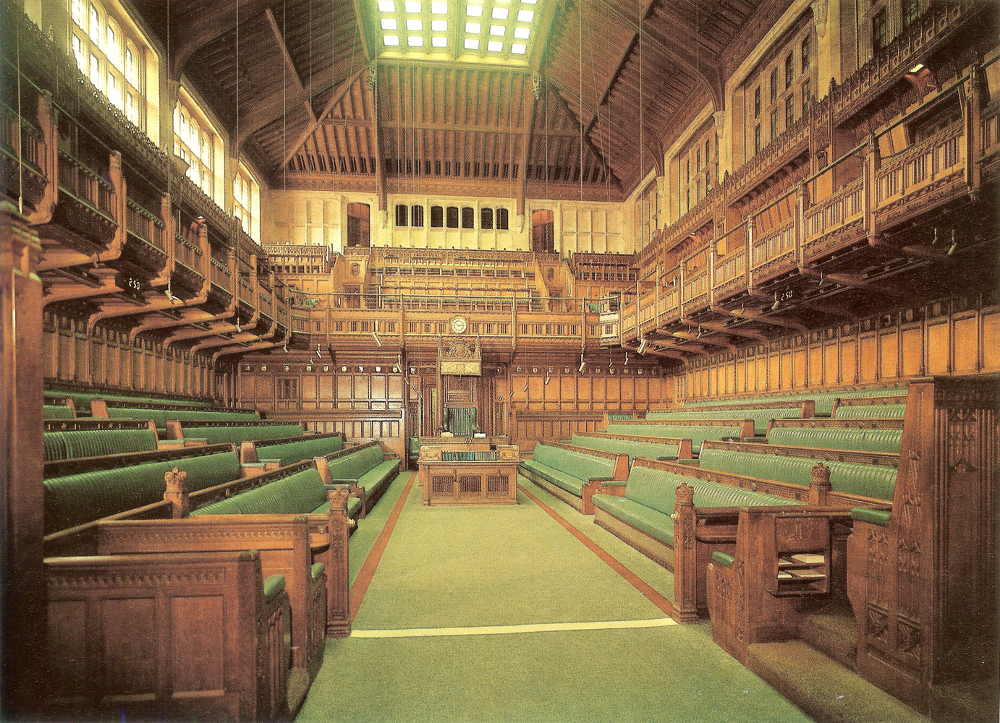
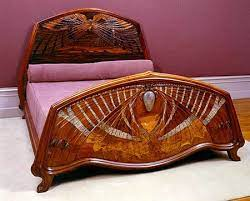
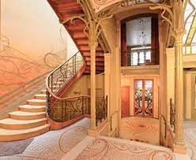
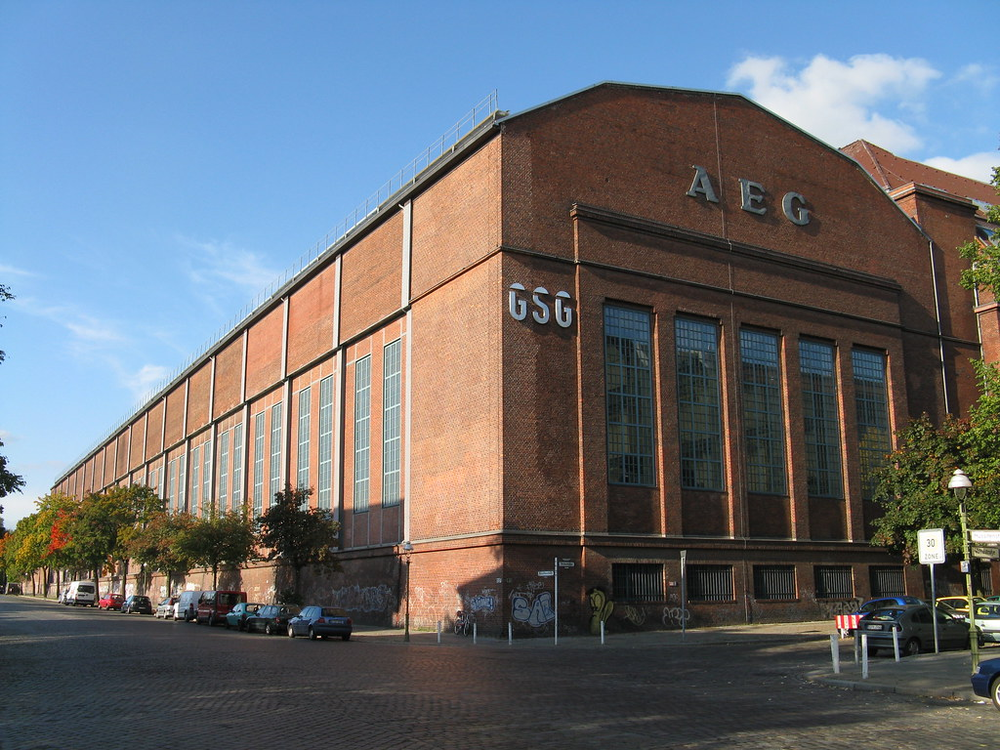
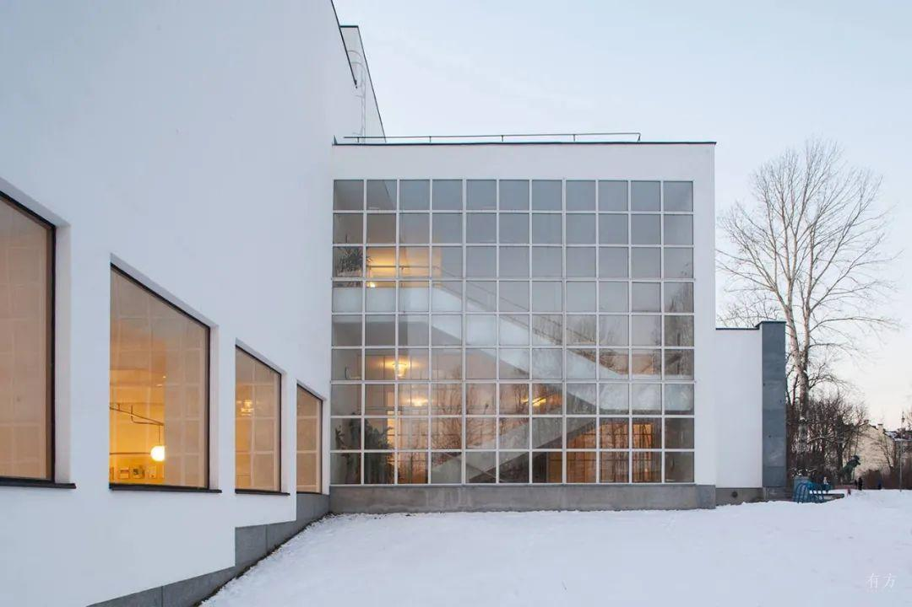

- ## [世界现代设计史论](#世界现代设计史论)

	- ### [前言](#前言)
	- ### [重点素材](#重点素材)

	- ### [艺术与手工艺运动](#艺术与手工艺运动)
		- ### [手工艺与工业时代对比](#手工艺与工业时代对比)
		- ### [约瑟夫帕克斯顿](#约瑟夫帕克斯顿)
		- ### [水晶宫博览会](#水晶宫博览会)
		- ### [维多利亚风格](#维多利亚风格)
		- ### [手工艺行会](#手工艺行会)
		- ### [威廉莫里斯](#威廉莫里斯)
		- ### [威廉莫里斯理想的幻灭](#威廉莫里斯理想的幻灭)
		- ### [红屋](#红屋)
		- ### [艺术与手工艺运动内容](#艺术与手工艺运动内容)
		- ### [约翰拉斯金](#约翰拉斯金)
	
	- ### [新艺术运动](#新艺术运动)
		- ### [新艺术运动与艺术与手工艺运动的相似之处](#新艺术运动与艺术与手工艺运动的相似之处)
		- ### [新艺术运动与艺术与手工艺运动的不同之处](#新艺术运动与艺术与手工艺运动的不同之处)
		- ### [新艺术运动诞生背景](#新艺术运动诞生背景)
		- ### [新艺术运动总结](#新艺术运动总结)
		- ### [法国巴黎新艺术运动](#法国巴黎新艺术运动)
		- ### [萨穆尔宾](#萨穆尔宾)
		- ### [现代之家](#现代之家)
		- ### [六人集团](#六人集团)
		- ### [阿尔丰斯穆夏](#阿尔丰斯穆夏)
		- ### [法国南锡派新艺术运动](#法国南锡派新艺术运动)
		- ### [埃米尔加莱](#埃米尔加莱)
		- ### [比利时新艺术运动](#比利时新艺术运动)
		- ### [维克多霍塔](#维克多霍塔)
		- ### [亨利凡德威尔德](#亨利凡德威尔德)
		- ### [西班牙的新艺术](#西班牙的新艺术)
		- ### [安东尼高迪](#安东尼高迪)
		- ### [苏格兰新艺术运动](#苏格兰新艺术运动)
		- ### [查尔斯麦金托什](#查尔斯麦金托什)
		- ### [格拉斯哥四人设计集团](#格拉斯哥四人设计集团)
		- ### [维也纳分离派](#维也纳分离派)
		- ### [德国青年风格](#德国青年风格)
		- ### [彼得贝伦斯](#彼得贝伦斯)
		- ### [赫尔曼穆特修斯](#赫尔曼穆特修斯)
		- ### [德国工业同盟](#德国工业同盟)

	- ### [装饰艺术运动](#装饰艺术运动)
		- ### [装饰艺术运动总结](#装饰艺术运动总结)
		- ### [好莱坞风格](#好莱坞风格)
		- ### [图画现代主义运动](#图画现代主义运动)
		- ### [法国装饰艺术运动的四种设计策略](#法国装饰艺术运动的四种设计策略)
		- ### [传统装饰运动比较](#传统装饰运动比较)
		
	- ### [现代主义运动](#现代主义运动)
		- ### 
		- ### 
		- ### 
		- ### 
		- ### 
		- ### 

	- ### [美国工业产品设计](#美国工业产品设计)
		- ### [福特公司的成功经验](#福特公司的成功经验)
		- ### [有计划废止制度](#有计划废止制度)
		- ### [解读有计划废止](#解读有计划废止)
		- ### [通用汽车成功原因](#通用汽车成功原因)

		- ### [流线型运动](#流线型运动)
		- ### [流线型风格的主要特点](#流线型风格的主要特点)

		- ### [美国工业设计四元老](#美国工业设计四元老)
		- ### [芝加哥学派](#芝加哥学派)
		- ### [沃尔特提格](#沃尔特提格)
		- ### [亨利德雷福斯](#亨利德雷福斯)
		- ### [诺尔曼贝尔盖迪斯](#诺尔曼贝尔盖迪斯)
		- ### [雷蒙特罗维](#雷蒙特罗维)
		- ### [哈利厄尔](#哈利厄尔)
		- ### [欧洲设计体系vs美国设计体系](#欧洲设计体系vs美国设计体系)
		- ### [德国设计发展vs美国设计发展](#德国设计发展vs美国设计发展)

	- ### [二战后的设计](#二战后的设计)
		- ### [美国](#美国)
		- ### [国际主义风格](#国际主义风格)
		- ### [查尔斯伊姆斯](#查尔斯伊姆斯)
		- ### [乔治尼尔森](#乔治尼尔森)
		- ### [菲利普约翰逊](#菲利普约翰逊)
		- ### [人体工程学](#人体工程学)
		- ### [波音707飞机设计与人体工学的运用](#波音707飞机设计与人体工学的运用)
		- ### [反计划废止](#反计划废止)
		- ### [艾罗沙里宁](#艾罗沙里宁)
		- ### [无障碍设计](#无障碍设计)
		- ### [通用设计](#通用设计)
		- ### [为真实世界的设计](#为真实世界的设计)

		- ### [乌尔姆](#乌尔姆)
		- ### [乌尔姆设计学院](#乌尔姆设计学院)
		- ### [乌尔姆学院教育制度](#乌尔姆学院教育制度)
		- ### [乌尔姆设计学院的贡献和影响](#乌尔姆设计学院的贡献和影响)
		- ### [马克思比尔](#马克思比尔)
		- ### [托马斯马尔多纳多](#托马斯马尔多纳多)

		- ### [德国](#德国)
		- ### [迪特拉姆斯](#迪特拉姆斯)
		- ### [博朗公司](#博朗公司)

		- ### [意大利](#意大利)
		- ### [系统设计](#系统设计)
		- ### [金圆规大奖](#金圆规大奖)
		- ### [吉奥庞蒂](#吉奥庞蒂)
		- ### [奥利维蒂公司](#奥利维蒂公司)
		- ### [乔科隆波](#乔科隆波)

		- ### [其他](#其他)
		- ### [索尼公司](#索尼公司)
		- ### [宜家公司](#宜家公司)
		- ### [斯堪的纳维亚的设计风格](#斯堪的纳维亚的设计风格)
		- ### [简述材料对设计的影响和作用](#简述材料对设计的影响和作用)
		- ### 
		- ### 
		- ### 

## 世界现代设计史论
-------------------------------------------

## 前言

#### 时代背景表
| 时期 | 背景 | 关键词 |
| :----: | :----: |:----: |
| 17 - 18世纪 | 资产阶级革命完成，技术革命推动资本家地位上升，现代化萌芽 艺术家和工业化的矛盾 面向大众 | 知识分子发起现世主义 启蒙时代 古希腊复兴 道德觉醒 1851年世博会水晶宫 工业革命 英国 机械生产 资产阶级|
| 19世纪 | 受到英国艺术与手工艺运动影响 | | 
| 19世纪末 - 20世纪初 |  | |

#### 时代人物表
| 时期 | 背景 | 相关运动 | 人物 |
| :----: | :----: | :---- | :----: |
| 17 - 18世纪 | 英国第一次工业革命成功 | -- | 威廉莫里斯(红屋) 约瑟夫帕克斯顿(水晶宫) 托马斯奇彭代尔|
| 19世纪下半叶 | 资产阶级革命完成，机械生产大流行 现代化萌芽 | 艺术与手工艺运动 | 罗斯金 威廉莫里斯 |
| 19世纪末 - 20世纪初 | 艺术与手工艺运动成功影响 印刷业发达 生物科学发达 | 新艺术运动 | 阿尔方斯穆夏 |

#### 工艺美术的标准(最关心)
> 合宜 `适用性原则`  

## 重点素材
> 这些最好都找到图片材料  

**艺术与手工艺运动**
----------------------------------------------------------------------------------------

| 时期 | 地点 | 时间 |
| :----: | :----: |:----: |
| 艺术与手工艺运动 | 英国 | 指英国`19世纪下半叶`形成的一场设计运动，是针对家具、室内产品、建筑的工业批量生产所造成的设计水准下降的局面，而在设计领域开展的一项`改革运动` |

> 背景：18世纪六十年代英国率先开展了工业革命，使机械越来越成为生产制造的重要手段 19世纪初各国工业革命先后完成，资产阶级革命完成，技术革命推动资本家地位上升，现代化萌芽 艺术家和工业化的矛盾 艺术家想服务大众 
> 机械技术 -> 进步 + 恐慌 + 工业化远超于设计水平
> 两极化: 精美手工艺品 粗劣工业品

> 运动时间：19世纪下半叶，萌芽在18世纪
> 运动内容
> - 艺术家推崇古希腊和哥特式风格
> - 强调`手工业的复兴`
> - 崇尚`诚实适用，真材实料，显示结构`的产品
> 运动特征：人造材料，机械工具，标准化
> 时代人物：罗斯金 威廉莫里斯 

> `机械化`造成两个问题：
> 1. 生产方式使产品变得低劣和粗糙艺术性大打折扣
> 2. 人变成了生产链上的一环，降低创造性，生产变得极其枯燥和乏味
> `设计师`面对两个问题：
> 1. 过分装饰矫揉造作的维多利亚风格蔓延
> 2. 令不少知识分子震惊甚至恐惧的工业化的来临
> 水晶宫维多利亚风展品的`缺点`总结为三点：
> 1. 为了掩盖瑕疵而增加华而不实的装饰外壳 -> 华而不实 -> 品质不诚实
> 2. 为了逐利而刻意增添不必要的装饰工艺 -> 矫揉造作 -> 功能丧失
> 3. 为了炫耀而将各种风格堆砌杂糅 -> 真空恐惧，唯美空洞

> 补充待删：
> - 罗斯金认为，手工艺人的技巧是快乐工作和实现艺术平等的基础。他彻底谴责机器使劳动变得简单无趣失去了手工作品的个性。
> - 18世纪的英国资产阶级革命已经完成，技术革命正在开展。古董，流星家居，陈设服饰等商品用来表现资本家社会地位和个人身份
> - 商人为了自己的利益推动市场，设计营销刺激消费欲
> - 此时人们的审美观念还停留在过去精雕细琢的手工艺产品，很难接受单纯简介的工业产品，工业设计远不成熟，是个新旧过度的阶段

#### 手工艺与工业时代对比
| aspect | 手工艺时代设计的重要特征 | 工业时代设计的重要特征 |
| :----: | :----: |:----: |
| 材料 | 自然材料 | 人造材料 |
| 工具 | 手工工具 | 机械工具 |
| 工艺 | 个人性 | 标准化 |

#### 艺术与手工艺运动内容
> 工艺美术运动起源于19世纪下半叶的英国，后发展成一场国际运动
> 历史背景：起因是针对机械工业批量生产所造成的产品艺术品位的下降以及机械化生产方式带来的乏味工作环境
> 代表人物：理论指导是约翰拉斯金，设计实践家是威廉莫里斯
> 特征
> 1. 强调手工艺，明确反对机械化生产
> 2. 装饰上反对矫揉造作的维多利亚风格，提倡哥特式风格
> 3. 主张设计诚实诚恳，反对设计上哗众取宠，华而不实的趋向
> 4. 主张师法自然，以及学习东方装饰风格
> 总结：首先，东一美术运动在拉斯金和莫里斯的指导下，首先提出了 美与技术相结合的原则，主张美术家从事产品设计，旨在提高产品的美感。在探索中，工艺美术运动形成了独特的淳朴大方，清新活泼，富有生机的风格特征。其次，他们秉承设计为普罗大众服务的设计理念，希望将人们从机器的束缚中解放出来，从事快乐的手工劳动，最后他们对工业化的反对，对机械的否定是违背历史发展潮流的，同时过于强调装饰，增加了产品的成本，使其为大众服务的目的只是成为知识分子的一厢情愿。

#### 约瑟夫帕克斯顿
> 他是一名园艺师，建筑工程师
> 1850年，设计了第一届世界博览会展馆——水晶宫。开创了采用标准构件，钢铁、玻璃设计和建造建筑的先河，非建筑师也能成为建筑风格的革新者

#### 水晶宫博览会
> 1851年英国要举行第一次世纪博览会，由于时间紧任务重，英国工程师派克斯顿以钢铁与玻璃建造温室的设计原理，大胆地把温室结构应用在这次博览会的展厅设计中
> 展览大厅全部采用钢材与玻璃，晶莹剔透，采光极好，故被人称之为水晶宫，水晶宫本身就是一个机器制品，没有任何多余的装饰。
> 水晶宫对世界近代现代建筑史，工业设计史具有重大意义，开创了采用标准构件、钢铁、玻璃设计和建造建筑的先河，把`技术`作为新建筑和新产品材料的直接`来源`，意味着非建筑师也能成为建筑风格的革新者
> 补充待删：
> 维多利亚时期人们对于装饰无休止一味贪多造成的不诚实的设计，不仅显示出一场势在必行的设计革命，而且说明设计教育急需改良，也显示了一个国家通过新兴经济致富后的暴发户心态，生产商推动所谓的潮流只是为自己的利益拓展市场

#### 手工艺行会
> 行会是有一个城镇，同行业的工匠，组成的互惠互利的联盟，开始形成与11世纪。其旨在调整同行业关系，解决同行业矛盾，保护同行利益，协调行业和政府的关系
> 1. 是在一个互惠互利的联盟中为工匠提供相同的职业工作，并实施垄断，提高个体设计师-工匠的生计和收益
> 2. 是工匠行会不仅保护其成员的利益，也保护消费者的利益，其通过制定行业规则制度，组织恶劣的工艺败坏行业声誉
> 3. 有效的促进了设计师-工匠的地位提升。

#### 奥古斯塔斯普金
> 普金是英国`19世纪`著名的建筑师，他认为维多利亚时期的设计是华而不实，缺乏功能且道德沦丧的。他支持复兴`哥特`复兴，呼吁设计与建筑中的真是原则，它基于三个基本属性即适用+真材+显示结构，归结为道德诚实
> 出版两部重要影响巨著：对照即14 15世纪的玉宇琼楼与当今类似建筑的比较 + 尖顶或基督教建筑的真实原则
> 著名的设计项目：威斯敏斯特宫的室内设计
> 补充待删：威斯特敏斯特宫又称议会大厦（Houses of Parliament）是英国议会（包括上议院和下议院）的所在地，位于英国伦敦的中心威斯敏斯特市，它坐落在泰晤士河河畔 哥特复兴式建筑代表 浪漫主义 是世界上最大的哥特式建筑 它的西北角的钟楼就是著名的大本钟 从11世纪起历代国王都在此举行加冕仪式。

#### 威廉莫里斯

> 威廉莫里斯是艺术与手工艺运动最主要的代表人物，英国工艺美术家，诗人，社会主义者，被设计界成为现代设计之父。他的代表作品是1858年和菲利普韦伯设计的红屋，1861年，成立了莫里斯公司
> 思想：
> 1. 设计是为大众服务的活动，而非为少数人服务的活动
> 2. 设计是一项集体活动，而不是个体活动
> 3. 强调手工艺，明确`反对机械化生产`
> 4. 提倡哥特式风格和其他中世纪的风格，讲究简单，朴实无华和良好功能
> 评价： 威廉莫里斯是一个重要的设计先驱，率先提出了设计的民主思想，强调实用性和美观性相结合，一生创作出大量优秀的设计。但严格来看，他不是现代设计的奠基人，因为他所探索的重点恰恰反对现代设计的核心——工业化和机械化生产
> 补充：
> - 莫里斯尽可能实用手工艺避免机器，造成他公司的产品造价高昂，违背他生产普通人买得起的好家具的目标，还是为资本家服务，作为一个非常坚定的社会主义者，莫里斯顽强抵抗任何形式的机械化，永远都无法达到他为大众服务的目标。
> - 莫里斯设计中的自然形态有着内在的合理性，融于自然的实用美感，是其设计的终极目标

#### 威廉莫里斯理想的幻灭
> 威廉莫里斯的理想：既要生产低价却高品质的商品，还要让工人从事创造性的劳动
> 可是纯手工作出的产品一般价格都比较高，普通大众消费不起还是去购买机械化生产出来价格亲民的产品，有消费就有市场，工厂还在照常运转，工人劳动依然不快乐，产品不美观 

#### 红屋
> 红屋是英国工艺美术运动典型代表作品，威廉莫里斯的婚房，无论是建筑还是室内家具由莫里斯和菲利普韦伯合作设计并亲自建造设计制作
> 因外墙采用红砖而得名。强调功能性，适用性和舒适性。是英国哥特式建筑和传统乡村建筑的完美结合，自然，简朴，实用。

#### 约翰拉斯金
> 约翰罗斯金(1819年－1900年)是英国维多利亚时代主要的艺术评论家之一，是美国美术理论家和教育家，是最早提出现代设计思想的人物之一。他针对水晶宫博览会的建筑和展品进行了尖锐的批评，推出了自己关于现代设计的理念如下
> 1. 设计应该与艺术相分离，设计应该成为独立的学科
> 2. 设计的功能主义原则立场应该强调设计的社会功能性，倡导为人民的艺术设计。设计应为大多数人服务，而不是为少数权贵服务
> 3. 罗斯金的理论带有强烈的道德主义色彩，而劳动者也有思想，劳动能促进健康，思想能引起快乐，二者不应该被分割。约翰拉斯金的这些设计思想是设计理论史上的重大突破，一直现代主义的建筑大师如路易斯莎莉文弗兰克莱特等人都在他们的设计中表达了拉斯金的理念。
主张艺术要密切联系大众生活，。同时他还提出了设计的实用性目的，主张取消艺术和设计之间的差别，要求美学家从事产品设计
拉斯金的，他关注艺术和技术相互作用的伦理方面，从道德主义立场批判资本主义社会

#### 索耐特14号椅
> 迈克尔索耐特的经典设计14号椅在`1859年`推出，被认为是第一把符合现代设计意义的座椅。
> 褪去所有装饰的典型的毕德迈风格作品具有双弧线椅背，椅子的每一个经蒸汽弯曲的框架，每一个编制或塑形的部件都具有功能性，不仅节省了原材料和用工成本，同时做到了使极简设计风格和大规模量产结合。完全做到了增一分则多，减一分则少。
> 轻便结实的14号椅在价格上也非常亲民，是第一次普罗大众可以真正消费得起的高档家具。
> 14号椅删繁就简的设计还十分利于出口，把未组装的产品部件装进集装箱，最大限度合理利用空间，到了目的地仅用螺丝刀就可以组装。民用，旅馆，饭店，咖啡厅和酒吧都非常适用
> 作为第一个专门为大规模量产设计的椅子，14号椅为设计实践引入了大量的新理念，为工厂系统带来了全新的理性思考。

#### 艺术与手工艺运动的得与失
> 艺术与手工艺运动缘起于十九世纪下半叶的英国，针对机器生产带来的粗鄙的产品质量和压抑人性的生产模式，提倡中世纪作坊式的手工生产方式，对于建筑、家具、纺织品和平面设计都产生了不小的影响。这其中既有相当多的积极意义，也有不少历史的局限性
> 进步方面：
> 1. 普金 威廉莫里斯 约翰拉斯金等人的指导实践下，率先形成了设计的民主思想，主张设计`为广大民众服务`，而不是为少数权贵服务，希望将人们从机器的束缚中解放出来，从事快乐又具有创造性的工作劳动。
> 2. 提出了`美与技术结合`的原则，主张美术家从事产品设计而不是纯艺术，改良粗陋的工业产品。
> 3. 对过度装饰的维多利亚风格进行批评，形成了一种`清新自然`的艺术风格，大量采用`动植物纹样`，注意材料选择，注意发挥材料优势，主张设计`诚实，质朴，大方，实用`具有一定温馨而浪漫的气质
> 局限性
> 完全`反对机械化`拒绝高效率的工业化生产方式，将手工艺推到工业化的对立面。违背发展潮流，曲折英国设计道路，过于强调装饰美使成本增加，__认为机械是美的产品的天敌，使这场运动为大众服务的目的成为了知识分子的一厢情愿__
> 方法论
> 工业设计体系的建立基本要素：对旧传统的摒弃 对机械生产的肯定

**新艺术运动**
----------------------------------------------------------------------------------------

| 时期 | 地点 | 时间 |
| :----: | :----: |:----: |
| 新艺术运动 | 起源于`法国、比利时`蔓延整个国际 | 19世纪末20世纪初(1895 - 1910)是从新古典主义、历史复古主义想现代主义`转化的过程`，是传统设计与现代设计之间`承上启下`的一个重要阶段 |
 
> 背景
> - 英国艺术与手工艺运动的影响
> - 生物学科发展 比如生物学家恩斯特海克尔的书自然界中的艺术形式
> - 石板套色印刷技术的发展 使得平面宣传品得以大量印刷成为重要的传播媒介
> - 民族国家的建立，人口显著增长
> - 日本艺术的影响
> 运动时间：`19世纪末-20世纪初期` 1910年后逐步为现代主义运动和装饰艺术运动所取代
> 运动内容：
> - 走向`自然主义` 或抽象直线(理性主义)，或流动曲线(自然纹样)
> - 反对工业化风格 but不完全排斥工业化进程
> - 企图在手工艺和艺术之间找到一个平衡点
> 运动特征：放弃任何一种历史风格 探索曲线直线新形式 创新意识 依旧强调手工艺 各国有各国的风格和名称 传统和现代设计的过度

| 国家 | 名称 | 重点人物团体案例 |
| :----: | :----: |:----: |
| 法国 | 新艺术运动(巴黎，南锡) | 新艺术之家(萨穆尔宾，法国巴黎) 现代之家(类似前者) 六人集团(赫克托吉马德) 南锡新艺术运动(埃米尔加莱) |
| 比利时 | 新艺术运动 | 亨利凡德威尔德、维克多霍塔 |
| 西班牙 | 现代派 | 安东尼高迪 |
| 英国 | 苏格兰新艺术运动 | 格拉斯哥四人设计集团 |
| 奥地利 | 维也纳分离派 |  |
| 德国 | 青年风格 | 彼得贝伦斯  赫尔曼穆特修斯|

> 补充待删：
> - 自然界中的艺术形式里面关于海葵水母原生动物的印刷品成为连通艺术与科学的桥梁，在20世纪初对设计的发展产生了巨大影响。他提出了自然界万物之间都彼此关联的理论
> - 在此之前，很多流派求复古，此后完全卸下历史包袱向前看，开创一种全新风格，从自然和民间乡土中寻求灵感。一篇合拢的树叶，一只孔雀的羽毛，一朵盛放的玫瑰都可以作为灵感来源，通过各种动态的，旋转的元素赋予他们戏剧化的设计风格
> - 自然主义装饰构思还是停留在装饰表面
> - 他们试图探索工业产品更深的意义，体现道德，并从其本土根基中找寻设计灵感，民族浪漫主义
> - 19世纪末 德国成为非常重要的工业强国，纺织钢铁主要出口国，蒸汽机铁路制造享有盛誉 是对英国制造商的借鉴
> - 20世纪初很多设计师意识到机械化的重要性，开始关注对工业生产的设计

#### 新艺术运动与艺术与手工艺运动的相似之处
> 1. 都是对矫揉造作的维多利亚风格和其他过分装饰风格的反动，都是`反对工业化风格`，都受到威廉莫里斯的思想理念和设计实践的影响
> 2. 新艺术运动继承了工艺美术对`大自然的崇尚`，强调从自然中寻求灵感，转向自然中的一些装饰题材
> 3. 都受到日本装饰风格，热便是江户时代艺术与装饰风格的影响，尤其是`浮世绘`的影响

#### 新艺术运动与艺术与手工艺运动的不同之处
> 1. 艺术与手工艺运动注重中世纪哥特风格，新艺术运动完全放弃任何一种传统装饰风格，`彻底走向自然风格`
> 2. 突出表现直线，`有机形态`，装饰题材基本来自于自然

| aspect | 工艺美术运动 | 新艺术运动 |
| :----: | :----: |:----: |
| 相似处 | 1.崇尚手工艺技术，反感工业制品 2.反对维多利亚风格和其他过分装饰 3. 青睐自然装饰题材(植物动物等) 4.受到日本装饰尤其是浮世绘的影响 |
| 不同处 | 为大众服务 | 为大众服务? |
| 不同处 | 推崇哥特风格 | 放弃任何一种传统的装饰风格 |
| 不同处 | 完全反对机械化工业化浪潮 | 反感工业制品的粗糙，但不完全排斥工业化进程 |

#### 新艺术运动诞生背景
> - 艺术与手工艺运动的影响
> - 生物学科的发展
> - 印象派、象征性主义艺术的成熟
> - 总体艺术的影响
> - 民族国家的建立

#### 新艺术运动总结
> 新艺术运动时19世纪末20世纪初在欧洲和美国发展的一次影响相当大的装饰艺术运动，是一次内容广泛的，设计上的形式主义运动
> 这场运动实质上是英国艺术与手工艺运动在欧洲大陆的延续，从法国兴起，之后蔓延至欧洲大陆，影响到英国和美国，在各国具有不尽相同的艺术风格
> 特征
> 1. 强调手工艺，反对机械工业化的艺术风格，开始温和的接收机械化变革
> 2. `完全放弃历史装饰风格`，开创全新的自然装饰风格
> 3. 一部分强调自然美，突出曲线和有机风格，并用流动、有韵律、波浪起伏的线塑造形体
> 4. 另一部分则将简洁、抽象的直线和方格有规律的结合成直线型的风格
> 总结：
> 1. 新艺术运动是知识分子中的部分精英，在工业化的大浪潮以及过分装饰的维多利亚风格泛滥的双重背景下所开创的设计尝试，该运动产生的大量的设计，为20世纪的设计开创了一个新阶段，成为传统和现代设计之间的一个`承上启下`的重要阶段。

#### 法国巴黎新艺术运动***
> 19世纪末至20世纪初，巴黎是法国新艺术运动的重要中心，从组织方式来看，法国这场运动由几个关系密切，以家具设计为主的设计集团为中心，其中影响最大的有 新艺术之家，现代之家和六人集团
> 新艺术之家有`萨姆尔滨`创办，他主要从事家居设计，他强调回到自然去，展出的作品大多具有强烈的自然主义倾向，模仿植物的形态和纹样，回避直线，刻意强调有机形态
> 现代之家：依然热衷于自然风格，也主要从事家居设计，设计风格和观念与新艺术之家类似
> 六人集团：1898年成立，由6位设计家组成的松散设计团体，以`赫克特吉马德`最著名，他的巴黎地铁站入口设计代表了法国新艺术的典型风格，地铁站入口巨大，生机勃勃又程式化的花茎采用标准化的铸铁部件，既能系列化生产，有便于运输

#### 萨穆尔宾
> 法国出版商，贸易商，艺术经纪人，对日本艺术非常着迷，1895年-1904年，萨穆尔宾将自己的日本艺术画廊变成了陈列室陈列兼具各种风格的来自日本以及西方艺术家的作品产品，取名为新艺术之家，由此新艺术名扬欧洲
> 他强调回到自然去，展出的作品大多具有强烈的自然主义倾向，模仿植物的形态和纹样，回避直线，刻意强调有机形态

#### 现代之家
> 巴黎新艺术运动的第二重要设计集团，和新艺术之家大同小异

#### 六人集团
> 1898年成立，由6位设计家组成的松散设计团体，以`赫克特吉马德`最著名，他的巴黎地铁站入口设计代表了法国新艺术的典型风格，地铁站入口巨大，生机勃勃又程式化的花茎采用标准化的铸铁部件，既能系列化生产，有便于运输
> 热衷自然风格，强调自然主义，提倡`回到自然`的口号。采用植物纹样、曲线作为设计的风格特征，在家具及公共设施上皆有表现。

#### 赫克特吉马德**
> 法国六人集团设计师成员，出生于里昂，作品更能代表法国的新艺术风格
> 他为`贝朗热公寓设计的铸铁大门`非常著名，这扇大门以非对称的卷草形态大而精美，如古典花园人造洞穴般的门厅和繁复的铸铁阳台卓尔不凡，这种风格显然受到霍塔的启发
> 吉马德于1898年为巴黎地铁公司设计的`地铁站入口`让他名声远扬，地铁站入口巨大，生机勃勃又程式化的花茎采用标准化的铸铁部件，既能系列化生产，有便于运输。反应了他以自然为参考同时又充分考虑设计可行性的设计理念，影响甚广。

#### 法国南锡派新艺术运动
> 是法国新艺术运动另一个重要中心，以家具生产和制造为主，产品广受欢迎，影响很大。
> 南锡新艺术运动中的平面设计发展很快，如广告与书籍设计，但也明显受`日本浮世绘`风格影响
> 设计模拟自然，可谓是仿生学的早期案例
> 其中设计师`埃米尔加莱`是这个中心的领军人物，埃米尔加莱的详细介绍下面有

#### 埃米尔加莱
> 主要从事`玻璃`艺术品制作和家具设计，认为自然是设计师灵感的源泉。在玻璃设计中，加莱不断实验玻璃的颜色，光感和纹理，痴迷于通过不同材质的运用获得最精妙的光线效果。他的玻璃制品更像雕塑艺术品而不是日用品。
> 在家居设计中，他主要采用雕刻的形式，通过镶嵌工艺表现出错综复杂的线条和空间效果，并提出了家居设计的主题要与产品功能性相吻合。
> 他是法国新艺术运动中较早提出要注意产品功能性的一位设计师。代表的设计有睡蝶床和蜻蜓古玩架
> 然而他的局限性在于其作品只能单件手工制作，未能和机械化生产结合起来

#### 阿尔丰斯穆夏**

> 阿尔丰斯穆夏是新艺术运动著名的招贴广告画画家，他的作品数量巨大，风格多为后世所效仿
> 穆夏的作品画面通常有青春美貌的女性和富有装饰性的曲线流程的花草组成。汲取了日本木刻优美的轮廓线，拜占庭艺术的几何装饰效果，以及巴洛克洛可可艺术细致而富于肉感的描绘
> 经过他的加工，所有的女性形象都显得甜美优雅，身材玲珑曲致，富有青春的活力，有时还有一头飘逸秀美的秀发
> 代表作品：JOB牌香烟的广告招贴

#### 比利时新艺术运动
> 民主色彩 功能主义理想和设计革命结合 提出人民的艺术 从大众消费者角度出发的艺术
> `维克多霍塔`:
> `亨利凡德威尔德`:

#### 维克多霍塔
> 比利时新艺术运动建筑设计中最杰出代表之一，代表作塔赛尔公馆的室内设计，这是建筑史上第一次对新艺术风格的尝试
> 出生于1861年，建筑设计师，在19世纪90年代的作品明显受到了海克尔的影响
> 塔赛尔旅馆是总体艺术的一次成功尝试，无论建筑外表设计还是室内设计装饰都线条流畅，色彩协调，同时能够在功能和装饰之间取得很好的平衡关系，显得更加稳健和完美
> 这个建筑开创性的使用钢材与玻璃屋顶，室内设计装饰线条流畅，温暖的金色阳光透过屋顶照射在楼梯拐角，楼梯间装饰性的花朵缠枝图案和柱头灯饰完美结合 色彩协调，同时能在功能和装饰之间取得很好的平衡关系，呈现出戏剧化的效果。典雅卓然，稳健优美，凸显了新艺术风格特点，反映着新世纪的前瞻精神

#### 亨利凡德威尔德
> 是19世纪末、20世纪初`比利时`新艺术运动的核心人物，有着巨大的国际影响，主要涉及领域是家具和室内设计。在德国创立魏玛工艺美术学院成为日后包豪斯的前身，还是德国工业同盟创始人之一。在新艺术运动中的`重要突破是对机械化的认可`。
> 1. 工业与艺术结合，对技术加以肯定，明确提出`功能第一`的原则
> 2. 设计的基本原则：设计结构合理，材料运用准确，工作程序明细，设计的实用与适用
> 威尔德就`艺术与工业结合`这一点，就突破了新艺术运动只追求形式，不讲功能的局限，推动了现代设计理论的发展，成为现代主义设计思想的奠基人。
> 但他的局限性是`不赞成标准化`，从而引发了[科隆论战](#科隆论战)
> 补充待删：
> - 装饰自身没有生命，必须依附于作品本身的造型和线条，从而获得有机统一的应有位置
> - 机械是一种强有力的催化剂，能够产生一种新的美感
> - 产品结构应符合逻辑，运用材料时要出其不意，要自豪并且坦诚地展现工作过程

#### 西班牙的新艺术
> `安东尼高迪`

#### 安东尼高迪
> 1852年出生于铜匠之家，具有典型的`平民化心态`，`民主化思想`，第一个设计项目是为工人设计住宅，将精神贵族和感情上的平民融为一体，代表作品有圣家族教堂，`米拉公寓`，巴特罗公寓，古埃尔公园等
> 设计特征：善于运用各种风格的折中处理手法，尤其是从哥特和摩尔式建筑中借鉴图案的主题，再将之变化为奔放，奇异而又和谐的造型。他的建筑和家具设计源于`生物形态`，造型奇特，富有`动势`，超乎寻常的设计充分展现了当时的世纪末精神
> 高迪在`现代设计史上`具有举足轻重的地位，其风格对后世产生了深远的影响，被新一代设计师成为能与国际主义、现代主义相抗衡的符号并加以借鉴。现代主义建筑大师勒柯布西耶称他为后现代主义的先驱
> 补充待删：
> - 高迪突破固有传统，用碎地砖快，杯碟瓷片做贴面，装饰古埃尔公园蜿蜒的矮墙，呈现一种完全与众不同的多彩斑斓的鳞状马赛克效果，第一次轻松美观的为艺术而艺术作品实施在公共环境中。
> - 圣家族教堂设计中，高迪运用类似的混合材料建造四座矗立的尖塔，他们的外观就好像聚沙成塔般瑰奇神奇，超越了其他任何设计师

#### 苏格兰新艺术运动
> 以苏格兰格拉斯哥市的青年设计家，建筑家查尔斯`麦金托什`为首的`格拉斯哥四人帮`

#### 查尔斯麦金托什
> 是世纪之交英国最重要的建筑设计师和产品设计师之一，他是一位真正的多面手，其设计作品包括建筑，室内，家具，灯具，玻璃制品，地毯，挂毯等领域，同时他也是以为画家
> 他的设计风格强调简单的几何形体有机形态的完美结合，强调纵横直线和黑白色的应用。注意平衡的处理，注重装饰性的表现，高背椅就是现代设计经典之作
> 他是一个联系新艺术运动到现代主义运动的关键过度人物，他主张的直线几何造型与中性色彩为机械化、批量化、工业化的形式作出有益的探索

#### 格拉斯哥四人设计集团 
> 在苏格兰新艺术运动中，取得了较大成就的是格拉斯哥四人集团。这四人分别为麦金托什，马克奈以及麦当娜姐妹。其中麦金托什的贡献尤为突出
> 他们在设计方面形成了独一无二的苏格兰新艺术表现风格：即雅致的直线与几何形状结合，与夸张富有节奏感的长线条联系起来，这杯设计史届习称为直线风格
> 格拉斯哥的探索为机械化，批量化，工业化的形式地顶了可能的基础。是联结新艺术运动和现代主义运动的关键性组织

#### 维也纳分离派
> 19世纪末奥地利的一批设计家公开提出与正宗的学院派分离，他们组织的团体自成分离派，其艺术宣言是为每一个时代的艺术，为每一种艺术的自由 
> 创办了刊物`圣春`，组建了`维也纳工坊`。代表人物是约瑟夫霍夫曼 科罗曼莫塞尔和奥拓瓦格纳
> 受麦金托什的影响，分离派的设计风格是`造型简洁明快`，注重`简单的直线`与自然主义形态的温和，`功能主义`和有机形式的结合
> 分离派的探索令当时的设计界耳目一新，在几何抽象的基础上，发展出一种非常前卫的设计语言，使得功能和装饰高度吻合，具有显著的功能主义美感，深刻地影响了之后的现代主义运动。然而在工业生产极端发达的大环境下，却没有关心艺术与及其生产的关系问题。二千造价昂贵，无法实现为大众设计的目的。
> 补充待删：
> 其他国家新艺术风格：强调有机外形 + 曲线装饰 + 注重自然主义表达 奥地利新艺术风格：接近英国的艺术与手工艺风格造型简单明确 + 注重简单几何外形，简单的直线与自然主义形态吻合
> 奥布里奇为分离派设计的展厅——分离派之屋。这个展馆又一系列长方形支撑的圆屋顶构成，镀金的月桂树叶穹顶格外引人瞩目，局部有装饰，体现分离派特征。入口铭刻着艺术组织宣言：为每一个时代的艺术，为每一种艺术的自由，体现世纪末维也纳社会精神的缩影

#### 美国传教士风格
> 美国设计师从本土积极进取的先锋精神和作为殖民地的国王经历中寻找灵感，创作家具和家居用品，这种风格就是传教士风格，很大程度受英国影响。
> 典型特征：对较粗的纵横线条和朴素无装饰的面板的使用，像18世纪末加州西班牙传教士使用的家具，结构单纯，表面装饰极简

#### 德国青年风格
> 德国的新艺术运动被称之为青年风格运动，这场运动有1896年创办的周刊青年而得名。受到自然界中的艺术形式影响，青年风格个的设计师们不仅试图改进装饰艺术及其相关的制作过程，同时也`提倡回归更简单，更低商业化的生活方式`。
> 分为两个阶段 总结`前期曲线，后期直线`
> - 第一阶段：与法国，比利时，西班牙新艺术运动相似，注重曲线装饰，强调自然主义。
> - 第二阶段：向格拉斯哥四人集团的探索倾斜，开始从简单的几何造型，从直线的运用上寻找新的形势发展方向
> `贝伦斯`是德国青年风格运动最重要的设计家，是德国现代设计的奠基人。他和其他青年风格成员以慕尼黑为中心开展设计实验，取得显著成绩，直接影响到后来德国工业设计的发展

#### 彼得贝伦斯

> 贝伦斯是德国青年运动最重要的设计家，是`德国现代设计的奠基人`，被视为德国现代设计之父 培养大师的大师
> 他的设计理念上具有功能主义倾向和`几何形状`和`无装饰表面`的明显偏好，注重功能与技术表现的基础上，追求设计形式的简约
> 他设计过`AEG`公司的企业形象设计系统，迄今仍有非常积极的参考价值。同时他设计的涡轮工厂建筑，开场了日后现代主义幕墙式建筑的最早模式
> 贝伦斯是一位非常有影响力的`现代主义先驱者`，他的设计理念在当时有意识的摆脱流行的新艺术风格，朝现代主义的功能主义方向发展。德国现代主义的兴起于贝伦斯的设计实践分不开，他的事务所培养了格罗佩斯、[密斯凡德罗](#密斯凡德罗)、柯布西耶[勒柯布西耶](#勒柯布西耶)等现代主义重要人物

#### 赫尔曼穆特修斯
> 建筑设计师，外交官，曾担任德国驻伦敦大使馆的建筑专员，在此期间，他不断报告英国建筑的情况以及在手工艺及工业设计方面的进展。将英国工艺美术运动介绍到德国，回国后对当时德国设计发展起到了重要的作用 
> 他反对任何设计上对于单纯艺术风格，淡出装饰画的盲目追求，认为设计必须讲究目的，使用功能和制作成本，`大力宣传功能主义的设计原则` 强调客观主义、机器风格、`标准化`
> 1907年与彼得贝伦斯成立了德国第一个设计组织——`德意志工业联盟`。这标志着德国现代主义运动的发展开始，自此大大提高了德国产品在市场山的竞争力，德国产品渐渐以理性，高质量闻名于世。
> 科隆论战胜出者
> 曾担任普鲁士政府的官方顾问，力主对德国美术教育体系进行大力改革，将彼得贝伦斯等一批富裕改革精神的建筑家，设计家推上当地美术学院领导的地位，从而引导了对美术教育的改革 德国工业同盟奠基人和活动的开创者，德国现代设计艺术的先驱

#### 德国工业同盟

> 全称为德意志工业同盟 简称DWB 是`1907`年由`赫尔曼穆特修斯`成立的旨在促进设计的半官方机构。
> 标志着德国现代主义运动的开始
> 该组织旨在提高德国工业产品的质量，公开追求商业目的，号召德国设计专业人员与德国生产厂家之间建立起合作关系，以推动德国产品在世界市场上的竞争力
> 宗旨：
> - 提倡艺术、工业、手工业结合
> - 通过教育，宣传，把不同设计综合在一起
> - 强调走官方路线，避免政治干扰(面向市场，面向消费民众，为大众而设计)
> - 大力宣传功能主义和承认现代工业
> - 坚决反对任何装饰
> - 主张标准化和批量化(设计要便于批量生产)
> 自从这个机构成立后，德国的设计家就有一个可以团聚的中心，对于德国的设计，建筑产生了巨大的促进作用，引起欧洲一系列国家的效仿
> 补充待删：
> - 在德国国内，工业同盟首创了工业设计活跃的局面，奠定了德国工业设计的发展的基础，确立了工业设计的基本理念，真正预示了设计艺术新时代的来临。
> - 从世界意义上讲，德国工业同盟影响了英国、瑞典、丹麦等许多国家在1911-1915年相继成立了类似的组织，使工业设计在欧洲各地开展起来。

#### 新艺术运动的兴起与贡献
> 新艺术运动是在英国艺术与手工艺运动的深刻影响下，由1895年的法国起源，之后蔓延到整个欧洲，乃至俄国和美国，成为一个影响广泛实验程度更加深刻的国家设计运动。新艺术运动受到了前沿生物学科，印象派，象征主义以及日本艺术的影响，批判工业化批量制造产品的丑陋粗劣，同时对于工业化机械生产持认同态度。
> 新艺术运动在不同的国家形成的流派和风格不尽相同。新艺术运动中的各种艺术团体和流派都企图在艺术与手工艺之间找到一个平衡点，由此创造出非常特殊的装饰风格。从威尔德的室内，霍塔的旅馆，吉马德的巴黎地铁入口设计，再带高低的建筑、穆夏的大张海报，都表现出一个从未有过的费历史主义的新装饰风格探索力量
> 新艺术运动放弃任何一种传统装饰风格，完全走向自然主义，强调自然中不存在直线，强调自然中没有完全的平面，在装饰上突出表现曲线、有机形态。这些设计，已经成为了19世纪和20世纪交接时期的典型设计风格特征，成为一种历史的经典风格。同时，某些功能主义的思想特征，也在某种程度上具有开创性的意义，比如麦金托什和格拉斯哥四人集团，维也纳分离派的设计家以及的德国的彼得贝伦斯，他们的设计尝试，昭示了现代设计的先声。新艺术运动的最大贡献是完成了对传统的超越，形成了全新的艺术形式，该运动产生的大量的设计，已经成为了经典设计风格，为20世纪的设计开创了一个新阶段，成为传统和现代设计之间的一个承上启下的重要阶段。

**装饰艺术运动**
----------------------------------------------------------------------------------------

| 时期 | 地点 | 时间 |
| :----: | :----: |:----: |
| 装饰艺术运动 | 起源于法国巴黎，风靡欧美，影响美国 | `1910 - 1935`年前后，是继新艺术运动之后的一场国际性的设计运动 |

> 背景
> - 第一次世界大战恢复之后，社会气氛乐观，宣泄嬉闹，奢华，自由的情绪
> - 经济发达 机械生产、现代化交通系统发展飞速 新技术提高人们的生活质量
> - 机械美学热潮 人们赞美机器 艺术模仿机器

> 运动时间：`20世纪二三十年代` 退潮于1930年经济大萧条 与`现代主义设计运动同时`(主张为大众服务)发展

> 运动内容：
> - 主张简单几何形式的美，机械美学，反对复古，反对自然，反对单纯手工艺，
> - 为工业化生产的产品而设计

> 运动特征：
> - `承上启下`的运动 受现代主义运动影响很大
> - 为上层社会权贵资产阶级服务
> - 东方风格和西方风格结合 人情化和机械化的结合

> 补充待删：
> - 装饰艺术时间是1910 - 1935左右，名称出自1925年在巴黎举办的国际现代装饰和工业艺术展
> - 艺术与手工艺运动 新艺术运动 装饰运动是第三个
> - 装饰艺术运动是一场承上启下的运动，既是对工艺美术运动，新艺术运动的自然装饰，中世纪复古表示反对，也对单调的工业化风格加以批评。
> - 最终现代主义设计运动胜出因为for大众，装饰艺术运动失败因为for权贵

#### 装饰艺术运动总结
> 装饰艺术运动是`20世纪二三十年代`在法国、美国和英国等国家展开的一次设计艺术运动。其名称出自1925年在巴黎举办的国际线带装饰和工业艺术发展
> 这场运动几乎与现代设计运动同时发展，从材料和形式上都`受到现代主义设计`的影响。但它很大程度上依然是传统意义上的装饰设计运动，其服务对象是`资产阶级`，与强调大众服务，大批量生产的现代主义设计相区别
> 特征
> - 主张采用新材料如玻钢铁啥的
> - 强调`机械美`
> - 采用大量新的装饰手法使机械形式以及现代特征变得更加自然华贵
> - 造型语言表现为大量的`简单几何形`，`绚丽的色彩`，以及表现这些效果的高档材料
> - 受到大量原始艺术、古典艺术、工业文明以及姐妹艺术的影响
> 总结：装饰艺术运动的风格追求华丽的装饰，从而满足人们对于产品形式美感的追求，但其性质仍是异常形式主义运动，是一场`承上启下`具有国际性的设计运动

#### 好莱坞风格
> 好莱坞风格是装饰艺术运动在美国的一个延伸与发展，它集中体现为公众化的电影院设计风格
> 其背景与20世纪30年代的经济危机有密切关系。这是，能够使人忘掉危机和积极困难的只有好莱坞电影，因此电影业成为了一枝独秀，好莱坞电影工业和电影院空前繁荣
> 此时电影院被称之为梦的宫殿。风格采用充满`梦幻`的色彩，夸张的方式，大胆的几何纹，卷草纹，动物纹，以对比强烈，闪亮的霓虹灯点缀，形成了繁华梦幻的装饰效果
> 好莱坞风格，代表性作品是埃及剧院和中国剧院，这些剧院在设计的过程中运用了很多装饰艺术风格元素，包括摩天大楼剪影，折线，放射状线条，金碧辉煌的色彩也体出现了装饰艺术的奢华，这种风格对欧洲也产生了一定的影响。

#### 图画现代主义运动
> 在装饰艺术运动的影响下，欧洲的一些国家出现了以海报为中心的新平面设计运动，由于既以图画为设计核心又绶带现代主义运动的影响，因此被称之为图画现代主义运动
> 该运动非常注重图像和文字的整合效果，综合了当时流行的各种现代艺术和设计流派的特点，从而发展自身的独特，新鲜的平面设计风格
> 这时设计师们已经脱离了以往的自然主义倾向，形成了新的视觉语言：画面简洁，形象鲜明，以平涂的颜色为主要色彩，强调诉求力。不采用新艺术运动写实的表现手法，而是采用了许多抽象，变形，立体主义的创作手法，产生高度的装饰效果

#### 法国装饰艺术运动的四种设计策略
> 1. 造型模仿与致谢-几何形式的简化
> 2. 注重力场与整体的控制，力场概念来自贡布里希的秩序感，其为一种比喻，用以理解各种对称与各种对应的强烈效果(回归对称，边缘处的装饰)
> 3. 材料表面体验与机械感的象征
> 4. 装饰语汇：多元文化截取

#### 传统装饰运动比较
| aspect | 艺术与手工艺运动 | 新艺术运动 | 装饰艺术运动 |
| :---- | :----: | :----: | :----: |
| 流行时间 | 19世纪下半叶 | 十九世纪末二十世纪初 | 二十世纪二三十年代 |
| 兴起国家 | 英国 | 欧洲大陆 | 欧洲 美国 |
| 服务对象 | 为人民大众服务 | 为上层权贵服务 | 为资产阶级权贵服务 |
| 对机械的态度 | 明确反对机械生产 | 反对机械化艺术风格 | 用户机器，赞美机器 |
| 制作方式 | 手工制作 | 手工制作 | 手工艺与工业化结合 |
| 标榜的对象 | 中世纪哥特式风格 | 全新自然主义风格 | 未来主义，机器美学 |
| 风格特点 | 变化的曲线，清新的色彩 | 曲线风格和直线风格 | 几何的形式，绚丽的色彩 |

**现代主义运动**
----------------------------------------------------------------------------------------

| 时期 | 地点 | 时间 |
| :----: | :----: |:----: |
| 现代主义运动 | 欧美 | `20世纪初期` `设计革命` |

> 背景
> - 受`新建筑运动`的影响：钢铁 水泥 平板玻璃 拼装式建筑 新建筑六大原则
> - 受`现代艺术流派`影响：立体主义画派 荷兰风格派 意大利未来派等

> 运动时间：`20世纪二三十年代` 一战到二战之间 退潮于1930年经济大萧条 与`现代主义设计运动同时`(主张为大众服务)发展

> 运动内容：
> - 为大批量生产 几何外形 中性色彩
> - 发展`新的设计形式`和新技术，来应对日益增强和急速变化的社会需求和商业需求
> - 形成`新的设计理论和原则`，把设计的中心从为权贵、少数人服务转移到`为社会大众`服务这个方向
> - 荷兰风格派(1918) 包豪斯(1919 - 1933) 苏联构成主义(1917)

> 运动特征：
> - `第一次设计革命 产生机器美学` `for大众社会整体即 民主主义` `for大工业化批量生产`
> - 两大内核：功能主义 理性主义
> - 高度理想化 浪漫乌托邦

> 关键词 
> 包豪斯 荷兰风格派 苏联构成主义 
> 形式服从功能 设计为人民 第一次真正的设计革命
> 理性主义 功能主义

| 国家 | 大师 |
| :--: |:--: |
| 德国 | 沃尔特格罗皮乌斯(包豪斯第1任校长 法格斯鞋楦厂) 密斯凡德罗(包豪斯第三任校长 巴塞罗那椅子 西格莱姆大厦 少即是多) 瓦西里康定斯基(师傅 生于俄国贡献德国 艺术理论家) |
| 法国 | 勒柯布西耶(走向新建筑 强调机械美) |
| 瑞士 | 约翰内斯伊顿(包豪斯老师 宗教拜火教 色彩视觉理论) |
| 美国 | 弗兰克劳埃德赖特(流水别墅) |
| 芬兰 | 阿尔瓦阿尔托(人文关怀 维保图书馆) |
| 匈牙利 | 马谢布鲁尔(徒弟 瓦西里第一个钢管椅子) |
> 共计`8`个大师 彼得贝伦斯

> 补充待删：
> - 然而工业化作为一种先进生产手段，从诞生之日算起，在欧洲徘徊了将近140年后，才作为一种积极因素在二十世纪初被设计家和艺术家所接受

#### 现代主义设计运动的特征
> 现代主义运动是`20世纪20年代`在欧美与装饰运动同时兴起的新兴设计运动。这是一场真正的`设计革命`，通过这个运动，__设计才`第一次`成为为广大民众服务的__，为大工业化，批量化生产服务的活动
> 其成因受到 `新建筑运动` + `现代艺术运动` 的影响
> 特点：
> 1. 设计目的是为社会总体服务，而不再是单纯为权贵阶级服务的活动
> 2. 设计是经由大批量机械化生产而转化成产品的，是与`工业化`密切相联，不再依附于手工艺生产的活动
> 3. 讲求设计的科学性，形式上提倡`无装饰`的简单几何`造型，重视空间布局，考虑成本开支。
> 4. 强调`功能主义`和`理性主义`
> 5. 带有浓郁的`民主色彩`和`高度理想化`特征
> 总结：现代主义设计是自工业革命以来，影响最大的一次设计运动，主要集中在德国、俄国和荷兰进行试验，带有鲜明的`革命性和民主性`

#### 功能主义**
> 功能主义是现代主义设计的基本原则，即强调功能为设计的中心和目的，而不再是以形式为设计的出发点
> 功能主义最早`源于`美国建筑大师`沙利文`的`形式服从功能`宣言，后发展为现代主义的重要特征，即认为功能对形式有决定性作用。功能主义讲求设计的科学性，重视设计实施时的效率、方便和经济效益，这反应了现代设计为大众服务的本质特征
> 功能主义的基本原则使现代主义设计表现出以下特征
> - 在形式上提倡无装饰的简单几何造型，`反对装饰`主义立场，秉持`中性色彩`计划。
> - 在设计上重视空间考虑，室内采用自由空间布局，尽量`少用隔断`空间的永久性墙面
> - 重视节约设计对象的费用和开支，把`经济效益`作为设计中的重要因素考虑，从而达到实用经济的目的

#### 荷兰风格派运动
> 荷兰风格派运动产生于20世纪初，是早期现代设计运动的重要组成部分
> 这场运动因杜斯伯格主编的`风格杂志`而得名，他同时发起并领导了一个结构较为松散的荷兰设计师和艺术家团体，旨在探索新的美学、新的艺术设计形式
> 代表人物：`杜斯伯格 蒙德里安 里特维德`
> 风格特征：下面有
> 总结：风格派运动同包豪斯一样，树立了一个艺术创作、设计的明确目的。其努力吧设计、艺术、建筑、雕塑联合统一为一个`有机的整体`。强调艺术家、设计师和建筑家的合作，强调联合基础上的个人发展，强调集体和个人之间的平衡。但在实践中，他们之间的矛盾和冲突接连不断，造成了风格派早期的分裂

#### 荷兰风格派设计特征
> 1. 完全剥除各种事物的特征，变成基本的`几何结构单体` 把元素划分到无与伦比的水平
> 2. 将这些集合单体或元素形成简单的结构`组合`
> 3. 研究运用`非对称形式`，追求形式变化性
> 4. 运用纵横几何结构，`三原色和中性色`(极色)
> 5. 反对印象主义和所有”巴洛克“艺术形式 抽像的简化 反对个性，排除一切表现成分

#### 红蓝椅
> 红蓝椅的作者是荷兰风格派运动成员`里特维德`，于`1918`年设计。它是20世纪西方现代艺术设计史上最富创造性的经典作品之一，具有鲜明的荷兰风格派特征
> 它是当时最负盛名的设计之一，通过一件视觉化的、充满力量的立体实物，`结构外露意味着问题的化解`，并给人一种空间无限感，向人们呈现风格派的`还原主义哲学`。具有鲜明的荷兰风格派特征
> 这件椅子用方形，长方形木条和木板，按模数组合，红蓝色非常鲜艳夺目，具有`高度立体主义`象征特点，与风格派领导人物`蒙德里安的绘画`具有很多内在联系

#### 俄国构成主义设计运动
> 构成主义设计运动是`十月革命胜利后`，在苏联一小批知识分子中产生的前卫艺术和设计运动，他们的探索带有`为无产阶级服务`的社会主义色彩，冀图通过一种艺术与设计的新形势语言，`重新建立社会秩序`
> 代表人物有：`马列维奇 李西斯基 塔特林`
> 运动特点：
> - 赞美工业文明，`崇拜机械结构`中的构成方式和`现代工业材料`
> - 主张用形式的功能作用和机构的合理性来代替艺术的形象性
> - 主张以`结构`为设计的`出发点`
> - 强调设计为无产阶级政治服务
> 塔特林设计的`第三国际纪念塔`是构成主义运动代表作品之一
> 总结：构成主义设计运动以结构为设计的出发点，通过抽象的方法，探索了事物的实用性，以及新技术条件下产品设计和技术如何结合的问题。不过大部分构成主义的设计都`没有能够实现`，真正变成建筑现实的构成主义建筑是在西方完成的，极为巴黎世界博览会上的苏联展览大厦
> 补充待删：
> - 在1925年因遭斯大林反对而未能获得进一步发展

#### 俄国第三国际纪念塔
> 构成主义最负盛名的设计是 第三国际纪念塔。它虽然`没实际建成`，但依然成为这一理想化设计改革组织的象征
> 纪念塔由`塔特林`在`1919`年设计，其体量巨大，呈螺旋上升结构，像埃菲尔铁塔和螺旋滑梯两者的结合体。根据塔特林的方案，它既是一座纪念物，也是一座大楼。纪念塔的设计高度约400米，超过巴黎埃菲尔铁塔，选用铁钢玻璃等工业材料

#### 科隆论战
> 1914年 `亨利·凡·德·威尔德`(否定标准化) PK `赫尔曼穆特修斯`(工业应该遵循科学原理、标准化 胜出)
> `德国工业同盟会`举办的工业艺术和建筑展会上爆发了一场重大的论战。
> 地位：`现代`主义设计艺术与`传统`手工艺理论上的`最后一次交锋`。
> 结果：设计标准化和机械化生产方式是社会发展的必然结果。穆特修斯的观点得到了大多数人的认可。
> 方法论：这场论战对德国艺术设计的发展起到了`积极的推动作用`，德国工业同盟在实践中实现了这一主张。德国工业同盟把底特律的美国福特汽车流水线引入德国，使流水生产线和标准化进入德国工业设计。

#### 包豪斯
> 包豪斯是`1919`年由德国著名建筑家，设计理论家`沃尔特格罗皮乌斯`创建，是世界上`第一所`完全为发展`设计教育`而创立的学院。经过十多年的发展，包豪斯成为集欧洲现代主义设计运动大成的中心
> 包豪斯的基本原则，下面有
> 包豪斯具有`理性主义`和浪漫的`乌托邦`精神。同时还具有`共产主义`的政治思想、建筑设计的实用主义方向和严谨的工作方法特征，造成了包豪斯富裕包容性的精神面貌。它存在的时间虽然短暂，但对现代设计产生的影响却非常深远，__奠定了现代设计教育的结构基础，奠定了现代主义设计的观念基础__，从而把欧洲现代追忆设计运动推向一个空前高度，已成为现代主义发展和现代艺术设计教育之路上的`里程碑`

#### 包豪斯的基本原则
> 1. 主张艺术与设计的新统一
> 2. `强调`设计的目的是人而不是`产品`
> 3. 认为设计必须`遵循自然与客观`的法则来进行
> 美学主张：整体意识 + 东方哲学 + 国际风格 + 教学和一

#### 包豪斯宣言的基本内容
> 1. 强调建筑家、画家和雕塑家的协作，共同建立艺术殿堂
> 2. 主张纯艺术应当转向应用艺术
> 3. 提倡艺术与技术的统一，艺术家与工程师的合作

#### 包豪斯的教育制度
> 包豪斯的教学体系奠定了现代设计教育的结构基础，为后来工业设计科学体系的建立，发展奠定了坚实的基础
> 包豪斯教学体系`完全是根据格罗皮乌斯的主张建立`起来的。他坚决反对艺术与技术分离，主张艺术家，建筑家，技术人员应该充分合作，抛弃纯理论知识和单纯书本的教学方法，主张艺术与技术，`教学与实践相结合`的教育制度
> 包豪斯的`教学体系`的建立分为`两个阶段` :  魏玛时期 + 德绍时期

#### 二期教学制度
> 教师不再称为大师master，而改用正式的教育职称教授
> 形式大师和手工艺大师的双轨制度被完全放弃，聘用各种工匠来协助工作室的教学实践，不再与教授享有同等地位
> 形成了六大类专业基础课程
> 成立建筑系，于1927年开始招生

#### 包豪斯的三个阶段和三任校长
> 创始人`瓦尔特格罗皮乌斯`(1919-1927)，第二任`汉斯迈耶`(1927-1930)，第三任`密斯凡德罗`(1931-1933)后来因为战争就结束了
> 对应`发展`三个`阶段`：
> - `魏玛时期`(初创和奠定`基础`的时期)
> - `德绍阶段`(`理想得到实现`，取得累累硕果的时期)
> - `柏林时期`(在纳粹的统治下渴望挣得`一线生机`的时期)

#### 包豪斯的局限性
> 由于历史原因，包豪斯也有其局限性
> 1. `过于强调理性`，功能，从而造成`冷漠`的风格，忽视了人的心理需求，影响了人与产品之间的情感和谐，显得机械、呆板、`缺乏人情味和历史感`，受到后现代主义的批判
> 2. 由于教员组成复杂，特别是先锋派艺术家占了主导地位，教学中的工艺成分超过技术成分，所关注的领域还是传统产品谁家，对现代化产品少有问津，对工业与传统工业之间的关系，`仍然带有乌托邦色彩`，对时代条件，机械化批量生产方式和经济概念趋向一种抽象的美学追求，而很少与实际生活需要进行考察
> 3. 它的许多思想，主张，设计活动大多`停留在实验室`里，与实际生活需求结合的不够紧密，只是在第二次世界大战之后，经过了其在美国的发展和传播，才完成其历史使命

#### 包豪斯的贡献和影响
> 尽管包豪斯存在`仅14年`，但它为欧洲近现代艺术设计所做出的的一系列重大的创造性贡献却被永远载入史册
> 1. 奠定了现代设计教育的结构基础，目前世界上各个设计教育单位，乃至艺术教育院校通行的基础课，即为包豪斯首创
> 2. 开始了采用现代材料，以批量生产为目的，具有现代主义特征的工业产品设计教育，奠定了现代主义工业产品设计的基本面貌，迄今依然对工业产品设计有深刻的影响
> 3. 对平面设计的功能化探索和在现代主义设计教育方面的探索，是现代平面设计一个主要的和重要的起源
> 4. 广泛采用工作是体制进行教育，让学生参与动手制作的过程，完全改变以往那种只设计，不动手制作的陈旧教育方式。
> 5. 开始`建立了与企业界工业界的联系`，使学生能够体验工业生产与设计的关联，开始迈出了现代设计与工业生产密切联系的第一步
> 6. 建立了一整套的设计艺术教育方法和教学体系，为后来工业设计科学体系的建立，发展奠定了坚实的基础
> 7. 包豪斯从事的设计实践真正`实现了技术与艺术的统一`，形成了真正的`理性主义设计原则`，开创了面向现代工业的设计方法，填补了现代艺术与技术、手工艺与工业之间的鸿沟

#### 包豪斯的影响与贡献拓展版
> 尽管包豪斯存在仅14年，但它为欧洲近现代艺术设计所做出的的一系列重大的创造性贡献却被永远载入史册  
> 1. 奠定了现代设计教育的结构基础，在理论研究上取得了可观的成就，目前世界上各个设计教育单位，乃至艺术教育院校通行的基础课，即为包豪斯首创
> 2. 开始了采用现代材料，以批量生产为目的，具有现代主义特征的工业产品设计教育，奠定了现代主义工业产品设计的基本面貌，迄今依然对工业产品设计有深刻的影响
> 3. 对平面设计的功能化探索和在现代主义设计教育方面的探索，是现代平面设计一个主要的和重要的起源，提倡国际风格，强调实用性和功能性，主张国际化艺术。
> 4. 广泛采用工作是体制进行教育，让学生参与动手制作的过程，完全改变以往那种只设计，不动手制作的陈旧教育方式，即艺术实践中学到本领和知识。
> 5. 开始建立了与企业界，工业界的联系，使学生能够体验工业生产与设计的关联，开始迈出了现代设计与工业生产密切联系的第一步
> 6. 建立了一整套的设计艺术教育方法和教学体系，为后来工业设计科学体系的建立，发展奠定了坚实的基础，培养了一批出色的学生校友，成为此后数十年的设计事业中坚力量
> 7. 包豪斯从事的设计实践真正实现了技术与艺术的统一，力图打破艺术和工艺技术之间的界限，形成了真正的理性主义设计原则，开创了面向现代工业的设计方法，填补了现代艺术与技术、手工艺与工业之间的鸿沟

#### 沃尔特格罗皮乌斯
> 沃尔特格罗皮乌斯是现代建筑、现代设计教育和现代主义设计最重要的奠基人之一。他创建了世界上第一所设计学院——`包豪斯设计学院`，开创了现代设计教育事业
> 设计理念：
> 1. 采用机械化手段批量生产价格低廉的为大众服务的住宅
> 2. 采用经济的方法，柱状预制的建筑方式
> 3. 强调功能第一、形式第二
> 4. 反对装饰，反对复古
> 代表著作：全面建筑观，代表设计，法格斯鞋楦厂，包豪斯校舍
> 格罗皮乌斯具有鲜明的民主主义色彩和社会主义特征，他的主张理念为包豪斯的兴起创办发展有重大影响，是现代主义设计运动和现代设计教育的奠基人。

#### 密斯凡德罗
> 密斯生于德国，之后移居美国。他是现代主义建筑设计最著名的大师之一，曾经担任包豪斯第三任校长
> 设计思想：
> 反对设计中对传统风格的抄袭，反对复古，主张新的，现代的风格，强调与时代的紧密联系
> 提出`少即是多`的立场和原则
> 主义采用钢筋混凝土结构来设计能够批量生产的现代建筑 最善于用`钢架`和`玻璃`表现技术的完美，是`现代摩天大楼`设计的开创者
> 强调设计应保持独立性，`设计不应与政治挂钩`
> 主要著述论文：建筑与时代，两座玻璃摩天大楼
> 代表设计：巴塞罗那国际博览会德国馆，`巴塞罗那椅子`(使他一举成名，成为世界公认的大师。巴塞罗那国际博览会的德国馆是米斯设计生涯的重要转折和里程碑) `西格莱姆大厦`
> 密斯通过自己一生的实践，奠定了明确的现代主义建筑风格，改变了世界都会`三分之一`的天际线，影响了好几代现代主义设计家，从而改变了世界建筑的面貌。
> 补充待删：
> - “少”是针对当时建筑界依然很流行繁琐的古典装饰手法提出的，因为古典的繁琐装饰阻碍了建筑的工业化进程；“多”则揭示了在大工业生产条件下可能创造出来的建筑上简洁而丰富的效果和最大的使用空间。 他倡导的建筑设计应立足于“少即是多”的功能主义美学思想，最善于用钢架和玻璃表现技术的完美，是现代摩天大楼设计的开创者。

#### 弗兰克劳埃德赖特
> 赖特是`美国`现代主义设计先驱，被誉为是美国本土建筑的开创者，师承著名建筑师沙里文，是西方现代主义建筑美学思想重要代表人物之一
> 他的设计具有相当大的个人表现成分，与当时领导世界设计主流的现代主义、新建筑、国际主义风格大相径庭。
> 设计理念
> 1. 自然主义，`有机主义`(与环境协调)，`中西部草原风格`(室内陈设偏于底层布局。天花板较低，并略有倾斜，室内有亲和感和安全感)
> 2. 强调建筑应该与它所处的环境相协调，提出有机建筑六个原则
> 3. 将机械科技、简约美学和民主艺术联系起来，提倡有节制的使用装饰
> 代表作：有机建筑
> 著作：《有机建筑》（1939）、《消逝的城市》、《机器的工艺美术》(1901)
> 代表作品：`流水别墅`(1936)，古根海姆美术馆(1943)，东京帝国饭店(1919)
> 赖特对现代主义设计的突出贡献是对传统的重新解释，对于环境因素的重视，对于现代工业化材料的强调，为日后新的探索产生重要借鉴,打破了把建筑单纯封闭为六面体的传统理念，主张空间可以内外贯穿，自由化分
> 拓展：有机建筑的六个原则
> 1. `简练`艺术性的检验标准
> 2. 建筑设计应该`风格多样化`，好像人类一样
> 3. 建筑应该与它的环境协调
> 4. 建筑的色彩应该和它所在的环境一致，也就是说`从环境中采取建筑色彩因素`
> 5. 建筑`材料本质的表达`
> 6. 建筑中精神的统一和完整性

#### 流水别墅
> 流水别墅是世界著名的建筑之一，它位于美国匹斯堡市郊区的熊溪河畔，由弗兰克`赖特`于`1935`年设计。作为赖特最具代表性的建筑作品，流水别墅被美国时代杂志成为二十世纪最伟大的住宅
> 这栋别墅是考夫曼家族的度假地，建在礁石上的房屋的每一个阳台都可以看见溪流，是整个房屋都融入到大自然的美景中，其层状结构也好像`成为了岩石`的一部分
> 流水别墅在空间的处理，体量的组合及与环境的结合上均取得了极大地成功，为`有机建筑理论`做了确切的注释，在现代建筑历史上占有重要地位

#### 约翰内斯伊顿
> 伊顿是一位`瑞士`画家，`1919`年收到格罗皮乌斯的邀请，到`包豪斯担任形式导师`的职务，对包豪斯的发展起到非常突出的重要作用
> 伊顿具有非常浓厚的`宗教意念`，他的教学往往是将宗教和科学视觉教育混为一体
> 他也是现代设计教育基础课的首创人，在基础教学中，他要求学生必须通过严格的视觉训练，对平面，立体形式，色彩和肌理有全面的掌握。他也是最早引入现代色彩体系的教育家之一，使学生能够对色彩有个理性的切实了解，而不仅仅停留在不可靠的个人感觉水平上。

#### 阿尔瓦阿尔托
> 阿尔瓦阿尔托是著名的`芬兰`现代建筑家和设计家，被称为`北欧现代建筑之父`。他探索出了一条更加具有`人文色彩`，更加注重人的`心理需求`的设计方向 非常推崇亨利·凡·德·威尔 热衷于使用木材
> 设计理念
> 1. 强调`有机形态+ 功能主义` 
> 2. 强调功能化、民主化的同时，更加注重人心理需求的满足
> 3. 寻求现代世界与自然的协调，`轻松感 + 流畅感`
> 他的作品具有轻松感、流畅感、剧烈、耐性，与咄咄逼人、高度理性的柯布西耶成为鲜明的对照
> 代表设计：`维保图书馆`，贝克之家，芬兰大厦 芬兰萨纳萨诺市政府厅、伊马特拉教堂
> 阿瓦尔阿尔托的最大的贡献是对于包豪斯，`国际主义风格人情化`的改良，开创了现代建筑人性化的可能性，取得了超越其他几位设计师的突破，在现代建筑史上留下不可磨灭的印记

#### 勒柯布西耶
> 现代主义设计的大师级人物，是`法国`现代主义建筑运动的接触代表，`机器美学的奠基人`，其建筑的新理念和城市规划思想有非常独到之处
<!-- > 设计理念： -->
> 1. `强调机械美`，认为住宅是人居住的机器
> 2. 强调科学性、理性，主张设计师向工程师学习，以建造远洋轮船的精神去建造房屋。
> 3. 新建筑六要素：底层架空 `屋顶花园` 自由空间 `横向长窗` `自由立面` 柱支撑结构
> 代表著作：`走向新建筑`，代表设计：萨伏伊别墅，马赛公寓(表现主义手法)，朗香教堂(后现代隐喻，塑性建筑 以其富有表现力的雕塑感和它独特的形式使建筑界为之震惊，完全背离了早期古典的语汇)
> 柯布西耶的理念以及时间存在大量知识分子`理想主义`的色彩。但他对于现代设计起步时提出的重要见解，对推动运动的整体发展起到了非常独到的作用
> 额外补充：崇拜飞机汽车，著有 走向新建筑，乌托邦主义 明日城市 当大教堂是白色的时候 彼得贝伦斯事务所工作过

#### 马谢布鲁尔
> 出生于匈牙利，是包豪斯第一期的学生，毕业后任`包豪斯教师`
> 布鲁尔在包豪斯最大的贡献是充分利用材料的特性，创造了一系列简洁轻巧功能化并适于批量生产的钢管椅，造型轻巧优雅，结构简单
> 他于`1924`年设计了世界上`第一把钢管椅子`，为了纪念他和老师瓦西里康定斯基的友情，这个椅子就叫`瓦西里椅子`

#### 瓦西里康定斯基
> 康定斯基生于俄国，是德国`表现主义`的重要成员之一，他创办了青骑士艺术团体，受到格罗皮乌斯邀请，于1921年来到`包豪斯任教`
> 康定斯基具有渊博知识，从美术到物理学，他都有独到的理解，并能够融会贯通，是一个非常杰出的的`艺术理论家`
> 康定斯基在包豪斯设立了自己独特的基础课程，严格地把设计基础课建立在`科学化、理性化`的基础之上，包豪斯最具有系统性的基础课程都是由他建立

#### 现代主义设计的成功经验
> 作为20世纪设计核心的现代主义设计，其产生了大量的成功经验以至很多今日设计依然遵循着现代主义设计的思想体系
> 1. 现代主义设计史`民主主义`的，设计是为广大人民服务的活动，而不是为少数精英权贵服务的活动。现代主义设计的领军人物认为自己可以通过设计来帮助人民，改善社会生活水平，提高社会总体水准。现代主义设计与统治欧洲几千年的为少数权贵服务的精英主义设计观形成了鲜明对照，具有知识分子浓烈的理想主义色彩，它是代表历史发展潮流，代表时代进步的
> 2. 现代主义设计是建立在`大工业机械生产`之上的。为了实现设计民主化，采用生产效率更高的机械化生产是唯一途径。然而机械生产一经产生，便存在艺术与工业的激烈冲突，知道德国工业同盟关于标准化的大论战最终结束，才真正在理论上消除了现代设计认识上的障碍，现代主义是建立在对机械大生产承认的基础之上，它标志着工业设计时代的到来
> 3. 现代主义设计产生了一种全`新的设计美学观`，即机械化时代的设计美学。现代主义强调机器的产生是社会进步的必然结果，及其产品应该有自己时代的美学表达方式。现代主义设计在造型语言上采用抽象的几何形式，以此来象征时代的效率和理性，认为产品的外在形式是内部结构和功能的反映。一种简洁，明快的设计风格由此产生，这是机械化大生产对工业设计审美特征的内在要求
> 4. 现代主义设计产生了`新的设计形式特点`。其一反以往装饰设计运动的强调装饰的特点，在形式上提倡无装饰的简单几何造型，反对装饰带来的不必要开支。在建筑商大量采用钢铁、钢筋混凝土和玻璃幕墙，成为现代建筑最鲜明的符号和标记
> 5. 现代主义奠定了`功能主义`和`理性主义`的设计思想理念。功能主义强调功能为设计的中心和目次，而不再以形式为设计的出发点。讲求设计的科学性，重视设计实施时的效率、方便和经济利益，它反映了现代设计为大众服务的本质特征。理性主义主张在设计上以严谨的、逻辑的理性思考和科学、客观、系统的分析作为设计的基础，提高产品的标准化、规范化和高效率，它反映了大机器生产对产品实现方式的内在要求，只有理性化的产品设计才能够适应机械化大生产。现代主义设计的功能主义和理性主义内容实际上是在意识形态和技术的两个层面对工业设计进行内在限定，两者不可分离

**美国工业产品设计**
----------------------------------------------------------------------------------------

| 时期 | 地点 | 时间 |
| :----: | :----: |:----: |
|  | 美国 | 20世纪30年代 |

> 背景：
> - 第一次世界大战根本性刺激了美国工业发展，20世纪20年代美国工业最好
> - 市场竞争机制起到决定性作用
> - 大萧条时代美国生产力下降，生产厂家寄希望于设计师能赋予他们的产品更吸引人的外表来引起消费者的购买欲，美观成为商业竞争的新利器 -> `流线型风格`
> - `消费主义`成了一种社会价值观和一种社会文化
> - 1930年后包豪斯领导者移居美国之后才开始真正的现代设计
> - 广告业也随之繁荣
> - 罗斯福新政 + 福利国家体制建立 -> 以中产阶级为中心的巨大的消费市场

> 时间：20世纪30年代

> 特征：
> - `实用主义` + 浓厚的`商业气息`
> - 沙利文形式服从功能 -> `形式追求市场`

> 贡献：
> - 发展了工业设计并使其职业化
> - 美国促进工业设计和其他设计活动发展的唯一动力是经济的活力，经济发展设计发展，经济萎缩，设计退步

> 负面影响：
> - 产品适用性遭到忽视，过分强调外形 1972年能源危机被日本汽车打败
> - 消费带上了炫耀性的色彩，造成资源浪费
> - 美国设计完全依赖于经济，经济倒退，设计倒退，二战之后美国工业设计萎缩

> 关键词：
> - 福特公司 有计划废止 流线型运动

#### 美国工业设计四元老
> `沃尔特提格`
> `雷蒙特罗维`
> `亨利德雷福斯`(盖迪斯助手)
> `诺尔曼贝尔盖迪斯`(美国最早个人独立设计事务所)

#### 福特公司的成功经验
> 福特公司成立于`1903`年，针对当时汽车市场产量低、价格高的局面，福特公司致力`提高汽车产量，降低汽车价格`，让汽车成为`大众消费得起`的产品
> 福特公司秉持以制造为主的设计理念，`首创了流水线`生产的制造模式，将工人进行细密化分工，生产标准、可互换性零件，从而大大提高了汽车的制造效率。
> T型汽车是美国福特汽车公司于1908-1927年推出的一款廉价汽车，以其低廉的价格使汽车作为一种使用工具走入了寻常百姓家，T型汽车是当时先进的生产技术与管理制度结合的典范，占领了汽车市场的极大份额
> 福特公司的贡献:
> - 改进`生产制造体系`，以适应大工业化时代的生产要求。
> - 通过更有效率的方式，实现了设计`为大众服务`的目的。
> - 在美国发展出一种新的美学观念，即`机械美学观念`(以制造为主导的设计理念 低成本高效率高产量)
> 总结：批量化 -> 标准化生产(有`可互换性零件`) -> 流水线作业

#### 有计划废止制度
> 有计划废止制度是由通用汽车公司总裁斯隆和设计师`厄尔`提出的汽车设计新模式
> 他们主张形成一种在设计新的汽车样式时须有计划考虑以后几年不断更换部分设计的制度，形成样式老化的过程
> 其目的是以人为方式有计划地迫使商品在短期内失效，造成消费者心里老化，促使消费者不断更新，购买新的产品
> 其中分为
> 1. 功能性废止
> 2. 款式性废止
> 3. 质量性废止
> 这种观念很快波及到包括汽车设计在内的所有产品设计领域，导致了一种极其有害的`用毕即弃`的即时消费主义浪潮，虽然有效刺激消费，但易对自然资源和社会财富造成`巨大的浪费`。同时再设计上只讲形式，`不讲功能`的恶习，偏离了现代设计功能主义的轨道
> 积极作用： 有效刺激消费，带来新的消费观，促进市场销售的同时促进激发科技的革新，带来设计改良
> 这种巧妙的市场运作手法，无不嘲讽地利用了消费者孩子气的对新鲜事物的喜爱，也`首次`将`季度新款`理念引入了产品设计领域
> 形式追随功能 -> 形式追随市场 -> 形式创造市场

#### 解读有计划废止
> 有计划废止制度是由通用汽车公司总裁斯隆和设计师厄尔提出的汽车设计新模式。他们主张形成一种在设计新的汽车样式时须有计划考虑以后几年不断更换部分设计的制度，形成样式老化的过程
> 有计划废止制度，是非常典型的美国市场竞争的产物。对于企业来说，具有很大的经济效益，企业可以仅仅通过对造型设计略加以改变从而达到`促进销售`的目的，创造出一个`庞大的市场`。通用汽车公司正式利用这项制度，`打败`了长期垄断市场的`福特`T型汽车，这是设计促使企业竞争胜利的成功案例。正因为如此，美国的汽车工业成为工业设计师最集中的企业
> 有计划废止制度对于日用品时尚性和暂时性的强调，在美国经济大萧条的年代，有效的促进了工业经济的回复，并且形成了`新的消费伦理观`，鼓励人们去丢掉旧的，购买新的，认为浪费反倒能带来价值，同时在一定程度上，形式上的不断改良也促进了科技的革新
> 然而，单纯的强调样式改变，也造成了美国汽车设计从1930-1980年初的大问题，那就是偏重外形而`轻视`汽车本身的`功能`，因此在1972年的能源危机中轻而易举的被外形虽然简单，性能却十分优秀的`日本汽车所击倒`
> 同时，随着公众环境保护意识的日益增强，有计划废止制度，不但大大增加了消费者不必要的开支，而且也造成了有限的地球`资源的浪费`，制造出不必要的废品和`垃圾`，破坏了环境生态。因此，这种制度也被批判为迫使消费者抛弃依然有用的产品，购买他们并不需要的新型号产品的消费主义`恶劣手段`。

#### 通用汽车成功原因
> 吸收福特制造的理念 形式追随功能 -> 形式追随市场 -> 形式创造市场
> 有计划废止制度，每年更换汽车样式

#### 流线型运动
> 流线型运动是美国20世纪30年代流行的一种样式设计运动
> 从交通工具外形开始，波及几乎所有产品外形都以`圆滑流畅的流线体`为主要形式，形成了流线型风格为主的工业设计特征
> 流线型本是空气动力学的一个术语，旨在高速运动中有降低风阻功效的圆滑流畅形状。它的形式体现了速度感和机械的活力感，变成为一种`现代精神象征`
> 优点是与空气动力学相关的产品能够提高速度降低能耗，缺点是其他产品作为世界样式广泛使用，导致了`纯粹的形式主义`，与功能无关。

#### 流线型风格的主要特点
> 强调水平方向的视觉效果，表面平整素净，少有附加装饰
> 外形简洁，轮廓圆顺流畅，少有棱角
> 建筑上采用玻璃砖作为装饰手段，常将窗户设计的类似轮船上的窗户
> 采用连续的不中断的直线或曲线作为装饰运动机
> 金属硬件大多采用镀铬装饰，玻璃和漆器也很普遍
> 大量采用铝材，电木等新型材料，瓷板也很常见

#### 芝加哥学派
> 时间：`19世纪末`，比“新艺术“运动早14年。
> 起因：美国西部开拓和`1871年芝加哥中心`大火加剧新建房屋的需求，芝加哥出现了一个主要从事高层商业建筑的建筑师群体，被称为“芝加哥学派”。
> 风格特征：
> - 1. 注重内部功能，大胆采用新材料
> - 2. 强调结构的逻辑表现
> - 3. 立面简洁、明确
> - 4. 采用整齐排列的`大面积玻璃窗`，突破了传统建筑的沉闷之感
> - 5. `形式服从功能` 沙利文
> 由于美国长期的`文化自卑心理`，芝加哥学派一直没有得到重视，到20世界初它的价值才被欧洲人重新发现。

#### 路易斯沙利文
> 芝加哥学派的代表人物，美国现代建筑的奠基人，其设计的商业建筑是美国建筑史上的里程碑
> 建筑理论：形式服从功能 + “有机建筑“ + 高层建筑的三段法(基座部分 最高的出詹楼阁 之间标准层)
> 代表作：`保证大厦`、`信托银行大厦`
> 贡献：
> 材料上，大胆采用新材料
> 形式上，大胆采用钢架结构的高层建筑形式
> 影响
> - `最早`解决高层办公建筑设计，树立了`高层建筑早期造型`的基本风格
> - 设计艺术理念上谋求`艺术与技术的有机结合`，给后来的现代主义建筑奠定了理论和实践基础

#### 沃尔特提格
> 提格式`美国`最早的工业设计师之一，对美国`工业设计职业化`很有贡献 20世纪20年代开办了自己的设计事务所
> 他的设计生涯与`柯达`公司有密切联系，为柯达公司设计照相机和包装
> 他设计的机械外形比较规整，便于清洁保养，安全便于使用。善于用外形设计的美学方式来解决功能和技术上的难点，他也是`最早`在产品设计中考虑到`人体工程学因素`的设计师之一
> 重点：20世纪30年代，是`最早`考虑人体工程学在设计中应用的设计师
> 他的代表作品有柯达名利牌相机，`班腾相机`(1936最早的便携相机) `707内舱设计主持者`
> 设计理念：
> 1. 始终与`技术人员`保持密切合作，从产品外形上协助解决技术问题
> 2. 尽量从工程需要和市场营销的角度去进行设计
> 3. 考虑人体工程学在产品设计中的应用

#### 亨利德雷福斯
> `美国`工业设计重要奠基人之一，一生都与`贝尔电话公司`的设计有密切联系，曾做过盖迪斯的助手
> 他起初从事舞台设计，后来转向工业设计，并开创了自己的工业设计事务所，曾为贝尔公司设计了100多种电话(1930 - 195?) `1927`年首次引入`横卧式电话`
> 他强调产品的高度舒适性，提出了`从内到外`的设计原则，产品应具有美丽的外观和美的触感，并符合人体的基本要求，为`人体工程学`在设计界的应用奠定了基础做出卓越贡献
> 著作：`为人的设计`(1955) `人体度量表`(1961) 为设计师们提供了极为实用的参考资料和人机工学模数
> 最成功的的作品：为贝尔公司设计的`300型电话机`，首次将听筒与话筒合二为一，奠定了现代电话机的造型基础 参与707民用客机内舱设计

#### 诺尔曼贝尔盖迪斯
> 是美国工业设计先驱，于1927年设立的工业设计事务所是美国最早的个人独立工业设计事务所
> 盖迪斯具有强烈的`理想主义色彩`和`未来主义`趋向，他也是流线性运动的主要发起人和推动者
> 是美国第一代工业设计师在设计程序上最为清晰严格的，明确确立了工业设计中的七点设计程序
> 代表作为：`地平线`(1923)，代表建筑：美国纽约世博会通用汽车馆，未来城市，交通系统等
> 七点设计程序原则
> 1. 确定所要设计的产品的功能
> 2. 了解生产这一产品的工厂的设备状况与生产手段
> 3. 把设计计划控制在经费预算以内
> 4. 与材料专家就材料问题进行咨询和研究
> 5. 了解与研究竞争状态
> 6. 对这一类产品的消费现状进行一次周密的市场调查
> 7. 将设计师自己的设想绘制成工业设想图

#### 雷蒙特罗维
设计原则：式样追随市场。
> 1. 罗维生于法国，后移居到美国。他是美国工业设计重要的奠基人之一，典型地体现了美国商业主义和使用主义的特征——简练，方便，经济，耐用 美国商业主义 + 实用主义 `高度商业化`
> 2. 罗维设计广泛，无所不包，昨天的设计是从唇膏到火车头，而今天的设计是从信用卡到智能大厦是他的口号
> 3. 罗维从20世纪30年代起从事火车头，汽车，轮船等交通工具设计，引入了流线型特征，`引发了流线型设计运动`
> 4. 罗维的设计公司主要从事交通工具设计、工业产品谁家和包装设计等方面的业务，自上世纪三十年代至八十年代，他开创的设计事务所吃成为全球规模最大，`效益最佳`的设计公司
> 5. 代表设计：`可口可乐标志` `冷点冰箱` 空军一号内饰和外观设计
> 6. 罗维是一个高度商业化的设计师，他通过一生广泛的设计实践，创造了现代设计史上的奇迹
> 设计理念：
> 1. 实用主义，最重要的不是设计哲学，设计观念，而是设计的经济效益
> 2. 外形简练，典雅美观
> 3. 使用方便，容易维修和保养，尽量通过产品的形状来表达使用功能
> 拓展
> 1929年，为格斯特纳公司重新设计`复印机`，罗维把原来暴露的不见巧妙的置于胶木壳中，使其造型大大改观，获得巨大成功。这次设计成功成为其事业的转折点
> 1933年，接到西尔斯，罗布克百货公司、宾夕法尼亚铁道公司、`灰狗长途汽车`的设计委托
> 20世纪30年代为`可口可乐`公司进行系列设计：瓶子、标志、标签
> 1935年，为西尔斯百货公司设计`冰点冰箱`，浑然一体的白色几何体，奠定了现代冰箱的基本造型
> 1937年，为宾夕法尼亚西铁路公司设计了集中`火车头`，`呈流线型外观`，在巴黎的世界博览会上获得交通工具项目金奖
> 1957年，为英国石油公司设计企业形象和标志
> 1964年，设计肯尼迪纪念邮票
> 1968年，为美国石油公司`壳牌石油公司`设计企业形象与标志，同年担任美国宇航局设计顾问，直到1974年为改进航天器械内部的视觉环境提出了一些非常重大的建议，并参与了一架波音707的设计
> 1974年，为苏联设计`莫斯科人汽车`，这也是前苏联第一个委任西方人设计的项目

#### 哈利厄尔
> 是美国商业性设计的代表人物，世界上第一个专职汽车设计师，1926年出任通用汽车设计主管，负责汽车外形，其设计风格奔放，富裕创新，开创了战后汽车设计中的高尾鳍风格。
> 他对汽车设计的影响了达到了无人企及的地步，而通用公司的设计部门也成了当时世界上最大的设计中心，厄尔对汽车的发展产生了重要影响，他1953年首次采用`整块弧形挡风玻璃`的做法影响至今
> 20世纪40-50年代，通用汽车公司总裁斯隆和设计师厄尔为了不断促进汽车销售，在其汽车设计中有意识的推行`有计划废止制度`。
> 设计理念：
> 1. 汽车造型的平滑，流畅。将车身拉长，降低，以流线型营造出速度感
> 2. 设计程序的革新，首创概念车用以测试消费者的反应和接受程度，了解消费者的品位和要求
> 3. 认为汽车外形是吸引消费者的重要因素，汽车既要好用也要好看

#### 欧洲设计体系vs美国设计体系
| aspect | 欧洲设计体系 | 美国设计体系 |
| :----: | :----: |:----: |
| 设计目的 | 社会利益 | 商业利益 |
| 设计发展方式 | 进行大量设计实践和科学实验进行设计教育 | 设计职业化，在激烈的市场竞争中进行设计 |
| 设计方面的突出贡献 | 建立了现代设计的理论和教育体系 | 进一步发展了工业设计尤其是产品设计 |
| 设计是出身 | 长期从事建筑设计 受过高等教育 | 各行各业大多没有正式高等教育文凭 |
| 设计师追求 | 追求文化品位长期效益和社会责任感 | 追求商业利益短期市场促销效果 |
| 设计师侧重面 | 注重扎实的理论基础讲求社会哲学 | 注重实用灵活讲求经济效益 |

#### 德国设计发展vs美国设计发展
| aspect | 德国 | 美国 |
| :----: | :----: |:----: |
| 设计目的 | 把社会利益当做设计教育和设计本身的目的 | 以市场需求为导向，把工业产品设计全面推向社会 |
| 进步之处 | 建立了现代设计的理论和教育体系 | 进一步发展了工业设计尤其是产品设计 |
| 方法 | 进行了大量设计实践和科学实验 | 工业设计职业化 |

**二战后的设计**
----------------------------------------------------------------------------------------

> 背景
> - 二战经济逐渐恢复，大部分国家都注意到`设计`对于经济发展的促进作用
> - 美国(市场竞争+经济效益)是唯一在第二次世界大战中未受损害并收益巨大的国家，二战后发展最快最好
> - `1940 -1950` 工业设计的成熟期，第二次世界大战之后的二三十年里，工业设计发展最迅速辉煌
> - `1950 - 1960` 几乎所有的西欧国家和日本都拟定了自己的`设计政策`(作为国策)，由此设计作为一个`独立的职业`
> - `1960s``意大利`经济发展迅速，设计逐渐发展出表达个性的设计面貌
> -

> 时间 20世纪后半叶

> 主要内容：
> - 设计理念走向科学化和理性化
> - 设计学成为新兴的边缘学科并迅速发展
> - 设计体系基本形成并进一步完善
> - 现代工业设计体系的六个总要环节：调研 -> 设计 -> 生产 -> 销售 -> 使用 -> 环保
> - 美国的战后设计：
> - 意大利的战后设计：
> - 西班牙的战后设计： 

> 主要特征  
> - `1960 - 1970`，工业设计中开始出现`企业形象LOGO`，行为标志，观念标志的设计

> 主要国家：美国(最发达) 英国 德国 意大利 日本
> 主要公司：美国IBM 德国博朗电器 意大利(奥利维蒂公司 卡西纳公司) 荷兰飞利浦 日本索尼 日本松下 

> 关键词：伊姆斯 国际主义风格 人体工程学 乌尔姆学院 系统设计 通用设计 

> 补充待删：
> - 意大利始终在亚平宁半岛上创造着世界奇迹。从埃特鲁里亚文明，古罗马文明再到欧洲近代的文艺复兴，意大利在具有悠久文明历史的国家中设计最为发达，先进，时尚。
> - 意大利设计非常具有民族特征，强调个人表达。1950年开始形成自己的设计面貌，1960s经济奇迹时期，国家进入富裕阶段，
> 意大利三种设计风格
> - 国际主义简单实用的特征 + 意大利文化特色
> - 具有意大利特征的高贵品质之 豪华型 设计风格
> - 浓郁意大利味的前卫设计风格
> - 20世纪40-50年代的日本现代谁家带有明显的模仿设计特征的痕迹，尚未形成成熟的日本设计风格，但善于学习其兼收并蓄的日本民族精神决定了日本工业设计不会沉寂太久，具有极强的爆发力，终究会成为世界工业设计大国。50年代索尼的腾飞已经初见端倪，670年代日本现代设计的异军突起更是明证
> - 日本现代设计最鲜明的特点， 是与传统文化，传统设计的和谐共处，现代设计与传统设计双规并行。既没有因为现代设计的发展破坏传统文化和设计，也没有因为传统设计的博大精深而阻碍现代设计的发展。
> - 日本的现代主义设计既有欧洲现代理性主义和高技术的特征，又有美国设计那种高度的商业为和大众色彩，更有来自传统文化和设计的周到，细腻，精致，小巧的气质和韵味，这是日本设计最具魅力的地方。

#### 美国
---------------------

#### 国际主义风格
> 现代主义设计经过`美国`的发展在`二战后`成为了国际主义风格，这种风格在六七十年代达到登峰造极的地步，影响各国的建筑，产品，平面设计风格，成为垄断性的风格。国际主义首先在建筑设计上得到确立，1927年，菲利普约翰逊在德国魏森霍夫现代住宅建筑展中最早提出了国际风格。战后，密斯凡德罗和菲利普约翰逊设计的`西格莱姆大厦`成为国际主义建筑的典范
> 国家主义设计具有形式简单，反装饰性，系统化等特点。在建筑上，钢筋混凝土预制构件结构和玻璃幕墙结构已经成为非常协调的组合，成为国际主义建筑的标准面貌
> 从根源上看美国国际主义风格与战前欧洲现代主义设计运动是同源的。现代主义有强烈的社会主义和民主主义色彩，设计的目的性和功能性是第一位的。与欧洲两极分化的社会阶级结构不同，美国收入殷实的中产阶级是美国社会的核心和比例最大的构成部分，现代主义设计大师移居美国后，现代主义在美国本土发展成为了国际主义，国际主义形式的象征性力量，成为了第一性的，如果说现代主义设计追求的是少则多是为了降低成本，供应大众，而国际主义的少则多变哼了现代化大企业的代表。原本的民主色彩变为了一中单纯的商业风格，变成了为形式而形式的形式主义追求，设计理念发生了本末倒置，原本作为自然结果的形式变成了设计追求的目的
> 国际主义风格一方面是现代主义发展的新高度，密斯的减少主义设计，代表了20世纪设计的高度发展。然而到了二十世纪六七十年代，全世界大都会都变得一摸一样，设计探索多元化的努力消失了，被追求单一化的国际主义设计所取代，不但使用者的心理诉求被漠视，大众性逐步被放弃，还由于过度追求简洁形式而最后连简单的功能也没有得到满足，这种广泛的不满倾向，是国际主义设计逐渐式微的主要原因
> 欧洲: 无产阶级 -> 少则多 -> 实现功能
> 美国: 中产阶级 -> 少则多 -> 市场形势

#### 查尔斯伊姆斯
> 伊姆斯夫妇(美国)是战后国际设计舞台上引领设计潮流的代表，长期为`米勒公司`设计家具，代表作品有`DAR扶手椅`，`LCW椅`和伊姆斯躺椅 B-3501的系列家具是最早的组合家具
> 他们善于运用新材料，新工艺，用`胶合板，塑料，纤维`等新材料，新工艺进行家居设计创新，椅子开创性地在胶合板弯曲成型时加入人体工学方面的考虑，兼有好功能，现代感，又具有有机形态

#### 乔治尼尔森
> 尼尔森(美国)担任米勒公司的设计主任，开创性的发展了现代办公室的开放空间系统设计，对后来的办公用品设计产生了很大的影响，为奥利维蒂公司设计的编辑者2型打字机为公司赢得了巨大利益
> 他也做了很多椅子

#### 菲利普约翰逊
> 约翰逊是美国最重要的设计理论家，当代建筑设计师之一
> 经历
> - 现代设计运动
> - 后现代设计运动
> __提出了`国际主义`这个新的名称__。他在采用古典风格时比较严肃，并不调侃。代表后现代主义设计中比较讲究保持古典主义精华完整性的一派
> 代表作是他跟密斯合作的`西河莱姆大厦`，他还涉及了`美国电报电话公司大厦`以及`水晶大教堂`

#### 人体工程学
> 人体工程学(美国)是在20世纪初发展起来的一门独立学科，二战中大量应用与军工领域，战后在日用产品设计中得到迅速发展和广泛应用
> 20世纪50年代在美国工业设计发展一大特点
> 人体工程学是一门研究人类和系统内的其他因素相互关系的学科，旨在将研究所得的结论，原则，数据和方法应用到设计中去，以期优化人类行为以及提高系统的总体表现
> 先驱者是`亨利德雷福斯`:为人的设计 + 人体度量图表 
> 30年代`最早`考虑人体的是`沃尔特提格`
> 人体工学的宗旨是研究人与人造产品之间的协调关系，它解决的问题包括:
> 1. 人造的产品，设备，设施，环境的设计与创造
> 2. 对于人类工作和活动过程的设计
> 3. 对于服务的设计
> 4. 对人类使用的产品和服务的合适程度的评估
> 人体工程学的发展阶段
| 时间 | 发展方向 |
| :----: | :----: |
| 1950年代 | 军事方面 |
| 1960年代 | 工业 |
| 1970年代 | 消费产品 |
| 1980年代 | 人机关系和软件方面 |
| 1990年代 | 认知能力和组织方面 |
| 21世纪 | 全球化的通信和经济活动的发展 |

#### 波音707飞机设计与人体工学的运用
> 人体工学原理在工业设计的运用以及生产的积极效果，成为`20世纪50年代`美国工业设计发展的一大特点。美国波音707飞机的设计成功，成为了人体工学运用在大型工业项目而大获成功的案例，是20世纪50年代美国工业设计的重大成就
> 波音公司的设计部门不是针对吸引顾客的外形而建立，它的主要功能是改进飞机内部的设计，以便提供更舒适，更安全的座舱座椅，以及其他用品和设备。在波音707客机的设计过程中，对于内舱设计影响最大的是美国工业设计先驱之一的`沃尔特提格`(美国)和`亨利德雷福斯`(美国)，他的设计中`大量运用人体工学的数据`，使用可塑性镶板，凹进的隐蔽灯，高靠背有轮廓边的宽大舒适的座位，以及与乘客服务相联系的系统和宁基的色彩，对内舱的布局，存储空间以及安全系统进行了深入研究和周密设计，这使得707型客机成为了优秀客机的代名词，深受世人好评
> 影响意义:
> - 推动了人机工学原理在其他工业设计领域的广泛运用
> - 使人机工学成为工业设计尤其是产品设计必须遵循的学科
> - 使为人设计的思想深入人心

#### 反计划废止
> 宗旨：与厄尔倡导的极端商业主义设计相反，坚持进行严谨的现代主义设计探索，反对虚化样式化的设计风潮
> 相关公司：IBM 派克公司(最早可换芯圆珠笔)
> 相关设计师：埃德加考夫曼 艾略特诺伊斯
> 埃德加考夫曼偏爱斯堪的纳维亚设计，主张：1.清晰简洁的产品造型 2.无装饰的产品造型 3.符合产品功能目的的设计

#### 艾罗沙里宁
> 沙里宁是`美国`著名的`建筑设计师`和`家具设计师`，他是美国战后设计师的杰出代表，对`诺尔集团`的发展起到了决定性的作用
> 他在设计上突破了功能主义倡导的几何结构，转而采用`有机曲线造型`。其建筑风格具有浓厚的有机造型色彩，属于比较典型的`后现代主义建筑`，提倡`有机功能主义风格`
> 代表作品：建筑上有耶鲁大学冰球馆，肯尼迪机场，家具上有`郁金香椅`
> 设计特点:
> 1. 突破了功能主义提倡的几何形结构，转而采用有机曲线造型
> 2. 把有机形式和现代功能结合起来
> 3. 简洁，舒展，非常理性

#### 无障碍设计
> 无障碍设计这个概念名称始建于1974年，是`联合国组织提出来`的设计新主张。
> 无障碍设计强调在科学技术高度发展的现代社会，一切公共空间环境以及各类建筑设施，设备的规划设计，都必须充分考虑具有不同程度生理缺陷者和正常活动能力衰退者群众的使用需求，配备能够应答，满足这些需求的服务功能与装置
> 无障碍设计的理想目标是无障碍，基于对人类行为，意识与动作反应的细致研究，致力于优化一切为人所用的物与环境的设计，清除那些让使用者感到困惑，困难的障碍，为使用者提供最大可能的方便，这就是无障碍设计的基本思想

#### 通用设计
> 通用设计是`美国`建筑师`罗恩梅斯`提出的设计概念。它是一种产品和环境设计，它不需要改造或者专门设计，能让所有人在最大程度上使用。其目的，是减少残障人和普通人之间身体障碍与心理隔阂
> 通用设计的设计原则有：公平使用，灵活使用，容错使用，低负荷使用，简单直接的使用，可感知的信息，空间和尺寸充足使用

#### 为真实世界的设计
> 随着战后`美国`设计的迅速发展，美国在环境安全等方面造成了恶劣的负面影响。针对这种局面，美国设计理念家`帕帕奈克`在上世纪70年代出版了`为真实世界的设计`。明确提出了自己对设计目的性的看法，这是在当时设计现状考察基础上，从涉及伦理层面上对设计和设计师提出的批评
> 在这部著作中他明确提出了设计的三个目的
> 1. 设计应该为广大人民服务，而不是为了少数富裕国家服务。他特别强调设计应改`为第三世界的人民服务`
> 2. 设计不但应该为健康人民服务，同时还必须考虑`为残疾人服务`
> 3. 设计应该认真考虑地球的有限资源使用问题，设计应该为`保护地球的有限资源`服务
> 帕帕奈克所提出的上述三个目的，反映了现代设计的根本宗旨和本质特征：设计的目的不仅仅是为了眼前的功能，形式目的服务的，设计更重要的意义在于设计本身具有形成社会体系的因素，因此对于设计的`考虑`也必须包括对于`社会短期和长期因素`的内容

#### 乌尔姆
---------------------

#### 乌尔姆设计学院
> 1953年，以爱歇舒尔为首的一批德国设计教育家在乌尔姆是成立了德国战后最重要的设计学院——乌尔姆设计学院
> 其目的之一是为了提高德国的设计水平，振兴德国经济，二是感到商业气息浓重的国际主义风格背离了现代主义和包豪斯的初衷
> 乌尔姆学院以理性主义为原则，技术美学思想为核心，倡导系统设计，培养了新一代的设计师，其贡献一是确定了工业设计的理性，技术性方向，二是奠定了一个使用发展大方向的教学体质来实施教育设计，三是与家电公司博朗密切合作，把系统设计理念贯彻到实践上，形成了博朗原则。
> 在乌尔姆设计理念的影响下，德国产品渐渐以理性，可靠，高品质功能化的特点闻名于世。
> 补充：
> 四个系：产品设计，视觉传播，建筑和信息，从1961年，增开了电影系。
> 强调动手实践，除了要学习和练习设计技能之外，还要学习最新的科学知识，学习能够适应未来工业发展需要的设计手段和方法

#### 乌尔姆学院教育制度
> 乌尔姆设计学院是继包豪斯设计学院之后，德国战后又一所重要的设计学院，奠定了一个适应发展大方向的教育体制
> 第一任校长是马克思比尔，他曾是包豪斯学校的学员，主张1.通过设计使个人创造性和美学价值与现代工艺达成某种平衡 2. 主张艺术与设计都基于理想的原则之上 3. 主张逻辑思维和艺术家式的工作方式相结合。
> 在接下来的发展中，学员尝试在造型，科学与技术之间建立一种新的密切联系。同时与博朗公司密切合作，从而开创了一种学院研究与企业生产相结合，理论教学与设计实践相统一的工业设计发展的成功模式
> 第二任校长是托马斯马尔多纳多，他认为设计`全然是理性的`，科学的，技术的，设计不是艺术活动。在他的主导下，学院形成了完整的课程教学体系，完全抛弃纯艺术课程，代之的是各种社会科学和技术科学的课程。学生必须结构科学技术，工业生产和社会政治三个方面的训练。乌尔姆将设计上升到严谨的科学系统范畴，已经从包豪斯在艺术与技术的摇摆不定中，坚定的走向了以科学技术，以理性为先导的道路
> 乌尔姆学院的设计教育是一种现代性，开放性的教育。它为现代设计教育建立了一个坐标。与当时通行的强调感性的设计造型教育不同，乌尔姆强调的是理性，科学性和现代性，其课程一半是新的科学知识，方法，包括人文学科的内容。这不只是为了培育出高素质的造型工作者，也是为了发展出批判性的社会与文化意识

#### 马克思比尔
> 雕塑家，建筑设计师，产品设计师，平面设计师，`德国乌尔姆首任院长`，设计了乌尔姆学院校舍建筑
> 教学主张：
> 1. 通过设计使个人的创造性和美学价值与现代工业达成平衡
> 2. 艺术与设计都基于理性的原则之上
> 3. 逻辑思维和艺术家式的工作方式相结合
> 4. 与布劳恩公司密切合作，进行一种学院研究与企业生产相结合，理论教学与设计实践相统一的工业设计发展模式

#### 托马斯马尔多纳多
> `德国乌尔姆学院第二任校长`，将乌尔姆学院从包豪斯的形式主义中解放出来，将其引入更为关注人文的广泛领域。在教学中引入社会科学和符号学的研究，把设计上升到严谨的科学系统范畴
> 教学主张
> 1. 设计应该而且必然是理性的，科学的，技术的，乌尔姆设计学院应完全立足于科学的基础之上，要培养出科学的设计师
> 2. 完全抛弃纯艺术课程，代之各种社会科学和技术科学课程如：社会学，心理学，哲学，机械原理，材料学，人体工程学科目

#### 乌尔姆设计学院的贡献和影响
> 1. 乌尔姆设计学院确立以理性和社会性为原则，反对为美的形式造型而去设计产品
> 2. 乌尔姆设计学院倡导的功能主义比包豪斯更具理性色彩。乌尔姆学院实现了设计的最低消耗，最高成就，所有涉及都达到了最简洁的程度，形成一种高度淳朴的纯粹主义的美学风格
> 3. 乌尔姆设计学院对设计，设计师作用和职责有清醒的认识，并认为设计不是一种表现，而是一种服务——这也是乌尔姆教育模式核心之一
> 4. 乌尔姆设计学院认为设计师必须具备一种谦虚合作的素质和团队精神，并最终通过产品功能的创设来完成这种服务使命。

#### 德国
--------------------

#### 迪特拉姆斯
> TODO: 补充
> 迪特拉姆斯是德国战后最重要的工业设计师，是博朗公司的设计部主任，他倡导的功能主义，极限主义原则，提出的好设计十大原则迄今依然影响着现代产品设计
> 他的设计总是简洁理性，同时不失优雅，注重功能体验，结构，比例和细节都显得浑然天成与恰如其分
> 他制定十大良好设计原则被称为设计界的十诫
> 1. 良好的设计是创新的 2. 良好的设计使产品有用 3. 良好的设计是审美的 良好的设计使产品易被理解 良好的设计是不显眼的 良好的设计是诚实的 良好的设计是持久的 良好的设计关注到最后的细节 良好的设计是对环境友好的 良好的设计史尽可能少的设计
> 迪特拉姆斯是包豪斯当代设计承上启下的一个重量级人物。飞利浦，西门子，宝马，大众都深受他的影响，可以说他影响了整个世界的设计
  
#### 博朗公司
> 博朗公司是德国大型的家电公司之一，由马克思博朗于1921年在德国创建，最初生产收音机，留声机部件
> 博朗公司反对有计划废止制度，拒绝飞速变换的风格，主张持久的设计，秉持纯粹到极致的设计哲学，形成了公司产品独特的设计风格，以简练的几何外形为基础，色调单纯，摒弃一切外加的装饰，以其高度理性化的外观设计和良好功能而著称
> 博朗公司在战后与德国乌尔姆学院合作，从而开创了一种学院研究与企业生产相结合，理论教学与设计实践相统一的工业设计发展的成功模式

#### 系统设计
> 系统设计就是以高度秩序的设计来整顿混乱的人造环境，使杂乱无章的环境变的比较具有关联和系统，它是德国设计的重要特征之一
> 系统设计是理性主义和功能主义的，常采用基本单元为中心，形成高度系统化，高度简单的形式，整体感强而具有冷漠和非人情味的特征
> 1956年古特罗特和迪特拉姆斯合作设计的SK4型组合音响就是一个典型的例子。该音响外形为一个长方形几何状的木头和塑料制作的箱子，上面加一个白色有机玻璃外罩，结构简单到无以复加的地步。通过谷歌洛特和拉姆斯的设计宣传和推广，系统设计成为德国的设计特征之一
> 系统设计也从产品设计扩展到包括平面设计的其他领域，例如奥托艾舍带领学生进行的德国国家汉莎航空公司视觉传达和平面设计，采用简单的方格网作为系统设计的基础，发展出字体，企业标志，整体企业形象来，色彩计划采用高度理性特点的铬黄和普鲁士蓝色，视觉效果非常强烈，是德国企业形象设计一个非常成功的例子，从而也奠定了利用方格网进行系统平面设计的基础

#### 意大利
--------------------

#### 金圆规大奖
> 金圆规奖是由1954年`意大利文艺复兴百货公司`设立，成为意大利设计最高奖
> 现今金圆规奖已经是欧洲绝大多数企业追求的工业设计将，由工业设计协会评定，以奖励每年有创意有技术突破的产品设计，成为设计界最高的荣誉

#### 吉奥庞蒂
> 吉奥庞蒂是意大利现代主义`最伟大`的设计大师 宣传推动现代设计，对意大利的现代设计影响巨大
>
> 成就
> - 他创办了`多姆斯`杂志，是意大利现代主义运动宣传阵地
> - 恢复了`米兰三年展`，使这一国际展览重放异彩，为优秀设计提供了公共展示的机会
> - 长期为`卡西纳公司`设计家具
> 代表作品：
> - `迪克斯特扶手椅`(其造型简洁，大方，结实，实用，至今仍然生产，成为了完美椅子的同义词)
> - `超轻椅`1957年
>
> 设计思想：
> - 二战后胖迪成为提倡`好设计，好生活`的代表人物，他提出我们理想的好生活，高品位是通过我们的家具，生活方式表达出来的，从而把家居设计，生活方式设计提到新的高度。
> - 将对`美的研究`与对产品高度`功能性和经济性`的追求紧密结合
> 
> 总结：
> - 庞蒂的设计特点：机械化大量生产 + 意大利文化 + 意大利传统工艺
> - 设计中融合了 传统工艺 + 古典艺术风格 + 现代流行元素，使得一件日常生活用品具有了一种超出其固有功能的品质，成为一件`既可以用，又可以观赏`的精美艺术精品。

#### 奥利维蒂公司
> 奥利维蒂公司是意大利人卡米罗奥利维地在1908年创办的以生产办工机械和设备为主的著名国际公司
> 公司以批量化，流水线生产方式为其特点，最早的形式追求功能，这一设计原则的实施实例，设计了多款优秀的打字机，并获得意大利金圆规大奖
> 奥利维蒂公司的设计程序和方式
> 1. 管理部门决定开发新产品，提出具体目标要求
> 2. 研究人员收集情报，进行市场研究和技术研究
> 3. 根据情报和研究结果，研究人员向设计和工程技术人员进行研究汇报。
> 4. 负责企业总体形象的部门参与设计人员的初步探讨
> 5. 澄清所有商业和市场问题后，设计人员开始工作，并形成概念

#### 乔科隆波
> `意大利米兰`著名设计师，在`卡西纳家具公司`的设计尤其引人注目
> 他的代表设计作品是`全球椅`，该椅子使用了热塑性塑料，完全一体成型，当时的广告这样介绍他：不会变老，不会坏，扔出窗户，放在室外，浸在水里，带入极地或沙漠，它将常新不旧。
> 改椅子价格低廉，色彩明快，方便相叠和运输，反映了`六十年代下半叶`也开始席卷意大利的`塑料热`

#### 索尼公司
> 索尼公司是日本战后最具国际影响力的电子行业公司
> 索尼的成功是政府扶持，引导设计战略，企业重视工业设计的成功典例
> 索尼公司非常重视设计，它将创造市场作为公司设计原则的核心概念。为此拟定了产品设计和开发的八大原则
> - 1. 产品必须有良好的功能 
> - 2. 产品设计美观大方
> - 3. 优质
> - 4. 产品设计具有独创性
> - 5. 产品设计具有合理性
> - 6. 各产品之间既有独立特征又要有内部关联
> - 7. 坚固耐用
> - 8.产品对社会大环境具有和谐美化作用
> 1979年，索尼公司根据青年人日常生活习惯所涉及的`Walkman`随身听，迅速受到`青年人的喜爱`，风靡全球。随身听的设计反映了日本设计师的`精细入微`之处，在司空见惯的现象中找到设计的切入点，令使用者倍感亲切
>
> 补充：
> 1945年成立，叫东京通讯株式会社
> 1950年索尼公司生产处第一台磁带录音机
> `1953`年由日本政府出面，`购买`到第一台全晶体管收音机(学习模仿)
> 1955年公司正式改名为sony
> `1959`年索尼设计`生产了`世界上第一台晶体管化的电视(技术突破)
> `学习模仿`(仿造型开发，学习掌握技术阶段) -> `技术突破`(换代型开发，重新设计对产品进行新的市场定位如何应用、进一步研发技术) -> `创造市场`(创造性市场，全新型开发，重新定义，突破产品基本概念)

#### 宜家公司
> 瑞典的一家公司是全球最大的家具家居公司，1943年由瑞典人英格瓦坎普拉德创建
> 从1980年代起，一家公司开始了全球化的拓展探索。结合北欧家具讲究功能，崇尚自然，有机形式，民族思想等特点，加上工业化大规模生产方式，建立了举行展销中心，采用推广生活方式而不是单纯推销家具的销售方法，赢得了国际市场
> 除了重视对于产品本身的设计之外，宜家对企业形象的设计也非常重视，从商店建筑，标准色，宣传品的设计，再到促销活动的组织和设计等各个方面都下足了功夫，受到国际市场的青睐。到1990年，宜家已成为西方最大的家具公司
> 为大多数人创造更美好的日常生活是宜家公司一直以来的努力方向，宜家始终将企业的产品设计和提高人们的生活质量的目标联系在一起，以为尽可能多的顾客提供设计精良，功能齐全且价格低廉的家具用品为经营宗旨，关注家具的环保和社会问题。宜家家居虽然现代化，但不盲目追赶时髦，实用却不缺乏新颖，注重以人为本，其产品风格简约，清新，自然，朴实，秉承北欧设计的传统理念。
> 补充：北欧设计理念(环保，人性化，简约) 国际市场开发(包装运输，顾客体验，宣传手册)

#### 再设计
> 即为再次设计，这个理念是日本著名设计大师原研哉提出的
> 其内在追求在于回到原点，重新审视我们周围的设计，以`最平易近人`的方式，来探索设计的本质
> 从无到有，当然是创造，但将一直的事物陌生化，更是一种创造，将这些`日常用品陌生化`，在进一步捕捉到新鲜感进行设计，并不是一件容易的事情。能够做到这一点，才是一名真正的设计师

#### 斯堪的纳维亚的设计风格
> 斯堪的纳维亚地区是北欧以斯堪的纳维亚半岛为中心的地区称谓(主要指北欧的瑞典，丹麦，挪威，芬兰冰岛五国)。在设计上他们主张努力通过适当的，负担得起的技术，不懈改善提高生活品质，关心人民的内在需求，将产品注入人请味，这使得斯堪的纳维亚的设计在全球范围内独树一帜，获得了崇高的国际声誉
> 芬兰建筑家，设计家阿尔瓦阿尔托是被狗现代设计奠基人之一。他最大的贡献是在于对包豪斯，国际主义风格人情化的改良。他强调有机形态和功能主义相结合，在满足功能化，民主化的同时更加关注人们内心需求的满足。同时强调建筑应与自然相协调，具有轻松感和流畅感。他设计的维保图书馆首创了多层场开的内部空间布局，天花板用木条拼接，具有良好的吸音效果，灯源设计与阳光的方向一致，体现对人内心细腻关怀；他还在建筑中广泛采用木材，石材，砖等自然材料，使得它的现代建筑具有与众不同的亲和感和人请味，开创了现代建筑人性化的可能性。
> 北欧的设计，一方面是高度精致，考究的设计语言，另一方面是彻底民主的设计动机，与其他国家以商业利益为追求目标的设计大相径庭。它是在北欧特定的地理位置，民族文化，历史文脉，尊重功能主义和传统价值取向的结合下形成的。北欧设计对于外形和装饰采取克制态度，追求形式与功能上的一致性，同时避免过于刻板和严酷的几何形式，从而形成了一种富有人情味的现代美学

#### 简述材料对设计的影响和作用
> 20世纪60年代塑料获得广泛应用，并在设计界大受追捧。热塑性塑料可以采用注塑成型法反复加热塑形做出复杂的立体造型，又快又便宜，给了设计师极大的创作空间，帮助设计师创造出想象中的产品。由德帕斯，杜尔比诺和洛马齐于1967年设计的Blow充气椅就是被热塑性材料成就的作品之一，不同于以往的传统椅子设计，以塑料为唯一原材料的Blow充气椅更加轻便易携，抗衰防腐，价格低廉。设计师用热塑塑料预设了沙发椅的形状，气体作为填充物可以随时被填充或被排放，这种特性极大的节约了运输成本。你可以把它到任何地方，无论是室内还是室外，blow充气椅打破了传统家具的使用限制，完全是由热塑塑料组成它甚至可以漂浮在水上。
> blow椅诞生的时代也是波普风大行其道的年代，新一代青年主张绝对自由充分民主，反对权威和国际主义冷漠单调的美学观念，标榜轻松戏谑，通俗平民的用物观。鲜亮的颜色，平滑紧实的表面，充气后奇特饱满简单抽象的形状，因为塑料透明性让人一眼就看穿的结构完全符合当时的波普偏好的趣味性和娱乐感，塑料作为一种新材料赋予了创意设计无限可能，更加贴合波普时代意大利人所追求的鲜明个性表达，使廉价的椅子变成了兼具娱乐性和瞬时雕塑美感的大众艺术。新材料正在成为产品含义的一部分，用来实践设计师前卫的设计蓝图，新材料也是启迪创造者的灵感源泉，在激发未来设计诞生的同时也能让我们重新审视已有的设计，从而创造出新的设计来重新定义我们的生活。

#### 总结欧洲工美历史表
| 时期 | 地点 | 时间 |
| :----: | :----: |:----: |
| 巴洛克 | 巴洛克这个词源自意大利，但其实影响整个欧洲 | 包括`17世纪`整个欧洲艺术，庄严高贵、豪华壮观的气韵，充满阳刚之气 |
| 洛可可 | 法国 | 用来形容`18世纪中期`流行于欧洲各国的装饰样式 |
| 新古典主义时期 | 欧洲 | 指`18世纪末至19世纪前半期`在欧洲流行的一种崇庄重典雅、带有复古意趣的艺术风格 |
| 艺术与手工艺运动 | 英国 | 指英国`19世纪下半叶`形成的一场设计运动，是针对家具、室内产品、建筑的工业批量生产所造成的设计水准下降的局面，而在设计领域开展的一项改革运动 |
| 新艺术运动 | 起源于法国、比利时蔓延整个国际 | `19世纪末至20世纪初`(1895 - 1910)是从新古典主义、历史复古主义想现代主义`转化的过程`，是传统设计与现代设计之间`承上启下`的一个重要阶段 |

**后现代主义设计运动**
----------------------------------------------------------------------------------------
> 1960年代末期，国际主义风格垄断建筑产品和平面设计已经将近30年，世界的建筑日趋同化，地方特色民族特色逐渐消退，建筑和诚实越来越单调。因此，一场在国际主义风格的垄断中开拓一条装饰性新路，丰富现代建筑面貌的革命就呼之欲出了。此时新一代年轻人主张绝对自由，广泛反对越南战争，环保主义盛行。人们具有悲天悯人的强烈社会责任感
> 到1980年代后期，随着战后婴儿一代逐渐成年，人们对政治漠不关心，热衷绝对自由逐步被保守主义取代，狂热主张渐失，强烈的社会责任感被享乐主义替代
> 20世纪50年代，著名的波普运动在英国兴起，它首先出现在艺术领域，后来对设计产生了重要影响，表现为设计家抛弃传统，更加重视自己这一代人的习惯爱好个性消费心理。从产品服装平面三个领域寻求突破，打破传统束缚，寻找代表自己的视觉符号，设计作品表现为造型奇怪，装饰图案非常特殊等忒单。英国在波普设计运动中显示出来的前卫性，引起了世界各国的注意与重视。

#### 后现代主义设计运动总结
> 后现代主义设计运动兴起于20世纪六十年代末七十年代初，是后工业社会，信息社会的产物。发端于建筑设计并影响到其他领域
> 背景： 20世界60年代，西方进入丰裕社会时代，人们消费观念从讲究解释内用转向求新求异。现代主义设计风格长期单调，沉闷，冷漠的形式充斥城市，人们渴望出现变化，西方新一代青年主张绝对自由，充斥着对政治，环境的关心，拥有悲天悯人的强烈社会责任感
> 风格特征  
> 历史主义和装饰主义立场
> 对于历史动机的折中主义立场
> 通俗娱乐性，处理装饰细节的模糊性
> 代表人物：美国著名建筑设计师罗伯特文丘里以及迈克格里弗斯
> 总结：后现代主义设计以反对现代主义设计艺术为思想基础，但在设计实践中表现出复杂多样的特征，出现了各种设计形式，流派纷杂，没有一个占主导趋势的流派或思想

#### 罗伯特文丘里
> 文丘里是美国建筑及，是后现代主义设计运动的代表人物
> 他反对密斯的`少即是多`，提出少即是乏味的看法
> 他主张建筑应该走向装饰化道路，采用折中，戏谑，轻松的方式
> 他主张一是从历史建筑元素来吸收装饰元素，二是从美国的通俗文化吸收装饰元素
> 著有 建筑的复杂性和矛盾性，被誉为20世纪自柯布西耶走向建筑之后最重要的建筑学著作
> 代表的建筑设计是母亲住宅

#### 迈克格里弗斯
> 格里弗斯是美国著名建筑设计师，后现代主义建筑设计的奠基人之一
> 他的后期现代主义建筑设计带有一点古典主义的特征，讲究装饰，色彩的丰富和历史风，使建筑具有趣味性和文化性，是城市的面貌趋于多元化。他善于讲历史风格与现代艺术元素结合起来，善于将知识分子的阳春白雪和普罗大众的通俗文化结合起来，在调侃诙谐中不失优雅
> 代表建筑设计是波特兰市的公共服务大楼，代表产品设计是带鸟哨的水壶

#### 飞利浦约翰逊
> 菲利普约翰逊是美国最重要的设计理论家，当代建筑设计师之一
> 他先后经历了现代设计运动和后现代设计运动，并提出了国际主义这个新的名称。他在采用古典风格时比较严肃，并不调侃。他代表了后现代主义设计汇总比较讲究保持古典主义精华完整性的一派
> 代表建筑设计是他和密斯合作的西格莱姆大厦，他还设计了美国电报电话公司大厦以及水晶大教堂

#### 波普设计运动背景
> 1960年代英国设计一个最显著的转变就在于不再苦苦追求重新开始现代主义设计运动，而是通过当时国内与国际的具体情况，根据市场的情况和消费者的需求开辟一条新的设计路径。
> 现代主义设计虽然具有功能良好，强调理性和注意服务对象的特点，但是风格单调，冷漠而缺乏人情味，在战后出生的年轻一代眼里，这种风格体现的是陈旧的，过时的观念。新一代消费者希望有新的设计风格来表达自己的消费观，文化认同立场，寻求一种新的自我表现的方式。当时用过设计界不少人，特别是青年设计师，认为色彩必须大胆和强烈，造型应该突破旧有的框框，甚至不惜有些古怪，有些荒唐

#### 波普设计运动
> 波普一次来源于`英`文大众化，波普设计是20世纪六十年代兴起于英国并波及欧美的一场前卫而又面向大众的设计艺术运动
> 其产生背景与战后日益形成的西方富裕设计，青少年消费市场，反叛立场，特别是对现代主义和国际主义设计的反感有密切关系。其思想根源来自美国大众文化，然而波普文化却是知识分子的文化
> 波普设计主要在产品，服装，平面三个方面开始突破，以服装最突出
> 代表人物及作品：玛丽葵恩特的超短裙和热裤，彼得穆多科的椅子那些事
> 特点
> 1. 利用现实生活中的任何视觉源泉，生活元素采用夸张，变形，拼贴的手法运用到产品样式的设计之中
> 2. 这些产品产生引人注目的效果，色彩艳俗，诙谐轻松，强调色彩和图案的平面效果，表现出强烈的通俗，乐观的可消费型
> 总结：早期波普运动追求新奇，反叛，后期却在历史风格中找寻借鉴，最终成为了历史大杂烩。波普设计运动是一个形式主义的设计风潮，没有更深层次的意识形态依据，所以本身形式的不断改变使它没有成为一个统一的设计运动

#### 玛丽匡特
> 玛丽匡特是英国波普运动杰出的服装设计师，她在伦敦创办了芭莎品牌专卖店。她将目标市场定位在当时具有反叛精神的少年，宣称高品位已经死了，粗俗才有生命
> 匡特最著名的产品是短小到无以复加的超短裙，以及短小紧贴的热裤。她的服装设计活泼，青春，裁剪简单，色彩强烈具有日夜都可以穿的特点

#### 艾伦琼斯
> 艾伦琼斯是英国波普设计运动著名的家具设计家
> 他最知名的雕塑代表作是三件用玻璃纤维制品的女性人体的帽架，桌子和椅子。这件作品于1969年横空出世，马上引发轰动。
> 琼斯设计的家具确实具有某种使用的可能性，但使用并不是他们的出发点，他企图通过这些产品来实验某种诡异的转变，解码，表达一种宣泄

#### 阿基佐姆
> 阿基佐姆工作室于1966在意大利佛罗伦萨成立，该设计组织有四名建筑师和两位设计师共同发起。他们在1967，1968先后连续举办了展览，其作品大多是速写，模型和想象图。其风格先后不一致，知识追求奇形怪状，无法批量生产
> 在产品设计方面，最典型的例子是他们于1966年设计的超级波浪沙发，1968年设计的狩猎椅和1969年设计的密斯椅，后二者显然是对现代主义设计原则进行反讽和质疑，他们还提出了无终结城市这样一种未来城市生活规划，这是一个十分神秘和激进的乌托邦愿景

#### 孟菲斯
> 20世纪八十年代，埃托尔索扎斯在意大利组织了一个前卫的设计集团——孟菲斯。孟菲斯是国际上公认的后现代主义设计的领头羊
> 孟菲斯主要从事产品设计，旨在将组织活动和商业销售挂钩。他们在设计中更加注重产品的语义内涵，认为形式不必追求功能，形式和材料都具有独立价值。孟菲斯在设计中采用了各种复杂，色彩鲜艳的表面图案，纹样肌理，设计形式上充满了任意的拼凑，浪漫的细节，往往流于艳俗
> 代表作是索扎斯制作的卡尔顿书架，该书架以廉价的工业材料装饰板贴面，大红大绿鲜艳无比，营造出一种廉价的商业感。它是就是要通过这种荒诞不经的外观形式，加上艳俗花哨的装饰色彩以戏虐调侃，恶搞的手法来颠覆现代主义设计的传统

#### 新现代主义设计
> 新现代主义设计风格是最早兴起于20世纪80年代中期，它是对于现代主义进行重新研究和探索发展的设计风格。
> 新现代主义设计的设计风格是理性主义，功能主义和减少主义
> 坚持现代主义的传统和原则，完全依照现代主义的基本语汇进行设计，但根据新的需要加入了新的简单形式的象征意义，因此既具有现代主义严谨的功能主义和理性主义的特点，又具有独特的个人表现和象征特性
> 代表人物是美籍华裔建筑大师贝津铭

#### 贝津铭
> 贝津铭先生是美籍华裔建筑家，新现代主义设计大师，曾师从格罗皮乌斯，后在哈佛大学留校任教，他被称为世界上最后一位现代主义大师
> 贝津铭先生坚持现代主义的传统，但他却认为一个民族最好的建筑，绝对是要结合本民族的文化传统，而不是一味的照搬别国，形成统一风格。他始终坚持着现代主义风格，在将建筑人格化的同时为其注入东方的诗意
> 代表作品：水晶金字塔，苏州博物馆，北京香山饭店，美秀博物馆

#### 解构主义设计
> 解构主义是20世纪八十年代兴起的一种新的设计风格，最先从建筑上开始
> 其核心是对于结构主义的分解和破坏
> 它所反对的是正统原则和正统标准，因此有很大的随意性和个人性，虽然解构主义看上去凌乱，但其实质有高度理性化的特点
> 代表人物：`弗兰克盖里`，代表建筑：古根海姆博物馆
> 拓展：TODO:弗兰克盖里

#### 高科技风格
> 高科技风格在建筑形式上突出当代技术的特色，凸显科学技术的象征性内容，以夸张的形式来突出高科技是社会发展动力
> 高有两种不同的含义，一是高技术，二是高品位。以把设计的对象从平民大众中抽取出来，成为上层人士所特有的，具有非民主化的特点
> 高科技风格的核心内容是富裕工业结构，工业构造，机械部件以美学价值，达到具有工业化象征性的特点
> 代表建筑史查理罗杰斯与1977年设计的法国蓬皮杜文化中心

#### 极少主义风格
> 减少主义风格是20世纪八十年代开始兴盛的一个设计风格，主要受到密斯凡德罗的影响，是其少则多思想的极端发挥
> 特征是美学上追求极端简单的设计风格，造型上简洁到无以复加的地步，但却主义到简单几何造型的典雅，已达到简洁而又丰富的效果
> 代表设计师是法狗设计师菲利普斯达克，80年代由他设计的钢骨家具在造型和装饰方面都异常简洁典雅，不带任何生硬或简陋之感，极富个人特色。1990年，斯达克为意大利阿莱西公司设计的外星人榨汁机，以其独特流畅的简洁外形和充满趣味的使用方式成为现代设计史上里程碑式的极少主义杰作

#### 绿色设计
> 绿色设计又称之为生态设计，是20世纪90年代兴起的一种新的设计方式。
> 工业革命之后，设计始终围绕如何满足人的需求为中心，忽略了对自然环境的保护，从而导致对环境的破坏，生态的污染，能源的过度消耗。为了解决这些问题，设计界掀起了旨在建立人与自然和谐发展的设计理念——绿色设计
> 三原则：
> 1. 减少原则，减少对物质和能源的消耗以及有害物质排放
> 2. 再使用原则，设计时要使产品及其零部件经处理之后才能继续被使用
> 3. 再循环原则，设计时需要考虑产品材料的可回收性

#### 低碳设计
> 低碳设计是以减少人类碳排放，降低温室效应带来的破坏效应为目标而进行的设计
> 低碳设计可以分为两种类型：一是重新规划人们的生活方式，提高人们的环境意识，在不降低生活水平的前提下，通过日常生活行为模式的在设计，降低碳消费量
> 二是通过节能减排技术的应用，或者开发新的可替代的能源，实现减排。

#### 装饰杂志
> 装饰杂志创始于1958年，由中央工艺美术学院创办，现是国内设计及工艺美术领域综合性的学术刊物
> 早期的参与者有张光宇，张丁，雷奎元，沈从文等老一辈艺术家，文学家。基于众多的专家及深厚的学术成果从而具有高度的权威性。在很长一段时间一直都是唯一的专业学术刊物，具有很宽的学术视野，也是中国设计观念演变研究的重要资料
> 杂志以装饰为名，寄托着老一辈艺术家对装饰，美华人民生活的美好愿望。秉承着立足当代，关注本土的办刊思想，以反映中国当代的设计实践与理论思考为己任