**关于现代设计**
------------------------------------------------------------------------
#### 什么是设计
> - 给一个事物，一个系统制定演绎基础的计划过程就是设计 Design is the planning that lays the basis for the making of every object or system。考量作品或者商品的`美`和`功能`而构思出来的形态

#### 设计的程序
> - 界定限度 满足不可协商的限度 优化可协商的限度

#### 设计的步骤
> - 准备阶段 (分析研究目的调查)
> - 整理设计目的 (解决存在问题的方案 + 设计方案提示方式 + 实施 + 发展+ 测试)
> - 后期阶段 (评估结果 + 总结意见)
> - 在设计 (修bug)

#### 设计的原则
> - KISS Keep it Simple Stupid 保持简单甚至有点笨的方法
> - there is more than one way to do it 解决方法不止一种
> - user-centered design 使用者中心原则

#### 设计的方法
> - 可能性
> - 重新界定设计结论：不用传统
> - 改进设计
> - 从时尚流行的目的出发设计
> - 改变使用环境 突破条件限制

#### 工业设计
> - 含义：主要指批量化机械化生产的消费品设计而言，日后逐步扩展到其他设计领域 一般都是尺度比较小的 在技术层面上是重叠的
> - 数码技术的发展，让工业设计发展初期的形式追随功能 form follows function 在很多当代产品的设计上，不再是必须遵守的原则

#### 工业革命对英国建筑影响
> - 推动现代建筑的发展
> - 工业时代引发的动荡，让历史成为手就害怕变革人们的避风港

#### 设计界20世纪初期面临的问题
> 1. 设计范畴与工业革命之前相比有了本质区别，必须适应社会需求改变自身 —— 现代设计体系
> 2. 如何形成新的设计理论和原则  —— 现代主义设计思想体系  思想

#### 设计界21世纪的改变
> 1. 21世纪的设计情况和20世纪有很大的不同，20实际设计较多的设计考虑还是已满足需求为主，但是21世纪发达国家和发展中国家的总体积经济水平都有提高，现代工程技术，数码和电脑技术，通信技术和生态技术等的发展，让建筑，产品进入了一个崭新的阶段。
> 2. 全球化 中产阶级的扩大和成为社会消费主流已经成为国际现象，有足够的市场制成和资金投入建筑和高端产品研发
> 3. 品牌意识不断加强，品牌策略在消费商攻城略地，让设计上一项提倡的 形式追随功能 已经不是必要的原则了。建筑和产品设计因而已经跨越了简单功能为主的阶段。
> 4. 现代设计针对地方特点，民族文脉的发展再过去的20年中有了很大的发展。既具有现代的结构，功能，同时具有地方特色，民族特色的设计，形成具有民族性的现代设计。有两个方向
>> - 体现民族审美习惯的现代设计：日本设计的紧凑，多功能 简洁 北欧设计的人请味和使用自然材料。虽然没有沿用民族设计的形式，但是再新设计中突出了民族审美的内涵
>> - 吸收一些民族传统形式而设计：包括产品设计，建筑设计平面设计等，设计上吸收民族民俗的风格

#### 待归类
> - 印刷术最早是中国人发明的，欧洲人直到15世纪为止都没有掌握这种技术，但是由于中国字的特点，中国之前都是固定凸板，而真正带动现代批量出版的是活字版。
> - 首先把活字技术发展完善并使之成为现代印刷的主要方法的是德国人，约翰古腾堡，他首次试验用铅锌合金制作活字并发明了油性的印磨，他最大的贡献就是发明和运用金属活字。
> - 从它发明印刷术的1450年前后开始，不仅德国，欧洲意大利法国西班牙荷兰瑞士等各国都纷纷开设印刷厂
> - 文艺复兴艺术的一个巨大贡献就是，绘画上透视技术的发明和广泛运用。
> - 文艺复兴运动的一个共同的显著特点：由于文化水准的提高和普及，造成书籍出版的繁荣。促进了平面设计和插图的发展
> - 现代建筑的起源首先是社会总需求，然后才是现代建筑思想的形成
> - 自行车最早是英国人发明的，英国也是最早把邮政服务标准化，全国普及化的国家之一

#### 设计改变生活
> - 一提起那些改变了人类生活的科技发明，人们常常想起的是飞机，火车，汽车。事实上，对人类生活形态影响最大的恐怕是那些改变了千千万万普通民众日常生活的家用电器，诸如照明设备，烹饪设备，冷藏设备，洗衣设备，取暖设备，垃圾处理设备等。

#### 设计促进发展
> - 经济发展中，大部分西方国家都注意到设计对于经济发展的重要促进作用，因此，在1950年代和1960年代中，几乎所有的西欧国家和日本都拟定了自己的设计政策，很多国家都把设计作为国家政策确定下来，从而大大促进了这些国家国民经济的迅速发展

**新古典设计运动**
----------------------------------------------------------------------------------------
| 时期 | 地点 | 时间 |
| :----: | :----: |:----: |
| 新古典设计运动 | 欧洲 | 18世纪下半叶 - 19世纪上半叶 |

> - 背景：为啥复古？1.资本崛起，为了体现与以往的贵族皇室地主阶级鲜明区别  2.通过复兴希腊，托斯坎尼风格来表现资产阶级的新政治立场
> - 白宫就是希腊风格和托斯坎尼风格的混合形式，向世界阐述自己的新国家所包含的整治内容
> - 核心目的：回归纯正的罗马时代的建筑 艺术风格，回归到具有理性色彩的古希腊艺术 18世纪反对巴洛克的装饰思潮
> - 新古典家具对于形式非常重视，舒适感在其次。仿古的成分在设计中占很大比重，追求庄严奢华感

**艺术与手工艺运动**
----------------------------------------------------------------------------------------

| 时期 | 地点 | 时间 |
| :----: | :----: |:----: |
| 艺术与手工艺运动 | 英国 | 指英国`19世纪下半叶`萌芽在18世纪 形成的一场设计运动，是针对家具、室内产品、建筑的工业批量生产所造成的设计水准下降的局面，而在设计领域开展的一项`改革运动` |

> - 背景：18世纪六十年代英国率先开展了工业革命，使机械越来越成为生产制造的重要手段  19世纪初各国工业革命先后完成，资产阶级革命完成，技术革命推动资本家地位上升，古董，流星家居，陈设服饰等商品用来表现资本家社会地位和个人身份 现代化萌芽 `机械进步带来恐慌` 工业领域设计水平低下 精美手工艺品 粗劣工业品 `艺术家和工业化的矛盾` 艺术家想虽然想服务大众，推崇古希腊和哥特式风格 强调`手工业的复兴` 崇尚`诚实适用，真材实料，显示结构`的产品
> - 罗斯金的理论和莫里斯的实践将设计生产置于一个新的道德绑架之中，他们都是社会主义者，追随马克思主义，对当时社会制度不满，谴责机器是劳动失去个性
> - 19世纪，兴建博览会，从产品设计的角度来讲，这些博览会也是现在工业产品设计的开端
> - 有史以来`第一次大规模的风格运动`，遍及欧洲和北美，对于建筑，家具和纺织品和平面设计都产生不小的影响
> - 风格流派运动，反对工业化都市化的社会模式，政治上没啥意义，反映的是运动者对工业化前的留恋，反映了设计思想在19世纪末的困境
> - `巴里斯哥特`: 设计的住宅体量较小，比较接近一半的民众的经济能力。建筑外观简洁，轮廓清晰。比如位于英格兰文德米尔的布莱克威尔山庄
> - 苏格兰设计师 `斯多夫德莱塞` 被认为是在19世纪下半夜的设计改革运动中的第一位工业设计师，访问日本，菱形茶壶 银制盖碗和瓢

> `机械化`造成两个问题：  
> 1. 生产方式使产品变得低劣和粗糙艺术性大打折扣
> 2. 人变成了生产链上的一环，降低创造性，生产变得极其枯燥和乏味

> `设计师`面对两个问题：  
> 1. 过分装饰矫揉造作的维多利亚风格蔓延
> 2. 令不少知识分子震惊甚至恐惧的工业化的来临

> `水晶宫展品的缺点`总结为三点：  
> 1. 为了掩盖瑕疵而增加华而不实的装饰外壳 -> 华而不实 -> 品质不诚实
> 2. 为了逐利而刻意增添不必要的装饰工艺 -> 矫揉造作 -> 功能丧失
> 3. 为了炫耀而将各种风格堆砌杂糅 -> 真空恐惧，唯美空洞

> 补充待删：
> - 18世纪的英国资产阶级革命已经完成，技术革命正在开展。
> - 此时人们的审美观念还停留在过去精雕细琢的手工艺产品，很难接受单纯简介的工业产品，工业设计远不成熟，是个新旧过度的阶段
> - 蒸汽机切木材贴面，可以制作廉价而外表精美的家具
> - 万恶的资本主义是导致这种局面(维多利亚风格流行)的根本原因，罗伯逊说是因为我们工匠的天才用在了更图利的那一面，而不是他们的品位不佳

#### 艺术与手工艺运动内容
> 工艺美术运动起源于19世纪下半叶的英国，后发展成一场国际运动
> 历史背景：起因是针对机械工业批量生产所造成的产品艺术品位的下降以及机械化生产方式带来的乏味工作环境  
> 代表人物：理论指导是约翰拉斯金，设计实践家是威廉莫里斯   
> 特征  
> 1. 强调手工艺，明确反对机械化生产
> 2. 装饰上反对矫揉造作的维多利亚风格，提倡哥特式风格
> 3. 主张设计诚实诚恳，反对设计上哗众取宠，华而不实的趋向
> 4. 主张师法自然，以及学习东方装饰风格    
> `美与技术相结合`原则(拉斯金和莫里斯)，美术家从事产品设计(up产品美感)  风格(淳朴大方，清新活泼，富有生机(动植物纹样)，具有一定温馨而浪漫的气质)  
> 设计理念(`为普罗大众服务`) -> 将人们从机器的束缚中解放 -> 从事快乐劳动  
> 不足：1.违背历史(反对工业化，否定机械) 2.于强调装饰(成本up) -> 知识分子的一厢情愿(为大众serve)。

#### 水晶宫博览会
> - 1851年英国要举行第一次世纪博览会(海德公园)，由于时间紧任务重，英国工程师约瑟夫帕克斯顿  -> 建造温室的设计原理(钢铁与玻璃) 运用到展厅设计中   
> - 称之为水晶宫(钢材与玻璃 -> 晶莹剔透，采光好)，机器制品，without装饰。  
> - 水晶宫对世界近代现代建筑史，工业设计史具有重大意义，开创了采用标准构件、钢铁、玻璃设计和建造建筑的先河，把`技术`作为新建筑和新产品材料的直接`来源`，意味着非建筑师也能成为建筑风格的革新者
> - 机械可以是一种风格的模式，技术可以提供新的材料和新的施工方法，建筑上的创新者不一定是建筑师
> - 水晶宫展览之后，开启一种崭新的购物体验——百货公司，引发了对于现代设计思想的讨论

#### 手工艺行会
> - 城镇同行业的工匠组成的互惠互利的联盟，begin11。同行业(调整关系，解决矛盾，保护利益)，行业和政府  
> - 为工匠提供工作 -> 工匠生计和收益UP -> 工匠地位UP -> 实施垄断
> - 保护消费者的利益，制定行业规则制度 -> 阻止恶劣的工艺败坏行业声誉
> - 专利制度对于现代设计的促进作用
>> 1. 完善保护了知识产权，保护了发明者的权益，从而极大鼓舞了创新精神，促进新产品新技术的发明和问世，有力推进了现代设计的发展，1790-1900年间，仅仅美国专利局，就收到了60万分新的专利申请，与此同时，工业产品的门类，品种极大的丰富起来，就是一个很好的历史证明

#### 奥古斯塔斯普金
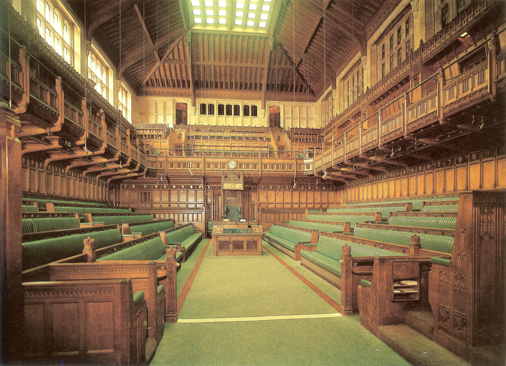

> 普金是英国`19世纪`著名的建筑师，反对维多利亚时期，支持复兴`哥特`，真实原则道德诚实(适用+真材+显示结构)   
> 著名的设计项目：`威斯敏斯特宫的室内设计`  它的西北角的钟楼就是著名的大本钟 从11世纪起历代国王都在此举行加冕仪式

#### 威廉莫里斯
> - 艺术与手工艺运动代表人物，英国工艺美术家，诗人，社会主义者  
> - 代表作品是`1858`年和菲利普韦伯设计的`红屋`  
> - 思想：  
>> 1. 设计为大众
>> 2. 设计集体活动
>> 3. 强调手工艺，明确`反对机械化生产`
>> 4. 提倡哥特式风格，简单朴实 良好功能  
>> - 评价： 重要设计先驱，率先提出设计的民主思想，实用性+美观性相，一生创作出大量优秀的设计。  
> - 不足：严格来看，不是现代设计奠基人(反对现代设计的核心——工业化和机械化生产)  违背他生产普通人买得起的好家具的目标，还是为资本家服务
> - 他所寻求的大众品位的提高，却是由那些抄袭了他的设计，再用机械化较低成本的批量生产出来出售给各个阶层的制造商完成的。

#### 约翰拉斯金
> - 英国维多利亚时代main`艺术评论家`，是最早提出现代设计思想的人物之一。尖锐批评水晶宫(建筑和展品)，关于现代设计的理念如下  
> 1. 设计(独立的学科)应该`与艺术相分离`
> 2. 设计的功能主义原则立场 倡导`为人民的艺术设计`
> 3. 理论`道德主义色彩`，劳动者(健康)也有思想(快乐) 二者不应该被分割    
> - these设计思想 1.设计理论史上的重大突破  2.影响建筑大师如路易斯莎莉文弗兰克莱特  
> - 提出设计目的是实用性，要求美学家从事产品设计    
> - 关注艺术和技术相互作用的`伦理方面`，手工艺人的技巧是快乐工作和实现艺术平等的基础。他彻底谴责机器使劳动变得简单无趣失去了手工作品的个性。从道德主义立场批判资本主义社会  
> - 拉斯金的《`现代画家`》提出：画家最根本的角色应该是忠实于自然。他主张施法自然，强调真善美，反对虚伪，邪恶和丑陋，而不是在古典中寻找
> - 建筑评论著作：`建筑的七盏灯`, 表达了他对哥特风格的喜爱  《`威尼斯的石头`》，

#### 索耐特14号椅
> 迈克尔索耐特的经典设计14号椅在`1859年`推出，被认为是第一把符合现代设计意义的座椅。  
> 这把椅子是典型的褪去所有装饰的毕德迈风格作品，具有双弧线椅背，椅子的每一个经`蒸汽弯曲`的山毛榉杆框架，每一个编制或塑形的部件都具有`功能性`，不仅`节省`了原材料和用工成本，同时做到了使极简设计风格和大规模量产结合。化繁就简，完全做到了增一分则多，减一分则少。  
> 轻便结实的14号椅在价格上也非常`亲民`，是第一次普罗大众可以真正消费得起的高档家具。  
> 14号椅`标准化零部件`的设计还十分利于出口，把未组装的产品部件装进集装箱，最大限度合理利用空间，到了目的地仅用螺丝刀就可以组装。民用，旅馆，饭店，咖啡厅和酒吧都非常适用  
> 作为第一个专门为`批量化大规模`量产设计的椅子，14号椅为设计实践引入了大量的新理念，为工厂系统带来了全新的理性思考。

#### 艺术与手工艺运动的得与失
> 艺术与手工艺运动缘起于十九世纪下半叶的英国 1.产品质量粗鄙(机器生产) 2.压抑人性生产模式，提倡中世纪作坊式的手工生产方式，对于建筑、家具、纺织品和平面设计都产生了不小的影响。积极意义+历史局限性  
> 进步方面：  
> 1. 率先形成了设计民主思想(普金 威廉莫里斯 约翰拉斯金)，1. 设计`为广大民众服务` 2.希望将人们从机器的束缚中解放出来  
> 2. `美与技术结合`原则，主张美术家从事产品设计up
> 3. 批评维多利亚风格，风格(淳朴大方，清新活泼，富有生机(动植物纹样)，具有一定温馨而浪漫的气质) 主张设计诚实实用 具有一定温馨而浪漫的气质  
> 局限性  
> 1. 完全`反对机械化` -> 将手工艺推到工业化的对立面 违背发展潮流
> 2. 过于强调装饰美使成本增加  (大众消费不起 -> 买机械化价格低产品 -> 工厂运转 -> 工人劳动依然不快乐/产品不美观)
> 总结 __认为机械是美的产品的天敌，使这场运动为大众服务的目的成为了知识分子的一厢情愿__  方法(`落后方式-实现先进理念`)本身就是相悖的 -> `工业设计体系建立基本要素`(摒弃旧传统 肯定机械生产)

**新艺术运动**
----------------------------------------------------------------------------------------

| 时期 | 地点 | 时间 |
| :----: | :----: |:----: |
| 新艺术运动 | 起源于`法国、比利时`蔓延整个国际 | 19世纪末20世纪初(1895 - 1910 30年)是从新古典主义、历史复古主义想现代主义`转化的过程`，是传统设计与现代设计之间`承上启下`的一个重要阶段 |

> - 在此之前，很多流派求复古，此后完全卸下历史包袱向前看，开创一种全新风格，从自然和民间乡土中寻求灵感。一篇合拢的树叶，一只孔雀的羽毛，一朵盛放的玫瑰都可以作为灵感来源，通过各种动态的，旋转的元素赋予他们戏剧化的设计风格
> - 自然主义装饰构思还是停留在装饰表面
> - 20世纪初很多设计师意识到机械化的重要性，开始关注对工业生产的设计
> - `亨利 图卢兹 劳特雷克`，法国 设计海报 线条粗壮，能少则少。生而逢时，赶上了印刷业大大发展的时候

#### 新艺术运动与艺术与手工艺运动的相似之处
> 1. 都是对矫揉造作的维多利亚风格和其他过分装饰风格的反动，都是`反对工业化风格`，都受到威廉莫里斯的思想理念和设计实践的影响
> 2. 新艺术运动继承了工艺美术对`大自然的崇尚`，强调从自然中寻求灵感，转向自然中的一些装饰题材
> 3. 都受到日本装饰风格，热便是江户时代艺术与装饰风格的影响，尤其是`浮世绘`的影响

#### 新艺术运动与艺术与手工艺运动的不同之处
> 1. 艺术与手工艺运动注重中世纪哥特风格，新艺术运动完全放弃任何一种传统装饰风格，`彻底走向自然风格`
> 2. 突出表现直线，`有机形态`，装饰题材基本来自于自然

| aspect | 工艺美术运动 | 新艺术运动 |
| :----: | :----: |:----: |
| 相似处 | 1.崇尚手工艺技术，反感工业制品 2.反对维多利亚风格和其他过分装饰 3. 青睐自然装饰题材(植物动物等) 4.受到日本装饰尤其是浮世绘的影响 |
| 不同处 | 为大众服务 | 为大众服务? |
| 不同处 | 推崇哥特风格 | 放弃任何一种传统的装饰风格 |
| 不同处 | 完全反对机械化工业化浪潮 | 反感工业制品的粗糙，但不完全排斥工业化进程 |

#### 新艺术运动诞生背景
> - 艺术与手工艺运动的影响
> - 生物学科的发展
> - 印象派、象征性主义艺术的成熟
> - 总体艺术的影响，当时社会发展日新月异，无论艺术还是生物科学都有了新的探索，设计不能拖后腿吃老本
> - 民族国家的建立

#### 新艺术运动总结
> 新艺术运动(艺术与手工艺运动在欧洲大陆延续 法国起) 19世纪末20世纪初 在欧洲和美国发展的一次影响相当大 内容广泛的 `装饰艺术设计形式主义运动`  
> 1. 强调手工艺，反对机械工业化的艺术风格，开始温和的接收机械化变革
> 2. `完全放弃历史装饰风格`，开创全新的自然装饰风格，注重象征性
> 3. 强调自然美 突出曲线和有机风格(流动韵律的线塑造形体)
> 4. 直线型的风格(简洁、抽象的直线和方格有规律结合)  
> 总结：   
> 1. 新艺术运动是知识分子中的部分精英，开创的设计尝试(工业化 维多利亚泛滥)，为20世纪的设计开创了一个新阶段，传统现代`承上启下`，风格实际上表现得是一种生活方式和生活态度，对日常生活提出更高更美的要求。是一个无可替代的从新古典主义，历史复古主义向现代主义转化的过程

#### 法国巴黎新艺术运动***
> 19世纪末至20世纪初，法国新艺术运动中心(巴黎)，由几个关系密切，以家具设计为主的设计集团为中心(新艺术之家，现代之家和六人集团)    
> `新艺术之家`: 萨姆尔滨(家居设计)创办，热衷自然风格，展出作品自然主义倾向，刻意强调有机形态 回避直线  
> `现代之家`：从事家居设计 热衷自然风格 设计风格和观念与新艺术之家类似  
> `六人集团`：`1898`begin，松散设计团体(6)，强调自然主义，提倡回到自然的口号。风格特征(植物纹样+曲线)，在家具及公共设施上皆有表现 famous`赫克特吉马德`，巴黎地铁站入口设计代表了法国新艺术的典型风格，

#### 赫克特吉马德**
> 六人集团成员，born里昂，作品代表法国新艺术风格  
> famous1`贝朗热公寓设计的铸铁大门`，大而精美非对称的卷草形态，如古典花园人造洞穴般的门厅和繁复的铸铁阳台卓尔不凡，受到霍塔启发  
> famous2 `地铁站入口`(1898)，地铁站入口巨大，生机勃勃又程式化的花茎采用标准化的铸铁部件，系列化生产 + 便于运输。设计理念 = 以自然为参考 + 考虑设计可行性

#### 法国南锡派新艺术运动
> 法国新艺术运动中心，以家具生产和制造为主，产品迎影大   
> 平面设计发展很快，如广告与书籍设计，但也明显受`日本浮世绘`风格影响  
> famous`埃米尔加莱`

#### 埃米尔加莱
> `玻璃`艺术品制作(不断实验玻璃的颜色，光感和纹理，痴迷于通过不同材质的运用获得最精妙的光线效果 他的玻璃制品更像雕塑艺术品而不是日用品) + 家具设计(雕刻的形式，通过镶嵌工艺表现出错综复杂的线条和空间效果，并提出了家居设计的主题要与产品功能性相吻合)  
> 理念 = 认为自然是设计师灵感的源泉 + 较早提出要注意产品功能性  
> 局限 = 作品只能单件手工制作  
> 代表: 睡蝶床 + 蜻蜓古玩架

#### 阿尔丰斯穆夏**
> 新艺术运动招贴广告画画家，作品数大 + 风格后世所效仿   
> 作品风格 = 青春美貌一头飘逸秀美的秀发女性 + 曲线流畅花草 + 汲取了日本木刻 + 拜占庭几何装饰 + 巴洛克洛可可艺术富于肉感细致描绘 -> 女性形象甜美优雅 + 身材玲珑 + 青春活力  
> 代表作品：JOB牌香烟的广告招贴

#### 维克多霍塔
> born`1861`，`比利时`建筑设计师  在19世纪90年代作品受到`海克尔`影响
> 代表作`塔赛尔公馆的室内设计`(总体艺术首次成功尝试 + 建筑史上首次对新艺术风格尝试):  建筑内外装饰 = 线条流畅 + 色彩协调 + 功能和装饰之间取平衡(1.开创使用钢材 + 玻璃屋顶 -> 金色阳光透过屋顶照射在楼梯拐角 2.楼梯间装饰性的花朵缠枝图案和柱头灯饰完美结合) -> 稳健典雅  呈现出戏剧化的效果 -> 反映着新世纪的前瞻精神

	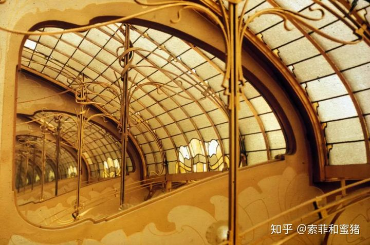
	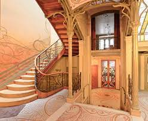
	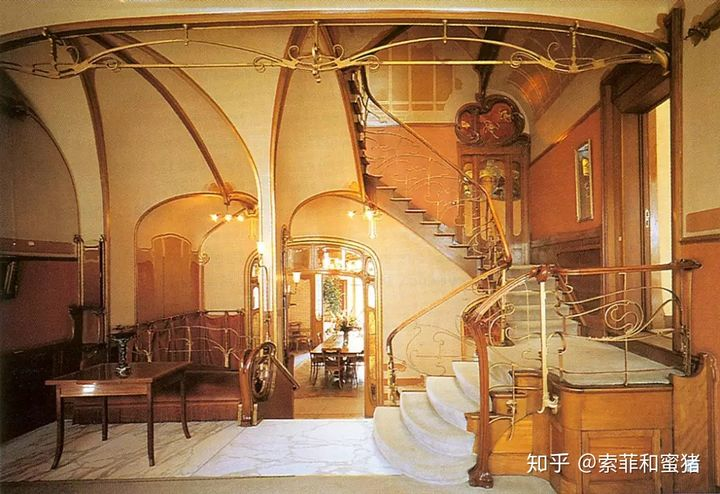

#### 亨利凡德威尔德
> 19末20初`比利时`新艺术运动核心人物(家具和室内设计)。国际影响力(现代主义奠基人之一) = 德国创立魏玛工艺美术 + 德国工业同盟创始人 + 对机械化的认可(机械催化剂 -> 新美感)  
> 1. 基本原则 = 结构合理 + 材料准确 + 程序明细 + 实用+适用
> 2. 工业与艺术结合 = 肯定技术 + 功能第一 -> 突破只追求形式不讲功能的局限(装饰自身没有生命，必须依附于作品本身的造型和线条，从而获得有机统一的应有位置) -> 推动现代设计理论发展
> 局限: `不赞成标准化`

#### 安东尼高迪
> born铜匠之家 ->`平民化心态` + `民主化思想`  -> 第一个设计项目是为工人设计住宅   建筑和家具设计源于`生物形态`  
> 设计特征：造型 = 折中混合各种风格变化 + 奔放奇异和谐   展现当时世纪末精神    
> 现代设计史 举足轻重 深远影响后世 与国际主义/现代主义相抗衡。现代主义建筑大师勒柯布西耶称他为后现代主义的先驱  
> 代表作: 圣家族教堂，`米拉公寓`，巴特罗公寓，古埃尔公园(用碎地砖快，杯碟瓷片做贴面，装饰古埃尔公园蜿蜒的矮墙 -> 多彩斑斓的鳞状马赛克效果 -> 第一次轻松美观的为艺术而艺术作品实施在公共环境中)

	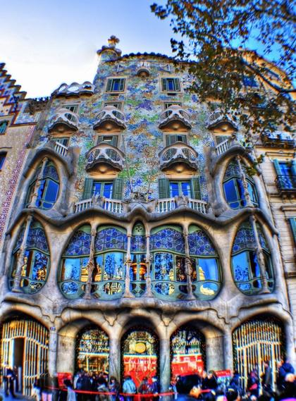
	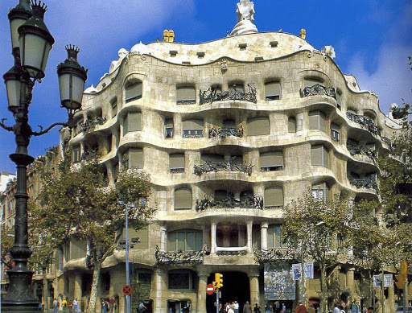
	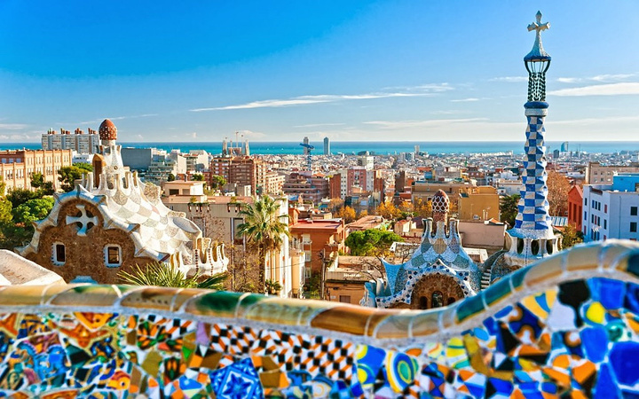
	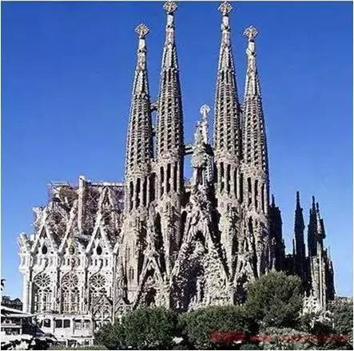

#### 查尔斯麦金托什
> 英国建筑设计师/产品设计师/画家，设计作品(建筑室内，家具灯具，玻璃制品，地毯挂毯等) 高背椅就是现代设计经典之作  
> 风格: 简单几何形 + 有机形态 + 纵横直线 + 黑白色(中性色彩) + 平衡处理 + 装饰性表现  
> 关键过度人物(新艺术运动 - 现代主义运动)，主张简单几何形 + 黑白色(中性色彩) -> 批量化工业化的生产形式作出有益的探索

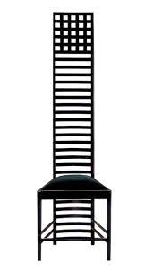

#### 维也纳分离派
> 奥地利的一批设计家(与学院派分离)group，艺术宣言: 为每一个时代的艺术，为每一种艺术的自由    
> `圣春`，`维也纳工坊`。约瑟夫霍夫曼 科罗曼莫塞尔 奥拓瓦格纳  
> 设计风格(麦金托什): `造型简洁明快` + 功能主义 + 有机形式  
> 特征: 耳目一新，base几何抽象 + develop前卫设计语言 = 功能装饰高度吻合 -> 功能主义美感 -> 影响现代主义运动  
> 弊端：no care 关系(艺术生产) 造价昂贵 -> 无法实现为大众设计的目的  
> `分离派之屋`(奥布里奇) 长方形支撑的圆屋顶 + 镀金的月桂树叶穹顶 = 体现分离派特征(局部有装饰)。入口铭刻：为每一个时代的艺术，为每一种艺术的自由 -> 世纪末维也纳社会精神缩影

#### 德国青年风格
> 青年风格运动(新艺术运动)，name(1896begin周刊青年)。受到自然形式影响 -> 改进装饰艺术及其相关的制作过程 + 提倡回归简单低商业化生活方式  
> - 第一阶段(曲线)：重曲线装饰，强调自然主义  
> - 第二阶段(直线 格拉斯哥四人集团)：寻找(from简单的几何造型，从直线的运用)新的形势发展方向  
> important`贝伦斯` 以慕尼黑为中心开展设计实验 -> 取得显著成绩 -> 影响到后来德国工业设计的发展

#### 彼得贝伦斯
> 贝伦斯是德国青年运动最重要的设计家，是`德国现代设计的奠基人`，被视为德国现代设计之父 培养大师的大师
> 他的设计理念上具有功能主义倾向和`几何形状`和`无装饰表面`的明显偏好，注重功能与技术表现的基础上，追求设计形式的简约
> 他设计过`AEG`公司的企业形象设计系统，迄今仍有非常积极的参考价值。同时他设计的涡轮工厂建筑，开场了日后现代主义幕墙式建筑的最早模式
> 贝伦斯是一位非常有影响力的`现代主义先驱者`，他的设计理念在当时有意识的摆脱流行的新艺术风格，朝现代主义的功能主义方向发展。德国现代主义的兴起于贝伦斯的设计实践分不开，他的事务所培养了格罗佩斯、[密斯凡德罗](#密斯凡德罗)、柯布西耶[勒柯布西耶](#勒柯布西耶)等现代主义重要人物

	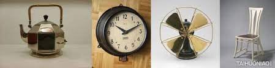
	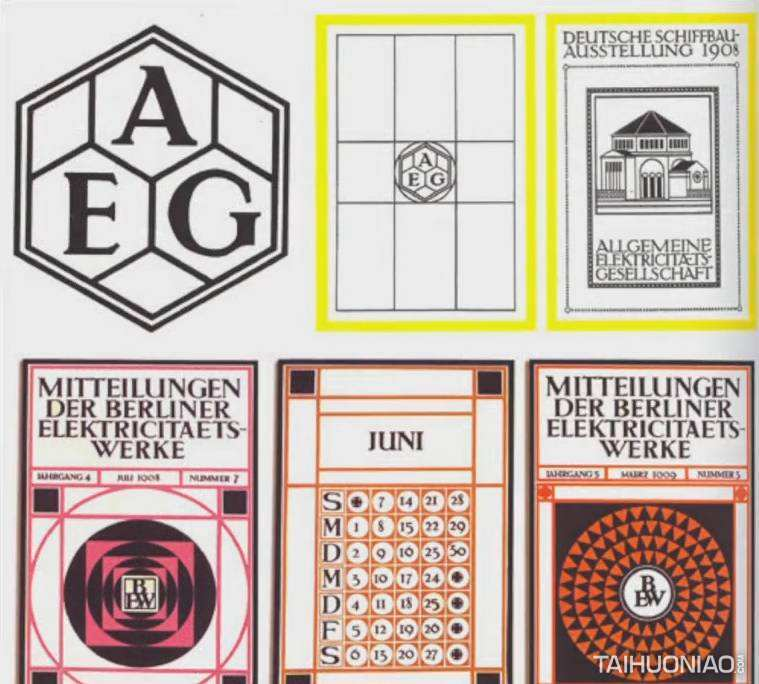
	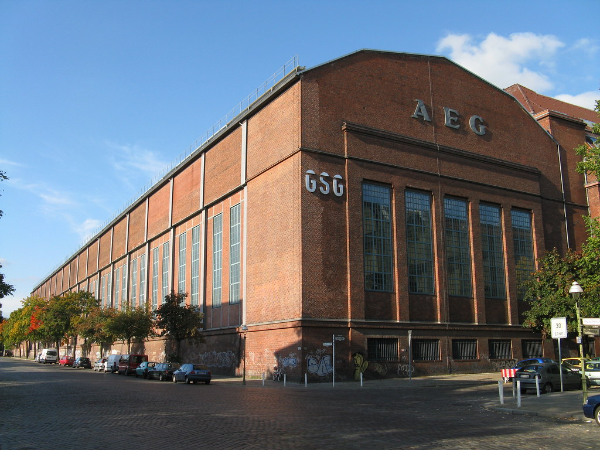

#### 赫尔曼穆特修斯
> 建筑设计师，外交官，曾担任德国驻伦敦大使馆的建筑专员，在此期间，他不断报告英国建筑的情况以及在手工艺及工业设计方面的进展。将英国工艺美术运动介绍到德国，回国后对当时德国设计发展起到了重要的作用 
> 他反对任何设计上对于单纯艺术风格，淡出装饰画的盲目追求，认为设计必须讲究目的，使用功能和制作成本，`大力宣传功能主义的设计原则` 强调客观主义、机器风格、`标准化`
> 1907年与彼得贝伦斯成立了德国第一个设计组织——`德意志工业联盟`。这标志着德国现代主义运动的发展开始，自此大大提高了德国产品在市场山的竞争力，德国产品渐渐以理性，高质量闻名于世。
> 科隆论战胜出者
> 曾担任普鲁士政府的官方顾问，力主对德国美术教育体系进行大力改革，将彼得贝伦斯等一批富裕改革精神的建筑家，设计家推上当地美术学院领导的地位，从而引导了对美术教育的改革 德国工业同盟奠基人和活动的开创者，德国现代设计艺术的先驱

#### 德国工业同盟
> 全称为德意志工业同盟 简称DWB 是`1907`年由`赫尔曼穆特修斯`成立的旨在促进设计的半官方机构。
> 标志着`德国现代主义运动的开始`
> 该组织旨在提高德国工业产品的质量，公开追求商业目的，号召德国设计专业人员与德国生产厂家之间建立起合作关系，以推动德国产品在世界市场上的竞争力
> 宗旨：
> - 提倡艺术、工业、手工业结合
> - 通过教育，宣传，把不同设计综合在一起
> - 强调走官方路线，避免政治干扰(面向市场，面向消费民众，为大众而设计)
> - 大力宣传功能主义和承认现代工业
> - 坚决反对任何装饰
> - 主张标准化和批量化(设计要便于批量生产)
> 自从这个机构成立后，德国的设计家就有一个可以团聚的中心，对于德国的设计，建筑产生了巨大的促进作用，引起欧洲一系列国家的效仿
> 补充待删：
> - 在德国国内，工业同盟首创了工业设计活跃的局面，奠定了德国工业设计的发展的基础，确立了工业设计的基本理念，真正预示了设计艺术新时代的来临。
> - 从世界意义上讲，德国工业同盟影响了英国、瑞典、丹麦等许多国家在1911-1915年相继成立了类似的组织，使工业设计在欧洲各地开展起来。
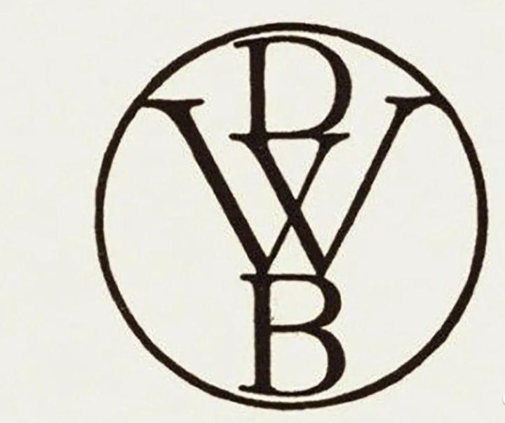

#### 新艺术运动的兴起与贡献
> 新艺术运动是在英国艺术与手工艺运动的深刻影响下，由1895年的法国起源，之后蔓延到整个欧洲，乃至俄国和美国，成为一个影响广泛实验程度更加深刻的国家设计运动。新艺术运动受到了前沿生物学科，印象派，象征主义以及日本艺术的影响，批判工业化批量制造产品的丑陋粗劣，同时对于工业化机械生产持认同态度。
> 新艺术运动在不同的国家形成的流派和风格不尽相同。新艺术运动中的各种艺术团体和流派都企图在艺术与手工艺之间找到一个平衡点，由此创造出非常特殊的装饰风格。从威尔德的室内，霍塔的旅馆，吉马德的巴黎地铁入口设计，再带高低的建筑、穆夏的大张海报，都表现出一个从未有过的费历史主义的新装饰风格探索力量
> 新艺术运动放弃任何一种传统装饰风格，完全走向自然主义，强调自然中不存在直线，强调自然中没有完全的平面，在装饰上突出表现曲线、有机形态。这些设计，已经成为了19世纪和20世纪交接时期的典型设计风格特征，成为一种历史的经典风格。同时，某些功能主义的思想特征，也在某种程度上具有开创性的意义，比如麦金托什和格拉斯哥四人集团，维也纳分离派的设计家以及的德国的彼得贝伦斯，他们的设计尝试，昭示了现代设计的先声。新艺术运动的最大贡献是完成了对传统的超越，形成了全新的艺术形式，该运动产生的大量的设计，已经成为了经典设计风格，为20世纪的设计开创了一个新阶段，成为传统和现代设计之间的一个承上启下的重要阶段。

**装饰艺术运动**
----------------------------------------------------------------------------------------

| 时期 | 地点 | 时间 |
| :----: | :----: |:----: |
| 装饰艺术运动 | 起源于法国巴黎，风靡欧美，影响美国 | `1910 - 1935`年前后，是继新艺术运动之后的一场国际性的设计运动 |

> - 进入1920年，西方社会从第一次世界大战的硝烟中重新站起来，社会气氛乐观，人们对生活质量的要求提高，欧洲各国经济普遍繁荣，逐渐有了装饰艺术运动。风格实际上是敷于繁华，充满闲情逸致的生活形态的反应，在1929年经济大萧条爆发之后当然难以为继
> - 主张简单几何形式的美，机械美学，反对复古，反对自然，反对单纯手工艺，
> - `承上启下`的运动 受现代主义运动影响很大 为上层社会权贵资产阶级服务
> - 最终现代主义设计运动胜出因为for大众，装饰艺术运动失败因为for权贵
> - `法国装饰艺术运动的四种设计策略`: 造型(直线-几何形式 -> 放射性线条) + 力场(贡布里希的秩序感)与整体控制 + 材料表面体验与机械感的象征 + 多元文化截取
> - 法国 `卡桑德拉` 彼夫字体，卡桑德拉的海报构成感也很强，可以借鉴    莫里斯本顿，百老汇体   `查尔斯盖思马`的插画海报可以借鉴  艾帝  唐纳德德斯基设计了汰渍LOGO

#### 装饰艺术运动总结
> - 装饰艺术运动是`20世纪二三十年代`在法国、美国和英国等国家展开的一次设计艺术运动。其名称出自1925年在巴黎举办的国际线带装饰和工业艺术发展
> - 这场运动`几乎与现代设计运动同时发展`，从材料和形式上都`受到现代主义设计`的影响。但它很大程度上依然是传统意义上的装饰设计运动，其服务对象是`资产阶级`，与强调大众服务，大批量生产的现代主义设计相区别
> - 受到埃及风格，非洲南美洲原始部落，中国元素，日本元素，大量借鉴了中国古代铜器和早期中国瓷器优雅的器型
> - 特征
> - 主张采用新材料如玻钢铁啥的
> - 强调`机械美`
> - 采用大量新的装饰手法使机械形式以及现代特征变得更加自然华贵
> - 造型语言表现为大量的`简单几何形`，`绚丽的色彩`，以及表现这些效果的高档材料
> - 受到大量原始艺术、古典艺术、工业文明以及姐妹艺术的影响
> 总结：装饰艺术运动的风格追求华丽的装饰，从而满足人们对于产品形式美感的追求，但其性质仍是异常形式主义运动，是一场`承上启下`具有国际性的设计运动
> - 名称出自 1925年在巴黎举办的国际现代装饰和工业艺术展。

#### 好莱坞风格
> 好莱坞风格是装饰艺术运动在美国的一个延伸与发展，它集中体现为公众化的电影院设计风格
> 其背景与20世纪30年代的经济危机有密切关系。这是，能够使人忘掉危机和积极困难的只有好莱坞电影，因此电影业成为了一枝独秀，好莱坞电影工业和电影院空前繁荣
> 此时电影院被称之为梦的宫殿。风格采用充满`梦幻`的色彩，夸张的方式，大胆的几何纹，卷草纹，动物纹，以对比强烈，闪亮的霓虹灯点缀，形成了繁华梦幻的装饰效果
> 好莱坞风格，代表性作品是埃及剧院和中国剧院，这些剧院在设计的过程中运用了很多装饰艺术风格元素，包括摩天大楼剪影，折线，放射状线条，金碧辉煌的色彩也体出现了装饰艺术的奢华，这种风格对欧洲也产生了一定的影响。

#### 图画现代主义运动
> 以图画海报为核心的`新平面设计运动`(in EU 装饰艺术运动 + 现代主义运动)  
> 特征：图像文字的整合效果 + 综合流行各流派特点 + 画面简洁形象鲜明 + 抽象变形平涂诉求力 + 立体主义 + 高度装饰效果 -> 新视觉语言

#### 传统装饰运动比较
| aspect | 艺术与手工艺运动 | 新艺术运动 | 装饰艺术运动 |
| :---- | :----: | :----: | :----: |
| 流行时间 | 19世纪下半叶 | 十九世纪末二十世纪初 | 二十世纪二三十年代 |
| 服务对象 | 为人民大众服务 | 为上层权贵服务 | 为资产阶级权贵服务 |
| 对机械的态度 | 明确反对机械生产 | 反对机械化艺术风格 | 用户机器，赞美机器 |
| 制作方式 | 手工制作 | 手工制作 | 手工艺与工业化结合 |
| 标榜的对象 | 中世纪哥特式风格 | 全新自然主义风格 | 未来主义，机器美学 |
| 风格特点 | 变化的曲线，清新的色彩 | 曲线风格和直线风格 | 几何的形式，绚丽的色彩 |
