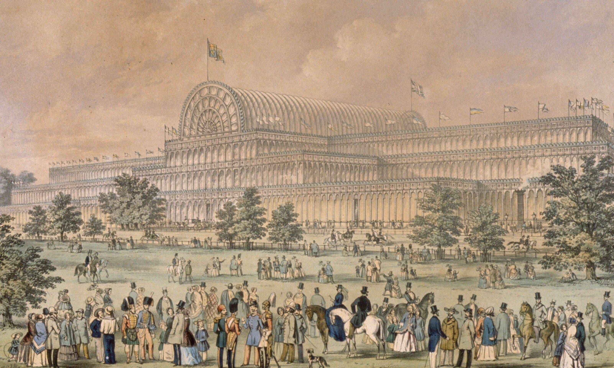
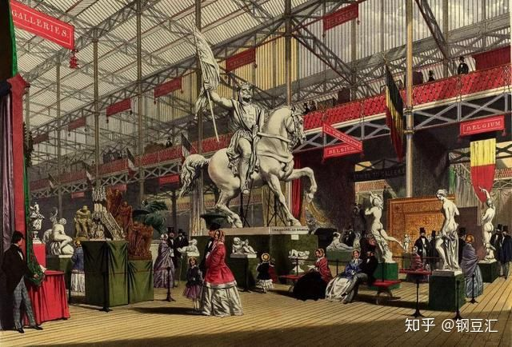
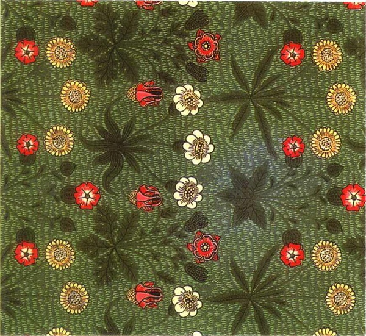
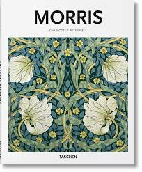
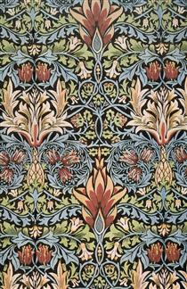
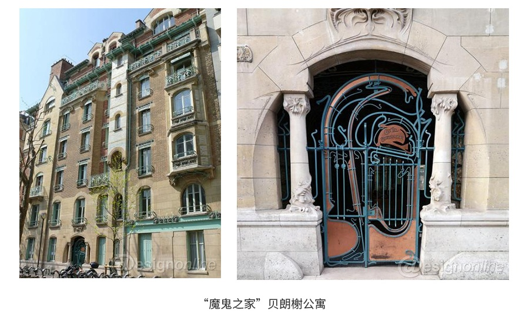
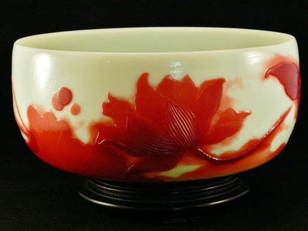
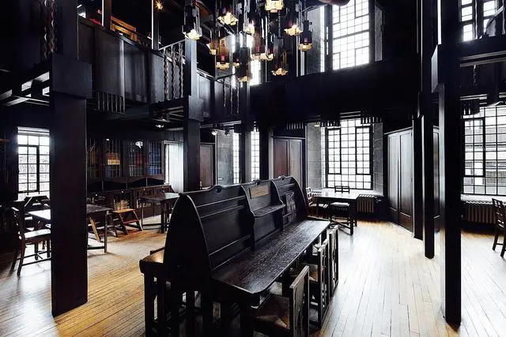
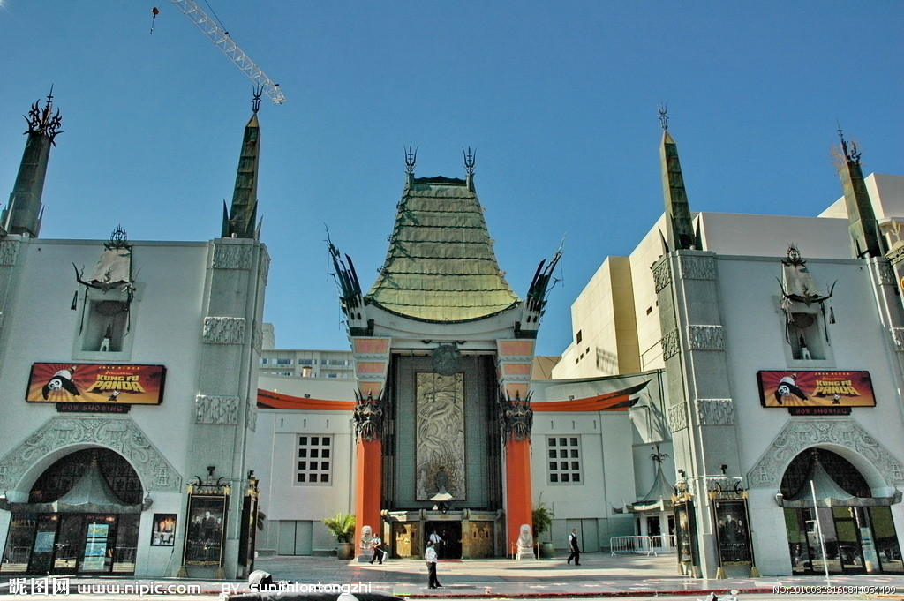

- ## [世界现代设计史论](#世界现代设计史论)

	- ### [前言](#前言)
	- ### [重点素材](#重点素材)

	- ### [艺术与手工艺运动](#艺术与手工艺运动)
		- ### [手工艺与工业时代对比](#手工艺与工业时代对比)
		- ### [约瑟夫帕克斯顿](#约瑟夫帕克斯顿)
		- ### [水晶宫博览会](#水晶宫博览会)
		- ### [维多利亚风格](#维多利亚风格)
		- ### [手工艺行会](#手工艺行会)
		- ### [威廉莫里斯](#威廉莫里斯)
		- ### [威廉莫里斯理想的幻灭](#威廉莫里斯理想的幻灭)
		- ### [红屋](#红屋)
		- ### [艺术与手工艺运动内容](#艺术与手工艺运动内容)
		- ### [约翰拉斯金](#约翰拉斯金)
	
	- ### [新艺术运动](#新艺术运动)
		- ### [新艺术运动与艺术与手工艺运动的相似之处](#新艺术运动与艺术与手工艺运动的相似之处)
		- ### [新艺术运动与艺术与手工艺运动的不同之处](#新艺术运动与艺术与手工艺运动的不同之处)
		- ### [新艺术运动诞生背景](#新艺术运动诞生背景)
		- ### [新艺术运动总结](#新艺术运动总结)
		- ### [法国巴黎新艺术运动](#法国巴黎新艺术运动)
		- ### [萨穆尔宾](#萨穆尔宾)
		- ### [现代之家](#现代之家)
		- ### [六人集团](#六人集团)
		- ### [阿尔丰斯穆夏](#阿尔丰斯穆夏)
		- ### [法国南锡派新艺术运动](#法国南锡派新艺术运动)
		- ### [埃米尔加莱](#埃米尔加莱)
		- ### [比利时新艺术运动](#比利时新艺术运动)
		- ### [维克多霍塔](#维克多霍塔)
		- ### [亨利凡德威尔德](#亨利凡德威尔德)
		- ### [西班牙的新艺术](#西班牙的新艺术)
		- ### [安东尼高迪](#安东尼高迪)
		- ### [苏格兰新艺术运动](#苏格兰新艺术运动)
		- ### [查尔斯麦金托什](#查尔斯麦金托什)
		- ### [格拉斯哥四人设计集团](#格拉斯哥四人设计集团)
		- ### [维也纳分离派](#维也纳分离派)
		- ### [德国青年风格](#德国青年风格)
		- ### [彼得贝伦斯](#彼得贝伦斯)
		- ### [赫尔曼穆特修斯](#赫尔曼穆特修斯)
		- ### [德国工业同盟](#德国工业同盟)

	- ### [装饰艺术运动](#装饰艺术运动)
		- ### [装饰艺术运动总结](#装饰艺术运动总结)
		- ### [好莱坞风格](#好莱坞风格)
		- ### [图画现代主义运动](#图画现代主义运动)
		- ### [法国装饰艺术运动的四种设计策略](#法国装饰艺术运动的四种设计策略)
		- ### [传统装饰运动比较](#传统装饰运动比较)
		
## 世界现代设计史论
-------------------------------------------

## 前言

#### 时代背景表
| 时期 | 背景 | 关键词 |
| :----: | :----: |:----: |
| 17 - 18世纪 | 资产阶级革命完成，技术革命推动资本家地位上升，现代化萌芽 艺术家和工业化的矛盾 面向大众 | 知识分子发起现世主义 启蒙时代理性自由 古希腊复兴 道德觉醒 1851年世博会水晶宫 工业革命 英国 机械生产 资产阶级|
| 19世纪 | 受到英国艺术与手工艺运动影响 | | 
| 19世纪末 - 20世纪初 |  | |

#### 时代人物表
| 时期 | 背景 | 相关运动 | 人物 |
| :----: | :----: | :---- | :----: |
| 17 - 18世纪 | 英国第一次工业革命成功 | -- | 威廉莫里斯(红屋) 约瑟夫帕克斯顿(水晶宫) 托马斯奇彭代尔|
| 19世纪下半叶 | 资产阶级革命完成，机械生产大流行 现代化萌芽 | 艺术与手工艺运动 | 罗斯金 威廉莫里斯 |
| 19世纪末 - 20世纪初 | 艺术与手工艺运动成功影响 印刷业发达 生物科学发达 | 新艺术运动 | 阿尔方斯穆夏 |

#### 工艺美术的标准(最关心)
> 合宜 `适用性原则`  

## 重点素材
> 这些最好都找到图片材料  

**艺术与手工艺运动**
----------------------------------------------------------------------------------------

| 时期 | 地点 | 时间 |
| :----: | :----: |:----: |
| 艺术与手工艺运动 | 英国 | 指英国`19世纪下半叶`形成的一场设计运动，是针对家具、室内产品、建筑的工业批量生产所造成的设计水准下降的局面，而在设计领域开展的一项`改革运动` |

> 背景：18世纪六十年代英国率先开展了工业革命，使机械越来越成为生产制造的重要手段 19世纪初各国工业革命先后完成，资产阶级革命完成，技术革命推动资本家地位上升，现代化萌芽 艺术家和工业化的矛盾 艺术家想服务大众 
> 机械技术 -> 进步 + 恐慌 + 工业化远超于设计水平
> 两极化: 精美手工艺品 粗劣工业品

> 运动时间：19世纪下半叶，萌芽在18世纪
> 运动内容
> - 艺术家推崇古希腊和哥特式风格
> - 强调`手工业的复兴`
> - 崇尚`诚实适用，真材实料，显示结构`的产品
> 运动特征：人造材料，机械工具，标准化
> 时代人物：罗斯金 威廉莫里斯 
> 罗斯金的理论和莫里斯的实践将设计生产置于一个新的道德绑架之中，他们都是社会主义者，追随马克思主义，对当时社会制度不满，谴责机器是劳动失去个性

> `机械化`造成两个问题：
> 1. 生产方式使产品变得低劣和粗糙艺术性大打折扣
> 2. 人变成了生产链上的一环，降低创造性，生产变得极其枯燥和乏味
> `设计师`面对两个问题：
> 1. 过分装饰矫揉造作的维多利亚风格蔓延
> 2. 令不少知识分子震惊甚至恐惧的工业化的来临
> 水晶宫维多利亚风展品的`缺点`总结为三点：
> 1. 为了掩盖瑕疵而增加华而不实的装饰外壳 -> 华而不实 -> 品质不诚实
> 2. 为了逐利而刻意增添不必要的装饰工艺 -> 矫揉造作 -> 功能丧失
> 3. 为了炫耀而将各种风格堆砌杂糅 -> 真空恐惧，唯美空洞
> 奥古斯塔斯普金明确反对这种风格，对水晶宫展品否定

> 补充待删：
> - 罗斯金认为，手工艺人的技巧是快乐工作和实现艺术平等的基础。他彻底谴责机器使劳动变得简单无趣失去了手工作品的个性。
> - 18世纪的英国资产阶级革命已经完成，技术革命正在开展。古董，流星家居，陈设服饰等商品用来表现资本家社会地位和个人身份
> - 商人为了自己的利益推动市场，设计营销刺激消费欲
> - 此时人们的审美观念还停留在过去精雕细琢的手工艺产品，很难接受单纯简介的工业产品，工业设计远不成熟，是个新旧过度的阶段
> - 19世纪就是建立在炼铁工业发展的基础之上，铸铁工艺up，然后是熟铁，然后是钢(加了碳)
> - 蒸汽机切木材贴面，可以制作廉价而外表精美的家具
> - 万恶的资本主义是导致这种局面(维多利亚风格流行)的根本原因，罗伯逊说是因为我们工匠的天才用在了更图利的那一面，而不是他们的品位不佳
> - 百工者，以致用为本，以巧饰为末 - 王符 汉
> - 装饰法则: 37条法则，建立装饰的规范，提出装饰艺术源于`建筑`，所有装饰都应该基于几何结构，形式开始向非历史方向转变

#### 手工艺与工业时代对比
| aspect | 手工艺时代设计的重要特征 | 工业时代设计的重要特征 |
| :----: | :----: |:----: |
| 材料 | 自然材料 | 人造材料 |
| 工具 | 手工工具 | 机械工具 |
| 工艺 | 个人性 | 标准化 |

#### 艺术与手工艺运动内容
> 工艺美术运动起源于19世纪下半叶的英国，后发展成一场国际运动
> 历史背景：起因是针对机械工业批量生产所造成的产品艺术品位的下降以及机械化生产方式带来的乏味工作环境
> 代表人物：理论指导是约翰拉斯金，设计实践家是威廉莫里斯
> 特征
> 1. 强调手工艺，明确反对机械化生产
> 2. 装饰上反对矫揉造作的维多利亚风格，提倡哥特式风格
> 3. 主张设计诚实诚恳，反对设计上哗众取宠，华而不实的趋向
> 4. 主张师法自然，以及学习东方装饰风格
> 总结：首先，东一美术运动在拉斯金和莫里斯的指导下，首先提出了 美与技术相结合的原则，主张美术家从事产品设计，旨在提高产品的美感。在探索中，工艺美术运动形成了独特的淳朴大方，清新活泼，富有生机的风格特征。其次，他们秉承设计为普罗大众服务的设计理念，希望将人们从机器的束缚中解放出来，从事快乐的手工劳动，最后他们对工业化的反对，对机械的否定是违背历史发展潮流的，同时过于强调装饰，增加了产品的成本，使其为大众服务的目的只是成为知识分子的一厢情愿。

#### 约瑟夫帕克斯顿
> 他是一名园艺师，建筑工程师
> 1850年，设计了第一届世界博览会展馆——水晶宫。开创了采用标准构件，钢铁、玻璃设计和建造建筑的先河，非建筑师也能成为建筑风格的革新者

#### 水晶宫博览会
> 1851年英国要举行第一次世纪博览会(海德公园)，由于时间紧任务重，英国工程师派克斯顿以钢铁与玻璃建造温室的设计原理，大胆地把温室结构应用在这次博览会的展厅设计中
> 展览大厅全部采用钢材与玻璃，晶莹剔透，采光极好，故被人称之为水晶宫，水晶宫本身就是一个机器制品，没有任何多余的装饰。
> 水晶宫对世界近代现代建筑史，工业设计史具有重大意义，开创了采用标准构件、钢铁、玻璃设计和建造建筑的先河，把`技术`作为新建筑和新产品材料的直接`来源`，意味着非建筑师也能成为建筑风格的革新者
> 补充待删：
> 维多利亚时期人们对于装饰无休止一味贪多造成的`不诚实的设计`，不仅显示出一场势在必行的设计革命，而且说明设计教育急需改良，也显示了一个国家通过新兴经济致富后的`暴发户心态`，生产商推动所谓的潮流只是为自己的`利益`拓展市场

#### 手工艺行会
> 行会是有一个城镇，同行业的工匠，组成的互惠互利的联盟，开始形成与11世纪。其旨在调整同行业关系，解决同行业矛盾，保护同行利益，协调行业和政府的关系
> 1. 是在一个互惠互利的联盟中为工匠提供相同的职业工作，并实施垄断，提高个体设计师-工匠的生计和收益
> 2. 是工匠行会不仅保护其成员的利益，也保护消费者的利益，其通过制定行业规则制度，组织恶劣的工艺败坏行业声誉
> 3. 有效的促进了设计师-工匠的地位提升。

#### 奥古斯塔斯普金
> 普金是英国`19世纪`著名的建筑师，他认为维多利亚时期的设计是华而不实，缺乏功能且道德沦丧的。他支持复兴`哥特`复兴，呼吁设计与建筑中的真是原则，它基于三个基本属性即`适用+真材+显示结构`，归结为`道德诚实`
> 出版两部重要影响巨著：`对照即14 15世纪的玉宇琼楼与当今类似建筑的比较` + `尖顶或基督教建筑的真实原则`
> 著名的设计项目：`威斯敏斯特宫`的室内设计
> 补充待删：威斯特敏斯特宫又称议会大厦（Houses of Parliament）是英国议会（包括上议院和下议院）的所在地，位于英国伦敦的中心威斯敏斯特市，它坐落在泰晤士河河畔 哥特复兴式建筑代表 浪漫主义 是世界上最大的哥特式建筑 它的西北角的钟楼就是著名的大本钟 从11世纪起历代国王都在此举行加冕仪式。

#### 威廉莫里斯

> 威廉莫里斯是艺术与手工艺运动最主要的代表人物，英国工艺美术家，诗人，社会主义者，被设计界成为现代设计之父。他的代表作品是1858年和菲利普韦伯设计的红屋，1861年，成立了莫里斯公司
> 思想：
> 1. 设计是为大众服务的活动，而非为少数人服务的活动
> 2. 设计是一项集体活动，而不是个体活动
> 3. 强调手工艺，明确`反对机械化生产`
> 4. 提倡哥特式风格和其他中世纪的风格，讲究简单，朴实无华和良好功能
> 评价： 威廉莫里斯是一个重要的设计先驱，率先提出了设计的民主思想，强调实用性和美观性相结合，一生创作出大量优秀的设计。但严格来看，他不是现代设计的奠基人，因为他所探索的重点恰恰反对现代设计的核心——工业化和机械化生产
> 补充：
> - 莫里斯尽可能实用手工艺避免机器，造成他公司的产品造价高昂，违背他生产普通人买得起的好家具的目标，还是为资本家服务，作为一个非常坚定的社会主义者，莫里斯顽强抵抗任何形式的机械化，永远都无法达到他为大众服务的目标。
> - 莫里斯设计中的自然形态有着内在的合理性，融于自然的实用美感，是其设计的终极目标

#### 威廉莫里斯理想的幻灭
> 威廉莫里斯的理想：既要生产低价却高品质的商品，还要让工人从事创造性的劳动
> 可是纯手工作出的产品一般价格都比较高，普通大众消费不起还是去购买机械化生产出来价格亲民的产品，有消费就有市场，工厂还在照常运转，工人劳动依然不快乐，产品不美观 

#### 红屋
> 红屋是英国工艺美术运动典型代表作品，威廉莫里斯的婚房，无论是建筑还是室内家具由莫里斯和菲利普韦伯合作设计并亲自建造设计制作
> 因外墙采用红砖而得名。强调功能性，适用性和舒适性。是英国哥特式建筑和传统乡村建筑的完美结合，自然，简朴，实用。

#### 约翰拉斯金
> 约翰罗斯金(1819年－1900年)是英国维多利亚时代主要的艺术评论家之一，是美国美术理论家和教育家，是最早提出现代设计思想的人物之一。他针对水晶宫博览会的建筑和展品进行了尖锐的批评，推出了自己关于现代设计的理念如下
> 1. 设计应该与艺术相分离，设计应该成为独立的学科
> 2. 设计的功能主义原则立场应该强调设计的社会功能性，倡导`为人民的艺术设计`。设计应为大多数人服务，而不是为少数权贵服务
> 3. 罗斯金的理论带有强烈的道德主义色彩，而劳动者也有思想，劳动能促进健康，思想能引起快乐，二者不应该被分割。约翰拉斯金的这些设计思想是设计理论史上的重大突破，一直现代主义的建筑大师如路易斯莎莉文弗兰克莱特等人都在他们的设计中表达了拉斯金的理念。
> 主张艺术要密切联系大众生活，。同时他还提出了设计的实用性目的，主张取消艺术和设计之间的差别，要求美学家从事产品设计
> 拉斯金的，他关注艺术和技术相互作用的伦理方面，从道德主义立场批判资本主义社会

#### 索耐特14号椅
> 迈克尔索耐特的经典设计14号椅在`1859年`推出，被认为是第一把符合现代设计意义的座椅。
> 褪去所有装饰的典型的毕德迈风格作品具有双弧线椅背，椅子的每一个经`蒸汽弯曲`的框架(山毛榉杆)，每一个编制或塑形的部件都具有`功能性`，不仅`节省`了原材料和用工成本，同时做到了使极简设计风格和大规模量产结合。化繁就简，完全做到了增一分则多，减一分则少。
> 轻便结实的14号椅在价格上也非常`亲民`，是第一次普罗大众可以真正消费得起的高档家具。
> 14号椅`标准化零部件`的设计还十分利于出口，把未组装的产品部件装进集装箱，最大限度合理利用空间，到了目的地仅用螺丝刀就可以组装。民用，旅馆，饭店，咖啡厅和酒吧都非常适用
> 作为第一个专门为`批量化大规模`量产设计的椅子，14号椅为设计实践引入了大量的新理念，为工厂系统带来了全新的理性思考。

#### 艺术与手工艺运动的得与失
> 艺术与手工艺运动缘起于十九世纪下半叶的英国，针对机器生产带来的粗鄙的产品质量和压抑人性的生产模式，提倡中世纪作坊式的手工生产方式，对于建筑、家具、纺织品和平面设计都产生了不小的影响。这其中既有相当多的积极意义，也有不少历史的局限性
> 进步方面：
> 1. 普金 威廉莫里斯 约翰拉斯金等人的指导实践下，率先形成了设计的民主思想，主张设计`为广大民众服务`，而不是为少数权贵服务，希望将人们从机器的束缚中解放出来，从事快乐又具有创造性的工作劳动。
> 2. 提出了`美与技术结合`的原则，主张美术家从事产品设计而不是纯艺术，改良粗陋的工业产品。
> 3. 对过度装饰的维多利亚风格进行批评，形成了一种`清新自然`的艺术风格，大量采用`动植物纹样`，注意材料选择，注意发挥材料优势，主张设计`诚实，质朴，大方，实用`具有一定温馨而浪漫的气质
> 局限性
> 完全`反对机械化`拒绝高效率的工业化生产方式，将手工艺推到工业化的对立面。违背发展潮流，曲折英国设计道路，过于强调装饰美使成本增加，__认为机械是美的产品的天敌，使这场运动为大众服务的目的成为了知识分子的一厢情愿__ 希望用一种落后的方式来世实现更先进的理念这个方法本身就是相悖的
> 方法论
> 工业设计体系的建立基本要素：对旧传统的摒弃 对机械生产的肯定

**新艺术运动**
----------------------------------------------------------------------------------------

| 时期 | 地点 | 时间 |
| :----: | :----: |:----: |
| 新艺术运动 | 起源于`法国、比利时`蔓延整个国际 | 19世纪末20世纪初(1895 - 1910)是从新古典主义、历史复古主义想现代主义`转化的过程`，是传统设计与现代设计之间`承上启下`的一个重要阶段 |

> 背景
> - 英国艺术与手工艺运动的影响
> - 生物学科发展 比如生物学家恩斯特海克尔的书自然界中的艺术形式
> - 石板套色印刷技术的发展 使得平面宣传品得以大量印刷成为重要的传播媒介
> - 民族国家的建立，人口显著增长
> - 日本艺术的影响
> 运动时间：`19世纪末-20世纪初期` 1910年后逐步为现代主义运动和装饰艺术运动所取代
> 运动内容：
> - 走向`自然主义` 或抽象直线(理性主义)，或流动曲线(自然纹样)
> - 反对工业化风格 but不完全排斥工业化进程
> - 企图在手工艺和艺术之间找到一个平衡点
> 运动特征：放弃任何一种历史风格 探索曲线直线新形式 创新意识 依旧强调手工艺 各国有各国的风格和名称 传统和现代设计的过度

| 国家 | 名称 | 重点人物团体案例 |
| :----: | :----: |:----: |
| 法国 | 新艺术运动(巴黎，南锡) | 新艺术之家(萨穆尔宾，法国巴黎) 现代之家(类似前者) 六人集团(赫克托吉马德) 南锡新艺术运动(埃米尔加莱) |
| 比利时 | 新艺术运动 | 亨利凡德威尔德、维克多霍塔 |
| 西班牙 | 现代派 | 安东尼高迪 |
| 英国 | 苏格兰新艺术运动 | 格拉斯哥四人设计集团 |
| 奥地利 | 维也纳分离派 |  |
| 德国 | 青年风格 | 彼得贝伦斯  赫尔曼穆特修斯|

> 补充待删：
> - 自然界中的艺术形式里面关于海葵水母原生动物的印刷品成为连通艺术与科学的桥梁，在20世纪初对设计的发展产生了巨大影响。他提出了自然界万物之间都彼此关联的理论
> - 在此之前，很多流派求复古，此后完全卸下历史包袱向前看，开创一种全新风格，从自然和民间乡土中寻求灵感。一篇合拢的树叶，一只孔雀的羽毛，一朵盛放的玫瑰都可以作为灵感来源，通过各种动态的，旋转的元素赋予他们戏剧化的设计风格
> - 自然主义装饰构思还是停留在装饰表面
> - 他们试图探索工业产品更深的意义，体现道德，并从其本土根基中找寻设计灵感，民族浪漫主义
> - 19世纪末 德国成为非常重要的工业强国，纺织钢铁主要出口国，蒸汽机铁路制造享有盛誉 是对英国制造商的借鉴
> - 20世纪初很多设计师意识到机械化的重要性，开始关注对工业生产的设计

#### 新艺术运动与艺术与手工艺运动的相似之处
> 1. 都是对矫揉造作的维多利亚风格和其他过分装饰风格的反动，都是`反对工业化风格`，都受到威廉莫里斯的思想理念和设计实践的影响
> 2. 新艺术运动继承了工艺美术对`大自然的崇尚`，强调从自然中寻求灵感，转向自然中的一些装饰题材
> 3. 都受到日本装饰风格，热便是江户时代艺术与装饰风格的影响，尤其是`浮世绘`的影响

#### 新艺术运动与艺术与手工艺运动的不同之处
> 1. 艺术与手工艺运动注重中世纪哥特风格，新艺术运动完全放弃任何一种传统装饰风格，`彻底走向自然风格`
> 2. 突出表现直线，`有机形态`，装饰题材基本来自于自然

| aspect | 工艺美术运动 | 新艺术运动 |
| :----: | :----: |:----: |
| 相似处 | 1.崇尚手工艺技术，反感工业制品 2.反对维多利亚风格和其他过分装饰 3. 青睐自然装饰题材(植物动物等) 4.受到日本装饰尤其是浮世绘的影响 |
| 不同处 | 为大众服务 | 为大众服务? |
| 不同处 | 推崇哥特风格 | 放弃任何一种传统的装饰风格 |
| 不同处 | 完全反对机械化工业化浪潮 | 反感工业制品的粗糙，但不完全排斥工业化进程 |

#### 新艺术运动诞生背景
> - 艺术与手工艺运动的影响
> - 生物学科的发展
> - 印象派、象征性主义艺术的成熟
> - 总体艺术的影响，当时社会发展日新月异，无论艺术还是生物科学都有了新的探索，设计不能拖后腿吃老本
> - 民族国家的建立

#### 新艺术运动总结
> 新艺术运动时19世纪末20世纪初在欧洲和美国发展的一次影响相当大的装饰艺术运动，是一次内容广泛的，设计上的形式主义运动
> 这场运动实质上是英国艺术与手工艺运动在欧洲大陆的延续，从法国兴起，之后蔓延至欧洲大陆，影响到英国和美国，在各国具有不尽相同的艺术风格
> 特征
> 1. 强调手工艺，反对机械工业化的艺术风格，开始温和的接收机械化变革
> 2. `完全放弃历史装饰风格`，开创全新的自然装饰风格
> 3. 一部分强调自然美，突出曲线和有机风格，并用流动、有韵律、波浪起伏的线塑造形体
> 4. 另一部分则将简洁、抽象的直线和方格有规律的结合成直线型的风格
> 总结：
> 1. 新艺术运动是知识分子中的部分精英，在工业化的大浪潮以及过分装饰的维多利亚风格泛滥的双重背景下所开创的设计尝试，该运动产生的大量的设计，为20世纪的设计开创了一个新阶段，成为传统和现代设计之间的一个`承上启下`的重要阶段。

#### 法国巴黎新艺术运动***
> 19世纪末至20世纪初，巴黎是法国新艺术运动的重要中心，从组织方式来看，法国这场运动由几个关系密切，以家具设计为主的设计集团为中心，其中影响最大的有 新艺术之家，现代之家和六人集团
> 新艺术之家有`萨姆尔滨`创办，他主要从事家居设计，他强调回到自然去，展出的作品大多具有强烈的自然主义倾向，模仿植物的形态和纹样，回避直线，刻意强调有机形态
> 现代之家：依然热衷于自然风格，也主要从事家居设计，设计风格和观念与新艺术之家类似
> 六人集团：1898年成立，由6位设计家组成的松散设计团体，以`赫克特吉马德`最著名，他的巴黎地铁站入口设计代表了法国新艺术的典型风格，地铁站入口巨大，生机勃勃又程式化的花茎采用标准化的铸铁部件，既能系列化生产，有便于运输

#### 萨穆尔宾
> 法国出版商，贸易商，艺术经纪人，对日本艺术非常着迷，1895年-1904年，萨穆尔宾将自己的日本艺术画廊变成了陈列室陈列兼具各种风格的来自日本以及西方艺术家的作品产品，取名为新艺术之家，由此新艺术名扬欧洲
> 他强调回到自然去，展出的作品大多具有强烈的自然主义倾向，模仿植物的形态和纹样，回避直线，刻意强调有机形态

#### 现代之家
> 巴黎新艺术运动的第二重要设计集团，和新艺术之家大同小异

#### 六人集团
> 1898年成立，由6位设计家组成的松散设计团体，以`赫克特吉马德`最著名，他的巴黎地铁站入口设计代表了法国新艺术的典型风格，地铁站入口巨大，生机勃勃又程式化的花茎采用标准化的铸铁部件，既能系列化生产，有便于运输
> 热衷自然风格，强调自然主义，提倡`回到自然`的口号。采用植物纹样、曲线作为设计的风格特征，在家具及公共设施上皆有表现。

#### 赫克特吉马德**
> 法国六人集团设计师成员，出生于里昂，作品更能代表法国的新艺术风格
> 他为`贝朗热公寓设计的铸铁大门`非常著名，这扇大门以非对称的卷草形态大而精美，如古典花园人造洞穴般的门厅和繁复的铸铁阳台卓尔不凡，这种风格显然受到霍塔的启发
> 吉马德于1898年为巴黎地铁公司设计的`地铁站入口`让他名声远扬，地铁站入口巨大，生机勃勃又程式化的花茎采用标准化的铸铁部件，既能系列化生产，有便于运输。反应了他以自然为参考同时又充分考虑设计可行性的设计理念，影响甚广。

	
	

#### 法国南锡派新艺术运动
> 是法国新艺术运动另一个重要中心，以家具生产和制造为主，产品广受欢迎，影响很大。
> 南锡新艺术运动中的平面设计发展很快，如广告与书籍设计，但也明显受`日本浮世绘`风格影响
> 设计模拟自然，可谓是仿生学的早期案例
> 其中设计师`埃米尔加莱`是这个中心的领军人物，埃米尔加莱的详细介绍下面有

#### 埃米尔加莱
> 主要从事`玻璃`艺术品制作和家具设计，认为自然是设计师灵感的源泉。在玻璃设计中，加莱不断实验玻璃的颜色，光感和纹理，痴迷于通过不同材质的运用获得最精妙的光线效果。他的玻璃制品更像雕塑艺术品而不是日用品。
> 在家居设计中，他主要采用雕刻的形式，通过镶嵌工艺表现出错综复杂的线条和空间效果，并提出了家居设计的主题要与产品功能性相吻合。
> 他是法国新艺术运动中较早提出要注意产品功能性的一位设计师。代表的设计有睡蝶床和蜻蜓古玩架
> 然而他的局限性在于其作品只能单件手工制作，未能和机械化生产结合起来

	
	
	

#### 阿尔丰斯穆夏**
> 阿尔丰斯穆夏是新艺术运动著名的招贴广告画画家，他的作品数量巨大，风格多为后世所效仿
> 穆夏的作品画面通常有青春美貌的女性和富有装饰性的曲线流程的花草组成。汲取了日本木刻优美的轮廓线，拜占庭艺术的几何装饰效果，以及巴洛克洛可可艺术细致而富于肉感的描绘
> 经过他的加工，所有的女性形象都显得甜美优雅，身材玲珑曲致，富有青春的活力，有时还有一头飘逸秀美的秀发
> 代表作品：JOB牌香烟的广告招贴

	
	
	

#### 比利时新艺术运动
> 民主色彩 功能主义理想和设计革命结合 提出人民的艺术 从大众消费者角度出发的艺术`维克多霍塔``亨利凡德威尔德`

#### 维克多霍塔
> 比利时新艺术运动建筑设计中最杰出代表之一，代表作塔赛尔公馆的室内设计，这是建筑史上第一次对新艺术风格的尝试
> 出生于1861年，建筑设计师，在19世纪90年代的作品明显受到了海克尔的影响
> 塔赛尔旅馆是总体艺术的一次成功尝试，无论建筑外表设计还是室内设计装饰都线条流畅，色彩协调，同时能够在功能和装饰之间取得很好的平衡关系，显得更加稳健和完美
> 这个建筑开创性的使用钢材与玻璃屋顶，室内设计装饰线条流畅，温暖的金色阳光透过屋顶照射在楼梯拐角，楼梯间装饰性的花朵缠枝图案和柱头灯饰完美结合 色彩协调，同时能在功能和装饰之间取得很好的平衡关系，呈现出戏剧化的效果。典雅卓然，稳健优美，凸显了新艺术风格特点，反映着新世纪的前瞻精神

	
	
	
	

#### 亨利凡德威尔德
> 是19世纪末、20世纪初`比利时`新艺术运动的核心人物，有着巨大的国际影响，主要涉及领域是家具和室内设计。在德国创立魏玛工艺美术学院成为日后包豪斯的前身，还是`德国工业同盟创始人`之一。在新艺术运动中的`重要突破是对机械化的认可`。现代主义奠基人之一
> 1. 工业与艺术结合，对技术加以肯定，明确提出`功能第一`的原则
> 2. 设计的基本原则：设计结构合理，材料运用准确，工作程序明细，设计的实用与适用
> 威尔德就`艺术与工业结合`这一点，就突破了新艺术运动只追求形式，不讲功能的局限，推动了现代设计理论的发展，成为现代主义设计思想的奠基人。
> 但他的局限性是`不赞成标准化`，从而引发了[科隆论战](#科隆论战)
> 补充待删：
> - 装饰自身没有生命，必须依附于作品本身的造型和线条，从而获得有机统一的应有位置
> - 机械是一种强有力的催化剂，能够产生一种新的美感
> - 产品结构应符合逻辑，运用材料时要出其不意，要自豪并且坦诚地展现工作过程

#### 西班牙的新艺术
> `安东尼高迪`

#### 安东尼高迪
> 1852年出生于铜匠之家，具有典型的`平民化心态`，`民主化思想`，第一个设计项目是为工人设计住宅，将精神贵族和感情上的平民融为一体，代表作品有圣家族教堂，`米拉公寓`，巴特罗公寓，古埃尔公园等
> 设计特征：善于运用各种风格的折中处理手法，尤其是从哥特和摩尔式建筑中借鉴图案的主题，再将之变化为奔放，奇异而又和谐的造型。他的建筑和家具设计源于`生物形态`，造型奇特，富有`动势`，超乎寻常的设计充分展现了当时的世纪末精神
> 高迪在`现代设计史上`具有举足轻重的地位，其风格对后世产生了深远的影响，被新一代设计师成为能与国际主义、现代主义相抗衡的符号并加以借鉴。现代主义建筑大师勒柯布西耶称他为后现代主义的先驱
> 补充待删：
> - 高迪突破固有传统，用碎地砖快，杯碟瓷片做贴面，装饰古埃尔公园蜿蜒的矮墙，呈现一种完全与众不同的多彩斑斓的鳞状马赛克效果，第一次轻松美观的为艺术而艺术作品实施在公共环境中。
> - 圣家族教堂设计中，高迪运用类似的混合材料建造四座矗立的尖塔，他们的外观就好像聚沙成塔般瑰奇神奇，超越了其他任何设计师

	
	
	
	

#### 苏格兰新艺术运动
> 以苏格兰格拉斯哥市的青年设计家，建筑家查尔斯`麦金托什`为首的`格拉斯哥四人帮`

#### 查尔斯麦金托什
> 是世纪之交英国最重要的建筑设计师和产品设计师之一，他是一位真正的多面手，其设计作品包括建筑，室内，家具，灯具，玻璃制品，地毯，挂毯等领域，同时他也是以为画家
> 他的设计风格强调简单的几何形体有机形态的完美结合，强调纵横直线和黑白色的应用。注意平衡的处理，注重装饰性的表现，高背椅就是现代设计经典之作
> 他是一个联系新艺术运动到现代主义运动的关键过度人物，他主张的直线几何造型与中性色彩为机械化、批量化、工业化的形式作出有益的探索

	
	
	

#### 格拉斯哥四人设计集团 
> 在苏格兰新艺术运动中，取得了较大成就的是格拉斯哥四人集团。这四人分别为麦金托什，马克奈以及麦当娜姐妹。其中麦金托什的贡献尤为突出
> 他们在设计方面形成了独一无二的苏格兰新艺术表现风格：即雅致的直线与几何形状结合，与夸张富有节奏感的长线条联系起来，这杯设计史届习称为直线风格
> 格拉斯哥的探索为机械化，批量化，工业化的形式地顶了可能的基础。是联结新艺术运动和现代主义运动的关键性组织

#### 维也纳分离派
> 19世纪末奥地利的一批设计家公开提出与正宗的学院派分离，他们组织的团体自成分离派，其艺术宣言是为每一个时代的艺术，为每一种艺术的自由 
> 创办了刊物`圣春`，组建了`维也纳工坊`。代表人物是约瑟夫霍夫曼 科罗曼莫塞尔和奥拓瓦格纳
> 受麦金托什的影响，分离派的设计风格是`造型简洁明快`，注重`简单的直线`与自然主义形态的温和，`功能主义`和有机形式的结合
> 分离派的探索令当时的设计界耳目一新，在几何抽象的基础上，发展出一种非常前卫的设计语言，使得功能和装饰高度吻合，具有显著的功能主义美感，深刻地影响了之后的现代主义运动。然而在工业生产极端发达的大环境下，却没有关心艺术与及其生产的关系问题。二千造价昂贵，无法实现为大众设计的目的。
> 补充待删：
> 其他国家新艺术风格：强调有机外形 + 曲线装饰 + 注重自然主义表达 奥地利新艺术风格：接近英国的艺术与手工艺风格造型简单明确 + 注重简单几何外形，简单的直线与自然主义形态吻合
> 奥布里奇为分离派设计的展厅——分离派之屋。这个展馆又一系列长方形支撑的圆屋顶构成，镀金的月桂树叶穹顶格外引人瞩目，局部有装饰，体现分离派特征。入口铭刻着艺术组织宣言：为每一个时代的艺术，为每一种艺术的自由，体现世纪末维也纳社会精神的缩影

#### 美国传教士风格
> 美国设计师从本土积极进取的先锋精神和作为殖民地的国王经历中寻找灵感，创作家具和家居用品，这种风格就是传教士风格，很大程度受英国影响。
> 典型特征：对较粗的纵横线条和朴素无装饰的面板的使用，像18世纪末加州西班牙传教士使用的家具，结构单纯，表面装饰极简

#### 德国青年风格
> 德国的新艺术运动被称之为青年风格运动，这场运动有1896年创办的周刊青年而得名。受到自然界中的艺术形式影响，青年风格个的设计师们不仅试图改进装饰艺术及其相关的制作过程，同时也`提倡回归更简单，更低商业化的生活方式`。
> 分为两个阶段 总结`前期曲线，后期直线`
> - 第一阶段：与法国，比利时，西班牙新艺术运动相似，注重曲线装饰，强调自然主义。
> - 第二阶段：向格拉斯哥四人集团的探索倾斜，开始从简单的几何造型，从直线的运用上寻找新的形势发展方向
> `贝伦斯`是德国青年风格运动最重要的设计家，是德国现代设计的奠基人。他和其他青年风格成员以慕尼黑为中心开展设计实验，取得显著成绩，直接影响到后来德国工业设计的发展

#### 彼得贝伦斯
> 贝伦斯是德国青年运动最重要的设计家，是`德国现代设计的奠基人`，被视为德国现代设计之父 培养大师的大师
> 他的设计理念上具有功能主义倾向和`几何形状`和`无装饰表面`的明显偏好，注重功能与技术表现的基础上，追求设计形式的简约
> 他设计过`AEG`公司的企业形象设计系统，迄今仍有非常积极的参考价值。同时他设计的涡轮工厂建筑，开场了日后现代主义幕墙式建筑的最早模式
> 贝伦斯是一位非常有影响力的`现代主义先驱者`，他的设计理念在当时有意识的摆脱流行的新艺术风格，朝现代主义的功能主义方向发展。德国现代主义的兴起于贝伦斯的设计实践分不开，他的事务所培养了格罗佩斯、[密斯凡德罗](#密斯凡德罗)、柯布西耶[勒柯布西耶](#勒柯布西耶)等现代主义重要人物

	
	
	

#### 赫尔曼穆特修斯
> 建筑设计师，外交官，曾担任德国驻伦敦大使馆的建筑专员，在此期间，他不断报告英国建筑的情况以及在手工艺及工业设计方面的进展。将英国工艺美术运动介绍到德国，回国后对当时德国设计发展起到了重要的作用 
> 他反对任何设计上对于单纯艺术风格，淡出装饰画的盲目追求，认为设计必须讲究目的，使用功能和制作成本，`大力宣传功能主义的设计原则` 强调客观主义、机器风格、`标准化`
> 1907年与彼得贝伦斯成立了德国第一个设计组织——`德意志工业联盟`。这标志着德国现代主义运动的发展开始，自此大大提高了德国产品在市场山的竞争力，德国产品渐渐以理性，高质量闻名于世。
> 科隆论战胜出者
> 曾担任普鲁士政府的官方顾问，力主对德国美术教育体系进行大力改革，将彼得贝伦斯等一批富裕改革精神的建筑家，设计家推上当地美术学院领导的地位，从而引导了对美术教育的改革 德国工业同盟奠基人和活动的开创者，德国现代设计艺术的先驱

#### 德国工业同盟
> 全称为德意志工业同盟 简称DWB 是`1907`年由`赫尔曼穆特修斯`成立的旨在促进设计的半官方机构。
> 标志着`德国现代主义运动的开始`
> 该组织旨在提高德国工业产品的质量，公开追求商业目的，号召德国设计专业人员与德国生产厂家之间建立起合作关系，以推动德国产品在世界市场上的竞争力
> 宗旨：
> - 提倡艺术、工业、手工业结合
> - 通过教育，宣传，把不同设计综合在一起
> - 强调走官方路线，避免政治干扰(面向市场，面向消费民众，为大众而设计)
> - 大力宣传功能主义和承认现代工业
> - 坚决反对任何装饰
> - 主张标准化和批量化(设计要便于批量生产)
> 自从这个机构成立后，德国的设计家就有一个可以团聚的中心，对于德国的设计，建筑产生了巨大的促进作用，引起欧洲一系列国家的效仿
> 补充待删：
> - 在德国国内，工业同盟首创了工业设计活跃的局面，奠定了德国工业设计的发展的基础，确立了工业设计的基本理念，真正预示了设计艺术新时代的来临。
> - 从世界意义上讲，德国工业同盟影响了英国、瑞典、丹麦等许多国家在1911-1915年相继成立了类似的组织，使工业设计在欧洲各地开展起来。

#### 新艺术运动的兴起与贡献
> 新艺术运动是在英国艺术与手工艺运动的深刻影响下，由1895年的法国起源，之后蔓延到整个欧洲，乃至俄国和美国，成为一个影响广泛实验程度更加深刻的国家设计运动。新艺术运动受到了前沿生物学科，印象派，象征主义以及日本艺术的影响，批判工业化批量制造产品的丑陋粗劣，同时对于工业化机械生产持认同态度。
> 新艺术运动在不同的国家形成的流派和风格不尽相同。新艺术运动中的各种艺术团体和流派都企图在艺术与手工艺之间找到一个平衡点，由此创造出非常特殊的装饰风格。从威尔德的室内，霍塔的旅馆，吉马德的巴黎地铁入口设计，再带高低的建筑、穆夏的大张海报，都表现出一个从未有过的费历史主义的新装饰风格探索力量
> 新艺术运动放弃任何一种传统装饰风格，完全走向自然主义，强调自然中不存在直线，强调自然中没有完全的平面，在装饰上突出表现曲线、有机形态。这些设计，已经成为了19世纪和20世纪交接时期的典型设计风格特征，成为一种历史的经典风格。同时，某些功能主义的思想特征，也在某种程度上具有开创性的意义，比如麦金托什和格拉斯哥四人集团，维也纳分离派的设计家以及的德国的彼得贝伦斯，他们的设计尝试，昭示了现代设计的先声。新艺术运动的最大贡献是完成了对传统的超越，形成了全新的艺术形式，该运动产生的大量的设计，已经成为了经典设计风格，为20世纪的设计开创了一个新阶段，成为传统和现代设计之间的一个承上启下的重要阶段。

**装饰艺术运动**
----------------------------------------------------------------------------------------

| 时期 | 地点 | 时间 |
| :----: | :----: |:----: |
| 装饰艺术运动 | 起源于法国巴黎，风靡欧美，影响美国 | `1910 - 1935`年前后，是继新艺术运动之后的一场国际性的设计运动 |

> 背景
> - 第一次世界大战恢复之后，社会气氛乐观，宣泄嬉闹，奢华，自由的情绪
> - 经济发达 机械生产、现代化交通系统发展飞速 新技术提高人们的生活质量
> - 机械美学热潮 人们赞美机器 艺术模仿机器

> 运动时间：`20世纪二三十年代` 退潮于1930年经济大萧条 与`现代主义设计运动同时`(主张为大众服务)发展

> 运动内容：
> - 主张简单几何形式的美，机械美学，反对复古，反对自然，反对单纯手工艺，
> - 为工业化生产的产品而设计
> - 四种设计策略：造型模仿与直线几何形式的简化

> 运动特征：
> - `承上启下`的运动 受现代主义运动影响很大
> - 为上层社会权贵资产阶级服务
> - 东方风格和西方风格结合 人情化和机械化的结合

> 补充待删：
> - 装饰艺术时间是1910 - 1935左右，名称出自1925年在巴黎举办的国际现代装饰和工业艺术展
> - 艺术与手工艺运动 新艺术运动 装饰运动是第三个
> - 装饰艺术运动是一场承上启下的运动，既是对工艺美术运动，新艺术运动的自然装饰，中世纪复古表示反对，也对单调的工业化风格加以批评。
> - 最终现代主义设计运动胜出因为for大众，装饰艺术运动失败因为for权贵

#### 装饰艺术运动总结
> 装饰艺术运动是`20世纪二三十年代`在法国、美国和英国等国家展开的一次设计艺术运动。其名称出自1925年在巴黎举办的国际线带装饰和工业艺术发展
> 这场运动几乎与现代设计运动同时发展，从材料和形式上都`受到现代主义设计`的影响。但它很大程度上依然是传统意义上的装饰设计运动，其服务对象是`资产阶级`，与强调大众服务，大批量生产的现代主义设计相区别
> 特征
> - 主张采用新材料如玻钢铁啥的
> - 强调`机械美`
> - 采用大量新的装饰手法使机械形式以及现代特征变得更加自然华贵
> - 造型语言表现为大量的`简单几何形`，`绚丽的色彩`，以及表现这些效果的高档材料
> - 受到大量原始艺术、古典艺术、工业文明以及姐妹艺术的影响
> 总结：装饰艺术运动的风格追求华丽的装饰，从而满足人们对于产品形式美感的追求，但其性质仍是异常形式主义运动，是一场`承上启下`具有国际性的设计运动

#### 好莱坞风格
> 好莱坞风格是装饰艺术运动在美国的一个延伸与发展，它集中体现为公众化的电影院设计风格
> 其背景与20世纪30年代的经济危机有密切关系。这是，能够使人忘掉危机和积极困难的只有好莱坞电影，因此电影业成为了一枝独秀，好莱坞电影工业和电影院空前繁荣
> 此时电影院被称之为梦的宫殿。风格采用充满`梦幻`的色彩，夸张的方式，大胆的几何纹，卷草纹，动物纹，以对比强烈，闪亮的霓虹灯点缀，形成了繁华梦幻的装饰效果
> 好莱坞风格，代表性作品是埃及剧院和中国剧院，这些剧院在设计的过程中运用了很多装饰艺术风格元素，包括摩天大楼剪影，折线，放射状线条，金碧辉煌的色彩也体出现了装饰艺术的奢华，这种风格对欧洲也产生了一定的影响。

#### 图画现代主义运动
> 在装饰艺术运动的影响下，欧洲的一些国家出现了以海报为中心的新平面设计运动，由于既以图画为设计核心又绶带现代主义运动的影响，因此被称之为图画现代主义运动
> 该运动非常注重图像和文字的整合效果，综合了当时流行的各种现代艺术和设计流派的特点，从而发展自身的独特，新鲜的平面设计风格
> 这时设计师们已经脱离了以往的自然主义倾向，形成了新的视觉语言：画面简洁，形象鲜明，以平涂的颜色为主要色彩，强调诉求力。不采用新艺术运动写实的表现手法，而是采用了许多抽象，变形，立体主义的创作手法，产生高度的装饰效果

#### 法国装饰艺术运动的四种设计策略
> 1. 造型模仿与直线-几何形式的简化 放射性的线条
> 2. 注重力场与整体的控制，力场概念来自贡布里希的秩序感，其为一种比喻，用以理解各种对称与各种对应的强烈效果(回归对称，边缘处的装饰)
> 3. 材料表面体验与机械感的象征
> 4. 装饰语汇：多元文化截取

#### 传统装饰运动比较
| aspect | 艺术与手工艺运动 | 新艺术运动 | 装饰艺术运动 |
| :---- | :----: | :----: | :----: |
| 流行时间 | 19世纪下半叶 | 十九世纪末二十世纪初 | 二十世纪二三十年代 |
| 兴起国家 | 英国 | 欧洲大陆 | 欧洲 美国 |
| 服务对象 | 为人民大众服务 | 为上层权贵服务 | 为资产阶级权贵服务 |
| 对机械的态度 | 明确反对机械生产 | 反对机械化艺术风格 | 用户机器，赞美机器 |
| 制作方式 | 手工制作 | 手工制作 | 手工艺与工业化结合 |
| 标榜的对象 | 中世纪哥特式风格 | 全新自然主义风格 | 未来主义，机器美学 |
| 风格特点 | 变化的曲线，清新的色彩 | 曲线风格和直线风格 | 几何的形式，绚丽的色彩 |
