**现代主义运动**
----------------------------------------------------------------------------------------

- TODO:《字体设计》`于秉楠`

| 时期 | 地点 | 时间 |
| :----: | :----: |:----: |
| 现代主义运动 | 欧美 | `20世纪初期` `设计革命` |

> - 荷兰风格派(1918) 包豪斯(1919 - 1933) 苏联构成主义(1917)
> - `第一次设计革命 产生机器美学` `for大众社会整体即 民主主义` `for大工业化机械化批量生产`
> - 两大内核：功能主义 理性主义
> - 高度理想化 浪漫乌托邦 无装饰几何化
> - 阿道夫卢斯《装饰与罪恶》：几何形式+功能主义符合20世纪群众需求，建筑为大众

#### 现代主义设计运动的特征
> - 现代主义运动(装饰运动同时in欧美 influence:新建筑运动 + 现代艺术运动): `20世纪20年代`(持续到70年代)新兴设计运动 + 真正设计革命 -> __设计`第一次`为大众服务/大工业批量化生产服务__    
> 1. 目的: serve for 社会总体，no权贵阶级  
> 2. 设计 -> 大批量机械化生产 -> 产品，no手工艺    
> 3. 科学性: 形式上无装饰简单几何造型，空间布局，考虑成本    
> 4. `功能主义` + `理性主义` + `民主色彩` + `高度理想化`
> - 总结：自工业革命以来，影响最大的一次设计运动，集中德国/俄国/荷兰，鲜明`革命性和民主性`
> - 局限性：发起者是精英分子，设计探索有理想主义和乌托邦主义的成分

#### 功能主义**
> 现代主义设计基本原则，即强调功能为设计的中心和目的，而不再是以形式为设计的出发点  
> 源于: 美国建筑大师沙利文宣言(`形式服从功能`: 功能对形式有决定性作用)，设计科学性 + 实施效率 + 经济效益 + 方便使用 -> 本质特征(for 大众服务)  
> 现代主义设计特征  
> - 形式: 无装饰简单几何造型 + 反对装饰 + 中性色彩    
> - 设计: 重视空间考虑 + 室内自由空间布局 + 少用永久性隔断墙面  
> - 实用经济 = 节约费用和开支 + 注重经济效益  

#### 荷兰风格派运动
> born20世纪初 name by 风格杂志(杜斯伯格主编(领导一个结构松散的荷兰设计师和艺术家团体 -> 探索新的美学、新的艺术设计形式))  
> 1. 剥除特征 -> 基本`几何结构单体` -> 把元素划分无与伦比水平  
> 2. 集合单体 -> 简单结构组合
> 3. `非对称形式` -> 形式变化性 + 纵横几何结构
> 4. `三原色和中性色`(极色)
> 5. 反对: 印象主义 + 巴洛克   提倡：简化抽像 反对个性 排除一切表现成分   
> 运动代表：`杜斯伯格 蒙德里安 里特维德`  
> 总结：明确目的(艺术创作设计) + 有机的整体(设计、艺术、建筑、雕塑) + 合作(艺术家/设计师/建筑家) + balance(集体个人)  
> 结局：实践中矛盾和冲突接连不断 -> 造成了风格派早期的分裂

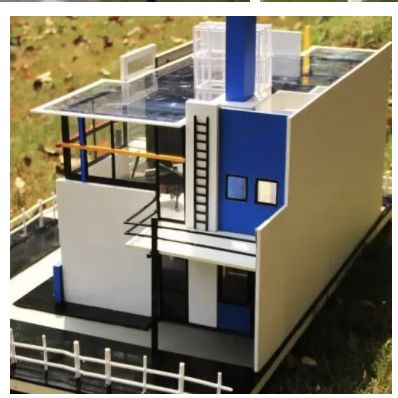
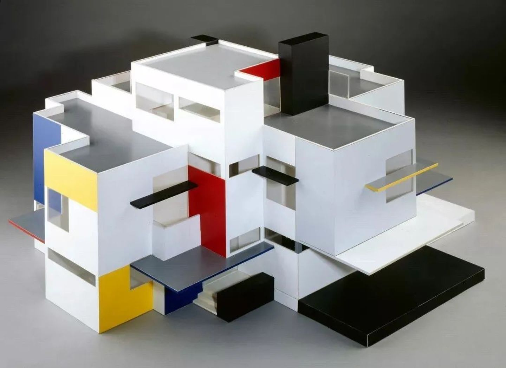

#### 红蓝椅
> by里特维德，in`1918` at20世纪  
> 当时最负盛名设计之一 + 现代艺术设计史上`最富创造性`的经典作品之一 + 鲜明荷兰风格派特征  
> 造型：组合(方形，长方形木条) + 样式：红蓝色鲜艳夺目 = 高度立体主义象征特点，influence by `蒙德里安的绘画`  
> 视觉化 + 充满力量 + 结构外露 = 立体实物 -> 问题的化解 + 空间无限感 -> 体现风格派的`还原主义哲学`  

#### 俄国构成主义设计运动
> after十月革命胜利 in苏联 一小批知识分子中产生的前卫艺术和设计运动，探索带有社会主义色彩(为无产阶级服务)，冀图通过一种艺术与设计的新形势语言，`重新建立社会秩序`  
> - 赞美工业文明 + 崇拜机械结构 + 现代工业材料    
> - 功能作用 + 机构合理性 replace 艺术形象性  
> - 设计出发点: 结构
> - 为无产阶级政治服务  
> 代表人物有：`马列维奇 李西斯基 塔特林`  
> 第三国际纪念塔(塔特林 在1925年因遭斯大林反对而未能获得进一步发展) 构成主义运动代表作  
> 总结：以结构为设计的出发点 + 抽象方法 = 实用性，产品设计和新技术如何结合。`没有能够实现` 真正变成建筑现实: 巴黎世界博览会上的苏联展览大厦

#### 俄国构成主义
> 受西欧艺术艺术影响，喜欢非具象的表现和几何抽象形式
> 塔特林的第三国际纪念塔 瓦西里康定斯基
> 构成主义也有着明确的乌托邦式的目标，冀图通过一种艺术与设计的新形势语言，重新建立社会秩序，他们所探寻的表现形式，反映出艺术家渴望用更民主的商品生产分配方式，取代资本主义制度的信念
> 基尼海报：充满冲击力的画面焦点是构成主义缪斯，前卫派女性丽丽雅布里克，她扮演以为革命左派女郎，手放在嘴边，呼喊出印刷字体呈喇叭状展开。就像这幅包含乌托邦热忱的平面设计海报一样，构成主义者坚信，他们可以通过自己的作品带来新的世界秩序

#### 俄国第三国际纪念塔
> by塔特林 in1919 构成主义(组织的象征 + 最负盛名的设计)。`没实际建成`  
> 纪念物/一座大楼(铁钢玻璃等工业材料) = 体量巨大 + 呈螺旋上升结构 + 埃菲尔铁塔 + 螺旋滑梯。high:约400米  
> 远远超越它所处的时代+ 激进设计项目 = 刺激感官 + 赞同前卫艺术 -> 社会主义教堂，机械美学完美标志 -> 欧洲设计建筑杂志报道

#### 科隆论战
> in1914  on工业艺术和建筑展会(by 德国工业同盟会) 亨利·凡·德·威尔德(否定标准化) PK 赫尔曼穆特修斯(工业应该遵循科学原理、标准化 胜出)  
> 地位：`现代`主义设计艺术与`传统`手工艺理论上的`最后一次交锋`。  
> 方法论：积极推动德国艺术设计 + 流水生产线标准化(底特律美国福特汽车流水线)进入德国工业设计。

#### 阿道夫卢斯
> 奥地利建筑师，20世纪初`最早`一批认为作出兼顾大批量和好设计产品的唯一方法就是`接受机器`的设计师之一  
> 卢斯认为：冗余的装饰是对人力与经济的浪费。作为实用主义者，他意识到朴素的根本是机械化而不是手工  
> 卢斯为现代主义运动的产生打下了坚实的理论基础。为理性主义设计的发展给出了难以辩驳的经济理由  
> 著作 装饰与罪恶  
> 德国成为第一个吧卢斯的设计理论全面付诸实践的国家

#### 包豪斯
> 沃尔特格罗皮乌斯(建筑家，设计理论家)(1919-1927 魏玛时期 初创和奠定基础的时期)创建，第一所完全为发展设计教育而创立的学院。十多年发展，欧洲现代主义设计运动中心    
> 第二任`汉斯迈耶`(1927-1930 德绍阶段 理想得到实现)，第三任`密斯凡德罗`(1931-1933 柏林时期 在纳粹的统治下渴望挣得`一线生机`的时期)  
> 基本原则    
>> 1. 艺术与设计的新统一(建筑家/画家/雕塑家/工程师 共建立艺术殿堂) 纯艺术 -> 应用艺术
>> 2. aim人
>> 3. 遵循自然与客观法则  
> 局限性  
>> 1. 过于强调理性功能 -> 风格冷漠，忽视人心理需求 -> 机械呆板 + 缺乏人情味和历史感 -> 受到后现代主义的批判  
>> 2. 先锋派艺术家占了主导地位 -> 对现代化产品少有问津 + 对工业与传统工业之间的关系仍然带有乌托邦色彩 + 对机械化批量生产方式和经济概念缺少与实际生活联系  
>> 3. 思想主张停留在实验室 after第二次世界大战，经过了其在美国的发展和传播，才完成其历史使命  
> 特征: 实用理性主义整体意识 + 东方哲学国际风格 + 乌托邦精神 + 共产主义政治思想 + 严谨工作方法教学和一 => 包豪斯包容性的精神面貌。  
> 存在短，对现代设计影响深远，__奠定了现代设计教育的结构基础，奠定了现代主义设计的观念基础__ 现代主义之路(发展 & 设计教育)的`里程碑`

#### 包豪斯的教育制度
> 奠定 现代设计教育的结构基础 + 建立工业设计科学体系
> 格罗皮乌斯的主张建立: 教学与实践相结合 = 反对艺术与技术分离 + 建筑家/画家/雕塑家/工程师共建立艺术殿堂 + 抛弃纯理论知识教学方法   
> 教学体系建立两个阶段 :  魏玛时期 + 德绍时期

#### 沃尔特格罗皮乌斯
> 奠基人(现代建筑 + 现代设计教育 + 现代主义设计) 创建包豪斯设计学院，开创了现代设计教育事业  
> 1. 住宅 for 大众服务(机械化手段批量生产 -> 低廉)
> 2. 采用经济方法，柱状预制的建筑方式
> 3. 功能第一、形式第二
> 4. 反对装饰，反对复古
> 代表著作：全面建筑观  
> 代表设计: 法格斯鞋楦厂，包豪斯校舍  
> 鲜明民主主义色彩 + 社会主义特征，主张理念影响包豪斯

#### 密斯凡德罗
> born德国，im美国。现代主义建筑设计大师，包豪斯第三任校长  
> 1. `少即是多`原则
> 2. 反对抄袭传统风格(复古)，主张与时代紧密联系现代新风格
> 3. 钢筋混凝土结构(钢架和玻璃) -> 批量生产的现代建筑
> 4. 设计(独立性)不应与政治挂钩  
> 论文：建筑与时代，两座玻璃摩天大楼  
> 代表设计：巴塞罗那国际博览会德国馆(20世纪伟大的标志性建筑，将钢铁 玻璃等现代主义工业材料元素与传统的昂贵的大理石，玛瑙石诙谐有机结合到一起，像一个现代主义的空间符号)，`巴塞罗那椅子`(使他一举成名，成为世界公认的大师。巴塞罗那国际博览会的德国馆是米斯设计生涯的重要转折和里程碑) `西格莱姆大厦`
> 一生实践奠定明确现代主义`建筑风格`，改变了世界都会`三分之一`的天际线，影响了好几代现代主义设计家，从而改变了世界建筑的面貌。
> 补充待删：
> - “少” -> 当时建筑界依然流行`古典装饰手法`(阻碍建筑工业化进程)
> - “多” -> 在大工业生产条件下可能创造出来的建筑上简洁而丰富的效果和最大的使用空间
> 他倡导的建筑设计应立足于“少即是多”的功能主义美学思想，最善于用钢架和玻璃表现技术的完美，是现代摩天大楼设计的开创者。

#### 国际主义风格
> 现代主义设计经过`美国`的发展在`二战后`成为了国际主义风格，这种风格在六七十年代达到登峰造极的地步，影响各国的建筑，产品，平面设计风格，成为垄断性的风格。国际主义首先在建筑设计上得到确立，1927年，菲利普约翰逊在德国魏森霍夫现代住宅建筑展中`最早提出了国际风格`。战后，密斯凡德罗和菲利普约翰逊设计的`西格莱姆大厦`成为国际主义建筑的典范
> 国家主义设计具有形式简单，反装饰性，系统化等特点。在建筑上，钢筋混凝土预制构件结构和玻璃幕墙结构已经成为非常协调的组合，成为国际主义建筑的标准面貌
> 从根源上看美国国际主义风格与战前欧洲现代主义设计运动是同源的。现代主义有强烈的社会主义和民主主义色彩，设计的目的性和功能性是第一位的。与欧洲两极分化的社会阶级结构不同，美国收入殷实的中产阶级是美国社会的核心和比例最大的构成部分，现代主义设计大师移居美国后，现代主义在美国本土发展成为了国际主义，国际主义形式的象征性力量，成为了第一性的，如果说现代主义设计追求的是少则多是为了降低成本，供应大众，而国际主义的少则多变哼了现代化大企业的代表。原本的民主色彩变为了一中单纯的商业风格，变成了为形式而形式的形式主义追求，设计理念发生了本末倒置，原本作为自然结果的形式变成了设计追求的目的
> 国际主义风格一方面是现代主义发展的新高度，密斯的减少主义设计，代表了20世纪设计的高度发展。然而到了二十世纪六七十年代，全世界大都会都变得一摸一样，设计探索多元化的努力消失了，被追求单一化的国际主义设计所取代，不但使用者的心理诉求被漠视，大众性逐步被放弃，还由于过度追求简洁形式而最后连简单的功能也没有得到满足，这种广泛的不满倾向，是国际主义设计逐渐式微的主要原因
> 欧洲: 无产阶级 -> 少则多 -> 实现功能
> 美国: 中产阶级 -> 少则多 -> 市场形势

#### 弗兰克劳埃德赖特
> 美国现代主义设计先驱，美国本土建筑的开创者，师承沙里文，现代主义建筑代表人物之一    
> 个人表现成分 + 风格大相径庭(现代主义、新建筑、国际主义)  
> 自然主义 + `有机主义`(与环境协调) + `中西部草原风格`(室内陈设偏于底层布局。天花板较低，并略有倾斜，室内有亲和感和安全感)  
> 建筑应与所处环境相协调 + 提出有机建筑六个原则  
>> 1. 检验标准:`简练`
>> 2. 像人类`风格多样化`，
>> 3. 与环境协调
>> 4. 色彩应与环境一致，从环境中采取建筑色彩因素
>> 5. 材料本质的表达
>> 6. 建筑精神: 统一 + 完整性  

> 机械科技 + 简约美学 + 民主艺术 -> 用装饰有节制   
> 代表作：有机建筑  
> 著作：《有机建筑》（1939）、《消逝的城市》、《机器的工艺美术》(1901)  
> 代表作品：`流水别墅`(1936)，古根海姆美术馆(1943)，东京帝国饭店(1919)  
> 现代主义突出贡献 = 传统重新解释 + 重视环境因素 + 强调现代工业化材料 -> 打破了封闭六面体的传统理念，空间内外贯穿自由化分  

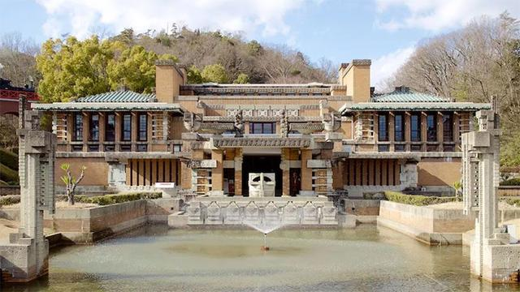

#### 流水别墅
> by弗兰克赖特 in1935  世界著名建筑之一，考夫曼家族度假地 in 熊溪河畔(美国 匹斯堡市 郊区)  
> 赖特最具代表性作品，美国时代杂志 `二十世纪最伟大的住宅`  
> 1.建在礁石上 -> 层状结构`成为了岩石`一部分 2.all阳台看见溪流 3.all房屋融入到大自然美景  
> 流水别墅极大地成功 = 空间处理 + 体量组合 + 环境结合，为有机建筑理论做了确切的注释，在现代建筑历史上占有重要地位

#### 约翰内斯伊顿
> `瑞士`画家，包豪斯担任形式导师，对包豪斯的发展起到非常突出的重要作用    
> 浓厚`宗教意念`，将宗教和科学视觉教育混为一体  
> 现代设计教育基础课的首创人，要求学生全面的掌握(严格视觉训练 + 平面立体形式 + 色彩肌理) 最早引入现代色彩体系 -> 学生色彩理性了解，rather than 个人感觉

#### 阿尔瓦阿尔托
> 芬兰现代建筑家/设计家，北欧现代建筑之父。设计方向(人文色彩 + 心理需求)  推崇亨利·凡·德·威尔 热衷于使用木材  与高度理性的柯布西耶成为鲜明的对照  
> 1. `有机形态+ 功能主义` 
> 2. 功能化 + 民主化 + 满足人心理需求
> 3. 自然协调 + 轻松感 + 流畅感  
> 代表设计：维保图书馆，贝克之家，芬兰大厦 芬兰萨纳萨诺市政府厅、伊马特拉教堂  帕米奥疗养院总体 41号扶手椅(有机的外形-> 看/坐(舒服/漂亮/装饰风格) 差别 低收入阶层用品能用就行)
> `最大贡献`: 改良(包豪斯/国际主义风格人情化)，开创`现代建筑人性化`的可能性，作品有种让人无法抗拒的柔和边缘的美学观，为现代主义注入有机形式(新 更具有影响力) 在现代建筑史上留下不可磨灭的印记  

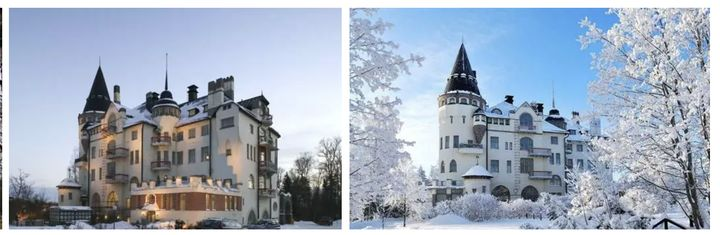

维保图书馆 伊马特拉教堂 芬兰萨纳萨诺市政府厅 帕米奥疗养院 帕米奥扶手椅

#### 勒柯布西耶
> 现代主义大师，法国现代主义建筑运动代表人物，机器美学(崇拜飞机汽车)的奠基人，其建筑的新理念和城市规划思想有非常独到之处  
> 1. 机械美 -> 住宅是人居住的机器
> 2. 科学理性 -> 以建造远洋轮船的精神去建造房屋
> 3. 新建筑六要素：底层架空 屋顶花园 自由空间 横向长窗 自由立面 柱支撑结构  
> 代表著作：`走向新建筑`  
> 代表设计：萨伏伊别墅，马赛公寓(表现主义手法)，朗香教堂(后现代隐喻，塑性建筑 以其富有表现力的雕塑感和它独特的形式使建筑界为之震惊，完全背离了早期古典的语汇)  
> 理念实践理想主义 但对推动运动的整体发展起到了非常独到的作用  
> 代表著: `走向新建筑`，乌托邦主义 `明日城市` 当大教堂是白色的时候

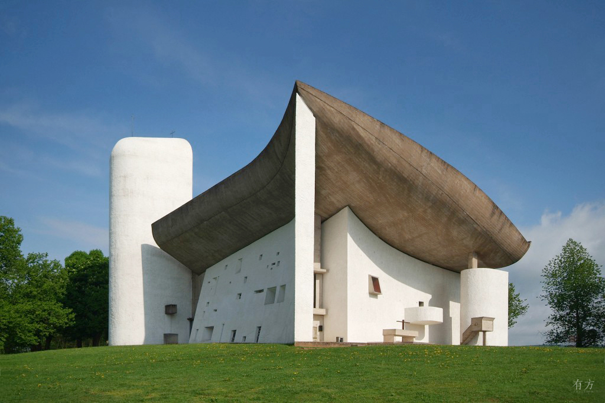
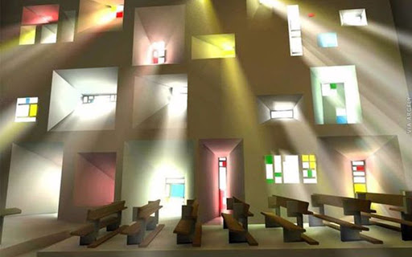

朗香教堂 朗香教堂内部 朗香教堂夜 马赛公寓

#### 马谢布鲁尔(匈牙利)
> 最大贡献: 创造一系列简洁轻巧功能化并适于批量生产的钢管椅(轻巧优雅，结构简单) in1924 设计世界第一把钢管椅瓦西里椅子(name for 纪念友情with瓦西里康定斯基)

#### 瓦西里康定斯基
> born俄国，德国表现主义的重要成员，创办青骑士艺术团体  
> 渊博知识(美术到物理学 独到的理解 融会贯通) 杰出艺术理论家   
> in1921 包豪斯任教 严格把设计基础课建立在科学理性的基础之上，包豪斯最具有系统性的基础课程都是由他建立

**美国工业产品设计**
----------------------------------------------------------------------------------------

| 时期 | 地点 | 时间 |
| :----: | :----: |:----: |
|  | 美国 | 20世纪30年代 第一次世界大战根本性刺激了美国工业发展 市场竞争机制起到决定性作用 |

> 特征：
> - `实用主义` + 浓厚的`商业气息` 发展了工业设计并使其职业化
> - 沙利文形式服从功能 -> `形式追求市场`
> - 忽视适用性，过分强调外形 1972年能源危机被日本汽车打败
> - 消费观造成资源浪费

#### 福特公司的成功经验
> born1903，针对汽车产量低、价格高 -> 致力提高汽车产量，降低汽车价格 -> 成为大众消费得起  
> 设计理念(以制造为主)，首创了流水线生产的制造模式，细化工人分工，标准可互换性零件 -> 制造效率up   
> T型汽车(1908-1927)廉价汽车，低廉价格使汽车作为一种使用工具走入了寻常百姓家，先进生产技术 + 管理制度，占极大份额，生产者决定设计 引导消费  
> 福特公司的贡献:
> - 改进`生产制造体系`，以适应大工业化时代的生产要求。
> - 通过更有效率的方式，实现了设计`为大众服务`的目的。
> - 在美国发展出一种新的美学观念，即`机械美学观念`(以制造为主导的设计理念 低成本高效率高产量)  
> 有序的制造 标准化的操作 可替换的部件 -> 提高了效率 but失去劳动者的个性  
> 1908-1927无人抗衡，精力update生产线，亨利福特think人人都应该有汽车所有权，任何差异和区别都是不平等的，不符合现代社会自由平等的制度。对于福特来着，大众意味着劳动者，大家都付出了劳动，都应该平等

#### 哈利厄尔
> 美国商业性设计代表人物，世界上第一个专职汽车设计师，`1926`年出任通用汽车设计主管，负责汽车外形，其设计风格奔放创新，开创了战后汽车设计中的`高尾鳍风格`。  
> 汽车影响 无人企及 设计部门当时世界上最大设计中心 `1953`年首次采用`整块弧形挡风玻璃`的做法影响至今  
> 20世纪40-50年代，通用汽车公司总裁斯隆和设计师厄尔为了不断促进汽车销售，在其汽车设计中有意识的推行`有计划废止制度`。  
> 设计理念：  
> 1. 汽车造型: 拉长降低车身流线型 -> 平滑流畅的速度感
> 2. 革新设计程序: 首创概念车 1.测试消费者反应接受程度 2.了解消费者品位要求
> 3. 外形吸引 汽车好用好看

#### 有计划废止制度
> 斯隆 + 厄尔 汽车设计新模式  
> 主张形成制度(在设计新汽车样式时 须有计划考虑 之后更换部分设计)  
> 目的: 以人为方式造成形成样式老化的过程 -> 有计划迫使商品短期失效 -> 造成消费者心里老化 -> 促使消费者不断更新购买新的产品 -> 形成20世纪全新的劳动伦理观  
> 1. 功能性废止 技术发展
> 2. 款式性废止 style
> 3. 质量性废止 寿命  
> 很快波及所有产品设计领域 -> 即时消费主义浪潮(极其有害用毕即弃)  
> 积极作用：1.有效刺激消费 促进市场销售 2.促进科技革新 带来设计改良 3.首次将季度新款理念引入了产品设计领域  
> 弊端：这种巧妙的市场运作手法 1.无不嘲讽地利用了消费者孩子气的对新鲜事物的喜爱 2.弱势群体无设计 3.对自然资源和社会财富造成巨大的浪费 4.设计上只讲形式不讲功能 偏离了现代设计功能主义的轨道   
> 形式追随功能 -> 形式追随市场 -> 形式创造市场  
> 并不是只有这种制度才能支撑市场，老产品不等于不好，比如迪特拉姆斯的设计

#### 通用汽车成功原因
> 1. 吸收福特制造的理念(标准化 可互换性零件 成本控制) 
> 2. 斯隆think汽车(1.代步工具 2.显示owner社会身份) -> 启用有计划废止制度(每年更换汽车样式) -> 有计划废止更加符合美国的社会体系(1.everyone通过努力获得成功的美国梦 2.人不只是在乎功能和价格还会自愿去购买与自己身份相符的产品)  
> 总结： 形式追随功能 -> 形式追随市场 -> 形式创造市场  

#### 流线型运动
> in美国 in20世纪30年代 流行 样式设计运动  
> begin with 交通工具外形，波及所有产品 -> 都以 `圆滑流畅的流线体` 为主要外形形式 -> 工业设计特征(流线型风格为主)  
> 空气动力学术语: 圆滑流畅形状 -> 高速运动中降低风阻功效  
> 风格的主要特点:  
> - 视觉效果: 强调水平方向(by装饰动机: 连续的不中断的直线或曲线)
> - 外形: 简洁平整素净  轮廓圆顺流畅 少装饰少棱角
> - 材料: 新型(铝材/电木/瓷板) 流行(镀铬装饰金属硬件/玻璃/漆器)
> - 装饰手段: 建筑: always玻璃砖 + 轮船窗户    
> 形式：速度感 + 机械活力感 = 现代精神象征  
> 优点: 空气动力学相关 提高速度 降低能耗  
> 缺点: 泛滥使用 -> 纯粹的形式主义 without功能

#### 芝加哥学派
> in19世纪末 美国西部开拓+1871年芝加哥中心大火 -> 房屋需求up -> 建筑师群体(in芝加哥 主要从事高层商业建筑)  
> - 1. 注重内部功能，大胆采用新材料
> - 2. 强调结构的逻辑表现
> - 3. 立面简洁、明确
> - 4. 采用整齐排列大面积玻璃窗，突破了传统建筑的沉闷之感
> - 5. 形式服从功能 沙利文  
> 文化自卑心理 -> 没有重视 -> 20初被欧洲人重新发现。

#### 路易斯沙利文
> 芝加哥学派的代表人物，美国现代建筑的奠基人，设计的商业建筑是美国建筑史上的里程碑  
> 建筑理论：形式服从功能 + “有机建筑“ + 高层建筑的三段法(基座部分 最高的出詹楼阁 之间标准层)  设计理念:艺术与技术的有机结合 -> 为现代主义奠定理论实践基础
> 两大胆：用新材料 用钢架结构的高层建筑形式 -> 最早解决高层办公建筑设计 -> 树立高层建筑早期造型的基本风格  
> 代表作：保证大厦 信托银行大厦

#### 沃尔特提格
> 美国最早工业设计师 -> 贡献(工业设计职业化) 20世纪20年代设计事务所  
> 柯达公司密切联系 -> 照相机和包装  
> 设计特点：规整机械外形 -> 安全适用 + 清洁保养。
> 设计理念：
> 1. 技术人员密切合作 + 用外形设计解决功能技术难点
> 2. 设计角度: 工程需要 + 市场营销
> 3. (最早)考虑人体工程学在产品设计中应用
> 代表作: 柯达名利牌相机，班腾相机(1936最早的便携相机) 707内舱设计主持者

#### 亨利德雷福斯
> 美国工业设计奠基人，贝尔电话公司密切联系  
> 起初舞台设计，后转工业设计，own工业设计事务所，  
> 设计原则(从内到外) + 产品美丽外观触感 + 高度舒适性(符合人体基本要求) -> 为人体工程学在设计界的应用奠定了基础做出卓越贡献  
> 著作：`为人的设计`(1955) `人体度量表`(1961) 为设计师们提供了极为实用的参考资料和人机工学模数  
> 最成功的的作品：300型电话机(首次将听筒与话筒合二为一 -> 奠定了现代电话机的造型基础) 参与707民用客机内舱设计

#### 诺尔曼贝尔盖迪斯
> 美国工业设计先驱，最早个人独立工业设计事务所  
> 理想主义色彩 + `未来主义` + `流线性运动发起人推动者`  
> 设计程序(清晰严格) -> 确立工业设计七点设计程序:  
> 1. 确定 产品功能
> 2. 了解相关 工厂设备 + 生产手段
> 3. 控制 经费预算以内
> 4. 材料咨询研究 by材料专家
> 5. 竞争状态 
> 6. 消费现状 周密市场调查
> 7. 绘制工业设想图
> 代表作为：地平线  神奇高速公路 夜晚的奇迹
> 代表建筑：美国纽约世博会通用汽车馆，未来城市，交通系统等  

	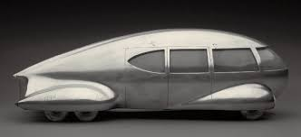
	
	

#### 雷蒙特罗维
> 美国工业设计奠基人  高度商业化设计师 -> 作品体现美国特征(商业主义 + 使用主义)——`简练方便，经济耐用` -> 创造了现代设计史上的奇迹  
> 设计广 口号: 昨天的设计是从唇膏到火车头，而今天的设计是从信用卡到智能大厦  
> 20世纪30年代起从事交通工具设计(火车头，汽车，轮船) -> 引发了流线型设计运动  
> 设计公司(规模最大，效益最佳 in 三十年代至八十年代)主要从事: 交通工具设计/工业产品设计/包装设计等  
> 设计理念：  
> 1. 实用主义: 设计经济效益最重要 式样追随市场
> 2. 外形：简练典雅美观
> 3. 功能：使用方便，易维修保养，形状表达功能  
> 代表设计：可口可乐标志 冰点冰箱(浑然一体白色几何体 -> 现代冰箱基本造型) 空军一号内饰和外观设计  灰狗长途汽车 莫斯科人汽车(前苏联第一个委任西方人设计的项目)

	
	
	

#### 欧洲设计体系vs美国设计体系
| aspect | 欧洲设计体系 | 美国设计体系 |
| :----: | :----: |:----: |
| 设计目的 | 社会利益 | 商业利益 |
| 设计发展方式 | 进行大量设计实践和科学实验进行设计教育(把社会利益当做设计教育和设计本身的目的) | 设计职业化，在激烈的市场竞争中进行设计(以市场需求为导向，把工业产品设计全面推向社会) |
| 设计方面的突出贡献 | 建立了现代设计的理论和教育体系 | 进一步发展了工业设计尤其是产品设计 |
| 设计是出身 | 长期从事建筑设计 受过高等教育 | 各行各业大多没有正式高等教育文凭 |
| 设计师追求 | 追求文化品位长期效益和社会责任感 | 追求商业利益短期市场促销效果 |
| 设计师侧重面 | 注重扎实的理论基础讲求社会哲学 | 注重实用灵活讲求经济效益 |

**二战后的设计**
----------------------------------------------------------------------------------------

> 时间 20世纪后半叶
> 背景
> - 二战经济逐渐恢复，大部分国家都注意到`设计`对于经济发展的促进作用
> - 美国(市场竞争+经济效益)是唯一在第二次世界大战中未受损害并收益巨大的国家，二战后发展最快最好
> - `1940 -1950` 工业设计的成熟期，第二次世界大战之后的二三十年里，工业设计发展最迅速辉煌
> - `1950 - 1960` 几乎所有的西欧国家和日本都拟定了自己的`设计政策`(作为国策)，由此设计作为一个`独立的职业`
> - `1960`意大利经济发展迅速，设计逐渐发展出表达个性的设计面貌
> - `1960 - 1970`，工业设计中开始出现`企业形象LOGO`，行为标志，观念标志的设计

> 主要内容：
> - 设计理念走向科学化和理性化 设计体系基本形成并进一步完善迅速发展
> - `现代工业设计体系六环节`：调研 -> 设计 -> 生产 -> 销售 -> 使用 -> 环保

#### 美国
---------------------

#### 玻璃之家
> 皮埃尔沙雷奥 巴黎 玻璃之家
> 原料前所未有的使用了令人惊叹的工业材料，包括钢梁，半透明的玻璃砖，多孔板材和橡胶地板
> 这个漂亮的钢与玻璃铸成的建筑，所有陈设都紧紧围绕着健康与卫生的理念，比如那些便于清洁的玻璃砖，还有利于通风的长排玻璃
> 虽然这个建筑里充斥着硬邦邦的工业美学，却并未令人感到冰冷。沙雷奥通过灰色地毯，泛着金光的木香板，以及很多天鹅绒家具巧妙为空间带来了温暖的感觉，比起柯布西耶要柔和的多

#### 查尔斯伊姆斯
> 战后国际设计舞台上引领 设计潮流 代表，长期为米勒公司设计家具  
> 善用新材料(胶合板，塑料，纤维)新工艺家居设计创新 椅子开创性地在胶合板弯曲成型时加入人体工学方面的考虑，好功能 + 现代感 + 有机形态  
> 代表作品: DAR扶手椅 LCW椅 伊姆斯躺椅 B-3501的系列家具是最早的组合家具

#### 伊姆斯夫妇
> 战虎国际设计舞台引领潮流的第一批美国设计中的代表是伊姆斯夫妇，他没在19451946年间设计的具有突破性重要意义的，各种模压成型的胶合板椅子，开创性的在胶合板弯曲处加入人体工学方面的考虑，其设计理念直接来自伊姆斯夫妇在战争期间为美国海军开发的胶合板腿部夹板和担架。

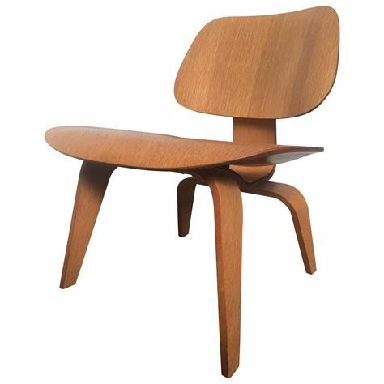

#### 乔治尼尔森
> 尼尔森(美国)担任米勒公司的设计主任，开创性的发展了`现代办公室的开放空间系统设计`，对后来的办公用品设计产生了很大的影响，为`奥利维蒂公司设计的编辑者2型打字机`为公司赢得了巨大利益c

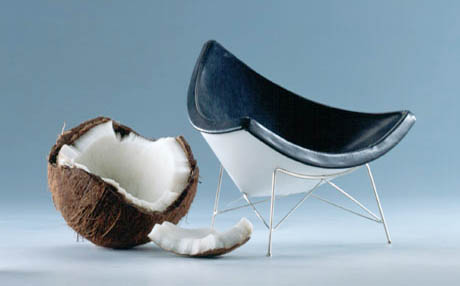

#### 人体工程学
> 人体工程学(美国)是在20世纪初发展起来的一门独立学科，二战中大量应用与军工领域，战后在日用产品设计中得到迅速发展和广泛应用  
> 20世纪50年代在美国工业设计发展一大特点  
> 人体工程学是一门学科研究 人类和系统内的其他因素 相互关系 -> 旨在将研究人与人造产品之间的协调关系(结论原则，数据法)应用到设计中去 -> 优化人类行为 + 提高系统总表现  
> 先驱者: 亨利德雷福斯(为人的设计 + 人体度量图表)   沃尔特提格30年代最早考虑人体  
> 1. 设计与创造(人造产品 设备设施 环境)
> 2. 设计(人类工作活动过程 服务)
> 4. 评估: 人造产品 服务合适程度

#### 反计划废止
> 宗旨：坚持严谨现代主义设计，反对虚化样式化  
> 相关公司：IBM 派克公司(最早可换芯圆珠笔)  
> 相关设计师：埃德加考夫曼 艾略特诺伊斯  
> 埃德加考夫曼偏爱斯堪的纳维亚设计，主张：1.清晰简洁的产品造型 2.无装饰的产品造型 3.符合产品功能目的的设计

#### 艾罗沙里宁
> 沙里宁是`美国`著名的`建筑设计师`和`家具设计师`，他是美国战后设计师的杰出代表，对`诺尔集团`的发展起到了决定性的作用  
> 他在设计上突破了功能主义倡导的几何结构，转而采用`有机曲线造型`。其建筑风格具有浓厚的有机造型色彩，属于比较典型的`后现代主义建筑`，提倡`有机功能主义风格`   
> 1. 突破几何形结构，采用有机曲线造型
> 2. 有机形式 + 现代功能
> 3. 简洁舒展，非常理性
> 代表作品：建筑上有耶鲁大学冰球馆，肯尼迪机场，家具上有`郁金香椅`  

#### 无障碍设计
> 无障碍设计这个概念名称始建于1974年，是`联合国组织提出来`的设计新主张。  
> 无障碍设计强调在科学技术高度发展的现代社会，一切公共空间环境以及各类建筑设施，设备的规划设计，都必须充分考虑具有不同程度生理缺陷者和正常活动能力衰退者群众的使用需求，配备能够应答，满足这些需求的服务功能与装置  
> 无障碍设计的理想目标是无障碍，基于对人类行为，意识与动作反应的细致研究，致力于优化一切为人所用的物与环境的设计，清除那些让使用者感到困惑，困难的障碍，为使用者提供最大可能的方便，这就是无障碍设计的基本思想

#### 通用设计
> 美国建筑师罗恩梅斯 设计概念: 不需要改造者专门设计满足所有人 的产品/环境设计  
> 目的: 减少 残障人普通人之间 身心隔阂    
> 设计原则有：公平灵活 + 简单直接 + 容错低负荷使用 可感知的信息 + 空间尺寸充足

#### 乌尔姆设计学院
> 1953年，爱歇舒尔为首的一批德国设计教育家在乌尔姆是成立了德国战后最重要的设计学院——乌尔姆设计学院  
> 建立目的: 1.提高德国设计水平 -> 振兴德国经济 2.国际主义风格(商业气息浓重)背离现代主义和包豪斯的初衷  
> 教育特色：理性主义原则，技术美学思想为核心，倡导系统设计
> 贡献:  
> 1. 确定工业设计方向(理性技术性社会性) -> 实现了设计的最低消耗，最高成就 -> 倡导的功能主义比包豪斯更具理性色彩
> 2. 奠定了一个适应发展大方向的教育体制 3.博朗密切合作 -> 把系统设计理念贯彻到实践上 -> 形成了博朗原则   4.影响德国产品渐渐以理性可靠，高品质功能化  

#### 迪特拉姆斯
> 迪特拉姆斯是德国战后最重要的工业设计师，是博朗公司的设计部主任  
> 倡导功能主义 + 极限主义原则 + 好设计十大原则 迄今影大  
> 风格：1.简洁理性，不失优雅 2.注重功能体验 3.结构比例细节 浑然天成恰如其分  
> 设计原则被称为设计界的十诫:  
> 1.良好的设计是创新的 2. 良好的设计使产品有用 3. 良好的设计是审美的 良好的设计使产品易被理解 良好的设计是不显眼的 良好的设计是诚实的 良好的设计是持久的 良好的设计关注到最后的细节 良好的设计是对环境友好的 良好的设计史尽可能少的设计  
> 包豪斯当代设计承上启下的一个重量级人物。飞利浦，西门子，宝马，大众都深受他的影响，可以说他影响了整个世界的设计

#### 博朗公司
> 博朗公司是德国大型的家电公司之一，由马克思博朗于1921年在德国创建，最初生产收音机，留声机部件  
> 博朗公司`反对有计划废止制度`，拒绝飞速变换的风格，主张持久的设计，`秉持纯粹到极致的设计哲学`，形成了公司产品独特的设计风格，以简练的几何外形为基础，色调单纯，`摒弃一切外加的装饰`，以其高度理性化的外观设计和良好功能而著称  
> 博朗公司在战后与`德国乌尔姆`学院合作，从而开创了一种学院`研究与企业生产相结合`，理论教学与设计实践相统一的工业设计发展的成功模式

#### 意大利
--------------------

#### 金圆规大奖
> 金圆规奖是由1954年`意大利文艺复兴百货公司`设立，成为意大利设计最高奖

#### 奥利维蒂公司
> 卡米罗奥利维 in1908 创办
> 公司以 批量化流水线 生产生产办工机械和设备 实践形式追求功能 设计多款打字机，获得金圆规大奖  

#### 吉奥庞蒂
> 吉奥庞蒂是意大利现代主义`最伟大`的设计大师  
> 成就:  
> - 创办`多姆斯`: 意大利现代主义运动宣传阵地
> - 恢复了`米兰三年展`
> - 长期为`卡西纳公司`设计家具  
> 代表作品：`迪克斯特扶手椅`(其造型简洁，大方，结实，实用，至今仍然生产，成为了完美椅子的同义词) `超轻椅`1957年  
> 设计思想：
> - 二战后`好设计，好生活`代表人物，他提出 理想好生活高品位 表达by家具/生活方式 -> 家居设计生活方式设计提到新的高度。
> - 将对`美的研究`与对产品高度`功能性和经济性`的追求紧密结合
> 总结：  
> - 庞蒂的设计特点：机械化大量生产 + 意大利文化 + 意大利传统工艺 + 现代流行元素  -> 一件日常生活用品既可以用，又可以观赏

	
	
	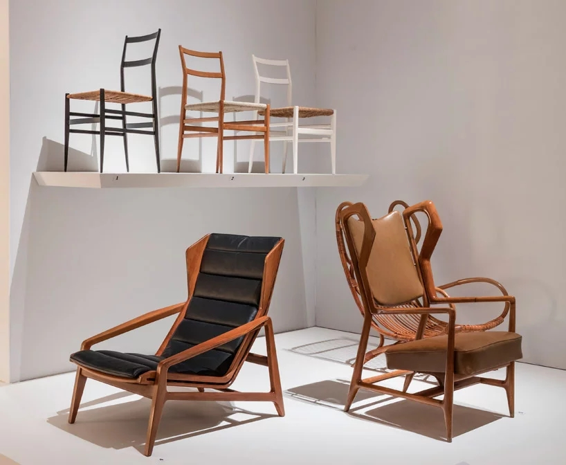
	
	
全球椅 超轻椅 迪克斯特扶手椅

#### 索尼公司
> 索尼公司是日本战后最具国际影响力的电子行业公司  
> 索尼成功 = 政府扶持 + 引导设计战略 + 企业重视工业设计  
> 非常重视设计，将`创造市场作为公司设计原则`的核心概念。为此拟定了产品设计和开发的八大原则  
> - 1. 产品必须有良好的功能 
> - 2. 产品设计美观大方
> - 3. 优质
> - 4. 产品设计具有独创性
> - 5. 产品设计具有合理性
> - 6. 各产品之间既有独立特征又要有内部关联
> - 7. 坚固耐用
> - 8. 产品对社会大环境具有和谐美化作用  
> 1979年，索尼公司根据青年人日常生活习惯所涉及的`Walkman`随身听，迅速受到`青年人的喜爱`，风靡全球。随身听的设计反映了日本设计师的`精细入微`之处，在司空见惯的现象中找到设计的切入点，令使用者倍感亲切

#### 再设计
> =再次设计，日本著名设计大师`原研哉`提出的  
> 其内在追求在于回到原点，重新审视我们周围的设计，以`最平易近人`的方式，来探索设计的本质  
> 从无到有，当然是创造，但将一直的事物陌生化，更是一种创造，将这些`日常用品陌生化`，在进一步捕捉到新鲜感进行设计，并不是一件容易的事情。能够做到这一点，才是一名真正的设计师

#### 总结欧洲工美历史表
| 时期 | 地点 | 时间 |
| :----: | :----: |:----: |
| 巴洛克 | 巴洛克这个词源自意大利，但其实影响整个欧洲 | 包括`17世纪`整个欧洲艺术，庄严高贵、豪华壮观的气韵，充满阳刚之气 |
| 洛可可 | 法国 | 用来形容`18世纪中期`流行于欧洲各国的装饰样式 |
| 新古典主义时期 | 欧洲 | 指`18世纪末至19世纪前半期`在欧洲流行的一种崇庄重典雅、带有复古意趣的艺术风格 |
| 艺术与手工艺运动 | 英国 | 指英国`19世纪下半叶`形成的一场设计运动，是针对家具、室内产品、建筑的工业批量生产所造成的设计水准下降的局面，而在设计领域开展的一项改革运动 |
| 新艺术运动 | 起源于法国、比利时蔓延整个国际 | `19世纪末至20世纪初`(1895 - 1910)是从新古典主义、历史复古主义想现代主义`转化的过程`，是传统设计与现代设计之间`承上启下`的一个重要阶段 |

**后现代主义设计运动**
----------------------------------------------------------------------------------------
> 1960年代末期，国际主义风格垄断建筑产品和平面设计已经将近30年，世界的建筑日趋同化，地方特色民族特色逐渐消退，建筑和诚实越来越单调。因此，一场在国际主义风格的垄断中开拓一条装饰性新路，丰富现代建筑面貌的革命就呼之欲出了。此时新一代年轻人主张绝对自由，广泛反对越南战争，环保主义盛行。人们具有悲天悯人的强烈社会责任感
> 到1980年代后期，随着战后婴儿一代逐渐成年，人们对政治漠不关心，热衷绝对自由逐步被保守主义取代，狂热主张渐失，强烈的社会责任感被享乐主义替代

#### 后现代主义设计运动总结
> 后现代主义设计运动兴起于20世纪六十年代末七十年代初，是后工业社会，信息社会的产物。发端于建筑设计并影响到其他领域  
> 背景： 20世界60年代，西方进入丰裕社会时代，人们消费观念从讲究解释内用转向求新求异。现代主义设计风格长期单调，沉闷，冷漠的形式充斥城市，人们渴望出现变化，西方新一代青年主张绝对自由，充斥着对政治，环境的关心，拥有悲天悯人的强烈社会责任感  
> 风格特征  历史主义和装饰主义立场 + 对于历史动机的折中主义立场 + 通俗娱乐性 + 处理装饰细节的模糊性  
> 代表人物：罗伯特文丘里 迈克格里弗斯    
> 总结：后现代主义设计以反对现代主义设计艺术为思想基础，设计实践复杂多样特征，没有占主导流派或思想

#### 罗伯特文丘里
> 文丘里是美国建筑师，是后现代主义设计运动的代表人物  
> 他反对密斯的`少即是多`，提出少即是乏味的看法  
> 建筑应装饰化道路，折中戏谑轻松  
> 1.是从历史建筑元素来吸收装饰元素 2.是从美国的通俗文化吸收装饰元素  
> 代表作：建筑的复杂性和矛盾性(被誉为20世纪自柯布西耶走向建筑之后最重要的建筑学著作
)  
> 代表的建筑设计是母亲住宅

#### 迈克格里弗斯
> 格里弗斯是美国著名建筑设计师，后现代主义建筑设计的奠基人之一
> 他的后期现代主义建筑设计带有一点古典主义的特征，讲究装饰，色彩的丰富和历史风，使建筑具有趣味性和文化性，是城市的面貌趋于多元化。他善于讲历史风格与现代艺术元素结合起来，善于将知识分子的阳春白雪和普罗大众的通俗文化结合起来，在调侃诙谐中不失优雅
> 代表建筑设计是波特兰市的公共服务大楼，代表产品设计是带鸟哨的水壶for阿列西公司

#### 飞利浦约翰逊
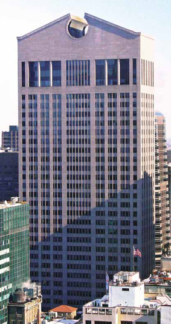

> 美国重要设计理论家 建筑设计师  经历过 现代设计运动 + 后现代设计运动  
> __提出了`国际主义`这个新的名称__。采用古典风格严肃不调侃 -> 代表后现代主义设计中 比较讲究保持古典主义精华 完整性 的一派  
> 代表作: 西河莱姆大厦with密斯 美国电报电话公司大厦 水晶大教堂

#### 波普设计运动
> 波普一词来源于英文大众化，波普设计是20世纪六十年代兴起于英国并波及欧美的一场前卫而又面向大众的设计艺术运动  其思想根源来自美国大众文化，然而波普文化却是知识分子的文化
> 其产生背景与战后日益形成的西方富裕设计，青少年消费市场，反叛立场，特别是对现代主义和国际主义设计的反感(虽具功能良好强调理性注意服务对象，但风格单调冷漠缺乏人情味，在战后出生的年轻一代眼里这种风格体现的是陈旧过时。新一代消费者希望有新的设计风格来表达自己的消费观，文化认同立场，寻求一种新的自我表现的方式。当时用过设计界不少人，特别是青年设计师，认为色彩必须大胆和强烈，造型应该突破旧有的框框，甚至不惜有些古怪，有些荒唐)有密切关系。  
> 1960年代，人们厌烦了实用的理性主义产品，转向偏爱醒目诱人的消费品。新设计在各方面带给人们端在有富有挑逗性的体验，也促进了消费热潮，制造商也开始持续生产一些列价格便宜，消费性的产品  
> 年轻消费者之中越来越流行流浪生活方式，促进了运输方便组装简易的廉价平板包装家具的发展。瑞典公司宜家同样在此时发展壮大，这得益于它成本经济的自组装家具  
> 产品，服装(最突出)，平面  
> 特点
> 1. 利用现实生活中 任何视觉源泉/生活元素 采用夸张变形拼贴产品样式设计
> 2. 这些产品色彩艳俗，诙谐轻松，强调平面效果，强烈通俗乐观可消费型
> 代表人物及作品：玛丽匡特的超短裙和热裤  
> 总结：早期波普运动追求新奇，反叛，后期却在历史风格中找寻借鉴，最终成为了历史大杂烩。波普设计运动是一个形式主义的设计风潮，没有更深层次的意识形态依据，所以本身形式的不断改变使它没有成为一个统一的设计运动

#### 玛丽匡特
> 玛丽匡特是英国波普运动杰出的服装设计师，她在伦敦创办了芭莎品牌专卖店。她将目标市场定位在当时具有反叛精神的少年，宣称 `高品位已经死了，粗俗才有生命`
> 匡特最著名的产品是短小到无以复加的超短裙，以及短小紧贴的热裤。她的服装设计活泼，青春，裁剪简单，色彩强烈具有日夜都可以穿的特点

#### 阿基佐姆
> 阿基佐姆工作室(四名建筑师 + 两位设计师)成立 in1966 in意大利佛罗伦萨  
> 风格先后不一致，追求奇形怪状，无法批量生产 提出无终结城市这样一种未来城市生活规划(十分神秘和激进的乌托邦愿景)  
> 1. 1966年设计的超级波浪沙发
> 2. 1968年设计的狩猎椅 -> 对现代主义设计原则进行反讽和质疑
> 3. 1969年设计的密斯椅 -> 对现代主义设计原则进行反讽和质疑

#### 孟菲斯集团
> 埃托尔索扎斯组织孟菲斯集团 in1980s in意大利 
> 国际上公认的后现代主义设计的领头羊  从事产品设计  `旨在将组织活动和商业销售挂钩`
> 设计原则：1.注重产品语义内涵，形式不必追求功能 2.形式材料独立价值 3.装饰：各种复杂，色彩鲜艳的表面图案和纹样肌理 4.设计形式: 充满了任意拼凑，浪漫的细节，往往流于艳俗  
> 代表作: `卡尔顿书架`by索扎斯(以廉价工业材料装饰板贴面，大红大绿鲜艳无比，营造出一种廉价的商业感 -> 通过这种荒诞不经的外观形式艳俗花哨的装饰色彩以戏虐调侃，恶搞的手法来颠覆现代主义设计的传统)

#### 新现代主义设计
> 新现代主义设计风格是最早兴起于20世纪80年代中期，它是对于现代主义进行重新研究和探索发展的设计风格。  
> 设计风格: 理性主义 + 功能主义 + 减少主义  
> 坚持现代主义的传统和原则，完全依照现代主义的基本语汇进行设计，但根据新的需要加入了`新的简单形式的象征意义`，因此既具有现代主义严谨的功能主义和理性主义的特点，又具有`独特的个人表现和象征特性`  
> 代表人物是美籍华裔建筑大师`贝津铭`

#### 贝津铭
> 贝津铭先生是美籍华裔建筑家，新现代主义设计大师，曾师从格罗皮乌斯，后在哈佛大学留校任教，他被称为世界上最后一位现代主义大师  
> 贝津铭先生坚持现代主义的传统，但他却认为一个民族最好的建筑，绝对是要结合本民族的文化传统，而不是一味的照搬别国，形成统一风格。他始终坚持着现代主义风格，在将建筑人格化的同时为其注入东方的诗意
> 代表作品：水晶金字塔，`苏州博物馆`TODO:，北京香山饭店，美秀博物馆

#### 解构主义设计
> 解构主义是20世纪八十年代兴起的一种新的设计风格，最先从建筑上开始   
> 其核心是对于结构主义的分解和破坏  
> 它所反对的是正统原则和正统标准，因此有很大的随意性和个人性，虽然解构主义看上去凌乱，但其实质有高度理性化的特点  

#### 高科技风格
> 高科技风格在建筑形式上突出当代技术的特色，凸显科学技术的象征性内容，以夸张的形式来突出高科技是社会发展动力    
> 高有两种不同的含义，一是高技术，二是高品位。以把设计的对象从平民大众中抽取出来，成为上层人士所特有的，具有非民主化的特点  
> 高科技风格的核心内容是富裕工业结构，工业构造，机械部件以美学价值，达到具有工业化象征性的特点  
> 代表建筑师 查理罗杰斯 in1977 法国蓬皮杜文化中心

#### 极少主义风格
> 减少主义风格是20世纪八十年代开始兴盛的一个设计风格，主要受到密斯凡德罗的影响，是其少则多思想的极端发挥  
> 特征是美学上追求极端简单的设计风格，造型上简洁到无以复加的地步，但却主义到简单几何造型的典雅，已达到简洁而又丰富的效果  
> 代表设计师是法狗设计师`菲利普斯达克`，80年代由他设计的钢骨家具在造型和装饰方面都异常简洁典雅，不带任何生硬或简陋之感，极富个人特色。`1990`年，斯达克为意大利阿莱西公司设计的`外星人榨汁机`，以其独特流畅的简洁外形和充满趣味的使用方式成为现代设计史上里程碑式的极少主义杰作

#### 绿色设计
> 绿色设计又称之为生态设计，是20世纪90年代兴起的一种新的设计方式。  
> 工业革命之后，设计始终围绕如何满足人的需求为中心，忽略了对自然环境的保护，从而导致对环境的破坏，生态的污染，能源的过度消耗。为了解决这些问题，设计界掀起了旨在建立人与自然和谐发展的设计理念——绿色设计   
> 三原则：  
> 1. 减少原则，减少对物质和能源的消耗以及有害物质排放
> 2. 再使用原则，设计时要使产品及其零部件经处理之后才能继续被使用
> 3. 再循环原则，设计时需要考虑产品材料的可回收性

#### 低碳设计
> 低碳设计是以减少人类碳排放，降低温室效应带来的破坏效应为目标而进行的设计  
> 低碳设计可以分为两种类型：一是重新规划人们的生活方式，提高人们的环境意识，在不降低生活水平的前提下，通过日常生活行为模式的在设计，降低碳消费量  
> 二是通过节能减排技术的应用，或者开发新的可替代的能源，实现减排。

#### 装饰杂志
> 装饰杂志创始于1958年，由中央工艺美术学院创办，现是国内设计及工艺美术领域综合性的学术刊物  
> 早期的参与者有张光宇，张丁，雷奎元，沈从文等老一辈艺术家，文学家。基于众多的专家及深厚的学术成果从而具有高度的权威性。在很长一段时间一直都是唯一的专业学术刊物，具有很宽的学术视野，也是中国设计观念演变研究的重要资料  
> 杂志以装饰为名，寄托着老一辈艺术家对装饰，美华人民生活的美好愿望。秉承着立足当代，关注本土的办刊思想，以反映中国当代的设计实践与理论思考为己任  

菲利浦·史塔克-幽灵椅子

汉斯维纳
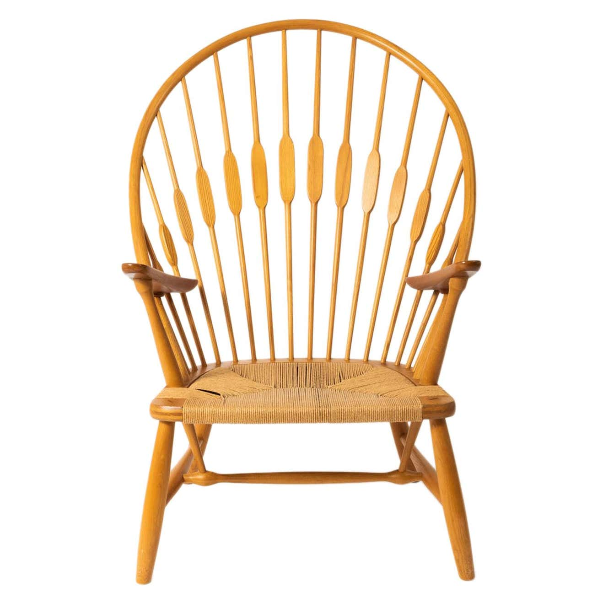
雅各布森

潘顿

埃罗·阿尼奧

