**古代埃及工艺美术**
----------------------------------------------------------------------------------------

| 时期 | 朝代时间 | 风格 |
| :----  | :----: |:----: |
| 有人类啦 | 300万年前 | 还是很像猴子 |
| 智人阶段 | 30万 - 20万年前 | 直立猿人 |
| 中期旧石器时代 | 20、30万年前 - 5万年前 |  |
| 晚期旧石器时代 | 5万 - 1.5万年前 | 母系社会 图腾崇拜 生产工具进步 |
| 中石器时代 | 1.5万年前 -  | 石器越来越小精细 也称细石器时代 |
| 新石器时代 | 始于78千年前  | 人类开始定居 农牧业出现 发明陶器 打磨石器农具 晚期母系社会向父系社会过度 |

> **背景**: 最早步入人类文明之一的古国，中枢是尼罗河。艺术`严肃而不朽` 相信人必然死而复活 是为了神明和来世享用，对来世生活的粉饰远远超过了对现实生活的美化
> **风格**： `永恒` + `不变`  几何形式的规整 + 对自然的犀利观察  静穆 庄重 浑厚 遒劲 `神秘主义色彩`
> 威兰多夫的维纳斯 

	
	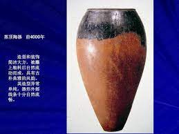
	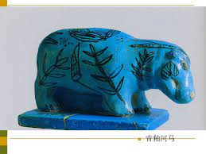
	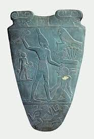
	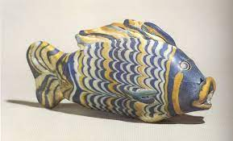

#### 黑顶陶器**
> `土红色`的器物上部或顶部施以`黑色的釉泥`，形成黑红两色对比效果的陶制品。造型单纯简练，有古朴典雅之风韵。制作于`公元前4000年`左右，古埃及早期陶工艺典型作品，现部分黑顶陶器存于`开罗埃及`艺术博物馆

#### 彩绘陶
> 暗地明花彩陶，黑顶陶衰落，彩绘陶出现，形式上受西亚风格的影响。比如而鱼纹彩陶钵，在土红色的器壁上用白土绘动物纹图案，统一和谐，极富形式美感。陶轮拉胚成型。

#### 化妆石板***
> 用处：古埃及人在化妆石板上把锑研碎，经调和制成`眼睛膏`。这种加工通常实在一种被称之为化妆石板的器具上进行的。这是埃及人经过精心设计之后打制或雕刻而成的专用器具，
> 装饰纹样：化妆石板的装饰纹样种类很多，以精美动物植物人物居多，后来演化成奉献用品或者纪念物
> 代表作有 `美尼斯王征服三角洲` 这个作品两面都以浮雕的形式变现了美尼斯王统一埃及的丰功伟绩，体现了埃及艺术浑厚古朴的特征，体现了`正面侧身律`

#### 正面侧身律*** 
> 古埃及人物的`造型`法则。多见于壁画 浮雕 器物的装饰中，通常表现为人物的`身体呈正面，头部呈侧面`，奠定了埃及艺术风格的基础，对两河流域 波斯以及腓尼基等地都有很大影响

#### 沙芯法**
> 古埃及的玻璃器的制作技法
> 做法：先由混有`黏土`及多量沙质的粗糙物质做成的器物的内部形态 -> 由金属棒的一端撑起来再浸入装有选作底色用的玻璃溶液的钳锅中旋转使之附上一层厚度相同的玻璃层 -> 玻璃外壳	`冷却之前`贴上保持半流动状态的拉长的各种色彩的长条状玻璃层 -> 用尖形工具刻画出独特的`波状`纹样 -> 容器外表光滑冷却之后吧颗粒状的内部沙土陶`取出`。
> **鱼形容器**:  in 大英博物馆 is best, 仅有14cm长，具备工艺美术的实用功能，也有审美价值
> 只有14cm，偏写实。出土于阿马那，是一件能代表古代埃及玻璃工艺水准的佳作， `采用沙芯法`.其艺术效果和工艺技巧均达到了极高程度
> 造型生动，色彩绚丽，表现出埃及人的装饰观念和美学思想

#### 古埃及玻璃制品的艺术特征
> `玻璃制品是古埃及发明创造`。制作材料和着色: 有沙、灰以及天然碳酸苏打的混合物加热制成。`并不透明`，后又发展着色工艺，色彩丰富艳丽 蓝经常使用(比较稳定) making method: 沙芯法名词解释
> all in：古埃及人对色彩的巧妙应用和把握 + 高超的工艺技巧和smart + 注重来世的美学观念和审美标准

#### 黄金王棺**
> 古埃及金属工艺典型代表，第18王朝为安置`图坦卡蛮王`的木乃伊而做的一层棺材，形象是按照图坦卡曼本人的相貌创作的，长180，耗费纯金220余公斤，以`松石玛瑙等珠宝`点缀，装饰性极强。
> 形象解析： 国王额部的蛇形装饰(埃及人崇拜的神灵 + 王权的象征)。下颌下面是假胡子(体现威严面目)，双手交叉紧握权杖的姿态(不可一世的威严 + 保护他在阴间平安再生来日复活)

**古代两河流域工艺美术**
----------------------------------------------------------------------------------------

> **装饰手法**: (刻纹 彩绘 刻纹填绘) 生活器皿 祭祀器 人像
> **背景**:  及其复杂 古巴比伦王朝(全盛于汉谟拉比时期) 新巴比伦王朝
> **风格**：带有很强的`世俗性`，人们`只关注国王或者主神`
> 尼尼微是陶器：纹样几乎遍布整个器壁，形制多为高脚杯

	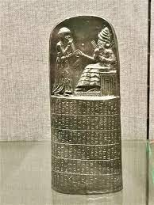
	

#### 汉谟拉比法典
> 是`古巴比伦王国`最出色的`石工艺品`，现藏于`巴黎卢浮宫`，在`苏珊遗址`发现的一块`玄武石碑`
> high: 2.25m 造型遒劲大方，装饰古朴典雅，浮雕太阳神沙玛什授权标给汉谟拉比王的庄严情节，下半部分用楔形文字刻着法典条文。
> 雕刻人物体现了苏美尔艺术传统的古朴柔韧。`是古代第一部完整保存下来的成文法典`。也受到了`正身侧面律`的影响。全面反映了古巴比伦王国的社会经济，政治状况和阶级关系。是研究考证古巴比伦王国历史的珍贵资料

#### 翼狮与牡鹿
> 是一件著名的大型`青铜`工艺作品。
> 在长方形铜板上，装饰着一头正面的翼狮和两只侧身的牡鹿。构图以翼狮的头和身体为中轴线，`呈严格的左右对称`。
> 作品风格庄严肃穆，翼狮突出的头部和鹿角的出格的表现打破了长方形带来的局限呆板之感，作品表现手法细腻`偏写实`，体现了工匠卓越的技能。

#### 两河流域与古代埃及工美的比较
> 相似点，由于历史和地理原因，古代两河流域工美在某些方面形成了与古代埃及相近似的风格
> 1. 数千年来工美的风格基本保持着原始的传统
> 2. 各类工美创作的形式法则与技法上的表现较为程式化
> 3. 类似古埃及的正身侧面律的表现形式在各种工艺品的装饰中较为常见
> 不同点
> 1. 古代埃及工美涉及广泛的材质，并取得了辉煌成就，特别是玻璃的发明对人类工艺文化产生了重大影响。在表现形式上，两河流域的工美善于利用多种材质互相搭配，作品技艺精湛，品种繁多，风格既丰富多彩又古朴典雅，反映了工匠们综合把握材料与题材的高潮能力。
> 2. 古代埃及工美注重装饰性的表现，强调精神上的作用，其作品往往不是为满足日常生活需求，而是为死者乞求来世享用而制作的。因此始终充满着静穆浑厚庄重的风韵，同时神秘有浓厚的宗教气息。在表现内容上，两河流域的工匠更多喜欢聚焦于当下，体现现实生活。作品体现浓厚的世俗性。
> 3. 埃及人永恒和不变的信念直接影响了工美的创作和风格。贯穿于古代埃及工美中的常在的秩序和恒定的理论使其形成独特的埃及风格。两个流域工美与当时人们生存环境的联系十分密切。其作品不论造型还是装饰纹样始终不离开动物形象，形成了古代东方工美创作特征之一。
> 总之古代两河流域的工美虽然在某些方面与古代埃及有着相同或相似的表现方法，但总体风格却完全不相同。

**波斯**
----------------------------------------------------------------------------------------
> 波斯是古代伊朗的名称，很多矿藏宝石重金属。金属工艺发达
> **埃兰王朝 - 米提亚王国**：`古朴典雅` 陶艺发展，代表了古代波斯`陶工艺`的`最高水平`。山羊纹金杯和狮纹金杯都是这时候的
> **阿黑门尼德王朝**：`豪华壮观` 最鼎盛的黄金时期。`金器突出`，代表翼狮形黄金角杯，`铸币制度`是人类历史上第一个大国首次施行统一的铸币制度。
> **萨珊王朝**： `优雅细腻` 波斯金属工艺获得复兴，卓越代表：`银制品工艺`，比如八曲长杯 织毯 联珠纹 八曲长杯

	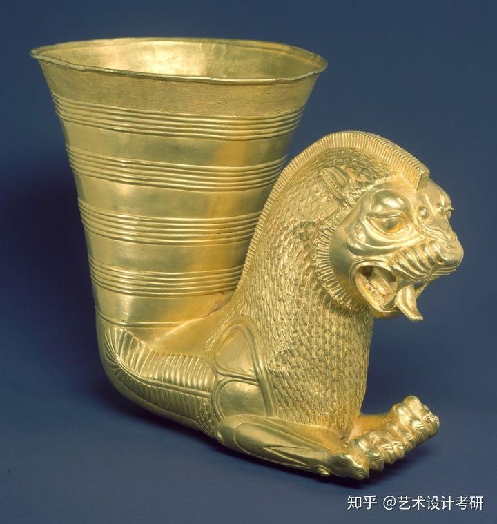
	
	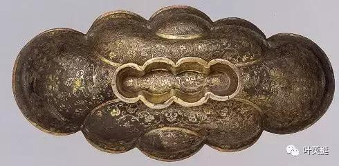

#### 翼狮形角杯
> 是在古代波斯所有工艺品中最具有代表性，因为这种造型的角杯在其他地区很少发现。基本结构都是前面为带翼的狮头、鹰头或其他动物形象，后半部分为高筒形的杯子。大都以金银制成
> 在`阿黑门尼德王朝时期`，翼狮形角杯极为盛行，它不仅作为`饮用器`，也是权势和富贵的`象征物`。前半部分造型装饰远远精彩与后半部分的杯子。
> 作品结构严谨，风格精美豪华，雍容瑰丽，做工考究，形象饱满，反映了阿黑门尼德王朝时期是波斯帝国的黄金时代。

#### 动物纹金杯
> 埃兰王朝 - 米提雅王朝的优秀金属工艺作品，代表作品有狮纹金杯和山羊纹金杯，这两件作品达到了`使用与审美功能的融合`：金杯杯壁上的动物装饰是浮雕和立雕两种手法表现的，动物的身体采用浮雕手法，而头部采用立雕附加到器壁上的，这些动物纹金杯不仅装饰效果生动，而且实用功能突出。动物的头部可以当做把手，方便人们手持和端拿

#### 萨珊银器
> 萨珊时期的银器制作有了突破性进展，是这一时期金工制品的卓越代表，各种银工艺品造型完美，装饰细腻，制作精致。
> 这一时期的金属工艺带有显著`古典主义色彩`的风格特征，洋溢着浓郁的`宫廷艺术气息`。
> 银器的造型以`八曲长杯，银盘，银壶，银碗`等居多，其中八曲长杯最富特色
> 银盘是有代表性的制品，装饰常见主体性的情节，如国王狩猎，神话故事及表现宫廷生活的题材。也有不少圣树圣兽纹饰或花鸟动物的内容。

#### 八曲长杯
> 萨珊王朝最具特色的银器。因杯子的口缘弯曲成八分，并呈细长形状而得名。装饰风格奇特繁丽，体现了当时工匠的大胆构想和精湛技艺
> 装饰多在杯子的外壁和底部，纹饰精致典雅，颇具装饰效果。`人物纹`八曲长杯和`动物纹`八曲长杯是这一时期金属工艺的典型之作。

#### 联珠纹
> 以联珠纹组成环形饰带，其内配以`对称动物`，是`萨珊王朝`时期织锦中极为常见的纹饰。饰带内动物`皆有翅膀`，比如飞鹿，翼狮等 这种独特装饰通过丝绸之路对中国当时的织锦工艺纹饰产生一定影响。

#### 波斯织毯
> 波斯织毯因其优质的材料和精致的做工，以及变化多端的编织技巧从而享誉世界。
> 常配以金丝银线和红绿宝石。`萨珊王朝`最为兴盛。堂皇富丽色彩艳丽，装饰题材广泛，常有圣树鲜花飞鸟等，体现了王公贵族奢靡生活和享乐主义的审美意识。

**伊斯兰工艺美术**
----------------------------------------------------------------------------------------

> **背景**: 融合`希腊古典文化，印度波斯和中国的先进文化`。伊斯兰教是世界三大教最晚，`反对偶像崇拜`，写实艺术形象少，`抽象图案多`。`植物纹样，几何图形`，阿拉伯数字。但是伊斯兰文化没有完全沉浸在宗教之中，也反应了很大的`世俗性`。
> **伊斯兰金属工艺风格**: `满密豪华精致繁丽的纹样` + `多种材料`，充满着`享乐主义`的色彩，装饰以`镶嵌`最为突出
> **伊斯兰工艺美术的特点**: 色彩鲜艳精致繁丽，构图满密，体现宗教思想，技法成熟。汲取东西方艺术精华，影响范围甚广，抽象为主，植物动物纹较多。幻想天国，五个统一。

#### 米奈型陶瓷
> 和斗彩很像，但是没什么联系。
> 米奈型陶器即用`米奈`手法制成的陶制品，是伊斯兰地区陶工艺的典型品类之一。
> 制作工艺为首先用钴蓝在白釉底上画草图，经过一度烘烤后，在加上各种色彩再烧一次。这种技法曾经广泛的影响中国日本。
> 米奈陶器的`色彩淡雅`调和普遍偏`冷色调`，肌理光滑美丽。12世纪的米奈型碗便是此类型的典型作品

#### 大马士革波纹
> 是`15世纪以前`伊斯兰`金属工艺品`上采用的尤为典型的技法
> 这种技法是在铁和钢的底子上刻出密集的交叉影线，将金银丝置于影线上锤击，使其附着在底子上形成图案。
> 这种技法在`盔甲和武器`的装饰尤为流行，曾随着丝绸之路传入中国。

#### 伊斯兰织毯
> 织毯和伊斯兰信徒有着密切的关系，有人把毯子视为接近神灵的圣杰的天阶。
> 织毯`构图满密`，有强烈的动感之没，纹样题材多为`花卉植物`，有时饰以阿拉伯文字，多以`红黄`等纯度较高的用色为主色调
> 穆斯林喜欢迁徙，织毯轻便功能多，表达了伊斯兰人对天国世界的幻想和向往，反应了人们的财富和地位

**日本工艺美术**
----------------------------------------------------------------------------------------
> 
> **背景**：`皆以中国唐朝为模范`，呈现唐风一边倒的态势。公元7世纪，汉字普及，佛教传入，公元645年的大化改新，由此进入封建社会。迁都平安，开始平安时代，此时遣唐使废止开始找自己的风格 12世纪末建立军事封建国家——镰仓幕府，进入幕府时代 明治维新，建立现代化社会

#### 绳纹式陶器
> `是日本最早的陶器`，能代表日本`上古文明`的艺术特色 绳纹文化时代一般分为`早前中后晚五`个时期
> 早期的绳纹陶器底部有尖形的，也有圆形的，器壁上或刻有精美纹样或用绳子缠在器壁上滚动器物形成无意识的捻绳纹，后期纹样开始有意识，精心加工的纹饰和口缘部分呈波状等。到了中期表现用黏土做的绳子隆起的纹饰。器皿厚而大，充满力量感。
> 到了绳纹文化后期，纹饰较平和，器型变小，这个时期已经能制作很完美的陶工艺品了。

#### 弥生式陶器
> 是日本上古文明典型的陶器工艺品之一 烧成温度较高，呈色多为赤褐色 造型严整，此时已经开始使用`陶轮`，装饰上用竹刮刀或梳子之类的工具刻画的纹样较多，平面化更强

#### 埴轮
> 上古时期，`古代贵族陪葬品`，目的是让死者在冥府也能获得快乐。
> 在日本各地均有发现，数量样式最多的地方是`关东地区`。埴轮形象抽象，`造型夸张`，寓意深刻，静穆冷峻，反应了古代日本工艺和雕塑的水准。
> 形制丰富，分为`圆筒埴轮`和`形象埴轮`。圆筒基本特征就是器物上下呈圆筒状，是一种十分抽象的陶塑纪念物。形象埴轮表现与人生活有关的内容为特征。有房屋埴轮，器物埴轮，人物埴轮，动物埴轮。

#### 莳绘
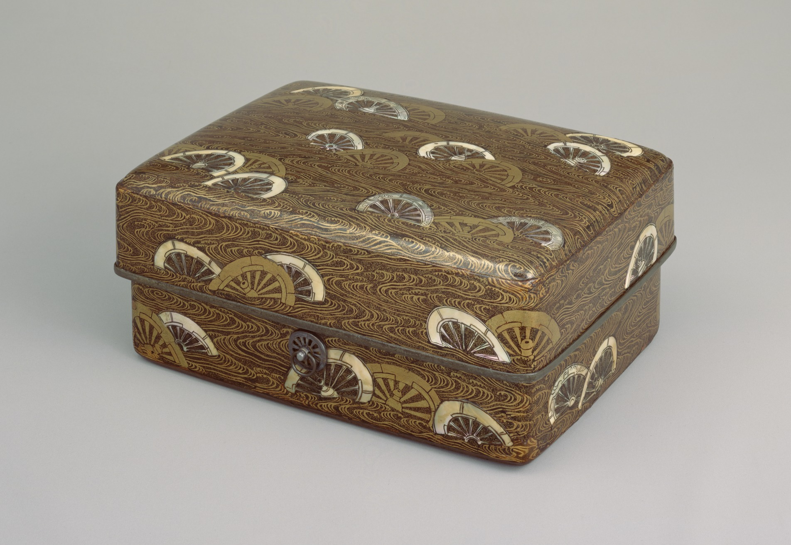

> 莳绘是日本漆工艺的技法之一，也可以用在陶瓷上，在十世纪以后形成，由中国的金银品脱演变而来，平安时代盛行，常与螺钿结合，典型作品：片轮车莳绘螺钿手箱
> 做法：以蒙上纱网的竹管将金粉抖落于漆器纹样上，然后上面涂上大漆，形成和谐美妙的装饰效果，也可以用在陶器上。
> 镰仓时代，又出现了平莳绘和高莳绘。金粉作为主要装饰材料广泛使用，播撒浓度不同呈现多层次的浓淡变化效果。

#### 乐烧茶碗
> 日本`丰臣秀吉`执政时期，桃山文化大放异彩，饮茶之风盛行，在`长次郎和千利休`的合作下，乐烧茶碗达到了成熟的地步。
> 其表现出`寂静而枯淡`的气质，与所追求纯粹的悠闲恬静之美的茶世界相一致。

#### 浮世绘
> 描写江户时代浮世的歌舞伎和花街巷柳风俗的多彩版画被称之为浮世绘 特点是`以木版印刷`，大量生产，采用。

#### 友禅染
> 友禅染的出现，是日本`江户时代中期`出现的印染技术上的一场革命
> 先在丝绸地上用胶描绘纹样后印染，最后再用水将胶洗掉从而完成制品，这种技法，可以忠实地表现出作者想要表现的内容
> 由于这种友禅染的出现，近代日本主要服饰小袖的染织，也全转变为染的形式。形成了崭新而美妙的工艺效果。

**古希腊工艺美术**
----------------------------------------------------------------------------------------

| 时期 | 朝代时间 | 风格 |
| :----  | :----: |:----: |
| 荷马时期 | 公元前12世纪 - 公元前8世纪 | 几何纹样时期 |
| 古风时期 | 公元前8 - 6世纪 | 东方纹样时期 黑色纹样时期 |
| 古典时期 | 公元前5 - 4世纪 | 红色纹样时期，彩绘纹样时期 |

> **最重要的两个城邦**： 希腊(工商业城邦)和雅典(农业奴隶制城邦)
> **背景**: 自由思想，不是君主独霸，城邦民主制，善于航海 陶器发展尤甚，大量出口 几何式 `唯美写实`

#### 古希腊陶艺
> - `几何纹样时期`(公元前9-8世纪)：最早的陶器见于荷马时期，按照样式的装饰题材和特点分为两个阶段，第一阶段(以平行线，交叉线，三角形，S纹和回形纹装饰为主要特色，这时期有一种常见的构图规律为`三带一同心圆式`，比如四马盖罐) 第二阶段(以图案化人物装饰为特色，主要题材取自于希腊神话和日常生活故事，具体有狩猎图，葬礼图等。人物特征是侧头，下巴似勾玉状突出，胸部呈倒三角，臀部和腿部有写实意味)
> - `东方纹样时期`(公元前7世纪)：因为和东方频繁的贸易往来，开始出现对东方国家`动植物纹样`和`怪兽纹样`的模仿，如棕榈纹，狮头羊身蛇尾，莲花纹等。`双耳陶壶`是这时的一件精美的代表作。壶身的四条横带区域分别以人首鸟身以及各种动物形象进行装饰。此时，制陶地区比较广泛，以`科林斯`和`阿提卡`两地最为突出。
> - `黑色纹样时期`(公元前6-5世纪)：公元前6-5世纪是希腊民主政治和陶器工艺的繁盛期，黑纹陶饰是这一时期陶工艺有代表性的类型。黑纹饰陶就是在赤色或黄褐色的陶壁上，用`黑色作剪影式`的描绘，而物体的内部结构则以刻线手法表现。这时期的陶器装饰内容以神化故事和英雄传说为主。`埃克西亚斯`是黑纹式盛期最优秀的制作者之一，代表作就是`阿克琉斯和埃亚斯玩骰子`，两个人都是克罗伊战争中的英雄，他们在出征的途中遇到风暴便玩骰子消遣，充满着生活的气息。
> - `红色纹样时期`(公元前5世纪)：在赤色或黄褐色的陶壁上用黑色或深褐色勾勒和装饰，然后再形象以外的部分涂上黑色色料`黑地`，其效果较之黑纹式的刻线显得更为灵活自如，丰富多彩。比如`布格力斯`的`醉酒少男少女`和`特洛伊战争图`，这时期工匠已经在绘饰上注重对`人体结构和肌肉组织`的正确观察和描绘，整体风格从几何式的生硬变得`写实唯美`
> - `彩色纹样时期`(公元前5世纪后期)：所谓白地彩绘就是在陶器壁上一层含铁成分少的石灰水，然后上面再用各种各种颜色加以绘饰，这种技法涂上的颜色未经高温处理，不能经久保存，当显示细部服饰的颜色消退后，便只留下简略的轮廓线，人物似乎也是裸露的了。这种装饰手法常见于香油小瓶，多为妇女所用或作为葬祭用物。代表工匠有`阿吉烈奥斯`，风格清秀典雅。
> `总结`：`伯罗奔尼撒战争`之后，随着国事衰微，希腊的陶工艺也日渐没落，总之，古希腊的陶器在制作工艺和装饰效果上都达到了及其完美的程度，它是立体与平面、造型与装饰、实用与审美的结晶。满足人们实用需求同时也起到欣赏和教化的作用。`柔和而圆润`的形制和充满`古典主义色彩`的装饰，为我们带来了一个`清新典雅`的世界，可谓沉默的音乐，无声的赞歌。

	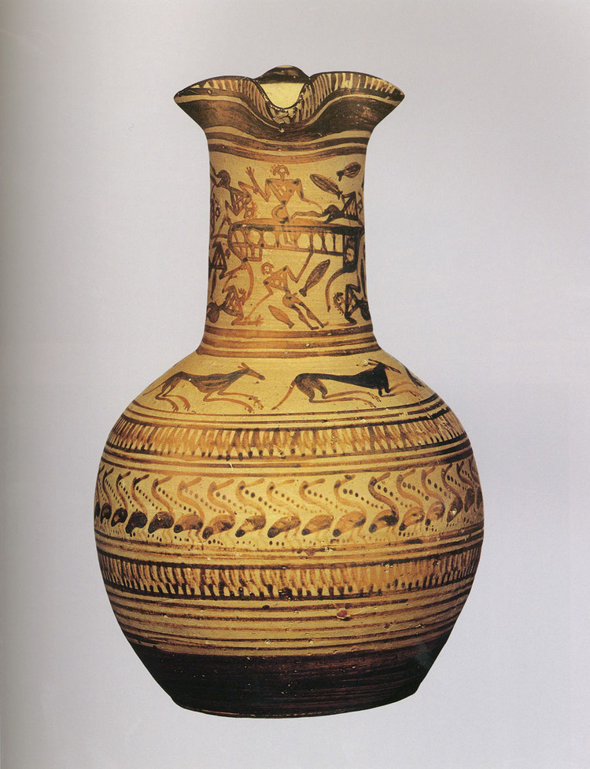
	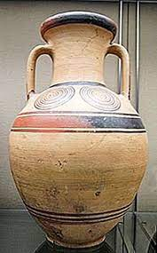
	
	
	
	

| 时期 | 时间 | 风格 |
| :----:  | :----: |:----: |
| 几何纹样时期 | 公元前9-8世纪 | 1.三带一同心圆 2.图案化人物 |
| 东方纹样时期 | 公元前7世纪 | 对东方国家动植物纹样和怪兽纹样的模仿 |
| 黑色纹样时期 | 公元前6-5世纪 | 在赤色或黄褐色的陶壁上，用黑色作剪影式的描绘，物体的内部结构以刻线手法表现 |
| 红色纹样时期 | 公元前5世纪 | 在赤色或黄褐色的陶壁上用黑色或深褐色勾勒和装饰并在形象以外的部分涂上黑色色料 |
| 彩色纹样时期 | 公元前5世纪后期 | 在陶器壁上一层含铁成分少的石灰水，上面再用各种各种颜色加以绘饰 |

**古罗马工艺美术**
----------------------------------------------------------------------------------------
> `尚希主义` `银器`和`玻璃制品`是罗马时代工美的代表性品种。

	
	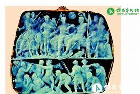

#### 穆拉诺和万花玻璃
> 以淡紫色、深蓝色、宝石绿、黄褐色作为基本色，掺入乳白色、黄色、淡红色制成各种玻璃器，这与称作热熔马赛克的玻璃加工技法是相同的，最为精彩的例证是文艺复兴时期发现的`万花玻璃`
> **万花玻璃**: 是古罗马玻璃工艺最精彩的制品，以碗的形式居多，采用的是`热熔马赛克`的玻璃加工技法。
> 这是将扭卷的各色玻璃合起来经热熔形成玻璃棒，在将此棒切断并置于器壁上，于是形成四方连续的纹样，再经热溶处理，使各色之间相互溶合，产生绮丽而辉煌的梦幻效果

#### 充气法
> 做法，将加热后的玻璃放置于管状棒的先端，通过这根管子一边向里吹气，一边按需要适当转动来吹造各种形制的玻璃器皿。
> 以吹制玻璃的手法和模子并用，使大量生产更加容易。日用玻璃几乎都是单色或极少的色彩混合其中，使之形成斑点状散步在器壁上。从整体来看，单纯的造型，简洁的装饰占主导地位。

#### 罗马银器
> 银器是罗马时代工艺美术的代表性品种，其成就是在埃特鲁里亚优良的黄金工艺上发展而来。银器不仅质地较硬，而且显得豪华，备受罗马人的青睐。
> 银器最初由东方传入罗马的，共和国末期到帝政初期，银器的浮雕装饰主题多为希腊神话，此外，风俗主题、哲学家、诗人的肖像、皇帝凯旋等`人物为主`的装饰很多，同时也有动物和植物的装饰，`风格偏写实`。
> 公关2-3世纪，进入后期罗马风格，这是一种自然主义描写向新的装饰性的表现转化的过程，除几何纹外，人物的表现和空间表现也呈`平面化`，此外，在银器的局部用乌金进行镶嵌技法也很盛行，装饰效果更为生动和复杂。

#### 为什么罗马银器流行
> 银器的`量大低廉`，也就是黄金价格的百分之8左右，因为成为欧洲工美史中独特的体系。`银的软度仅次于黄金`，加工起来有良好的延展性，便于细工处理，不论敲打，锻锤雕刻等技术都能很好地 施展。`银的重量也比黄金轻`，而且显得纯净而辉煌，可以做出明暗关系很强的浮雕装饰纹样，整个调子比黄金制品更为洗练。

#### 罗马赤陶
> 罗马赤陶是在`继承希腊制陶技法`的基础上，尤其是直接受到希腊时代意大利南部生产的黑色陶器影响下生产的。
> 罗马赤陶是罗马时代呈朱红色并有光泽的陶器，公元前1世纪-公元前4世纪初，作为饮食器广泛流行于整个罗马统治区域
> 做法是将即将干坯进入`含铁成分较高`的泥浆中，施挂一层薄薄的陶衣，晾干后在1000左右的氧化焰陶窑中烧成。陶衣在烧制过程中形成`氧化铁`，呈现独特的朱红色泽。
> 罗马赤陶的造型十分规范，多样的器型是由模具翻制的，装饰上几乎都有`浮雕`装饰，大致都是嵌花贴饰或者模型翻印而成。

#### 奥古斯都的玉佩
> 奥古斯都的玉佩是古罗马时期最著名的玉石雕刻品，现藏于`维也纳艺术史博物馆`。
> 它采用`缠丝玛瑙`制成，用`浮雕`的工艺手法，在深暗色的底子上表现了众多的任务形象
> 表现了奥古斯都战胜日耳曼人的凯旋场面，造型胜多，手法及其写实。正在与女神谈话的奥古斯都，在胜利之后卸下戎装，裸露着健美的肌肉，双足踏盾。在约20cm见方的玛瑙上，展现了雕刻家高超的技艺，代表了罗马盛期工艺品的最高水平。

**欧洲中世纪工艺美术**
----------------------------------------------------------------------------------------

| 时期 | 时间 | 风格 |
| :----:  | :----: |:----: |
| 中世纪(`政教合一`的教权统治) | 公元5 - 15世纪(自西罗马帝国灭亡 - 文艺复兴) | 用精神的美去代替物质的美，用灵魂的美代表肉体的美，用天上的理想代表世俗的理想 |

> **中世纪特点**:`完全服务于基督教` 艺术家并不是一心一意要创作自然的真实写照，也不是要创造优美的东西，他们为艺术及工艺美术全心倾注的便是忠实的向教友表述宗教故事的内容和宗旨。
> **中世纪工艺美术的特征**: 工美是宗教的产物，雕刻绘画低落，但是工美辉煌独特 形式丰富 制作精良 内涵深刻 都反应了当时审美观念：`泯灭人性，完全为宗教服务`，衍生出的工美风格：`低沉而凝重`

#### 圣遗物箱
> 是中世纪金属工艺最典型的类型，它是用来安放基督教圣者遗物或骸骨的容器
> 其多用`金属`制成，并以`宝石、象牙、玻璃`等材料加工而成
> 圣遗物箱的造型釉建筑形，动物形，人物形，其中以建筑形最常见，一般皆按照中世纪拜占庭式、哥特式或罗马式的造型制作，犹如一个个精致的建筑模型，显得格外庄重肃穆，豪华典雅。

#### 嵌饰十字架
> 作为基督教标记，十字架是神的象征，虔诚的信徒们便以最美好、最珍奇的材料赋予它神秘的形象和辉煌的色彩。其多用金属制成，并以宝石、象牙、玻璃等材料加工而成

#### 象牙祭坛
> 中世纪的小型祭坛是基督教徒必不可少的物品。平时陈设在家中，远行时可以折叠合拢，随身携带。`小型祭坛基本都是象牙制品`，具有庄严肃穆，华美典雅的艺术效果，充满着古典艺术的风韵。
> 哥特时期意大利制作的一件象牙袖珍礼拜坛便是此类作品最优秀的代表，这件精美的象牙雕饰祭坛看上去似乎有点像哥特式建筑模型，几乎都是人物形象，造型生动，雕刻细腻，构成严谨。在仅高24cm的作品上雕刻了众多人物形象，五官和衣纹皆有极为精细的刻画，显示出工匠卓越的工艺技能。

#### 彩绘玻璃窗
> 彩绘玻璃窗主要因中世纪`哥特式教堂`而兴盛，彩绘玻璃便于采光，是哥特式教堂建筑不可缺少的组成部分。14世纪以后随后哥特式建筑的衰落而逐渐消失
> 做法是先用铅条编成各种抽象的轮廓，然后用小块的玻璃镶嵌彩绘而成，带有单线平涂式的绘画意趣 色彩比较丰富，基本 色调是红蓝紫三种，纹饰多采用简洁的人物，动物或者植物纹样
> 以法国夏特尔教堂的彩绘玻璃窗为典型，其制作工艺尤其是色彩效果赋予了玻璃工艺崭新的艺术语言

**文艺复兴时期工艺美术**
----------------------------------------------------------------------------------------

| 时期 | 地点 | 时间 |
| :----: | :----: |:----: |
| 文艺复兴 | 意大利 | 公元14世纪 - 16世纪 |
| 文艺复兴 | 欧洲其他各国 | 公元15世纪 - 17世纪 |

> 文艺复兴的时代指的是从中世纪的文化向近代文化`过度`的时期
> 思想解放，新兴资产阶级反封建的文化运动，打破教会独裁，强调理性
> **四个重要转变**: 1.工艺美术`宗教性质->宫廷性质`，和民生关系紧密，工美空前繁荣 2. 艺术家的才能得到了充分的发挥 3. 符合大众需求且性价比高的木质家具，玻璃器皿和陶器等得到了空前大力发展 4. 此时的工美注重造型色彩等各方面比例与协调的感觉，一般器物的造型也更加考虑到适用和便利的因素

#### 马略卡式陶器
> 马略卡式陶器是意大利文艺复兴时期的一种陶器，因途径马略卡岛输入意大利而得名，文艺复兴时期马略卡陶器对欧洲不少国家影响甚大
> 马略卡式陶器制作工艺首先是成型素烧，然后施白色陶衣，干后绘饰，再`二次烧成`。
> 绘饰色彩丰富，风格活泼简练，常以象征性线描绘画。内容早期多为图案化的植物，鸟兽和文字组合等，还保留着晚期`哥特式`装饰的痕迹。晚期主要表现`神话故事、寓意人物和日常生活情境`，手法`写实造型严谨`。器形常见的有把手壶，大盘或陶砖等。

#### 田园风味陶器
> 16世纪后期，法国的陶器 工艺呈现出独自的风格特征，著名的法国陶艺家`伯尔拉尔·巴利`系经过多年的探索，创造了所谓的田园风味陶器。
> 这种类型的陶器以浮雕式的装饰手法代替了马略卡式陶器装饰的绘画性。常见的装饰题材是鱼、昆虫、蛇等，表现手法写实，趣味奇特。
> `巴黎卢浮宫`收藏的椭圆形陶盘是巴利系的代表作，长泾达53cm，在盘的平面上以高浮雕的首付啊表现了蛇、昆虫等动物和植物形象，再加上黄蓝绿等色的透明铅釉，使整个盘装饰呈现着特殊的效果。

#### 法兰索奥一世的盐缸
> 作者是当时最著名的金工`本韦努托 切利尼`，此缸是他最具代表性的杰作，切利尼享有崇高的社会地位，为权贵阶层服务
> 此缸体现了样式主义风格，主要用来彰显国王的权利文化和富有，实用性无关紧要。盐缸采用珐琅金工艺，镶满宝石，装饰奢华，在椭圆形的台座上雕刻着两个相对而坐的神像，地神和海神，周围还有象征着四季的浮雕，形成了与中世纪贵金属工艺风格迥异的装饰特征。体现了切利尼对技巧的表现欲和同时代赞助者追求精致的趣味

#### 贝壳式水壶
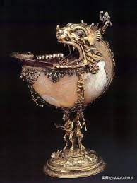

> 是德国金工师温泽尔的代表作，制作于公元16世纪。
> 在装饰手法上吸取了法国田园风味陶器的某些特点，比如以写实工细的手法表现了昆虫或其他爬行虫类，从而形成了额奇特的装饰效果
> 将天然材料和人工材料完美结合，不仅反映出工匠的精湛技艺，同时也反映了文艺复兴时期宫廷的审美趣味。

#### 文艺复兴时期玻璃工艺的特点
> 文艺复兴时期玻璃生产的中心是威尼斯，这里全面继承了古罗马以来已经形成的制作玻璃的传统工艺，玻璃生产是在受到威尼斯共和国庇护的穆拉诺岛，生产工艺在当时严格保密，所以文艺复兴时期的玻璃工艺是以穆拉诺玻璃器著称于世的
> 早期的玻璃器是在成型的器皿上加以彩绘，然后二次烧成。装饰上以彩绘形式表现神话故事、寓意人物和现实生活中的骑士和淑女。常见的造型釉玻璃高脚杯、碗和盘等。
> 16世纪以后，这种带有绘画性装饰的玻璃器逐渐被透明程度完好的玻璃器所代替。透明的玻璃中可以嵌入不透明的白色线条以形成一种嵌线玻璃或者另一种更为精致的嵌网玻璃，效果典雅高贵。

#### 文艺复兴时期家具工艺的特点
> 较中世纪`少了很多宗教色彩`，表现出`生机盎然`的风格特征
> 木材多选择胡桃木。大量采用雕刻技术，模仿古代大理石和浮雕艺术，总体日趋精美豪华。
> 为人民大众日需所制作的家具也十分繁荣，装饰上较为简洁，材质也更为低廉，实用性更强
> 家具正面常常绘饰或雕刻神话传说、寓言故事、风俗活动等场景。家具表面的肌理十分丰富，装饰手法多样有贴金、天鹅绒衬垫等。

**巴洛克时期工艺美术**
----------------------------------------------------------------------------------------

| 时期 | 地点 | 时间 |
| :----: | :----: |:----: |
| 巴洛克 | 巴洛克这个词源自意大利，但其实影响整个欧洲 | 包括`17世纪`整个欧洲艺术，庄严高贵、豪华壮观的气韵，充满阳刚之气 |

> **背景**：巴洛克艺术其起`源于意大利`，但`整个17世纪`欧洲文化艺术的中心是在`法国` 17世纪的欧洲艺术通常被称为巴洛克时期。
> 巴洛克风格的艺术具有
> **风格**: `华丽性、浪漫性、激情性、运动性、空间性、综合性`的特征，同时洋溢着`庄严高贵、豪华壮观`的气韵，充满强烈的`动势`和`阳刚之气`，在表现形式上打破了各种旧艺术风格，追求`标新立异`的表现，更少的宗教性质
> **性质**: 巴洛克时期的工艺美术是`宫廷性质`的工艺美术，`完全为王室`和权贵服务。追求吧建筑雕刻绘画结合成一个`整体`。
> **家具显著变化**: 以织物或皮革的包衬处理替代了扶手、靠背或其他局部的雕刻装饰 以回廊柱的单纯形式代替了圆形旋木与方木相间组成的椅腿

#### 巴洛克
> 巴洛克愿意通常为 畸形的珍珠，不合常规 等。后来特指盛行于整个`欧洲17世纪的艺术风格。
> 巴洛克时期的工艺美术主要是围绕着建筑而兴起的染织工艺、木工艺、玻璃工艺等
> 主要特点是气势磅礴、色彩富丽、对比强烈、富有动势、注重光的效果、追求时间和空间的无限，力图融建筑、绘画于一体，充满`阳刚之美`。

#### 戈贝兰织物所
> 路易14时期由宰相`科尔贝尔`于1662年成立的宫廷性质的织物所，`负责人`是宫廷画家`夏尔勒布伦`
> 设计样稿都由宫廷画师制作，内容包括`希腊神话，宗教故事和历史事件`。
> 代表作有`路易十四加冕式`，壁毯人物众多，场面壮观，作品的样稿设计和制作工艺虽然都很成功，但一味模仿大型装饰壁画的表现而使织锦壁毯固有的艺术特征丧失了。
> 戈贝兰织物所还制作了大量的写实性花卉纹样织毯，构图繁密，色彩丰富，目的是为了增强建筑物室内装饰的效果，当时织锦壁毯工艺所取得的成就和17世纪欧洲高水平的绘画艺术分不开。

#### 戈贝兰花壁毯
> 戈贝兰花壁毯是法国巴洛克时期为宫廷所制作的壁毯
> 1662年，法王路易14的宰相聚集了巴黎的织毯作坊，成立了宫廷性质的戈贝兰织物所
> 设计样稿皆由宫廷画师制作，其负责人是宫廷画师夏尔勒布伦。他的样稿包括希腊神话、宗教故事、历史事件。构图满密、色彩丰富、富丽华贵
> 大型的织锦壁毯是用竖机制作的，可以看出`纬线起花`的工艺已经及其成熟

#### 布尔镶嵌法
> 由`路易十四时期`最优秀的家具工艺师布尔于1680年左右创造,`布尔长期在宫廷任职`，早期作品常采用五彩木片作花鸟图案镶嵌装饰
> 做法是将金属片和龟甲重叠在一起，刻成一样的图案，然后在镶嵌在橱柜家具的表面
> 代表作品是现藏于`巴黎罗浮宫`的 布尔镶嵌法式的衣柜，镶嵌技法相当出色，色彩配置也极为和谐
> 他制作的家具的创新性和丰富性为凡尔赛宫增色不少。这种镶嵌法曾经对法国后来的家具工艺产生了深远的影响。甚至连邻国的家具工艺家也纷纷效仿。

#### 德尔夫特窑
> 是`巴洛克`时期欧洲制陶业的繁盛地，其位处`荷兰`的德尔夫特
> 其主要是仿制中国瓷器风格，并在当时大获成功。它以白底篮彩纹样为主，近似中国的青花瓷。装饰以龙凤、狮子、亭台楼阁、山水风景等中国青花瓷传统纹样，同时选择欧洲人得以理解的形态，加以改动重组，被称为`希诺瓦兹里`纹样
> 纹饰清新活泼，表现自由，充满东方情调，备受欧洲人喜爱
> 德尔夫特窑不但生产日常用具，`也生产陶砖`。尽管其在装饰上模仿中国纹样，然而其`造型`完全是按照欧洲人的生活习性和欣赏习惯而设计的，这也是德尔夫特窑能够垄断欧洲陶工艺制品市场的重要原因。
> 克拉克在荷兰特指中国古代瓷器 荷兰东印度公司
> 仿造 胎质粗糙(不是高岭土+瓷石)，颜色失真 还有毒(含铅等重金属被微酸溶解会毒死人)
> 改良胎料：改进陶土配方，加入高岭土石英等 蓝陶的胎土钴料釉料配方成为荷兰国家机密
> 改良烧造方法：胎料和铅釉无法承受高温，采用地纹烧制，先用素坯900烧制，然后画，施透明釉再1040烧造而成，所以实质上是一种低温铅釉瓷器类似于唐三彩
> 用氧化钴颜料不断调配，偏灰，当地称之为忧郁蓝，
> 装饰模仿：器型，常用纹饰，构图，外边缘以一圈或多圈纹饰衬托中央主图或纹章成为荷兰陶工喜欢的设计
> 1713年后瓷器发明出来了就完蛋了

**洛可可时期工艺美术**
----------------------------------------------------------------------------------------

| 时期 | 地点 | 时间 |
| :----: | :----: |:----: |
| 洛可可 | 法国 | 用来形容`18世纪中期`流行于欧洲各国的装饰样式 |

> **风格**: 活泼轻快，轻浮浪漫，充满`女性`抒情婉转的`阴柔之美`，粉饰出一种`轻快和欢愉`的情调，表现贵族生活的优雅、爱情的愉悦和田园生活的抒情，有远离现实的幻想色彩，刻意追求`繁复`的装饰效果，显得`矫揉造作`，热衷于`精雕细琢`的表现手法。 家具多为弯腿，曲线造型增多，有专门给女性用的小型写字台，
> **性质**: `纯粹的宫廷艺术`

#### 洛可可
> 罗可可原意为岩石和贝壳饰物，后来特指盛行于18世纪欧洲各国的艺术样式。
> 特点是纤细、轻巧、华丽和繁缛的装饰性，多用`C形、S形和涡卷形`的曲线和艳丽`浮华的色彩`做装饰构成，以`不对称，不均衡`，甚至带有反秩序常规向的特点表达强烈的动感。
> 其整体带有女性抒情、婉转、阴柔之美，是纯粹的宫廷艺术，带有明显的`享乐主义色彩`，热衷于精雕细琢的表现手法。
> 就装饰艺术自身发展的规律而言，罗可可风格的形成实际上是`巴洛克艺术刻意修饰而走向极端的必然结果`。

#### 麦森窑
> 1710年，`德国`国王赶造复活节用瓷，勒令建立麦森王室瓷窑。`博蒂格尔`通过不懈努力终于在1709年烧造出欧洲第一件优质白瓷器，通过优选高岭土，于`1713年`春天开始批量生产，麦森窑王室瓷窑于是名声大振，震动了欧洲
> 赫罗尔特对麦森窑的发展作出了重大的贡献，他绘制的瓷器装饰带有浓郁的东方色彩
> 麦森窑还烧制陶瓷雕塑。坎德勒创作的瓷塑作品生动可爱，深受社会上层人士的喜爱。

#### 塞弗尔窑
> 塞弗尔窑是`法国`洛可可时期最著名的瓷器产生地。路易十五的宠姬`蓬巴杜夫人`是该窑的庇护者
> 塞弗尔窑的装饰忒单具有典型的洛可可式的阴柔之美。它通常在器皿的两面中央绘以`罗可可式的装饰纹样`，产品多用金粉描边，釉面多以青、绿、黄或玫瑰色为底。
> 从1759-1764年，麦森窑产品大多是蓬巴杜妇人所喜欢的玫瑰色地，所以亦称玫瑰色蓬巴杜式，现藏于巴黎布特·巴咧美术馆的水壶和水钵便是代表作品。这件器物造型带有洛可可式的优美曲线，水壶的两面和水钵的四面装饰着白底金色的植物纹样，其余部分皆以玫瑰色为底，精致华丽，风格偏女性化。
> 此外，塞弗尔窑的白色瓷塑也是相当精致的，不少有成就的雕塑家也都从事过瓷塑的设计。

#### 托马斯奇彭代尔
> 托马斯是`18世纪`英国最杰出的家具设计家和制作家，对各国家具都有广泛研究，尤其对法国`哥特式`和`洛可可式`家具以及中国式的家具研究颇为精深。并探索过中国风格罗可可化的可能。
> 奇彭代尔于1754年出版了一本叫`绅士与家具制作指南`，在英国这是有人第一次为了给自己的产品促销而出版一本家居设计专著。这本指南远销国内外，给他带来大量订单的同时也让他的设计名扬四方。显示他卓越的设计和精明的头脑。
> 现藏于伦敦美术馆的`中国式床铺`就是他的一件代表作品，整个床吸收了中国式的四柱形式，但高高的尖形顶盖则是英国独有的，这件作品以红黄相间的装饰为主要色调，局部施金获得了奇特的装饰效果。

	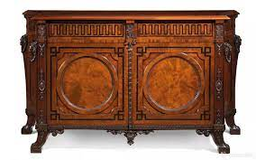
	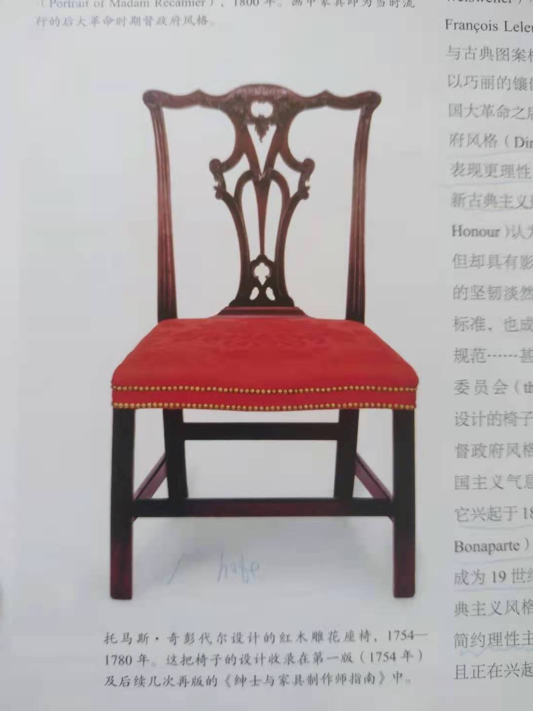

#### 洛可可时期染织纹样的特点
> 法国18世纪染织工艺的时代特点较为明显的反映在纹样的变更上
> 在18世纪初期的染织品的纹样还基本保持着巴洛克时期的特点，即纹样的构成运用中心轴呈左右的对称状，同时一种以菱形结构出现的植物纹也较为流行
> 从18世纪30年代开始，洛可可式的染织纹样大体形成，它的特点主要为
> 1. 是自然主义`植物纹样`的表现，其中壁毯的题材很多是洛可可式的田园牧歌风味
> 2. 是构成上注意`非对称性`的处理，多用`C形、S形和涡卷形`的曲线作装饰构成，给人一种纤细轻巧之感以及豪华奢丽的印象，
> 3. 更多的表现了绘画性的特点，如丰富的层次和明暗关系处理，特别是带有情节性的人物风情题材。当然，由于`过分主义写实纹样`的表现，势必给制造工艺带来阻碍，同时也就多少影响到染织品自身特征的充分表现。

**新古典主义时期工艺美术**
----------------------------------------------------------------------------------------

| 时期 | 地点 | 时间 |
| :----: | :----: |:----: |
| 新古典主义时期 | 欧洲尤其是法国 | 指`18世纪末至19世纪前半期`在欧洲流行的一种崇庄重典雅、带有复古意趣的艺术风格 |

> 新古典主义是巴洛克和罗可可的对立面，在法国取得的成绩最高
> 主要是一个过渡时期，为之后现代设计打下基础
> 新古典主义时期工美风格反应了新兴资产阶级市民阶层的审美意识，对浮华矫饰的洛可可风格进行了修整，对古典艺术进行了新的挖掘和揭示。标志着没落的宫廷艺术即将进入尾声。

#### 韦奇伍德

> 出身于制陶工人家庭英国人韦奇伍德(1730 - 1795)被称为英国陶瓷之父，于1759年建立韦奇伍德公司
> 重要贡献： 科学的制造方法，对材料全面深入的研究，对商业组织的远见卓识，设计更新，引领市场，对劳动力的合理安排(劳动分工的细化)
> 对商业组织的把控：通过特殊的社会关系，韦奇伍德为英国的夏洛特王后只做了一大批奶油陶餐具，这张皇家订单很大程度上帮助了韦奇伍德公司确立了品质与时尚的声誉，1765年以后，这类设计被称为王后陶，为他带来很多订单名声大噪
> 营销策略：以古董设计包装技术创新：主要的技术例如新胎体和工序的改进在目录中并为提及，不愿意宣传新发现，而是把上蜡画的黑炻器效果酷似伊特鲁里亚陶器描述成重新发现失传的古老工艺，因为他明白产品之所以能热销是因为他们没有让顾客联想到那些可能难以让人接受的进步方面。他还开办时尚精品展览室接受产品预订减低压货的风险。韦奇伍德明白时刻走在时尚前沿对于商业竞争的重要性
> 他的名言是：什么都值得试一试，可以视为对启蒙主义思潮及相关的经验主义思想的总结，也预见了工业革命的发展方向，引领了现代设计的进程。

#### 维多利亚风格
> 维多利亚风格，常用来形容19世纪欧洲等英语系国家盛行的建筑和装饰风格。此时英国进入维多利亚女皇时代，殖民地遍布全球，设计上也转向了繁琐奢华的方向。反映了新生的资产阶级企图利用繁琐华贵的设计来炫耀自己的财富的欲望
> 自主要特征是`华丽、繁缛、对历史风格的堆砌，达到了无以复加的地步`，甚至产品的功能因为装饰的过度被严重妨碍，它的实质是古典折中主义。

#### 帝政风格
> 帝政风格是拿破仑帝国的官方艺术风格。帝政风格`非常强调皇权`，是新古典主义时期的最后阶段
> 拿破仑一心想效仿古罗马帝国的模式建立起统一的欧洲，帝政风格就是这一观念的产物。为了与波斯王朝相对立，帝政风格仿照古罗马风格，宏伟壮观，庄重典雅。更多地表现在室内装潢和家居设计中，后来被拓展到公共建筑上。

#### 新古典主义时期工艺美术风格发展
> 新古典主义时期工美风格反映了新兴资产阶级市民阶层的审美意识，对浮华矫饰的洛可可风格进行了归正，对古典艺术进行了新的挖掘和揭示，标志着没落的宫廷艺术即将进入尾声
> 给当时充满着脂粉气的洛可可时式工艺风格所笼罩的欧洲带了了清新之风。
> 使人们开始冷静回顾温习古希腊罗马艺术的真谛，体验古典艺术美学思想的艺术法则，对新型市民阶层的审美观念和文化意识产生了极大的影响。
> 为欧洲现代工艺美术和现代设计的产生奠定了良好的基础，以崭新的审美观念和工艺美学思想，构建了通向现代工美的道路。

#### 奥古斯塔斯普金
> 普金是英国19世纪著名的建筑师，他认为维多利亚时期的设计是奢华而不诚实的，功能缺乏且道德沦丧。他支持复兴哥特风格，呼吁设计与建筑中的真是原则，它基于三个基本属性即适用，真材和显示结构，三者最终归结为道德诚实
> 他出版有两本产生社会影响的著作：`对照；即十四，十五实际的玉宇琼楼与当今类似建筑的比较``尖顶或基督教建筑的真是原则`。最著名的设计项目是威斯敏斯特宫的室内设计
