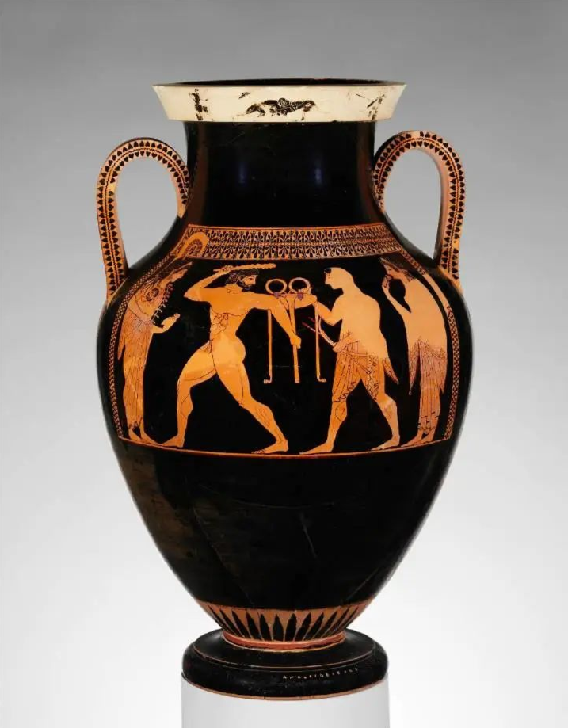

**古代埃及工艺美术**
----------------------------------------------------------------------------------------
> **背景**: 最早步入人类文明之一的古国，尼罗河。艺术`严肃而不朽` 死而复活 神明来世，粉饰来世>美化现实生活
> **风格**： `永恒` + `不变`  几何形式的规整 + 对自然的犀利观察  静穆 庄重 浑厚 遒劲 `神秘主义色彩`
> 威兰多夫的维纳斯 

	
	
	
	
	
威兰多夫的维纳斯 翼狮与牡鹿 萨珊银壶 穆拉诺万花玻璃

#### 黑顶陶器**
> 土红器上/顶`黑色的釉泥`，黑红对比。造：单纯简练，装：古朴典雅。begin`公元前4000年` 部分埃及艺术博物馆

#### 彩绘陶
> 暗地明花，陶轮拉胚成型 黑衰彩出，西亚风格。鱼纹彩陶钵，土红器壁 白土绘动物纹图案，统一和谐，极富形式美感

#### 化妆石板***
> 用处：化妆石板锑调眼睛膏。精心设计 打制/雕刻专用器具  
> 装饰纹样：种类多，动物植物人物居多，奉献用品/纪念物  
>  `美尼斯王征服三角洲` 两面浮雕美尼斯王统一埃及，体：艺术浑厚古朴 + 正面侧身律

#### 正面侧身律*** 
> `造型`法则。壁画 浮雕 器物，`身正，头侧`，奠定埃及艺术风格基础，影两河流域/波斯

#### 沙芯法**
> 玻璃技法  做法：内部形态(黏土/沙质粗糙物质) -> 金属棒 浸入钳锅 旋转 玻璃层 -> 冷却之前 半流动状态 拉长各色玻璃层 -> 刻波状纹样 -> 冷却取出。  
> **鱼形容器**: 阿马那 in 大英博物馆, 14cm，造:生动，装：色彩绚丽 偏写实 总结：实用功能 + 审美价值 古代埃及玻璃工艺水准佳作(艺术效果工艺技巧极高) 装饰观念和美学思想

#### 黄金王棺**
> 金工艺代表，18 图坦卡蛮王 棺材，本人相貌创作，180，220，松石玛瑙等珠宝点缀，装极强。  
> 额部蛇(神灵 + 王权)。假胡子(威严面目)，交叉紧握权杖(不可一世的威严 + 阴间平安来日复活)

**古代两河流域工艺美术**
----------------------------------------------------------------------------------------

> **装饰手法**: (刻纹 彩绘 刻纹填绘) 生活器皿 祭祀器 人像  
> **背景**:  及其复杂 古巴比伦王朝(全盛于汉谟拉比时期) 新巴比伦王朝  
> **风格**：带有很强的`世俗性`，人们`只关注国王或者主神`  
> 尼尼微是陶器：纹样几乎遍布整个器壁，形制多为高脚杯

#### 汉谟拉比法典
> 古巴比出色石品，巴黎卢浮宫，苏珊遗址 玄武石碑  
> high: 2.25m 造:遒劲大方，装:古朴典雅，上半：沙玛什汉谟拉比王，下半:楔形法典条文。  
> 雕刻人物体现了苏美尔艺术传统的古朴柔韧。`是古代第一部完整保存下来的成文法典`。也受到了`正身侧面律`的影响。全面反映了古巴比伦王国的社会经济，政治状况和阶级关系。是研究考证古巴比伦王国历史的珍贵资料

#### 翼狮与牡鹿
> 是一件著名的大型`青铜`工艺作品。
> 在长方形铜板上，装饰着一头正面的翼狮和两只侧身的牡鹿。构图以翼狮的头和身体为中轴线，`呈严格的左右对称`。
> 作品风格庄严肃穆，翼狮突出的头部和鹿角的出格的表现打破了长方形带来的局限呆板之感，作品表现手法细腻`偏写实`，体现了工匠卓越的技能。

**波斯**
----------------------------------------------------------------------------------------
> **埃兰王朝 - 米提亚王国**：`古朴典雅` 陶艺发展，代表了古代波斯`陶工艺`的`最高水平`。山羊纹金杯和狮纹金杯都是这时候的 古代伊朗
> **阿黑门尼德王朝**：`豪华壮观` 最鼎盛的黄金时期。`金器突出`，代表翼狮形黄金角杯，`铸币制度`是人类历史上第一个大国首次施行统一的铸币制度。
> **萨珊王朝**： `优雅细腻` 波斯金属工艺获得复兴，卓越代表：`银制品工艺`，比如八曲长杯 织毯 联珠纹 八曲长杯

#### 翼狮形角杯
> 古波斯工艺品最具代，其他地区少现。前:带翼的狮鹰头/其动，后:高筒杯子。金银 前造型装饰 > 后杯子。  
> `阿黑门尼德王朝时期`极盛，`饮用器`+`象征物`(权势和富贵)。  
> 结严，风格精豪，雍瑰，做工考究，形象饱满，黄金时代(阿黑门尼德王朝时期)。

#### 动物纹金杯
> `埃兰王朝 - 米提雅王朝`金艺，狮纹金杯/山羊纹金杯，`使用与审美功能的融合`  
> 壁动物(浮雕和立雕)，身体浮雕，头部立雕附加，装饰效果生动 + 实用功能突出。头部把手，手持端拿

#### 萨珊银器
> 萨珊时期的银器制作有了突破性进展 带有显著`古典主义色彩`，`宫廷艺术气息`  
> 造:`八曲长杯(富特色)，银盘，银壶，银碗`  
> 装:国王狩猎，神话故事及表现宫廷生活的题材。圣树圣兽纹饰或花鸟动物

#### 八曲长杯
> 萨珊王朝最具特色银器。造：口缘八分，细长。装:风格奇特繁丽，工匠(大胆构想 + 精湛技艺)  
> 装饰多在杯子外壁和底部，纹饰精致典雅，颇具装饰效果。人纹八长和动纹八长典型之作。

#### 联珠纹
> 环形饰带，内`对称动物`，`萨珊王朝`织锦中极为常见。`皆有翅膀`飞鹿，翼狮等 影丝绸之路对中国当时织锦工艺纹饰

#### 波斯织毯
> 优质材料精致做工，变化多端编织技巧  金丝银线/红绿宝石
>`萨珊王朝`盛。堂皇富丽色彩艳丽，题材广泛，圣树鲜花飞鸟等，审美意识(奢靡生活+享乐主义的)

**伊斯兰工艺美术**
----------------------------------------------------------------------------------------

> **背景**: 融合`希腊古典文化，印度波斯和中国的先进文化`。伊斯兰教是世界三大教最晚，`反对偶像崇拜`，写实艺术形象少，`抽象图案多`。`植物纹样，几何图形`，阿拉伯数字。但是伊斯兰文化没有完全沉浸在宗教之中，也反应了很大的`世俗性`。
> **伊斯兰金属工艺风格**: `满密豪华精致繁丽的纹样` + `多种材料`，充满着`享乐主义`的色彩，装饰以`镶嵌`最为突出
> **伊斯兰工艺美术的特点**: 色彩鲜艳精致繁丽，构图满密，体现宗教思想，技法成熟。汲取东西方艺术精华，影响范围甚广，抽象为主，植物动物纹较多。幻想天国，五个统一。

#### 米奈型陶瓷
> 斗彩，没联系。 `米奈`手法制成，伊斯兰地区陶工艺典型品类。  
> 钴蓝白釉画草图，烘烤，上色再烧。影中国日本。  
> 色彩淡雅 偏冷色调，肌理光滑美丽。12世纪米奈型碗便是此类型的典型作品

#### 大马士革波纹
> 是`15世纪以前`伊斯兰`金属工艺品`上采用的尤为典型的技法    
> 铁和钢的底子交叉影线，金银丝影线上，附着在底子上形成图案。  
> 盔甲和武器，丝路入中国。

#### 伊斯兰织毯
> 伊斯兰信徒，接近神灵的圣杰的天阶。  
> `构图满密`，动感，题材`花卉植物`，饰阿拉伯文字，`红黄`纯高的为主色调  
> 穆斯林喜欢迁徙，织毯轻便功能多，天国世界向往，反应了财富和地位

**日本工艺美术**
----------------------------------------------------------------------------------------
> **背景**：`皆以中国唐朝为模范`，呈现唐风一边倒的态势。公元7世纪，汉字普及，佛教传入，公元645年的大化改新，由此进入封建社会。迁都平安，开始`平安时代`，此时遣唐使废止开始找自己的风格 12世纪末建立军事封建国家——镰仓幕府，进入幕府时代 明治维新，建立现代化社会
> **乐烧茶碗**:丰臣秀吉 桃山文化 长次郎和千利休 `寂静而枯淡`

#### 绳纹式陶器
> `最早`，`上古文明`艺特色 绳纹文化时代`早前中后晚`  
> 早: 底尖/圆，壁刻纹样/无意识压型纹/捻绳纹，之后有意识，施纹器纹饰和口缘呈波状。中: 绳子隆起。器皿厚大，力量感。后: 平和，器型变小，now完美。

#### 弥生式陶器
> 是日本上古文明典型的陶器工艺品之一 烧成温度较高，呈色多为赤褐色 造型严整，此时已经开始使用`陶轮`，装饰上用竹刮刀或梳子之类的工具刻画的纹样较多，平面化更强

#### 埴轮
> 古坟时代贵族陪葬品，冥府快乐。  
> 数量样式最多in`关东地区`。抽象，造:夸张，寓深，静冷，古日本工艺和雕塑水准。  
> 圆筒埴轮(上下呈圆筒状，是一种十分抽象的陶塑纪念物)/形象埴轮(与人生活有关 房屋埴轮，器物埴轮，人物埴轮，动物埴轮)

#### 莳绘
> 莳绘漆工技法，also陶瓷，十世纪以后形成，from末金缕+金银品脱，平安盛，always + 螺钿，片轮车莳绘螺钿手箱  
> 竹管with纱网 金粉抖落漆器纹样，涂大漆，和谐美妙装效
> 镰仓时代，平莳绘/高莳绘。金粉广泛用，浓度不同呈现多层次的浓淡变化效果。

#### 浮世绘
> 描写`江户时代`浮世的歌舞伎和花街巷柳风俗的`多彩版画`被称之为浮世绘 特点是`以木版印刷`，大量生产，采用。

#### 友禅染
> 出现`江户时代中期`印染技场革命  胶描纹后印染，水洗胶完成，忠实表现作者内容  
> 近代日本主要服饰小袖的染织，全是染形式。形成了崭新而美妙的工艺效果。

**古希腊工艺美术**
----------------------------------------------------------------------------------------
> **最重要的两个城邦**： 希腊(工商业城邦)和雅典(农业奴隶制城邦)
> **背景**: 自由思想，不是君主独霸，城邦民主制，善于航海 陶器发展尤甚，大量出口 几何式 `唯美写实`

#### 古希腊陶艺
> - `几何纹样时期`(公元前9-8世纪)：早荷马时期，两个阶段(装饰题材特点): 1.(平行线，交叉线，三角形，S纹和回形纹装饰为主要特色，常构图规律`三带一同心圆式`四马盖罐) 2.(图案化人物，题材(希腊神话+日常生活故事)，e.g.狩猎图，葬礼图等。人物特征是侧头，下巴勾玉，胸倒三角，臀腿写实)
> - `东方纹样时期`(公元前7世纪)：东方贸易，模仿东方国家`动植物纹样`+`怪兽纹样`，e.g.棕榈纹，狮头羊身蛇尾，莲花纹等。`双耳陶壶`。四条横带区域分别以人首鸟身以及各种动物形象进行装饰。制陶区广 科林斯 阿提卡。
> - `黑色纹样时期`(公元前6-5世纪)：`民主政治`和`陶器工艺`繁盛期(6-5)，黑纹代表性类。赤黄褐色陶壁，用`黑色作剪影式`的描绘，物体内部结构刻线。装饰内容(神化故事+英雄传说为主) `埃克西亚斯`代表作就是`阿克琉斯和埃亚斯玩骰子`，克罗伊英雄，风暴便玩骰子消遣，生活气息。
> - `红色纹样时期`(公元前5世纪)：赤黄褐色陶壁 用黑色或深褐色勾勒和装饰，然后再形象以外的部分涂上黑色色料，较黑纹式更灵活自如，丰富多彩。`布格力斯`(醉酒少男少女 + 特洛伊战争图)，工匠注重对`人体结构和肌肉组织`的正确观察和描绘，整体风格从几何式的生硬变得`写实唯美`
> - `彩色纹样时期`(公元前5世纪后期)：陶器壁上一层石灰水(含铁少)，各色加以绘饰，颜色未高温，不能久保，当显示细部服饰的颜色消退后，轮廓线，人物裸露。香油小瓶，`阿吉烈奥斯`，风格清秀典雅。
> `总结`：`伯罗奔尼撒战争`之后，随着国事衰微，希腊的陶工艺也日渐没落，总之，古希腊的陶器在制作工艺和装饰效果上都达到了及其完美的程度，它是立体与平面、造型与装饰、实用与审美的结晶。满足人们实用需求同时也起到欣赏和教化的作用。`柔和而圆润`的形制和充满`古典主义色彩`的装饰，为我们带来了一个`清新典雅`的世界，可谓沉默的音乐，无声的赞歌。

	
	
	
	

**古罗马工艺美术**
----------------------------------------------------------------------------------------
> `尚希主义` `银器`和`玻璃制品`是罗马时代工美的代表性品种。

#### 万花玻璃
> 古罗马玻璃最精彩制品，碗多，`热熔马赛克` 扭卷的各色玻璃合起来经热熔形成玻璃棒，在将此棒切断并置于器壁上，四方连续，再经热溶处理，各色相互溶合，梦幻效果

#### 充气法
> 做法:加热后的玻璃放置于管状棒的先端，另一边向里吹气，一边按需吹造型玻璃器皿  
> 以吹制玻璃的手法和模子并用，大量生产容易。日用玻璃(单色或极少的色彩混合斑点状散步在器壁上) 从整体来看，单纯造型 + 简洁装饰占主导。

#### 罗马银器
> 银器是罗马时代工艺美术的代表性品种，`埃特鲁里亚`优良的黄金工艺。质硬，豪华，罗马人青睐。
> from东方，共末到帝初，浮雕装饰多为希腊神话，风俗主题、哲学家、诗人的肖像、皇帝凯旋等`人物为主`，同时也有动物和植物的装饰，`风格偏写实`。
> 公关2-3世纪，进入后期罗马风格，`自然主义描写` -过程-> `新的装饰性的表现转化`，除几何纹外，平面化(人物表现/空间表现)，局部乌金镶嵌技法盛行，更生动复杂。

#### 为什么罗马银器流行
> 银器的`量大低廉`  
> `银的软度仅次于黄金`，有良好的延展性，便于细工处理，不论敲打，好施展锻锤雕刻等技术。  
> `银的重量也比黄金轻`，纯净而辉煌，明暗强浮雕，调子黄金制品洗练。

#### 罗马赤陶
> `朱红色光泽`陶器，公元前1世纪-公元前4世纪初，饮食 整个罗马
> 继承希腊制陶技法 将干坯`含铁成分较高`泥浆中，薄薄陶衣，晾干1000氧化焰陶窑。烧制`氧化铁` -> 朱红色泽。
> 造:十分规范，由模具翻制的，装:都有`浮雕`，嵌花贴饰/模型翻印。

**欧洲中世纪工艺美术**
----------------------------------------------------------------------------------------

| 时期 | 时间 | 风格 |
| :----:  | :----: |:----: |
| 中世纪(`政教合一`的教权统治) | 公元5 - 15世纪(自西罗马帝国灭亡 - 文艺复兴) | 用精神的美去代替物质的美，用灵魂的美代表肉体的美，用天上的理想代表世俗的理想 |

> **中世纪特点**:`完全服务于基督教` 艺术家全心倾注的便是忠实的向教友表述宗教故事的内容和宗旨。
> **中世纪工艺美术的特征**: 工美是宗教的产物，雕刻绘画低落，但是工美辉煌独特 形式丰富 制作精良 内涵深刻 都反应了当时审美观念：`泯灭人性，完全为宗教服务`，衍生出的工美风格：`低沉而凝重`

#### 圣遗物箱
> 金属工艺类型，圣者遗物或骸骨的容器  多`金属`制，with`宝石、象牙、玻璃`  
> 造: 建筑形(最常见)/动物形/人物形，一般皆按照中世纪拜占庭式/哥特式/罗马式，精致建筑模型，庄重肃穆，豪华典雅。

#### 嵌饰十字架
> 标记，神象征 信徒最美好珍奇的材料赋予 神秘形象 + 辉煌色彩。多金属制，with宝石、象牙、玻璃

#### 象牙祭坛
> 小型祭坛不可少。陈设在家中，折叠合拢，随身携带。象牙，庄严肃穆/华美典雅，古典艺术风韵   
> 意大利象牙袖珍礼拜坛 优秀代表，像哥特式建筑模型，几乎都是人，造生，雕刻细腻，构成严谨。24cm 雕刻了众多人，五官衣纹精刻，工匠卓越工艺

#### 彩绘玻璃窗
> 因中世纪`哥特式教堂`盛，采光，不可缺 14世纪以后 消失  
> 铅条编成抽象轮廓，小块玻璃镶嵌彩绘，单线平涂式 色彩丰富，红蓝紫，纹饰多简洁人物  
> 典型: 法国夏特尔教堂，色彩赋予崭新艺术语言

**文艺复兴时期工艺美术**
----------------------------------------------------------------------------------------

| 时期 | 地点 | 时间 |
| :----: | :----: |:----: |
| 文艺复兴 | 意大利 | 公元14世纪 - 16世纪 |
| 文艺复兴 | 欧洲其他各国 | 公元15世纪 - 17世纪 |

> 文艺复兴的时代指的是从中世纪的文化向近代文化`过度`的时期
> 思想解放，新兴资产阶级反封建的文化运动，打破教会独裁，强调理性
> **四个重要转变**: 1.工艺美术`宗教性质->宫廷性质`，民生关系紧密，工美空前繁荣 2. 艺术家的才能得到了充分的发挥 3. 符合大众需求且性价比高的木质家具，玻璃器皿和陶器等得到了空前大力发展 4. 此时的工美注重造型色彩等各方面比例与协调的感觉，一般器物的造型也更加考虑到适用和便利的因素

#### 马略卡式陶器
> 意大利文艺复兴时期种陶器，途径马略卡岛，影欧洲国家  
> 成型素烧，施白陶衣，干后绘饰，再`二次烧成`。    
> 造：把手壶，大盘或陶砖等。  
> 装：色丰，风格活泼简练，象征性线描绘画。早期: 图案化的植物鸟兽/文字组合 晚期: 神话故事、寓意人物和日常生活情境，写实造型严谨

#### 田园风味陶器
> 16世纪后期，法陶艺家`伯尔拉尔·巴利`创造的田园风味陶器    
> 装: 浮雕式 代替 马略卡式绘画性。题材: 鱼、昆虫、蛇等，写实，趣味奇特。  
> 巴黎卢浮宫 椭圆形陶盘 盘面以高浮雕表现了蛇、昆虫等动物和植物形象，再加上黄蓝绿等色的透明铅釉，使整个盘装饰呈现着特殊的效果。

#### 法兰索奥一世的盐缸
> 法兰索奥一世的盐缸是文艺复兴意大利著名金工师`本韦努托 切利尼`，最具代表性杰作，
> 此缸，主要用来彰显国王的权利文化和富有，实用性无关紧要。盐缸采用珐琅金工艺，纯金打造，镶满宝石，装饰奢华，椭圆形台座 相对而坐神像，地神和海神，人物形象带有样式主义风格的显著特征。周围还有象征着四季的浮雕，形成了与中世纪贵金属工艺风格迥异的装饰特征。体现了切利尼对技巧的表现欲和同时代赞助者追求精致的趣味

#### 贝壳式水壶
> 德国金工师温泽尔 代表作 公元16世纪 装: 吸取法国田园风味陶器，以写实的手法表现了昆虫，形成奇特装饰效果 `天然材料 + 人工材料`，反映: 精湛技艺 + 文艺复兴时期宫廷审美。

#### 文艺复兴时期玻璃工艺的特点
> 文艺复兴时期玻璃生产的中心是威尼斯，这里全面继承了古罗马以来已经形成的制作玻璃的传统工艺，玻璃生产是在受到威尼斯共和国庇护的穆拉诺岛，生产工艺在当时严格保密，所以文艺复兴时期的玻璃工艺是以穆拉诺玻璃器著称于世的
> 早期的玻璃器是在成型的器皿上加以彩绘，然后二次烧成。装饰上以彩绘形式表现神话故事、寓意人物和现实生活中的骑士和淑女。常见的造型釉玻璃高脚杯、碗和盘等。
> 16世纪以后，这种带有绘画性装饰的玻璃器逐渐被透明程度完好的玻璃器所代替。透明的玻璃中可以嵌入不透明的白色线条以形成一种嵌线玻璃或者另一种更为精致的嵌网玻璃，效果典雅高贵。

**巴洛克时期工艺美术**
----------------------------------------------------------------------------------------

| 时期 | 地点 | 时间 |
| :----: | :----: |:----: |
| 巴洛克 | 巴洛克这个词源自意大利，但其实影响整个欧洲 | 包括`17世纪`整个欧洲艺术，庄严高贵、豪华壮观的气韵，充满阳刚之气 |

> **背景**：巴洛克艺术其起`源于意大利`，但`整个17世纪`欧洲文化艺术的中心是在`法国` 17世纪的欧洲艺术通常被称为巴洛克时期。
> 巴洛克风格的艺术具有
> **风格**: `华丽性、浪漫性、激情性、运动性、空间性、综合性`的特征，同时洋溢着`庄严高贵、豪华壮观`的气韵，充满强烈的`动势`和`阳刚之气`，在表现形式上打破了各种旧艺术风格，追求`标新立异`的表现，更少的宗教性质
> **性质**: 巴洛克时期的工艺美术是`宫廷性质`的工艺美术，`完全为王室`和权贵服务。追求吧建筑雕刻绘画结合成一个`整体`。
> **家具显著变化**: 以织物或皮革的包衬处理替代了扶手、靠背或其他局部的雕刻装饰 以回廊柱的单纯形式代替了圆形旋木与方木相间组成的椅腿

#### 巴洛克
> 畸形的珍珠，不合常规 特指盛行于整个欧洲17世纪的艺术风格。  
> 围绕着建筑 染织工艺、木工艺、玻璃工艺  
> 特点: 气势磅礴、色彩富丽、对比强烈、富有动势、注重光的效果、追求时间和空间的无限，力图融建筑、绘画于一体，充满`阳刚之美`。

#### 戈贝兰织物所
> 路易14时期由宰相`科尔贝尔`于1662年成立的宫廷性质的织物所，`负责人`是宫廷画家`夏尔勒布伦`
> 设计样稿都由宫廷画师制作，内容包括`希腊神话，宗教故事和历史事件`。
> 代表作有`路易十四加冕式`，壁毯人物众多，场面壮观，作品的样稿设计和制作工艺虽然都很成功，但一味模仿大型装饰壁画的表现而使织锦壁毯固有的艺术特征丧失了。
> 戈贝兰织物所还制作了大量的写实性花卉纹样织毯，构图繁密，色彩丰富，目的是为了增强建筑物室内装饰的效果，当时织锦壁毯工艺所取得的成就和17世纪欧洲高水平的绘画艺术分不开。

#### 戈贝兰花壁毯
> 戈贝兰花壁毯是法国巴洛克时期为宫廷所制作的壁毯
> 1662年，法王路易14的宰相聚集了巴黎的织毯作坊，成立了宫廷性质的戈贝兰织物所
> 设计样稿皆由宫廷画师制作，其负责人是宫廷画师夏尔勒布伦。他的样稿包括希腊神话、宗教故事、历史事件。构图满密、色彩丰富、富丽华贵
> 大型的织锦壁毯是用竖机制作的，可以看出`纬线起花`的工艺已经及其成熟

#### 巴洛克时期染织工艺的风格特征(不太能考)
> 在巴洛克时期染织工艺以织锦壁毯为代表，17世纪欧洲的织锦壁毯工艺在追求奢侈生活的富裕的王公贵族的提倡下，由众多的画家和织物师共同努力取得了辉煌的成就，其繁盛地便是路易十四统治下的法国巴黎
> 1662年法国国王路易十四的宰相戈贝尔将分散在巴黎的壁毯作坊聚集起来，成立了为宫廷服务的戈贝兰织物所，其产品以戈贝兰式花壁毯最有名
> 其设计样稿均由宫廷画家制作，负责人就是宫廷画师夏尔勒布伦，他的样稿内容包括希腊神话，宗教故事，历史事件，构图满密，色彩丰富富丽华贵，大型的织锦壁毯是竖机制作的，可以看出纬线起花的工艺已经极为成熟。代表作品有 路易十四加冕礼，作品中人物众多，场面壮观。
> 除了发国外，17世纪的弗兰德斯和荷兰的织锦壁毯工艺也相当繁盛。许多绘画大师例如鲁本斯和维米尔都参与过壁毯样稿的设计，由此看见，当时织锦壁毯工艺所取得的成就就是与17世纪欧洲最高水平的绘画艺术分不开的。

#### 布尔镶嵌法
> 由`路易十四时期`最优秀的家具工艺师布尔于1680年左右创造,`布尔长期在宫廷任职`，早期作品常采用五彩木片作花鸟图案镶嵌装饰
> 做法是将金属片和龟甲重叠在一起，刻成一样的图案，然后在镶嵌在橱柜家具的表面
> 代表作品是现藏于`巴黎罗浮宫`的 布尔镶嵌法式的衣柜，镶嵌技法相当出色，色彩配置也极为和谐
> 他制作的家具的创新性和丰富性为凡尔赛宫增色不少。这种镶嵌法曾经对法国后来的家具工艺产生了深远的影响。甚至连邻国的家具工艺家也纷纷效仿。

**洛可可时期工艺美术**
----------------------------------------------------------------------------------------

| 时期 | 地点 | 时间 |
| :----: | :----: |:----: |
| 洛可可 | 法国 | 用来形容`18世纪中期`流行于欧洲各国的装饰样式 纯粹的宫廷艺术|

> **风格**: 活泼轻快，轻浮浪漫，`充满女性抒情婉转的阴柔之美`，粉饰出一种`轻快和欢愉`的情调，表现贵族生活的优雅、爱情的愉悦和田园生活的抒情，有远离现实的幻想色彩，刻意追求`繁复`的装饰效果，显得`矫揉造作`，热衷于`精雕细琢`的表现手法。 家具多为弯腿，曲线造型增多，有专门给女性用的小型写字台，

#### 洛可可
> 岩石和贝壳饰物，18世纪。 装饰性(纤细、轻巧、华丽和繁缛) 装饰构成 = 曲线(C形、S形和涡卷形) + 艳丽浮华的色彩，以不对称不均衡带有反秩序常规向的特点表达强烈的动感。  
> 其整体带有女性抒情、婉转、阴柔之美，纯宫，享乐主义色彩，精雕细琢
> 就装饰艺术自身发展的规律而言，罗可可风格的形成实际上是`巴洛克艺术刻意修饰而走向极端的必然结果`。

#### 托马斯奇彭代尔
> 18世纪 英国 最杰出家具设计家制作家 各国(法国/中国)家具广研，中国风格罗可可化。  
> 1754`绅士与家具制作指南`，在英国这是有人第一次为了给自己的产品促销而出版一本家居设计专著。远销国内外，大量订单的同时设计名扬四方。卓越设计 + 精明头脑。  
> 伦敦美术馆 `中国式床铺`，中国式的四柱形式 尖形顶盖英国独有，以红黄相间的装饰为主要色调 + 局部施金 = 奇特的装饰效果

**新古典主义时期工艺美术**
----------------------------------------------------------------------------------------

| 时期 | 地点 | 时间 |
| :----: | :----: |:----: |
| 新古典主义时期 | 欧洲尤其是法国 | 指`18世纪末至19世纪前半期`在欧洲流行的一种崇庄重典雅、带有复古意趣的艺术风格 |

> 新古典主义是巴洛克和罗可可的对立面，在法国取得的成绩最高
> 主要是一个过渡时期，为之后现代设计打下基础
> 新古典主义时期工美风格反应了新兴资产阶级市民阶层的审美意识，对浮华矫饰的洛可可风格进行了修整，对古典艺术进行了新的挖掘和揭示。`标志着没落的宫廷艺术即将进入尾声`。

#### 帝政风格
> 拿破仑官方艺术。`强调皇权`，新古典主义最后阶段 拿破仑效仿古罗马帝国的模式建立起统一的欧洲，仿照古罗马风格，宏伟壮观，庄重典雅，帝政风格就是这一观念的产物。更多地表现在室内装潢和家居设计中，后来被拓展到公共建筑上。
