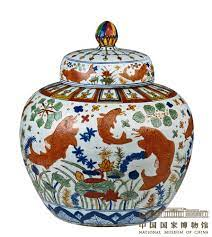

**明代工艺美术**
----------------------------------------------------------------------------------------

隆庆年间(1567年)明政府调整政策，允许民间赴海外通商，史称`隆庆开关`

> - **风格**: `端庄清新`，嘉靖`富丽华贵` 皇家主导的精致高档品  体现士大夫情趣的民间高档品 中西文化艺术交流衍生出的工艺品 装饰趋于平面化程式化较唐代的宝相花
> - **明代丝绸图案变化**：人物题材数量不断增多，花卉等植物纹压倒性优势，吉祥图案大量出现 补子出现
> - **掐丝珐琅**:景泰蓝，阿拉伯等西方国家的传统工艺品，元入中国。明产多，`宣德景泰`制作精良，品类较多。掐丝珐琅虽然经过中国文明改造，丰富明艳，富贵华丽->非士大夫文房清玩。只为宫廷
> - 明代嘉靖釉里红数量比较多 甜白釉永乐时期最盛
> - 明代建国之后在`景德镇`珠山之下设置了官窑，1402年以后称为`御器厂`
> - 宜兴紫砂出现在北宋
> - **陆子刚** 明代著名琢玉工艺家，生活在嘉靖万历年代 擅长平面减地的雕刻手法 类似于浅浮雕
> - **倪仁吉** 刺绣名家 凝香子 浙江浦江人 绣过心经 著有凝香绣谱毁于战火
> - **药斑布** 明清松江 苏州一带流行 俗称浇花布
> - **纻丝=缎**(暗花 织金 素 妆花(品格最高)) 最高级丝绸   todo 掐丝珐琅

#### 顾绣***
> 明后期 顾女绣 顾绣/露香园绣  万历名气 绣稿名家绘画/自创。针丰、劈丝极细，配色自然。全为惟妙惟肖的传达笔墨的韵味。因若干花纹形体纤小，又采用了补笔的手法  
> 顾绣名家先后有`缪氏 韩希孟 顾兰玉`。`韩希孟`由负盛名，能书善画，常绣`宋元名画`。作品被称为 `韩媛秀`  

#### 斗彩**
> </u>`釉下青花和釉上各彩`争雄斗艳。 又称逗彩。`明宣德时期`已经开始烧造。鼎`盛在成化`。斗彩这个词是`晚清`出现的 </u>  
> making method: 坯体用氧化钴描绘图案的轮廓 -> 上釉经700-800高温烧成 -> 再用颜色填涂画完 -> 再次低温二次烧成彩色  
> 特点：颜色优美协调。产品多为秀雅`小型器`。装饰主题：成化斗彩多折枝和缠枝花卉。婴戏 子母鸡 花鸟 瑞果。 famous`鸡缸杯`和`天字罐`都是酒器

#### 五彩
> `青花五彩`(下青花+上彩色) + `釉上五彩`(上彩图, 上溯宋代红绿彩瓷) 又称古彩或硬彩。  
> `青花五彩`繁荣在嘉靖万历时期。`同斗...风格`。图案满密，色彩浓艳，效果追求热烈  
> 器型大小都有，厚胎大器物特色

#### 甜白釉**
> 指的是瓷细釉润，半木光(三氧化二铝含量高)。`永乐`盛，是明官窑产量最大的颜色釉品种。  
> 特点：素面釉为主，配印划刻花，金彩饰。  
> 日用品 祭祀器 造型仿造伊斯兰

#### 德化白瓷**
> 福建德化青白瓷在宋元时代就大量外销，德化白瓷在`明中期兴起`，明后期至清早期繁荣，之后衰落
> 德化白瓷胎体紧密，釉色以乳白为主。这主要因为德化`瓷土含硅铅较高`，常见道释人物等。
> 德化白瓷多做供奉器不适实用。明外销，欧洲尤其欢迎。`何朝宗`是瓷塑高手

#### 宜兴紫砂
> `细陶器` 江苏宜兴 `铁`，可塑，细腻，`不施釉`。烧造在1090-1180的氧化气氛中进行。
> main茶壶。原味，热，陶色雅。喝茶首选。
> `begin北宋`，盛明中晚期，`供春 时大彬`。清代 陈鸣远 陈曼生 邵大亨

#### 百宝嵌
> 漆木 装饰，以`金银珠玉，珊瑚象牙，水晶玛瑙`贵材 漆木家具器皿上镶嵌图案，明清时代，`main扬州`

#### 髹饰录
> `髹漆工艺专著`。about隆庆 `黄成`  漆器原料、工具、设备和方法，原则 漆器史。
> 明末嘉兴漆工`杨明`逐条，内容丰，今`王世襄`髹饰录解说

#### 宣德炉**
> 小香炉，`黄铜质地`黄金 材质精纯，色泽美观，造型古雅，备受推崇。宣铜/宣德炉 明代时仿造品大出，清民仿铸炉古董行景观。

#### 天工开物**
> 里程碑中国科技史著作，3 18 123 宋应星 农业手工业的生产技术和经验，朴素造物观念。珍贵文献。
