**原始社会**
----------------------------------------------------------------------------------------
图腾 陶器 玉器

- ### [旧石器时代](#旧石器时代)
- ### [新石器时代](#新石器时代)
- ### [图腾*](#图腾*)
- ### [陶器*](#陶器*)
- ### [马家窑彩陶](#马家窑彩陶)
- ### [河姆渡文化](#河姆渡文化)
- ### [良渚文化](#良渚文化)
- ### [龙山文化*](#龙山文化*)
- ### [蛋壳陶***](#蛋壳陶***)
- ### [玉C龙***](#玉C龙***)
- ### [良渚玉琮**](#良渚玉琮**)
- ### [原始陶器的适用性原则*](#原始陶器的适用性原则*)
- ### [中国原始陶器的成型方法与造型之间的关系*](#中国原始陶器的成型方法与造型之间的关系*)

#### 常见考点
> - 已知`最早`的中国人类活动遗址发现在`山西芮城`的`西侯度`，距今约`180`万年。  
> - 原始社会时期的装饰题材以`抽象几何纹样`为主
> - `农耕`的出现标志着新石器时代的开始
> - `陶器`的出现标志着农耕文明的开始
> - 原始工艺美术往往带有`功利目的`，`自然崇拜`和`图腾信仰`的作用尤其突出。  
> - 已知彩陶最早地区是`黄河中游地区`
> - 古人没有软玉硬玉之分，他们认为`美石即为玉`
> - 白陶含`1.6%`氧化铁，最早距今7000年`马家浜文化`

#### 旧石器时代
> 以`打制`方式制成，最早的石工具称`旧石器`

#### 新石器时代
> 距今约8000年开始进入新石器时代, `农耕`标志着新石器时代的开始。
> 以`磨制`方式制成，`陶器`、玉器、纺织品、牙骨器、漆器日益发达。

#### 图腾*
> 图腾一词出自`印第安奥基华斯部落`的语言，意为`氏族的标志`。可以是动物植物甚至无生物  
> 母系社会中，人们认为图腾不仅不本氏族有亲缘，甚至还是氏族的祖先和保护神。因此表现图腾是礼敬，也是氏族兴旺生存无忧的保障。  
> 原始艺术中，图腾是重要的主体。例如仰韶文化半坡类型的彩陶中，鱼纹地位突出

#### 陶器*
> 以调水的黏土制坯，经`800~1000` 甚至>1000 高温烧制的器物，借助水和火焰，将松软的黏土制为坚硬的器物  
> 是人类最早的创造性劳动，其见证了人类从游牧到定居，标志着农耕文明的开始。  
> 陶器的制坯方法有按出现先后顺序有`捏塑、泥条盘筑、轮制`  
> 原始陶器的`造型`之美体现于`黑陶`，`装饰`之美体现于`彩陶`。
+ 红陶 (最早，氧化环境)
+ 灰陶 (还原坏境)
+ 彩陶** 
> 体现`装饰之美`。多为泥质`红陶`，先在坯体上以`矿物质颜料`绘制图案后烧，颜色不易褪脱，彩绘陶`先烧后画` 
> `繁荣于新石器时代中期`，彩绘题材以`几何纹为主`，如鱼纹、鸟纹、蛙纹、舞蹈人纹等。
> 中国彩陶以`黄河`流域最为发达。中游仰韶文化(河南 红黑白抽象几何 半坡鱼纹 庙底沟鸟纹)、上游马家窑文化(甘肃马家窑，达到巅峰 波浪纹同心圆)出土的彩陶最为精美，下游(大汶口)
+ 黑陶 (强还原坏境)
> 体现`造型之美`。在强还原气体的窑炉里烧成，温度高于同时的红陶和灰陶，精品为蛋壳陶  
> 多数里外皆黑，所谓黑衣陶则是在灰陶和红陶外施加黑色陶衣，说白了就是熏黑的。
> 晚期黑陶普遍采用轮制法成型，多以劲挺的造型取胜，素面器居多。造型周正、器壁均薄，漆黑光亮.
> 河姆渡文化、良渚文化、`龙山文化`，下面有介绍，代表器为猪纹黑陶锛。
+ 蛋壳陶**
> 下面有详细介绍
+ 白陶 (只对原料要求很高)
> 以白色黏土或者氧化铁仅为1.6percent的高岭土制作，故烧成后是白色的。
+ 原始瓷器
> 原始青瓷出现于商代中期，烧成温度`1200`，比陶更坚固	

#### 蛋壳陶***
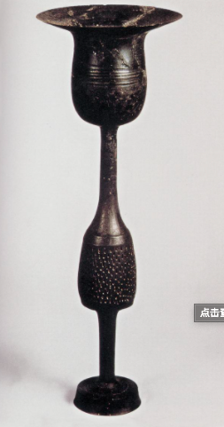

> `新石器晚期`出现的一种黑陶，以`山东龙山文化`出产的最精，代表着原始陶器的造型和工艺成就，占有者都是上层人。
> 采用`快轮成型`，__器壁薄如蛋壳，造型周正，表面打磨精细，漆黑光亮。高度一般在25cm以下，重量仅50-70g。为焙烧时不塌陷且较坚实，陶瓷壁通常上薄下厚__。
> `蛋壳黑陶高柄`：__高26.5cm，厚不足1mm，口沿薄至0.2mm，底部厚度不足1-2mm。因底座太小，易倾倒，虽精美却不适用__

#### 马家窑彩陶

	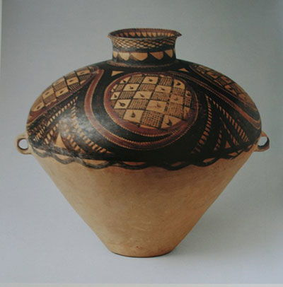
	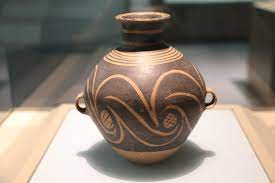
	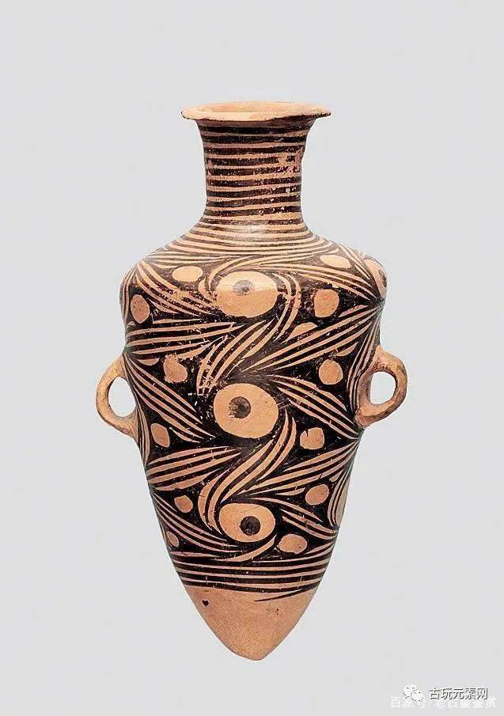

> 马家窑(黄河流域)文化彩陶众多，装饰丰富，中国`彩陶艺术致此达到巅峰`。此类彩陶器表打磨光滑，多以色浓如漆的黑彩绘画。盆锛碗内壁常有精美图案，壶瓶常在外壁通体装饰。
> 纹饰由`旋涡纹`、圆圈纹、波状纹、弦纹组成，线条生动流畅，弧线旋转造成强烈的`运动感`，堪称我国早期彩陶的杰作。花纹主要以弧线构成点缀以圆点，流畅富有节奏，人物纹数量少，其中`舞蹈人纹`备受瞩目。

#### 仰韶文化

	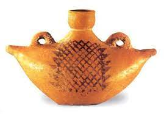
	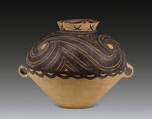
	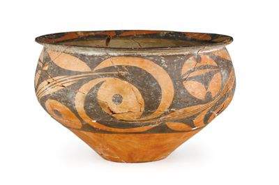
	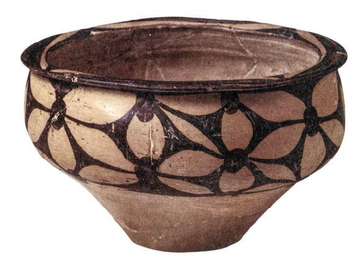
	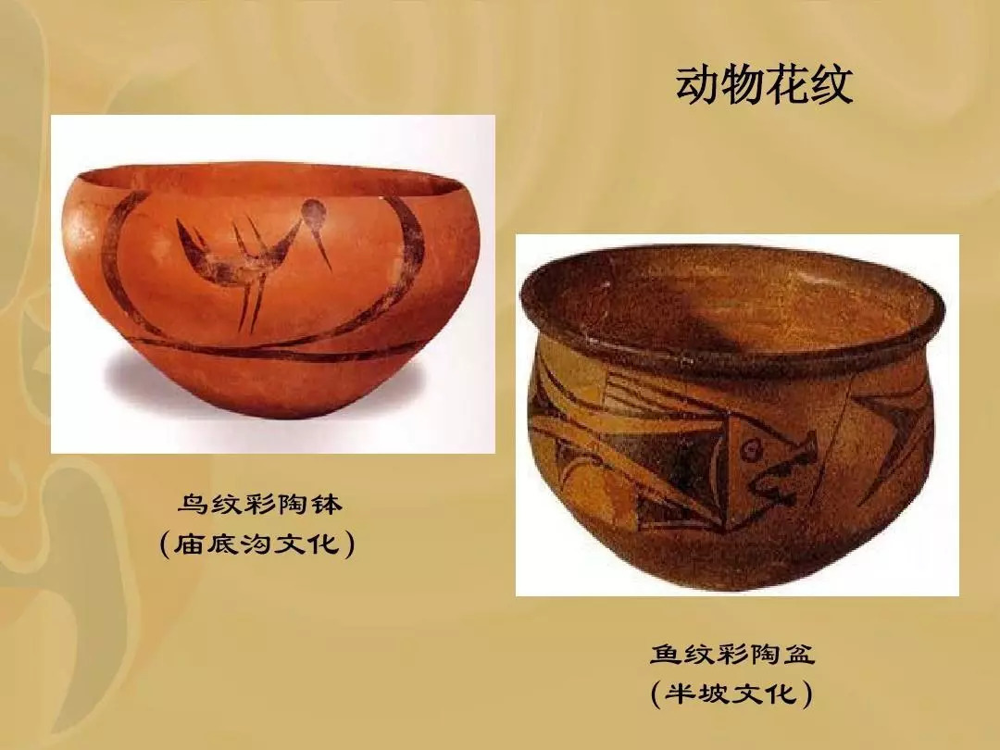

> 1921年发现于`河南仰韶村`。抽象几何形 + 少量写实动物纹
> 半坡(鱼纹) 庙底沟(鸟纹花瓣纹) 大河村(太阳纹月亮纹) 都属于仰韶文化

#### 河姆渡文化
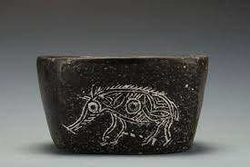

> 年代约公元前5000-前3300年，发现于`浙江余姚河姆渡` 长江流域。早期黑陶较为精美，出现了颇为写实的`猪纹`(猪纹黑陶锛)

#### 良渚文化
> 年代约公元前3300-前2200年，发现于`浙江余杭良渚`。
> `黑陶`出现在`晚期`，灰胎黑皮陶，常以快轮成型，造型规整，胎体一般比较薄，素面磨光，也伴有刻划和镂空彩绘装饰
> 良渚文化玉器特别精良出土量大。最突出的装饰当属神人兽面纹。兽面纹仍为商周青铜器主要装饰题材。

#### 龙山文化*
> 年代约公元前2500-前2000年，发现于浙江余杭良渚。分布在山东东部江苏淮北
> 黑陶晚期特别多，`普遍以快轮成型`，造型规整，胎壁薄厚均匀，工艺水平极高
> `蛋壳黑陶高柄杯`出自此文化，

#### 红山文化
> 年代约公元前4000-前3000年，发现于`内蒙古赤峰红山`后遗址。分布在内蒙古东部、辽东西部、河北北部一带，红山文化玉器颜色多样，原始玉器多为透闪石，材料主要来自辽宁，作品多为动物造型，器型多样，风格刚健质朴。

#### 玉C龙***
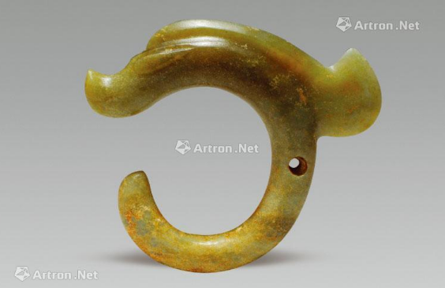

> 红山岫岩玉 由于中国人自认为是龙的传人，故`红山文化`里，玉龙最受推崇。
> 他们体型较大，高多在25cm以上，卷曲呈C形。若立置，则造型腾跃飞舞，颇有架云凌波，上天入海的气势。 被誉为华夏第一龙。
> 史论材料：中国华夏银行logo来源于中国国宝玉龙(C形龙)，玉龙是中国古代红山文化的典型器物，取材自辽宁岫岩玉，距今五千多年，被誉为华夏远古第一龙。龙是华夏文明图腾，此logo也凸显了华夏之意，而且此标志的外部造型釉毛笔书成并做图案化处理，更加简洁鲜明凸显了浓厚的中华文化底蕴。里面信用卡的造型代表了华夏银行符合当代电子化发展趋势，此标志内外形内方外圆，类似于中国古币，将华夏、银行、经济、文化、现代从视觉上融为一体。

#### 良渚玉琮**
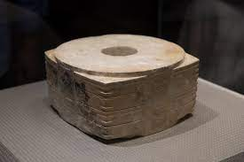

> 出产自`良渚文化`，属于透闪石，玉琮是良渚玉器的典型器，外方而中有圆形孔洞。常常用来作礼地祭祀。造型一般粗矮，鲜有细长，最重有6500g。最典型器物是琮王，形制硕大，装饰精细，常可见装饰`神人兽面纹`。

#### 原始陶器的适用性原则*
> 工艺美术讲求`适用`，陶器虽是中国原始艺术的早期样式，已经体明确现适用的原则。
> **造型**：原始陶器之中，锛碗盆罐壶瓶之类最多，造型都`和圆关系密切`。例如锛碗盆基本都是`圆的横切`，罐壶瓶大体是圆的拉长。
> **原因**：无棱角 最容易制作(将坯料放置在陶轮上，用手提拉便可制得器物) 最大的压力 耐用性 最节省材料 遮掩变形 可令人获得更大的审美愉悦 易清洗
> **尺度和比例**：陶盆口径通常在30-40cm之间，小于人的肩膀，可以使端持`省力`。`陶碗口径`大多与今日相当，多在12-20cm之间，15cm最为常见，这样的大小不仅`方便端持`，更使其容量的重量适宜。为了视觉舒适，端持方便，放置安稳，今日的碗的口径、足径与高之比大体在2：1：1，而这样的比例早已被原始陶碗所采用。
> **装饰目的**原始陶器的装饰往往带有`功利目的`，学者指出盆的装饰往往出现于内壁上部及口唇，外壁通常不加装饰，因为当时无椅登类的家具，陶器通常放置于地面，所以人无论立、蹲、坐器物总是在视平线以下，`彩陶装饰最常出现的部分恰恰最宜观赏`，一些彩陶图案因人的视线高低变化产生不同的艺术效果，这种做法就是今日的立体设计。

#### 中国原始陶器的成型方法与造型之间的关系*
- 捏塑(早期)
	> 手捏成小器物，造型一般不规整。  
- 泥条盘筑(新石器中期)
	> 较大器物，用手把黏土搓成条由下而上层层盘成器物再用泥浆抹平填沟，大多胎壁比较厚 中期以后常用
- 轮制( 快轮成形拉坯)
	> 慢轮：修整
	> 快轮：出现晚于慢轮 将坯料置于淘车旋转面的中央，旋转坯轮，用手提拉成型。黑陶就是以此手法制作所以一般比较规整，技艺最精当属蛋壳陶
	
#### 单元总结
> `功能和美观的统一`：明确的功利性质，美退居其次
> `技术对艺术的制约`：比如原始陶器捏塑适于制作小型器物，泥条盘筑适于制作较大器物，轮制可使造型规整，胎体薄厚均匀，快轮更成就了蛋壳陶。
> `形式法则的创造`：造型已有对称、均衡和对比等，甚至已经熟练运用单独、散点、二方连续等图案构成。
> `经济原则的发明`：比如多数彩陶装饰集中在视线能看到的地方，其他地方往往光素无纹。节约资源，经济适用
> 影响：兽面纹被商周青铜器所沿用，陶盆陶碗比例尺寸仍在沿用，丝绸和陶器的发明。
