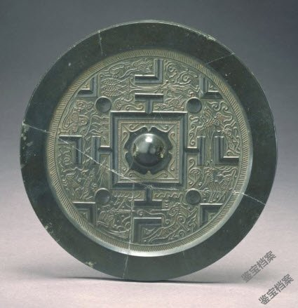
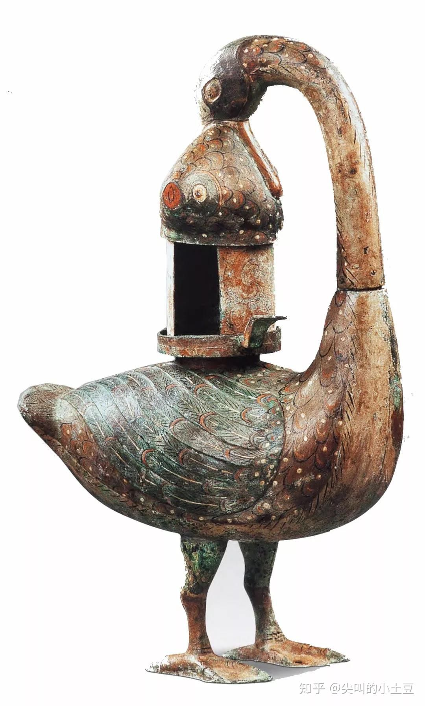
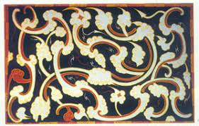
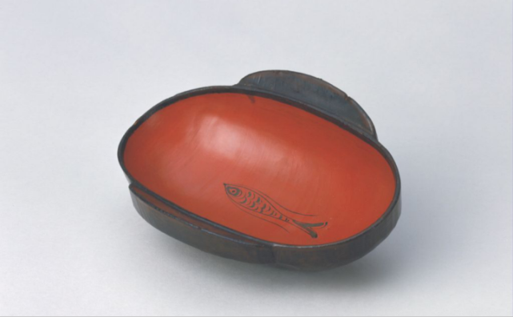

**秦汉工艺美术**
----------------------------------------------------------------------------------------
史学家把汉武帝(公元141)登基视为西汉中期的开始，章帝(公元88)故去视为东汉早期的结束

#### 常见考点
> - **风格**: 受神`灵动瑰奇` 追求纹样的神韵、形象的完美，装饰纹样或者充，流，写实/夸张，疏朗/满密，运动感，洋溢蓬勃向上。告别诡秘威严，神仙思想弥漫，长生，来世 厚葬盛 殉葬品 `丝绸`是潮流，`云气纹`是丝绸的潮流，重要纹样：四神\灵
> - **水平对比**: 官府造作西汉(马王堆) > 东汉(新疆甘肃)
> - **工美格局**: `漆器盛行` 瓷器no `青铜器颓势`无可逆转多为生活用品，灯具，熏炉，镜子，越来越简朴  
> - **漆器技法**：`彩绘，锥画，金银贴薄花(唐代发展成了金银平脱)，镶嵌` 从商代就开始有了基本
> - **汉代丝绸主要产地**：都城(长安 洛阳)，临淄，襄邑 成都 秦汉工美最大成就体现于丝绸的进步
> - 两汉漆器多为`木胎`和`布胎` 汉代为防止胎体开裂会在胎体上裱糊麻布成为`纻器`
> - 西汉动物纹多为`禽鸟`，东汉的`走兽纹`采用频繁 
> - **青铜器没落原因**: 漆器陶瓷 代替材料成本高的青铜器成为主流，汉是铜镜艺术的高峰期 社会进步，文明发展，逐渐`注重适用性，巫术衰落`，无青铜器沟显。 生活用品，器物趋向`轻便`，装饰日渐`简朴平面化`，`素面器`成为主流。灯具的发展`样多题新颖创意`。
> - **金缕玉衣**: 厚风盛，玉石不朽，精气不泄 玉衣殓服，小玉片编缀，金银铜丝缕，东汉缕的材料区别主人标志。

#### 博山炉**
> 常见`焚`，体豆，盖，雕山形。 工艺精湛`鎏金错金银`都会使用。熏香器具 + 传说，灵噙走兽，香燃，烟气`云雾缭绕`，`体神`。

#### 铜奔马
> `东汉`极为珍贵`浪`的铜 工艺精湛，造型写实。旅标 骏马昂，身，三足一足 凌空飞腾极速奔跑，体现出汉代奋，豪的精神

#### 两汉铜镜

> **汉镜高**，青铜器简朴镜纹精美。 汉镜一般不大，15cm，mini5cm，>20cm少
> 西早继承战晚，蟠螭纹，山字纹,四神纹都很常见。`规矩纹TVL`也是在西汉早期出现，武帝时期(西汉中期)开始流行，两汉之交极盛，东汉晚期依然常见。
> 铭文是汉镜的重要装饰，镜缘/中央，镜纹含义/期盼家族兴旺国盛民昌的吉祥话。

#### 规矩纹**
> TVL式花纹/博局纹。  **西汉中期出现，武帝时代开始流行，两汉之交极盛**  四神五灵/神人纹搭配，汉心，象征天地 框架

#### 四神纹***
> `青龙、白虎、朱雀、玄武`重要汉代纹样，铜镜陶瓷`瓦当` `东、西、南、北`四个方位 /  `春、秋、冬、夏`四个季节。五行盛，`麟`五灵, 汉神思邪福

#### 适合纹样***
> 中国传统的纹样方式，是具有一定外形限制的纹样，图案素材经过加工变化，组织在限定的图形以内  
> 适合纹样具有严谨与实行的艺术特点，要求纹样的变化既能体现特征，又穿插自然，形成独立的装饰。  
> 外形完整，内外巧妙结合，独立装饰

#### 釭灯***

> 釭灯是汉代流行的一种设计优秀的铜灯，往往装饰华丽，设计极富匠心 普遍设有`吸烟管`，能将烟气导入灯身，灯身通常可以`贮水`溶解烟气。灯罩的`罩板`可以开合，以调节光纤的强弱和光照的方向。  
> 釭灯的造型多样，有人形、牛鸟形甚至是炉形的变形等，或写实或夸张凝聚了艺术的美妙其中人形灯最受瞩目，长信宫灯
> 彩绘青铜雁鱼灯

#### 长信宫灯**
> `西汉`杰出铜灯。出土于`满城汉墓`。命名由来：灯神刻有长信铭文，曾为`窦`所居`长`中使用
> 造型解释：一名温顺宫女跪坐，左手持灯盘，右臂上扬袖口下垂为灯罩。烟气从灯罩进入灯身(`没说能贮水`)，降低空气污染。短柄可以调节光线强弱，头手盘底拆洗。
> 总结特点：`通体鎏金`，适用美观，雕塑艺术的审美+工艺设计的功能性
> 启发和影响：功能和形式的统一，优雅艺术形式完全为功能服务。体现科学性，环保性，交互，创意性, 实用性，人性化 这都是当代设计所考虑的因素。

#### 云气纹***

> 汉工美装饰云气纹代表性 成熟不晚于战国，盛两汉 线形舒卷起伏，动感，分割统一。少单，+ 瑞兽灵噙/动物纹云虚纹，气热缭漫，满，飘，动

#### 素纱褝衣
> 是汉纱的杰出代表作品，出自`马王堆一号墓`，最早、完整、最精、轻，国一，`湖馆`。  
> 这件褝衣结构精密细致，孔眼均齐清晰，烟`49g`。不靠down经纬 丝线纤细，现代仿造复杂，代表了`西汉`初期养蚕、缫丝、织造工艺的`最高水平`。

#### 丝绸图案

| 朝代 | 颜色 | 主题 | 构图 |
| :----  | :----: |:----: | :----: |
| 西汉 | 配色单纯 | 禽鸟 夸张变形 数量略少 | 散点构图较多 不能确定边界 |
| 东汉 | 色彩浓重 色彩丰富 浓重 注重对比 | 走兽纹频繁 | 四方连续式构图，题材繁满紧凑 |

> 西汉的丝绸图案以马王堆的出土物为代表，构图满密，大量采用`动物`题材是汉代丝绸图案的重要现象，除了绢地茱萸纹，`植物纹真的特别特别少`。  自由(充盈天地) 变幻(抽象) 运动(昂扬向上)
> 汉代丝绸图案中`几何纹`最多，`菱纹`是典型，菱纹一般以大菱纹居中，两侧各套一个小菱纹，形象类似耳杯。包括东汉在内，植物纹更少，常见多种动物纹再配上云气组成的云虚纹。
> `西`汉丝织品图案常取用`散点式构图`，而到`东`汉则多取`四方连续`，题材繁满紧凑，动物形象一般夸张变形，强调`动态`，极富生命力。东汉的锦面上通常织出吉祥语词 较呆板规整。
> 对鸟菱纹绮地乘云绣 汉代纹样集合 汉代纹样集合2 印花敷彩纱局部 绢地茱萸纹 罗地信期绣

#### 两汉漆器的特点*

> `西汉`漆器把青铜器比下去了`达到了巅峰`成为主要饮食器具，出现很多高档漆器。东汉中期以后，也许和陶瓷发展的挤压有关，漆器盛极而衰。  
> 两汉漆器`种类丰富，造型百变`。举例：杯具盒和多子妆盒的介绍。  
> `制作方法`：木胎 布胎 泥胎 `麻布胎`(又称纻器:西汉中期开始成为高档漆器普遍制胎方法)
> `技法和题材`：`彩绘，锥画，金银贴薄花(唐代发展成了金银平脱)，镶嵌`。彩绘仍然是主要的装饰手法，装饰的主要题材是云气纹，常以云虚纹的形式出现，强调动态，纤细轻佻飘逸神仙  
> 一杯卷用百人之力，一屏风就万人之功，高档漆器成了上层社会的主要饮食器具

#### 多子奁盒***
> 可能战国酒器演化，多子奁盒在较大的容器内放置造型各异，大小不一的若干小容器。`节省空间`，携带方便，清洁卫生，极其适用。是汉代设计功能突出的漆器品种

#### 瓷器***
> 原始瓷器出现`商代中期`，瓷器诞生于`东汉`，最早发明与中国，宋代为高峰，中国陶瓷文化的核心
> 以瓷石+高岭土为坯，上釉后，1200以上高温烧制。胎体紧密坚实，扣击声音清脆,至今仍是餐饮器的主要类型 诞生于东汉 浙江上虞地区烧造最盛，被称为越窑 
