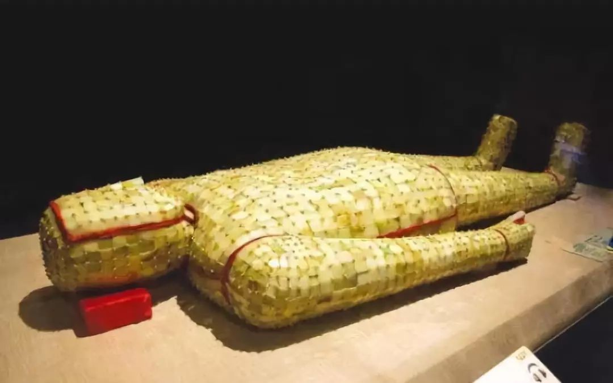

**秦汉工艺美术**
----------------------------------------------------------------------------------------
427年好久 丝绸 青铜灯具 香炉 漆器 玉器

史学家把汉武帝(公元141)登基视为西汉中期的开始，章帝(公元88)故去视为东汉早期的结束

| 朝代 | 朝代时间 | 社会性质 |
| :----  | :----: |:----: |
| 秦 | 公元前221年 - 前206年 | 封建社会 |
| 西汉 | 公元前206年 - 公元8年 | 封建社会 |
| 新莽 | 公元9年 - 25年 | 封建社会 |
| 东汉 | 公元25年 - 220年 | 封建社会 |

- ### [秦汉工艺美术](#秦汉工艺美术)
- ### [青铜器没落原因](#青铜器没落原因)	
- ### [博山炉**](#博山炉**)	
- ### [铜奔马](#铜奔马)	
- ### [两汉铜镜](#两汉铜镜)	
- ### [规矩纹](#规矩纹)	
- ### [四神纹*](#四神纹*)	
- ### [适合纹样*](#适合纹样*)	
- ### [釭灯](#釭灯)	
- ### [长信宫灯](#长信宫灯)	
- ### [云气纹***](#云气纹***)	
- ### [素纱褝衣](#素纱褝衣)	
- ### [丝绸图案](#丝绸图案)	
- ### [多子奁盒*](#多子奁盒*)	
- ### [瓷器](#瓷器)	
- ### [汉代装饰艺术风格](#汉代装饰艺术风格)
- ### [两汉丝绸](#两汉丝绸)	
- ### [两汉漆器的特点](#两汉漆器的特点)	

#### 常见考点
> - **风格**: `灵动瑰奇` 或写实或夸张，或疏朗或满密，但都充满了运动感，洋溢着蓬勃向上的力量。彻底告别了和对诡秘威严的鬼神世界的向往，`神仙思想弥漫`，人们期盼长生，热烈追求来世的幸福所以`厚葬之风盛行`殉葬品十分精美。
> - **汉武帝的两个举措**: 对工美影响深远：1. 独尊儒术，罢黜百家 2. 开通丝绸之路
> - **水平对比**: 官府造作西汉(马王堆) > 东汉(新疆甘肃)
> - **工美格局**: `漆器盛行` 瓷器水平不行 `青铜器颓势`无可逆转多为生活用品，灯具，熏炉，镜子，越来越简朴  
> - **漆器技法**：`彩绘，锥画，金银贴薄花(唐代发展成了金银平脱)，镶嵌` 从商代就开始有了基本
> - **汉代丝绸主要产地**：都城(长安 洛阳)，临淄，襄邑 成都
> - 浪漫瑰奇的`楚文化`对汉代时代风格的形成发挥了重要作用  
> - 两汉漆器多为`木胎`和`布胎` 汉代为防止胎体开裂会在胎体上裱糊麻布成为`纻器`
> - 西汉动物纹多为`禽鸟`，东汉的`走兽纹`采用频繁 

#### 青铜器没落原因
> `漆器的繁荣+陶瓷的发展` 渐渐代替材料难得，且铸造成本高的青铜器成为主流，但是无法取代是铜镜，两汉仍然是`铜镜艺术的高峰期`  
> 社会在进步，人们更关注文明的发展，逐渐`注重适用性，巫术衰落`，无须再借助青铜器沟通天地神人，旧制度瓦解，也不必以青铜器显示权威。  
> 青铜器主要成为生活用品，器物趋向`轻便`，装饰日渐`简朴`，`素面器`成为主流。
> 适用性原则既反映于平面化的装饰，还表现在器型的合宜和器体的轻薄，不过`灯具的发展`情形却不相同，样式很多，`题材新颖富有创意`。

#### 博山炉**

> 常见`焚香器具`，炉体呈豆形，盖高而尖，雕镂成山形。
> 工艺精湛`鎏金错金银`都会使用。是熏香器具和海上仙山传说结合的产物，中间装饰有灵噙走兽，香料燃烧，烟气冒出似仙境`云雾缭绕`，`体现神仙思想`。

#### 铜奔马

> `东汉`时期一件极为珍贵的`浪漫主义情怀`的青铜工艺品 工艺精湛，`造型写实`。现在为中国旅游标志
> 骏马昂首嘶鸣，身形矫健，三足腾空，一足踏飞燕着地。表现了骏马凌空飞腾极速奔跑的雄姿，体现出汉代奋发向上，豪迈进取的精神

#### 两汉铜镜

	
	
	

> **两汉仍是铜镜艺术的高峰期**，青铜器普遍走向简朴，镜纹却愈加丰富精美。
> 汉镜一般不大，通常直径在15厘米上下，小的不足5cm，20cm以上的很少见。
> 西汉早期继承了战国晚期铜镜的特点，蟠螭纹，山字纹,四神纹都很常见。`规矩纹TVL`也是在西汉早期出现，武帝时期(西汉中期)开始流行，两汉之交极盛，东汉晚期依然常见。
> 铭文是汉镜的重要装饰，即可出现在镜缘，也能铸造在中央，可以解说镜纹含义，也可能是期盼家族兴旺国盛民昌的吉祥话。
> 东汉四神博局纹铜镜 TVL式花纹铜镜

#### 规矩纹
> `规矩纹`即`TVL式花纹`，又称博局纹。  
> **西汉中期出现，武帝时代开始流行，两汉之交极盛**  
> 通常和四神五灵或者神人纹搭配，在汉人心中，规矩纹组成了一个`象征天地`图案。代表了天地的框架

#### 四神纹*

> 以`青龙、白虎、朱雀、玄武`组成的四神或四灵是重要的汉代纹样，出现于铜镜，在陶瓷特别是`瓦当`上应用甚广。  
> 象征着(顺序分先后) `东、西、南、北`四个方位或者 `春、秋、冬、夏`四个季节。汉代五行说盛行，因此额外加`麟`(独角兽)组成五灵, 体现了汉人神仙思想和辟邪求福

#### 适合纹样
> 中国传统的纹样方式，是具有一定外形限制的纹样，图案素材经过加工变化，组织在限定的图形以内
> 适合纹样具有严谨与实行的艺术特点，要求纹样的变化既能体现特征，又穿插自然，形成独立的装饰。
> 外形完整，内外巧妙结合，独立装饰

#### 釭灯

> 汉代灯的样式各种各样，装饰异常丰富几乎所有技法都被采用过，但是考究的`铜灯只在宫廷使用`，百姓灯具多为陶瓷  
> 其中釭灯往往装饰华丽，设计极具匠心。他们普遍设有`吸烟管`，能将烟气导入灯身，灯身通常可以`贮水`溶解烟气。灯罩的`罩板`可以开合，以调节光纤的强弱和光照的方向。
> 釭灯的造型多样，有人形、牛鸟形甚至是炉形的变形等，或写实或夸张凝聚了艺术的美妙其中人形灯最受瞩目，比如`长信宫灯`如下
> 灯具成就：`功能合理，结构科学，造型生动，装饰富丽`
> 彩绘青铜雁鱼灯

#### 长信宫灯**

> `西汉`杰出铜灯。出土于`满城汉墓`。命名由来：灯神刻有长信铭文，曾为`窦皇后`所居`长信宫`中使用
> 造型解释：一名温顺宫女跪坐，左手持灯盘，右臂上扬袖口下垂为灯罩。烟气从灯罩进入灯身(`没说能贮水`)，降低空气污染。短柄可以调节光线强弱，头部 手臂 灯盘 底座都可以拆卸擦洗。
> 总结特点：`通体鎏金`，适用美观，雕塑艺术的审美+工艺设计的功能性
> 启发和影响：功能和形式的统一，优雅艺术形式完全为功能服务。体现科学性，人性化，环保性，实用性，交互，少污染，创意性, 这都是当代设计所考虑的因素。

#### 云气纹***

> 汉代工艺美术的装饰中，云气纹最具代表性(神仙思想嘛)，成熟不晚于战国，大盛于两汉
> 它以线形的舒卷起伏为主要的表现形式，增加图案动感，分割画面又能产生统一。
> `很少单独出现`，往往和瑞兽灵噙或动物纹组合出现(又称云虚纹)，气氛热烈，缭绕漫卷，布局满密，姿态飘逸，动感

#### 素纱褝衣
> 是汉纱的杰出代表作品，出自`马王堆一号墓`，是世界上现存年代最早、保存最完整、制作工艺最精、最轻薄的一件衣服，国家一级文物，藏于`湖南省博物馆`。  
> 这件褝衣结构精密细致，孔眼均齐清晰，而且轻薄如烟重仅`49g`。如此轻薄靠的不是降低经纬密度，仅凭丝线的纤细，哪怕现代工艺仿造起来也相当复杂，代表了`西汉`初期养蚕、缫丝、织造工艺的`最高水平`。
> 汉人独爱轻薄的丝绸，汗末蔡邕指责“帛必薄细”的现象来批评当世的浮靡。

#### 两汉丝绸
> 丝绸是个统称，起源于`新石器时代`，泛指以蚕丝织造的各类纺织品。在中国丝绸地位极高，生产遍布城乡，与国计民生息息相关  
> 丝绸吸湿透气，是高级服装的主要面料，装饰内容和面料都体现着等级制度，丝绸纹样极具展示型，引领着时代装饰的潮流  
> **秦汉工美最大成就体现于丝绸的进步**，从此，丝绸成了中国最重要的工美品类
> 劝奖农桑令汉代丝绸产量大增，不仅官府织造发达，民间生产也迅速发展  
> 西汉丝绸主要出土于长沙马王堆汉墓，东汉织物主要出土于新疆和甘肃，普遍带有异域色彩。  
> 锦长期是声誉最隆的丝绸品种，其装饰也往往是丝绸乃至工美的代表，四川成都的蜀锦驰名中外。  
> 染色也是制作织物的重要步骤，`色彩关乎礼制`，汉代染色基本靠植物染料和矿物染料  
> `丝绸标志着时代的潮流`，其装饰荟萃着艺术的精华，对其他工美门类影响巨大。

#### 丝绸图案

| 朝代 | 颜色 | 主题 | 构图 |
| :----  | :----: |:----: | :----: |
| 西汉 | 配色单纯 | 禽鸟 夸张变形 数量略少 | 散点构图较多 不能确定边界 |
| 东汉 | 色彩浓重 色彩丰富 浓重 注重对比 | 走兽纹频繁 | 四方连续式构图，题材繁满紧凑 |

	
	
	
	
	
	

> 西汉的丝绸图案以马王堆的出土物为代表，构图满密，大量采用`动物`题材是汉代丝绸图案的重要现象，除了绢地茱萸纹，`植物纹真的特别特别少`。  自由(充盈天地) 变幻(抽象) 运动(昂扬向上)
> 汉代丝绸图案中`几何纹`最多，`菱纹`是典型，菱纹一般以大菱纹居中，两侧各套一个小菱纹，形象类似耳杯。包括东汉在内，植物纹更少，常见多种动物纹再配上云气组成的云虚纹。
> `西`汉丝织品图案常取用`散点式构图`，而到`东`汉则多取`四方连续`，题材繁满紧凑，动物形象一般夸张变形，强调`动态`，极富生命力。东汉的锦面上通常织出吉祥语词 较呆板规整。
> 对鸟菱纹绮地乘云绣 汉代纹样集合 汉代纹样集合2 印花敷彩纱局部 绢地茱萸纹 罗地信期绣

#### 两汉漆器的特点*

> `西汉`漆器把青铜器比下去了`达到了巅峰`成为主要饮食器具，出现很多高档漆器。东汉中期以后，也许和陶瓷发展的挤压有关，漆器盛极而衰。  
> 两汉漆器`种类丰富，造型百变`。举例：杯具盒和多子妆盒的介绍。  
> `制作方法`：木胎 布胎 泥胎 `麻布胎`(又称纻器:西汉中期开始成为高档漆器普遍制胎方法)
> `技法和题材`：`彩绘，锥画，金银贴薄花(唐代发展成了金银平脱)，镶嵌`。彩绘仍然是主要的装饰手法，装饰的主要题材是云气纹，常以云虚纹的形式出现，强调动态，纤细轻佻飘逸神仙  
> 一杯卷用百人之力，一屏风就万人之功，高档漆器成了上层社会的主要饮食器具

#### 多子奁盒*

> 战国时期酒器演化而来，多子奁盒在较大的容器内放置造型各异，大小不一的若干小盒。`节省空间`，携带方便，清洁卫生，极其适用。
> 是汉代设计功能突出的漆器品种，典型器如多子妆奁和杯具盒。

#### 瓷器*
> 原始瓷器出现`商代中期`，瓷器诞生于`东汉`，最早发明与中国，宋代为高峰，中国陶瓷文化的核心
> 以瓷石+高岭土为坯，上釉后，1300左右高温烧制。胎体紧密坚实，扣击声音清脆, 诞生于`东汉浙江上虞地区`, 至今仍是餐饮器的主要类型
> `浙江`是东汉瓷器的主要产区，这一代的陶瓷窑厂被称为`越窑`。刻划堆贴堆塑是常规的装饰手法。

#### 汉代装饰艺术风格
> 1. 受神仙思想的影响，汉代装饰艺术特征: `灵动贵气`是汉代服装装饰艺术的`典型特征`。追求纹样的神韵、形象的完美，装饰纹样或者充盈天地，流管自然，或写实或夸张，或疏朗或满密，但都充满了运动感，洋溢着蓬勃向上的力量
> 2. `丝绸`是潮流，`云气纹`是丝绸的潮流，云气纹名词解释
> 3. 汉代`重要纹样`：四神\灵(青龙、白虎、朱雀、玄武) 经常出现在铜镜、陶瓷、瓦当(尤其) `神仙思想 辟邪求福`

#### 两汉玉器
> 独尊儒术对玉器的发展影响重大，孔子将玉赋予了极高的道德含义。
> 和田玉最被看重，礼仪用玉衰落明显。

#### 金缕玉衣

> 两汉厚葬之风盛行，而且汉人相信玉石可令尸骨不朽，精气不泄
> 玉衣是两汉帝后亲贵的殓服，以小玉片编缀而成，编缀玉衣的有金银铜丝缕，到了东汉，缕的材料成了区别主人神人的标志。