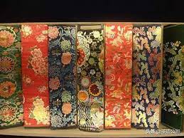

**清代工艺美术**
----------------------------------------------------------------------------------------

> - 满洲人(农耕民族)建立 `康熙雍正乾隆`三朝是清王朝的鼎盛时期和工美的`巅峰` 乾隆晚期发生转折走向下坡 总结：<u>前期艺术技术并重，后期技术大于艺术</u>
> - **民间制作**: `民间总体规模 >> 官府`。清民间丝织业繁荣，`江宁苏州杭州`是全国的丝织中心，其中江宁精品丝绸最好
> - **创新**: 康熙晚期创造了`粉彩 珐琅彩`，都是`釉上彩` 清代家具样式丰富，如`多宝格，暖椅`都是新创
> - **装饰特点**: `绘画性装饰已经慢无节制`，重复滥用，构图琐碎繁缛，面貌浮夸，缺乏创造力。吉祥图案就是典型。
> - **四大名绣**: 粤绣、蜀绣、湘绣和苏绣
> - **粤绣**：指珠`江三角洲地区`为主的刺绣流派，`畅销欧美`。绣线加入`孔雀羽毛或金线`，图案多为吉庆题材，构图满密，受西方`油画`影响，写实重`明暗`，绣工常为`男子`。
> - **蜀绣**：`成都`。以细密平整的`短针绣`见长。民间喜庆色彩浓郁，花纹集中，颜色艳丽明快，`因耐用畅销国内`。
> - **湘绣**：`长沙`。`光细不起毛`。花纹写实层次感强，前期以日用品为主，后期欣赏品地位更重要。
> - **苏绣**: `苏州`，`部分商品供奉内廷`。`深受顾绣`的影响，以`套针`为主，配色和谐自然，题材多为花鸟鲽鱼，常以题材的谐音或寓意表现吉祥主题。`丁佩`和`沈寿`，沈寿自幼习绣，绣法`吸取油画之长`注重明暗，透视效果，立体感强。她的刺绣享有崇高的`国际声誉`，`其意大利帝后像`，耶稣像获得国际大奖。`沈寿`晚年病中口述，张骞笔录，整理出`雪宧绣谱`。
> - **雪宧绣谱**: `沈寿`口，张骞笔。`完整系统的刺绣专著`，备述刺绣的工具，技艺，法则，对中国刺绣艺术，后苏绣受沈寿影响最大。
> - 清代丝绸代表是缎，重锦非常名贵 厚重精致，有金线
> - 晚清刻丝多有创新：三蓝刻丝和水墨刻丝
> - 瓷母可能是由唐英负责烧制的，郎世宁没参加圆明园建设
> - 以氧化铁为呈色剂的低温黄釉是明代的发明 已知最早烧造在宣德时代。
> - TODO: 中国白瓷演进没看 明清时期釉上彩没背 吉祥图案待补充

#### 云锦

> 元代就有 `700年历史` `皇家专供`  晚清云锦`江宁` 
> `库缎` `库锦` `妆花`三大品种。`妆花`是云锦的代表 十几色几十色，色彩最富丽，作品最华艳，其中在满金地上织出彩色图案的`金宝地`尤其富丽华贵。
> 云锦一般紧密厚重，图案庄重严谨，纹样形象程式化，色彩浓艳，讲究对比，常大量使用金线，风格庄严饱满。

#### 清代丝绸图案
> 清代丝绸图案题材及其丰富，形象趋于琐碎，`构图趋于满密`。`花纹形象写实`，<u>对逼肖的追求压倒了神韵的传达。</u>  
> 清代装饰特别讲究寓意吉祥，`图必有意，意必吉祥`的说法虽然偏颇，但吉祥图案比例远超以往。尽管寓意美好，气氛热烈，但是频繁使用还是`略显俗套浅薄`，折损清代装饰的艺术格调  
> 清代`丝绸团花极为活跃`，或大或小，题材为花卉蜂蝶禽鸟等，结构紧凑，色彩喜庆浓郁，是最有清代特色的图案组织形式。

#### 唐英
> 75，`乾隆督陶官`，奉天人。不通 -> 钻研工匠同吃同住日夜观察学习 -> 时间长，成就高
> 深谙胎料火性，精通烧造，又有多种创新，能集古代瓷艺之大成。所著 `陶成记事碑` `陶冶图说`等是研究古代陶瓷的珍贵文献。

#### 清代青花
> 不管官窑民窑青花`产量最高`。其中`康熙`青花名声`最盛`，优秀的康熙青花色阶丰富，呈色鲜亮，层次颇多，犹如绘画中的墨分五彩，题材丰富表达细腻生动，有青花五彩的美誉。
> 康熙民窑题材尤其丰富，`多取材自小说，戏曲`。官窑相对单纯，基本是`龙凤或花卉岁寒三友`等。康熙民窑常有如凤尾尊，观音尊等大型作品，但官窑造型古板，多为盘碗瓶之类。
> 康熙官窑的釉里红不少，因为釉里红的烧造温度极难把控，可见当时烧造水平之高。康熙之后青花虽依然流行，但艺术创造力下降，水平较高的雍正和乾隆也难以和康熙时期比拟。

#### 粉彩
> 粉彩受`珐琅彩`影响的`釉上彩`品种，创始于康熙晚期，雍乾时期极盛。`雍正时期粉彩取代了五彩`，成为烧造最多的釉上彩品种，乾隆以后走向没落。
> 粉彩题材丰富，`花卉和花鸟`是粉彩最受推崇的题材，清绮优雅，艺术造诣很高，洁白细腻的胎体烘托了器物的柔秀。
> 粉彩和五彩差异明显，比如`粉彩以油调色`而`五彩以水调色`，烘烤温度也低于五彩，其中最主要的差异是粉彩注重表现题材的阴阳向背，写实性强。而五彩则是单线平涂，层次感较差，较为抽象。

#### 珐琅彩
> 珐琅彩`初创于康熙晚期`，是以`富含硼的`珐琅料在瓷胎上绘画图案，然后入窑烘烤图案的瓷器，多为盘碗杯壶小型器。
> 基本是康雍乾烧造的御用`釉上彩`器物，产量不高，少数用于赏赐，名贵异常。民间俗称`古月轩`。多由`养心殿造办处`在`景德镇白瓷`上完成彩绘和烘烤，`宫廷艺术气息浓厚`。
> 珐琅彩与从西欧传入的铜胎画珐琅大有渊源，不过是将其技法移植与瓷器。雍正时期发展壮大，宫廷已能自制珐琅彩。但乾隆中期以后转向衰落，这也许与粉彩的繁荣有关。

#### 大禹治水图玉山
> `乾隆年间`制作，耗时十余年，折白银上万两，是中国玉器宝库中用料(新疆弥勒塔山的青玉制成)最宏，运路最长，花时最久，费用最昂，雕琢最精，器形最巨，气魄最大的玉雕工艺品。`高2米多`，表现大禹率领人民开山治水的宏大场面。以同名`宋画`为蓝本，<u>`在宫中设计，扬州碾琢，后运回北京刻诗印`</u>
> 由于制作此玉山耗时太久，造价过高乾隆帝也深觉痛心，在玉山背面刻诗告诫后世不可再这样破费造作。

#### 桐荫仕女图玉饰
> 清代桐荫仕女图玉饰以一块取过玉碗的余料巧作为一处江南庭院的精致。
> 门瓦微垂，中间有圆月形门，门半开，内外各立一长衣少女，门外少女手持如意，门内少女双手捧盒，二人透过门缝互相观望
> 玉工利用玉料外面橘黄色和白色的皮子，琢制成庭院四周的植被和假石，描绘出一幅迷人的安谧景色。
