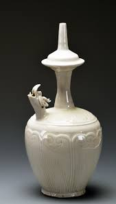
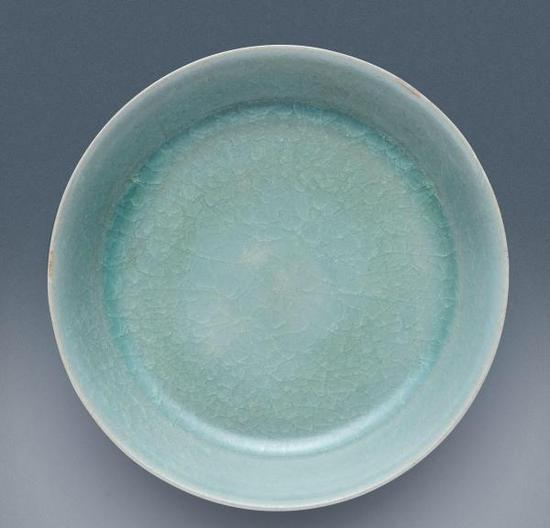
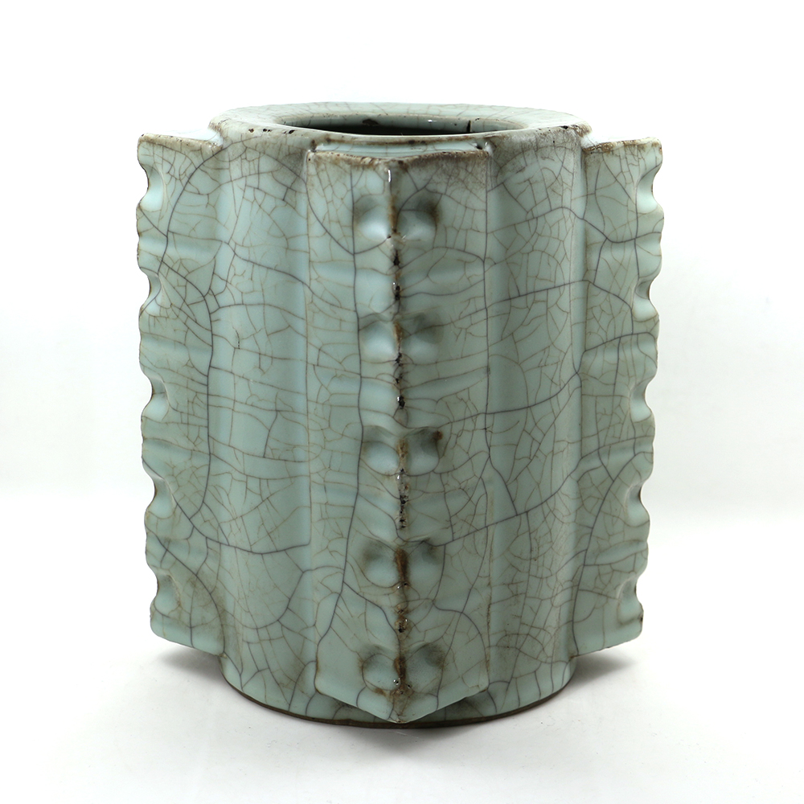
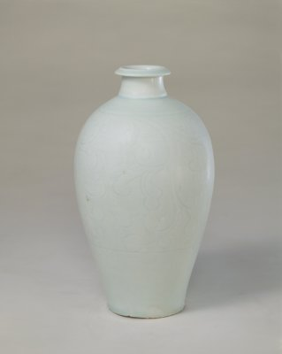
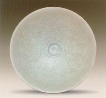
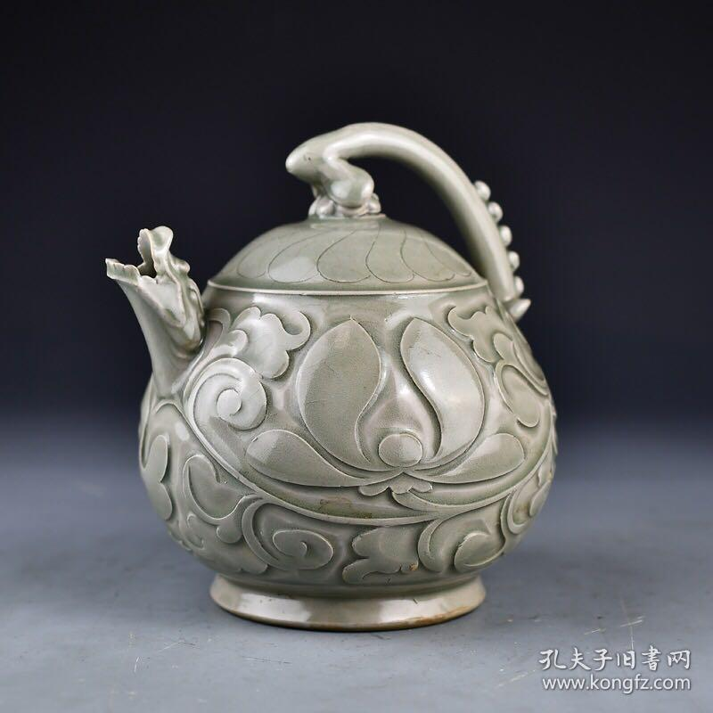
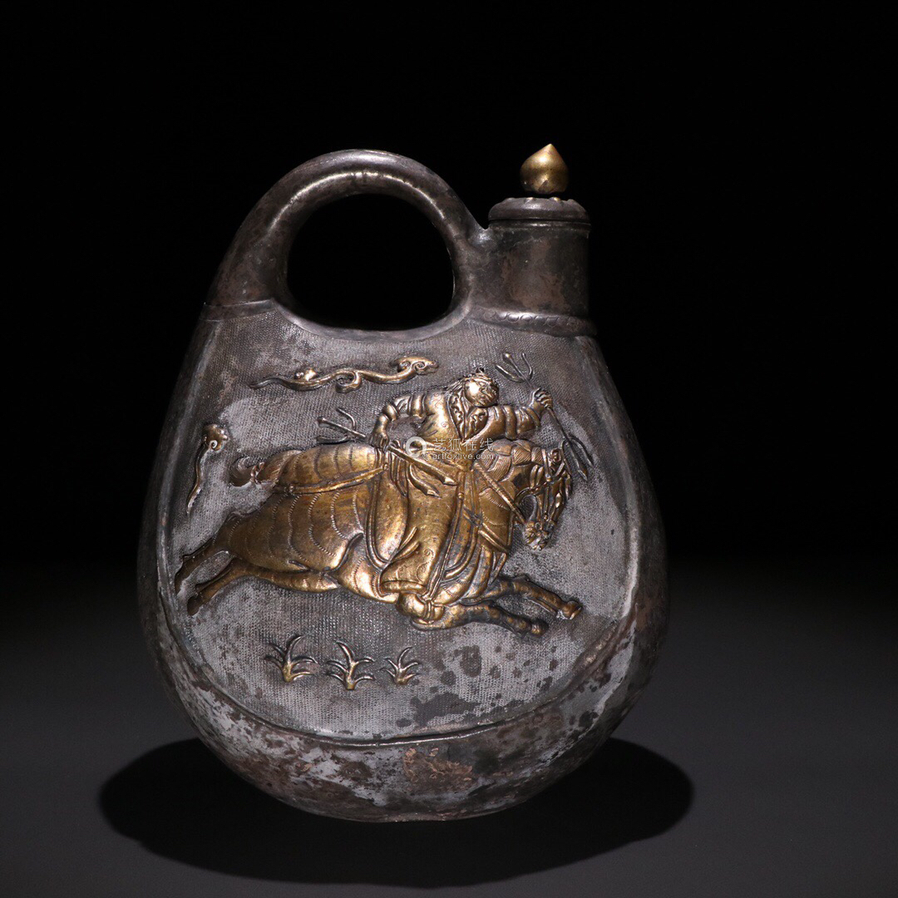

**辽宋夏金工艺美术** 
----------------------------------------------------------------------------------------
定汝均磁耀 官窑景德镇窑龙泉窑建窑吉 缂丝 吉祥图案 雕漆 戗金银

#### 常见考点
> - **背景**: 中国古代`两宋社会文化素质最高` `经济非常发达` `抑武修文`，这项国策对工美艺术影响重大。
> **风格**：`典雅优美` 
> - **陶瓷**：是中国陶瓷艺术的`黄金时代` **北方(定窑 汝窑 均窑 磁州窑 耀州窑) 南方(南宋官窑 景德镇窑 龙泉窑 建窑 吉州窑)**，宋代`沿用二八抽分制`。
> - **漆器**：`雕漆`
> - **宋工美潮流**：`绘画性装饰`(夏商周铜器，宋徽宗，文化现象，统治阶层引导，士大夫阶层拥护，百姓也为之效仿) `仿古制作`。知画 士大夫标志。
> - **宋代首创**: `石灰碱釉` `覆烧法`
> - 辽代属于游牧民族尚白，`白釉`的风靡和`宜携带物`的盛行是辽代陶瓷的特点。
> - **瓷窑系统**: 白瓷(定窑) 青瓷(汝窑、官窑、均窑、龙泉窑、景德镇) 黑瓷(建窑) 民间瓷窑(磁州窑，吉州窑)
> - **中央性官府丝织作坊**: 绫锦院 成都锦院 文绣院
> - **戗金银**: from`西汉填金针刻` 1.漆地上刻划图案 2.刻纹内上漆 3.填以金银箔，效果富丽。
> - **两宋金银器**: 造型特征`仿生` 模仿`花卉瓜果形态` -> 北宋(唐代联系甚多)，南宋(小巧，造型`仿造梅荷桃`等，仿古常见) 装饰题材: 花卉和瓜果题材most，缠枝折枝团花
> - **宋代丝绸图案特点**:  花头的不同：两宋罗纱绫的`装饰题材以花卉为主`，花头多取`侧面`，清新柔婉，`最为写实`。构图常用`缠枝和折枝`。这与唐多取正面的花头和团花表现出的枝肥叶壮端庄饱满的风韵迥异绝殊 `北宋`时，`构图较满密`，偶见人物纹也有少量的动物纹和几何纹。`南宋`时`构图疏松`，`未见人物纹`，鸟兽纹几何纹减少，`花卉的主导`地位更突出，图案形象更优美。 宋代丝绸图案里`天下乐`和`一年景`饶有意味。**吉祥图案渐渐成为传统**

#### 刻丝**
> 克丝 革丝 `唐代`就有 `入宋发扬光大` 文思院。 通经断纬，古埃及 虽繁复，色彩支持性强，宋书画，惟妙惟肖。  
> 游牧民族实用品，中原人欣赏品，士大夫光辉典范。`朱克柔，沈子蕃`

#### 吉祥图案
> 有几种寓意美好的题材组成 含义 = 谐音 + 寓意  
> 宋世俗文化，美好寓意题材图案begin，北宋中期的灯笼锦开风气之先河，用节日里的典型器物来暗喻时节。北宋后期的一年景则将四时节物和花卉汇聚一堂  
> 明清时期up `图必有意，意必吉祥` 固寓意好，老`庸俗浅薄`

#### 辽代春水秋山玉
> 统治`契丹族`，有`渔猎活动`，春秋的渔猎尤其频繁 from契丹四时奈钵。春季天鹅，近水，春水。秋季捕鹿，虎 秋山 辽玉屡作动物形象，狩猎的对象。

#### 石灰碱釉
> 高温黏，不易流动，多次上釉，厚釉层 玉的质感 釉面光泽柔和，降低了烟熏和裂釉的倾向

#### 覆烧法
> 定工 北宋中期 发明，垫圈匣钵，扣烧，高度五或六分之一。  
> **省空间，低成本，效仿，总产量。**  欠缺，器口毛涩 元中期后渐少

| 窑厂 | 窑地址 | 烧造起始盛衰 | 烧造工艺 | 釉色 | 造型 | 装饰 | 评价和影响 |
| :-- | :---: | :---: | :---: | :---: | :---: | :---: | :--- |
| 定窑 | 河北曲阳 | 上溯晚唐，入北宋极盛，前期为皇家烧造贡窑 | 覆烧法 | 烧造白瓷著称 | 规整 | 早期多为简洁秀雅的刻花，中晚期流行清晰满密的印花 | 定窑工匠发明了覆烧法，覆烧法名词解释，影响甚广，后世的一些窑厂常以为它为楷模 |
| 汝窑 | 河南省宝丰清凉寺 | 烧造于北宋晚期 | 支烧法 | 釉色天青 胎呈香灰色 | 造型单纯典雅小器型居多 | 釉面带有细碎的开片蟹爪纹，素面器居多 | 汝窑以开启陶瓷新风而地位突出，宋代五大名窑之首。汝窑将陶瓷之美荟萃与优雅的造型和如玉的釉质，是宋元明清以来宫廷汝瓷用器 |
| 宋代官窑 | 河南开封和浙江杭州一带 | 烧造于北宋末年 | 小器物支烧法大器物垫烧法 | 以青瓷为主，釉色多为粉青色也有青灰色青黄色 | 造型常仿古青铜器或玉器 | 质感如玉普遍带有疏密不一的开片，紫口铁足 | 以宫廷用瓷和陈设瓷为主 |
| 龙泉窑 | 浙江龙泉 | 历史可上溯至南朝，入南宋昌盛。 | 石灰碱釉 | 釉色有粉青 豆青 梅子青等 | 常仿古 | 堆贴浮雕素面流行 | :--- |

#### 定窑***

> `河北曲阳`  `上溯到晚唐入北宋盛` famous`乳白瓷`，黑釉绿釉，白瓷胎细釉润，前期为皇家烧造贡瓷。  
> 覆烧法，名词解释 定窑器形规整，早期简洁秀雅`刻划花`，中晚期满密清晰印花装饰

#### 汝窑***

> `河南省宝丰清凉寺` begin`北宋晚期` `取代定窑`以盛誉极高的精品`入贡`  
> 釉`天青 偏兰翠色` 胎香灰色 玛瑙末。`小细碎`蟹爪纹。原缺陷，后成为人为的艺术装饰意趣。  
> 汝窑以开启陶瓷新风而地位突出。`素多`，造型单纯典雅`小多`。优雅的造型 + 如玉的釉质 = 陶瓷美。似玉、非玉、而胜玉。在宋元明清，宫廷汝瓷用器，视若珍宝。`支烧法`(使得釉尽可能遮盖胎体)

#### 宋代官窑***

官窑青釉琮式瓶

> `河南开封`-`浙江杭州`，begin`北宋末年`  
> main`青瓷`，粉青色(多)青灰色青黄色，古玉。胎深，釉厚。`紫口铁足`。开片>汝窑开片 小支 大`垫烧法`。  
> 釉润，精致。宋古，造型古雅`仿青铜器` 以宫廷用瓷和陈设瓷为主

#### 龙泉窑***
> 龙泉窑青釉贯耳瓶 `偏翠绿色`
> `浙江龙泉` 又称`处州窑`。上溯`南朝` `入南宋昌盛`。famous`青瓷`，胎色有白和黑灰两种，釉色有粉青 豆青 梅子青等。  
> 以粉青梅子青为代表器物 启用`石灰碱釉` 多次施釉->温润如玉 普遍带开片，`紫口铁足`  
> 器型丰富，素面器流行，常有仿古的礼器如琮式瓶 
> 龙泉窑瓷器北宋时装饰受越窑影响，主要造刻划青瓷，后期受官窑影响推崇薄胎厚釉，产品大量外销。

| 窑厂 | 窑地址 | 烧造起始盛衰 | 烧造工艺 | 釉色 | 造型 | 装饰 | 评价和影响 |
| :-- | :---: | :---: | :---: | :---: | :---: | :---: | :--- |
| 景德镇窑 | 江西景德镇 | 北宋中期繁荣 | 覆烧 | 青中泛白 | 轻盈秀丽 | 素面器物多 配刻划花 | 以烧造青白瓷著称远销海内外 |
| 均窑 | 河南禹州 | 创烧于北宋初期 | 氧化铜为呈色剂 | 海棠红、梅子青、茄皮紫、天兰等色彩 | 胎质细腻，器体厚重，造型规整 | 就是颜色 | 钧瓷的名贵正在于其独特的窑变釉色，每一件钧瓷的釉色都是唯一的，故有“钧瓷无双”的说法 |
| 耀州窑 | 陕西省铜川 | -- | -- | 橄榄绿 釉色青翠 | -- | 粗狂简朴较深的刻划花 | 北方重要青瓷窑系 与越窑相似 越器 |
| 磁州窑 | 河北磁县 | 北宋中期民间窑厂 | :---: | 白底黑花 | :---: | 刻划花 | 世俗文化 + 绘画性装饰 |
| 建窑 | 福建建阳 | 上溯东汉，宋徽宗时期兴盛 | 黑釉茶盏 | 釉地漆黑，其上多布满银色结晶斑块 | 茶盏 | 结晶斑也叫兔毫油滴曜变 | 主要斗茶 |

#### 景德镇窑

	
	

> `江西景德镇` 地处饶州又称饶州窑，北宋中期繁荣 南宋称之为饶玉。最著名的宋代产品是`青白瓷`，青白瓷`创烧在北宋初年`。`覆烧法`，宋元时代销海内外。  
> 釉色青中泛白，常被称为`影青`，胎体细白轻薄，釉面光润透明，色调纯正匀净，造型轻盈秀丽，`素面器物居多`，若加装饰基本也是潇洒优雅的`刻划花`。  
> 景德镇窑青白瓷梅瓶 青白釉刻花婴戏纹碗

#### 均窑
> `河南禹州`，`创烧于北宋初`，北宋晚盛，产品类型很多，famous`窑变釉彩`和蓝色的`乳浊釉瓷`  
> 蓝釉色浅为月白，色浓为天青。精品胎质细腻，器体厚重，造型规整，釉中则有烧造中自然形成的`蚯蚓走泥纹`  
> 窑变釉器是以铜为呈色剂，高温烧出红色色斑，因色彩的差异有玫瑰紫，海棠红等称谓。
> 钧瓷的名贵正在于其独特的窑变釉色，`每一件钧瓷的釉色都是唯一的`，故有“入窑一色出窑万彩”“钧瓷无双”的说法  

#### 耀州窑

> `陕西省铜川`，宋`北方`重要的`青瓷窑系` 颜色橄榄绿，釉色青翠。与越窑相似 被称之为越器    
> 流行粗犷简朴的`刻划花`，刻花劲挺洒脱，刀刀见泥，代表 刻花青瓷倒流壶

#### 磁州窑
> `河北省磁县` `北宋中期民间窑厂`。 `化妆土`。以`白底黑花`的装饰最为典型。
> 装饰题材多见花鸟和一些生活小景为主题，诗文也常常被采用，图案往往简介潇洒生动有趣。装饰手法常用划花手法表现细部
> `世俗文化` + `绘画性装饰`宋磁州窑白地黑花婴戏纹枕 

#### 建窑
> `福建建阳` `东汉` `黑釉茶盏` 徽宗`斗茶`，黑釉风靡。  
> 釉厚釉地漆黑，布满细长银色的结晶斑块，称兔毫 圆形结晶斑称为油滴或曜变。在日本建盏备受推崇。

#### 皮囊壶***

> 辽代数量`很多`很有特色。鸡冠壶/马蹄壶，模仿游牧民族的皮质容器。  
> **皮囊壶的演进趋势为，提系部分由孔而梁，器身由扁而圆。孔宜扎系、梁利提拎，扁宜贴体，圆利陈放**。  
> 造型的演进体现的正是契丹民族的生活由迁徙到半定居的转变。工艺美术同生活的联系最紧密，皮囊壶就是最好的证明。充分`体现了实用性原则`。

#### 青白瓷***
> 江西景德镇 饶州窑 北宋中期盛 又称饶玉。宋元时代畅销海外  
> 景德镇famous青白瓷。釉色青中泛白，又称青影。胎体洗白轻薄，釉面光润透亮。  
> 造型轻盈秀丽 素面器多 刻花划花来装饰。 覆烧法

#### 两宋陶瓷的艺术特色

> **宋人审美理念文人地位制瓷技艺引出陶瓷总结**: 两宋瓷窑众多，分布极广，名窑辈出，是中国陶瓷艺术的黄金时代。宋代制瓷技艺及其精湛，为陶瓷艺术之美的展现提供了诸多技术上的可能。宋代崇尚自然之韵，提倡“天人合一”的审美理念，宋代文人地位空前绝后，当时的士大夫具有高雅、严谨的审美情趣，这种审美意趣影响了陶瓷生产，使陶瓷从实用性走向艺术性。宋瓷釉色莹润装饰极简，展现出优美典雅的艺术风貌，成为了宋代文化的典型代表。  

> **宋代制瓷技术**: 有很大提升和创新，高温烧制石灰釉是这个时代的主流，`石灰碱釉`可加厚釉层，令器物有如玉的质感。<u>定窑窑工把传统的烧盘碗的单件匣缽仰置装烧法改为`覆烧法`，覆烧法的创造和推广提高了瓷器的产量，同时也降低烧造成本。</u>宋人对瓷釉的贡献尤为突出，单青釉就能分析出十几种色调，细微的差异常常是有意为之。<u>`玛瑙入釉`的汝窑釉色天青堆脂莹润，官窑沉静肃穆，犹如古玉，龙泉梅子青釉丰盈滋润像雨水淋过的青梅。瓷釉中时常带有`窑变开片`等特殊装饰，展现出宋人对于天然之美的渴望。</u>制瓷釉面`追求玉的质感`，品质最高的瓷器甚至舍弃了装饰，单纯展现瓷釉粹美  

> **两宋陶瓷的装饰题材千姿百态**: 缠枝花卉，灵噙走兽，人物及其生活场景，文字装饰，几何纹和博古图等都有实例，不过题材虽然丰富，宋代陶瓷装饰总体来看却`平和简素`。越是高档瓷器，越对装饰采取`克制态度`，南宋的龙泉青瓷甚至舍弃了精美的开片，登上了静穆的巅峰。不少上品青白瓷也减省了装饰，以突出纯洁如玉的质感，着力表现瓷器特有的`材质之美`。即使稍加装饰，构图也大多疏朗，形象潇洒。  

> **宋瓷的造型丰富典雅**: 纵观宋瓷各大窑系的作品，无不具有`和谐、舒适的比例关系`。宋人追求创作要与自然山水契合，他们善于从自然中寻找灵感，将植物的`仿生`形态加以设计之后，运用到瓷器的造型当中，<u>比如瓜棱瓶是宋瓷的常见器型之一，其造型与瓜棱相似，但并不生搬硬套，而是将瓜棱的造型与瓷器相结合，将自然美感与器皿的功能美感巧妙融合，最终创造了出腹部由凹凸的弧线构成瓜棱式形体，瓶口做花瓣式外撇的美妙造型，</u>体现了宋代人`“取之自然”“大美不言”的审美理念`，这种仿生造型极大程度上提高了产品的烧造成功率，符合当今的可持续发展理念。宋瓷日用品的造型大多造型洗练清新，陈设器和祭祀器的`仿古之风`尤其盛行。<u>徽宗，高宗是方古风的倡导者，均瓷，汝瓷已在大量仿古，南宋的龙泉青瓷，不仅模仿三代的青铜鼎鬲，还要模仿历史更久远的玉琮。</u>  

> **总结审美就是很简朴单一东方韵味和其他朝代不同**: 造型淡出古雅，装饰平和简素，釉色莹润如玉是两宋陶瓷艺术的突出艺术特点，同官府宫廷联系越多，造型就越单纯，装饰越简素，在古代这是绝无仅有的。宋代瓷业文化可以说是宋代社会面貌与审美情趣的集中体现，开辟了陶瓷美学的新境界，形成了一种颇具时代特征的审美文化，典雅内敛，极具东方文化之韵。不同于汉的龙飞凤舞，不同于唐肥厚丰满，也不同元明清的华丽多彩，在中国古代瓷器中，宋瓷以器形优雅、釉色纯净、图案清秀，在中国陶瓷史上独树一帜。  
