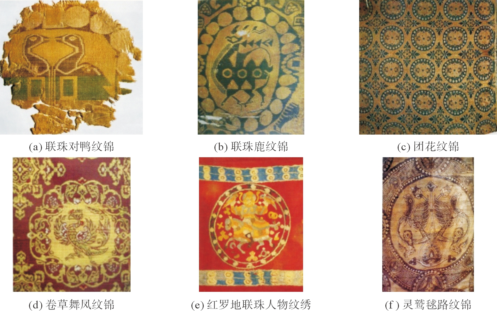
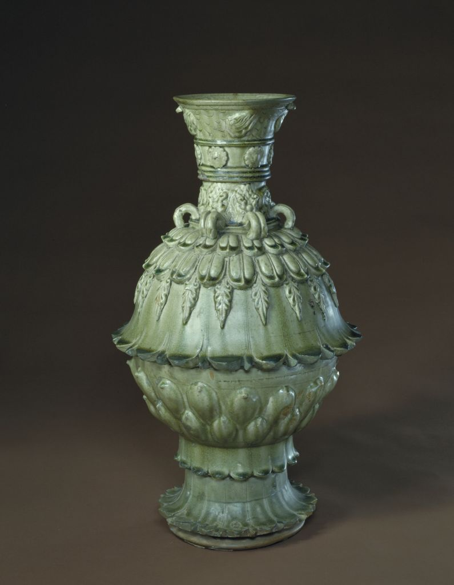

**魏晋南北朝工艺美术**
----------------------------------------------------------------------------------------
联珠纹 青瓷是主流，白瓷的创造更有意义 犀皮
没有形成统一的工美风格 面貌多样(北方西化 南方汉化)

| 朝代 | 朝代时间 | 风格 |
| :----  | :----: |:----: |
| 三国 | 公元220年 - 265年 | 延续汉风，透露清新自然 |
| 西晋 | 公元265年 - 316年 | 和三国差不多，以西晋的覆没为界限，此前风格统一，此后分为南北系统 |
| 十六国 | 公元304年 - 439年 | 清新自然被扼杀，雄强华丽 |
| 东晋 | 公元317年 - 420年 | 汉风被放弃，逐渐演化出清秀温柔 |
| 南朝 | 公元420年 - 589年 | 汉风被放弃，逐渐演化出清秀温柔 |
| 北朝 | 公元386年 - 581年 | 封建社会 |

- ### [联珠纹***](#联珠纹***)	
- ### [化妆土](#化妆土)	
- ### [犀皮](#犀皮)	
- ### [莲花尊](#莲花尊)	
- ### [堆塑罐](#堆塑罐)	
- ### [黄釉扁壶](#黄釉扁壶)	
- ### [北方白瓷的影响和意义](#北方白瓷的影响和意义)	
- ### [南北朝装饰纹样的变化**](#南北朝装饰纹样的变化**)	

#### 考点
> - `佛教`发展起来，影响了工艺美术，如装饰题材`莲花忍冬纹`流行，夹纻造像
> - 工艺美术转折点 灵动瑰奇 -> 清秀修长清新自然。交融碰撞出的新的艺术特点。装饰纹样的变化趋势(`清新自然，清秀修长` 植物纹开始变多)
> - `唐宋`是犀皮最为兴盛的时期
> - 南北朝植物纹增多是唐中期题材变化的先声
> - 化妆土：`婺州窑 磁州窑` 吉州窑 邢窑
> - 堆塑罐：三国西晋越窑烧造的陪葬品

#### 联珠纹***

	
	
	
	
	
	

> 联珠纹都由什么`组成`: **由一个个小圆珠组成。圆珠或排成条带等形状，或围成圆，以包围主题纹样，成为联珠圈，联珠圈是联珠纹的典型。**
> 应用`时间和地区`: 是`公元6世纪~公元7世纪`后期中国最重要的装饰题材，也是波斯地区重要的装饰纹样，应该传自波斯。`8`世纪逐渐`淡出`装饰主流
> 特点：常见有翼动物，中土未有的狮子，少见的大象，短窄的胡服，作隆准的胡相，甚至西方神像，与当时传入的萨珊文化有关
> 宗教寓意或神话含义，并非唯美的装饰

#### 化妆土
> 反复淘洗质地细腻的白色瓷土(`含铁量低`)制成的泥浆, 涂在胚体表面来遮掩坯料较差颜色较深的产品  
> `最早出现在三国时代`，`婺州窑`是以施化妆土为常规工艺手段的已知`最早瓷窑`另外 磁州窑 邢窑粗白瓷 吉州窑

#### 犀皮

> 是漆器传统的装饰手法，其`起源不晚于三国`，`唐宋`是犀皮的`兴盛期`
> 做法：在胎骨上用稠漆堆砌凹凸的地子，再于其上髹饰上不同色的大漆，然后打磨平滑，按照地子的形状，器表有各种形状的彩色花纹

#### 莲花尊

> `北朝青瓷莲花尊`(中国国家博物)，高59.5厘米，口径12.2厘米，底径20.2厘米。长颈直口，外沿饰一对桥形耳，流肩，颈、肩部有`六`个双系环耳。贴塑六团花，六兽面纹，器身以多层仰、俯莲瓣堆雕，釉色莹润，积釉处呈浅绿色。器盖雕饰莲瓣纹，由于`受佛教影响`，青瓷上盛行莲花纹装饰。北朝莲花尊器型为`早期北方青瓷的代表`
> 造型新颖别致，尊体以腹为中心，上下部塑饰各位相向的三层莲花瓣，共七层
> 造型高达挺拔，装饰华丽繁缛，注重`空间变化`和`立体效果`

#### 堆塑罐
> 模仿`动物造型`常常借助堆塑的手段，形象最繁复的是又称`谷仓罐`或`魂瓶`的堆塑罐。主要是`三国`越窑烧造的`殉葬品`，三国晚期最精美。
> 堆塑形象常有现实的`楼阁庭院 其间布列主仆 乐舞 禽畜`等，也有虚幻的`仙人佛像`。继承了汉代便流行的`神仙思想`，也体现了`佛教`影响扩大的体现。

#### 黄釉扁壶
> 
> 造型与`拜占庭`(东罗马帝国)的扁壶相仿，壶腹两面的印花不仅包括了敏感的`联珠忍冬`，主题更为中亚乐舞with胡服胡相  
> *最能直观说明北朝上层对西方文明的钟爱*。 

#### 北方白瓷的影响和意义
> `最早出现`在`北齐`晚期，出自`安阳范粹墓`，胎土中含铁量在1%以下。釉面呈现明显泛青。
> 中国瓷器可以分做颜色釉和彩绘瓷两大类，白瓷的出现意味着又增添了一种釉色，更为彩绘瓷器提供了最佳的釉色选择。
> 北方烧制瓷的技术和历史都不如南方，那为什么还能`首创`技术要求更高的白瓷呢，这与占据统治地位的北方民族有关，萨满教认为白色是吉善的象征，信奉萨满教的北方统治者特别喜欢白瓷。从这个例子中不难看出，**工艺美术是为人生产的，一旦技术条件具备，人的需求喜恶必然决定产品的面貌，甚至能促进新技术的诞生，创造新品种。**

#### 南北朝装饰纹样的变化**
> 由于大背景西方文化东渐、佛教东传，在公元6世纪以来的`南北朝后期`，联珠纹出现，植物纹大量涌现，`写实倾向`愈加明显。前代流行的丝绸图案云虚纹依然大量延续，但云气多作连续的波状，风云流动灵动瑰奇的图案气象不见了，展现出`端庄规整清秀修长`的新风貌。
> 联珠纹的名词解释
> 同`佛教的流行`相联系，晋代青瓷上有相当数量的`莲花纹`和`忍冬纹`。南北朝后期随着莲花纹和忍冬纹不断增加，`植物纹数量开始变多`，从此开始重要，为唐中期题材变化做铺垫。`唐代`之后花卉题材渐多，终于成为了装饰`主流`
> 南北朝前期，`写实`化倾向显现，重神韵但不要求一定逼真酷肖，告别了汉晋时代变形夸张的古典风格，迎来了`走向自然`的时代新风，后期这种写实风逐渐成为潮流，经`唐人`的大力弘扬，终占`主导地位`。
