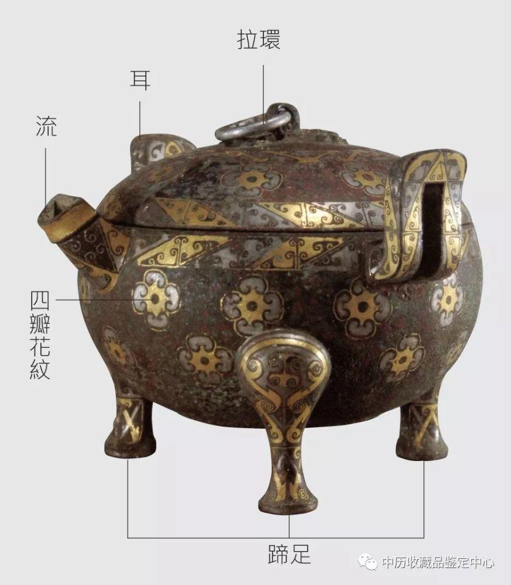
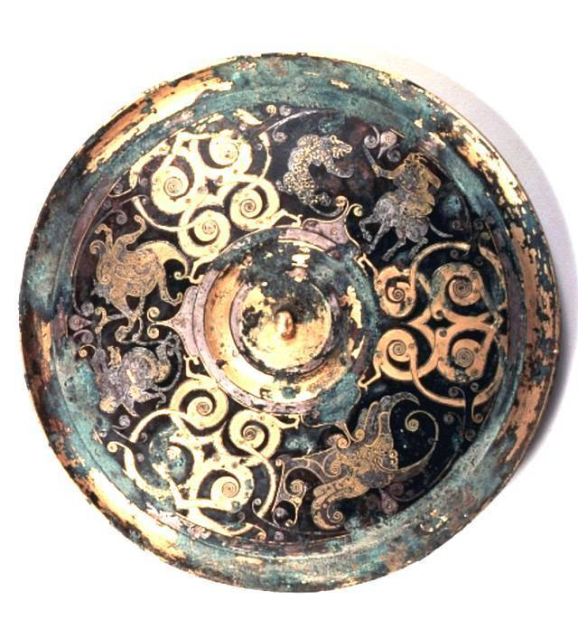

**春秋战国**
----------------------------------------------------------------------------------------
青铜器带钩 铜镜 彩绘陶 漆器 考工记

| 朝代 | 朝代时间 | 社会性质 | 特色 |
| :----  | :----: |:----: |:----: |
| 春秋 | 公元前771年 - 前475年 | 奴隶社会 | **清新华丽** |
| 战国 | 公元前475年 - 前221年 | 封建社会 | **清新华丽** |

#### 常见考点
> - **艺术风貌**：`清新华丽`  工美多为表现`人性活动`题材
> - **新技法**：模印制范法，`失蜡法`、`嵌错(错金银)`，针刻、`鎏金`、漆绘、麻布胎漆器 
> - **金银器装饰手法**： `锤揲、錾刻、掐丝、镶嵌、焊缀小金珠`  
> - **漆器装饰手法**：`彩绘 螺钿 雕漆 金银平脱` 商晚期就有了
> - **物勒工名**：(秦国相邦吕不韦的主持下集合门客们编撰的一部杂家名著)吕氏春秋上首次提到了“物勒工名” 所谓“物勒工名”是一种`春秋时期开始出现的制度`，指器物的制造者要把自己的名字刻在上面，以方便管理者检验产品质量，成书于秦始皇统一中国前夕
> - **耳杯**: 仿生造型，又称羽觞，一种漆器容器。`战国中晚期`数量已多，到汉更加流行。
> - **彩绘陶**:秦汉时期风靡，不绝如缕，容器down雕塑性up  做法:在磨光的`器物表面直接绘制`，或先涂底色，然后绘出，与彩陶不同。
> - 从春秋晚期起，工美逐渐`走出庙堂回归生活关注适用` 西周就有铁器，到战国进入了`铁器时代` 彩绘陶在战国秦汉时期最风靡
> - 春秋战国时期**青铜器在上层生活中的地位难以动摇**，`仍然是时代艺术的中心`
> - 曾侯乙墓(湖北省随州市)是战国早期，周王族诸侯国中曾国的国君曾侯乙的一座墓葬

#### 莲鹤方壶
> 青铜制盛酒或盛水器，高126cm，1923年出土于河南郑公大墓 禁展，故宫青铜馆，河南博物院。
> 此壶主体部分为西周后来流行的方壶造型，有盖，双耳，圈足。 从制作工艺上看，莲鹤方壶的铸造采用了圆雕、浅浮雕、细刻、焊接等多种技法，工艺精湛，反映了`春秋时期`整体清新自然的风貌
> 盖顶一鸟耸立，张翅欲飞，壶侧双龙旁顾，夺器欲出，壶底两螭抗拒，跃跃欲试，全部格局，在庞然大器的附着上，有离心前进动向，是象征争求解放、迎接曙光的时代精神

#### 金银错**

> 也叫错金银，`初见于春秋晚期`，流行于两汉，此后仍然不绝如缕，色美，对比烈
> 制作方法：用尖锐的铁工具在器物表面刻图，镶嵌copper,gold,silver丝片，通常还要用锉石使之平滑不易脱落，提高亮度更加美观。也有铁器错金银也有银器错金

#### 失蜡法**
> 出现在`春秋晚期`并且一直流行到现在的制作精密金属漆的方法 立体 曾侯乙墓出土的`尊盘`最受关注
> 制作方法：蜂蜡制成内模 -> 用泥浆敷内模制成外范 -> 高温熔化蜂蜡由预留孔洞排出 -> 注入铜浆 -> 冷却剥去外范  

#### 鎏金
> 春秋战国器物局部出现了鎏金和鎏银，汉代通体鎏金的青铜器更多。入唐，鎏金银器更为常见。  
> 做法：加热金泥(金箔调以水银)涂器表，水银挥发，金固表，金光灿烂。

#### 铜镜**

	
	
	

> 古人鉴容的青铜用具，多呈扁平的圆形，正面光滑明亮，背面或光素或装饰精美，一般中间有钮。装饰通常随镜身一道铸成，战国后也有在背面追加华美高档的装饰    
> `最早`出现在距今公元前2000的`齐家文化`墓葬，`战国中晚期`开始了铜镜最早的艺术高峰，`汉唐`两个高峰之后就不咋地了  
> 不同地区的铜镜装饰风格各有特点，比如楚镜装饰满密，通常有四叶、菱形、蟠螭，`山字纹`(湖南最多，四山最多)等，  

#### 带钩**
> 犀比、犀毗、师比，出现`西周晚期`，最早西周晚期墓葬，`风靡于战国秦汉`  
> 是古人扣接腰带或随身佩挂小件物品的器具。常作`微曲的`长条形或琵琶形等，首部弯曲，钩背设圆钮  
> 材料`以青铜居多`，也常见金银玉等，展示型极强，常用鎏金镶嵌错金银等手法装饰倍受上层人士的重视

#### 漆器**

	
	
	
彩绘乐舞漆鸳鸯形盒 彩绘窃曲纹漆豆

> 以木(最多)\竹\麻木\纸为胎,用大漆(可以抗酸防腐)髹饰的器物。去水生漆 -> 熟漆 -> 经处理的熟漆髹饰   
> 最早出土于距今六七千年的河姆渡文化遗址，战国工艺类，黑地红绘常见，动物纹居多。汉繁，唐以后观赏性。  
> 战国时还有胎上先刷漆灰(以角、骨、砖等粉末调和生漆而成的糊状物)再髹饰的实例。刷漆灰意在使器表更平整   
> 漆器种类很复杂，大致归类为以下: 1.素漆器(一个色 春秋战国之前多) 2.描绘漆器(带画意 eg春秋战国-两汉的彩绘漆器) 3.雕刻漆器(动刀装饰 e.g.宋元时代的雕漆) 4.镶嵌漆器(eg唐金银平脱、螺钿，明百宝嵌)

#### 夹纻*
> 一种漆器的做法，木胎易裂变，`战国中期`有了在木胎上裱糊麻布的做法，因麻布古称纻，这种方法遂称夹纻
> 后到战国晚期，有开发了一种新做法：用涂漆灰的麻布在木模或者泥模裱糊若干层，干后去模，在麻壳上刷漆，这种漆器使用的完全是麻布胎，所以非常轻便，魏晋以来制作常`车载人抬的佛像`。此技法被传承改进，时至今日依然沿用。

#### 中国丝绸
> 统称，起源于`新石器时代`，最早出土的锦出土于辽宁朝阳的`西周早期墓`，蚕丝织造。地位极高，生乡，国计民生  
> 高级服装主要面料，等级制度，展示，引领潮流  丝绸陶瓷中国代名词，中工美影响世界周代的丝绸发端。

#### 考工记***
> `第一手工艺`，合金配比文献，非1成，齐国，7100，西汉补入`周礼`，儒家一部分  
> 提出“天良”, 时令 环境 材质 技术 王公、士大夫、`百工(手工业者)`、商旅、农夫、妇功六种，百工：审曲面执，以饬五材，以辨民器  
> 重视发展生产力的思想，总结了当时的制作，中国科技史、工艺美术史和文化史上 自东汉以来注疏不断，今日更多。

### 对考工记天有时地有气材有美工有巧合此四者然后可以为良的看法
> 天时(越窑)地利材美工巧(明式家具,巧色)

> **考工记介绍+概括意义**: 考工记是第一部系统的手工艺著作，最终成书与`战国时代的齐国`，`西汉`补入`周礼`，从此成为`儒家经典`的一部分，它重视发展生产力思想，总结当时的制作，**在中国科技史、工艺美术史和文化史上都占有重要地位，**考工记把"天有时，地有气，材有美，工有巧，合此四者，然后可以为良"作为设计和造物遵循的基本原则。对后世影响深远，虽为先秦时期所著但至今仍有`实用价值`。  

> **天时地气总结**: 在这条原则中，天有时，地有气被放在前两位，可见在当时`天时地利`在工匠心中占有`最基础和根本`的地位。在工匠们日常工作中应首先确保不会违背天地法则才能造出可以为良的物品，这反应了当时`人们对大自然的崇拜`  
> **天有时解读**: 。一年四季二十四节气，人们意识到`气候变迁`是影响草木山水的主要因素，所以`天有时`是造物的`首要条件`，<u>比如“凡为弓， 冬析干，而春液角，夏治筋，秋合三材，寒奠体，冰析爵。”即冬天剖木制作弓干，春天浸制牛角配件，夏天制造筋绳，秋天用丝胶、漆组装弓箭，冬天调校，第二年春天再上弓弦，弓箭制造才得以完成。</u>  
> **地有气解读**: 中国地大物博，不同地区有不同的地理面貌和气候特征，`土地`的自然特性决定了动植物的根本`属性`，土地也是人的根本，所以`人造物和设计`也自然是`地气的产物`，<u>比如”郑之刀，宋 之斤，鲁之削，吴粤之剑，迁乎其地而弗能为良，地气然也“。认识自然，`遵守自然的规律`，这是设计所必须遵循的`基本准则`，时至今日也是十分宝贵的设计思想和精神。</u>  

> **材美工巧总结**: 造物必须依靠一定的材料，使用与材料相应的工艺技术，`材料是基础，技术是保障`。材有美，工有巧缺一不可，所以求材美，树工巧也成了匠人们的`普遍追求`。  
> **材有美解读**: 材有美可以代表如美玉，象牙，红木，贵金属等无论在哪个朝代和地区都被世人追捧的`高档美材`或者只有某个地方独产的`特色材料`；也可以指经匠人研究体验找出其`特点的普通材料`，<u>比如竹子虽不名贵也不难得，但韧度高不易折可以用来做簸箕、篮子等</u> 。对`材料的认知程度`决定了工艺美术的发展`深度`，只有明确造物的需求，然后`根据需求选材`，才能成就材之美。  
> **工有巧解读**: 不过成就材之美仅有“美材”可不行，还必须经过精心的加工制作, “工有巧”对“工”的要求是“巧”，巧代表着各种`技法`。不同材料的化学成分和组成结构有着很大差异，所以`因材施技`尤为重要，<u>比如木材的加工工艺因木之质而有锯、刨、削、榫之类的分别，金属材料而有相应的锻、炼、锤打等工艺。</u> 从材料与工艺的关系看，工艺是加工材料的工艺, 材料是基础，工艺是基于材料的本质属性形成属于自己的程序和方法，所以材料和技术就构成了`互为`的关系。  

> **总结**: 对于这句话我们也可以`反过来看`，在观察任何一件可以为良的工艺品时，我们都会感叹加工此物的匠人的精巧手艺，但巧妇难为无米之炊，没有实实在在的物理材料，匠人也无法施展他们的绝技。所有材料究其根本，都是取之自然。天地孕育着自然万物，匠人顺应天地法则而为，因材施工，施工以巧，以成良器。考工记虽然成书与先秦战国，但其中的设计准则依然可以沿用`至今适用性极强`，包含了我国古代先人的大智慧，代表了中国古代工匠的`匠人精神`。

#### 夏-秦汉青铜器艺术演进*
> - **青铜器整个发展从夏到汉总结**: 青铜器开端于夏，红铜锡合金，加锡可以，合范法失蜡法，铭文(又称钟鼎文、金文)文献史料，断代。祭祀天地别尊卑。最顶尖技术，人造物品，是中华文化艺术乃至科学技术的代表。**两个高峰**，汉代走向衰落  
> - **夏代**: 萌芽，风格平实质朴，绿松石镶嵌的兽面纹，走出原始  
> - **商代**: 由于殷人尊神率先，沟，显，so神秘威严诡异色彩up，兽面纹多, 造厚体硕，饮酒器多  
> - **周代**: 重薄，so明尊卑，别上下，礼仪性up。风格简平工规+几何化+理。简化兽面纹、窃曲、重环是主流，铭文加长。`列鼎制度`钟  
> - **春秋时期，战国时代**: 思想空前自由，`地位下降`，清洗，造型少，器薄，平面化。铜镜带钩。神秘down，礼down。风格轻扬灵动，清新华丽+ 动物造型居多(龙 变体蟠螭)+实用性up，漆虽繁，但青上层地位高，时代艺术中心  
> - **秦汉以后**: `漆器``制瓷`工艺繁荣发展。体现了夏商西周时期`社会观念的演进`和`统治阶级的意志`的`青铜器quit`。青铜器的发展代表了华夏早期文明的发展。先秦时期的文化对日后中华民族文化的发展起到了十分重要的奠基作用。

|  属性/朝代   | 商 | 西周 | 春秋战国 |
| :----  | :----: |:----: |:----: |
| 历史文化 | 笃信武术，重视祭祀 | 薄鬼神而重礼仪 | 礼坏乐崩，社会思想活跃 |
| 主要功能目的 | 沟通天地，显示权威 | 明尊卑别上下 | 回归生活，关注适用 |
| 风格面貌 | 威严诡异 | 严整规矩 | 清新华丽 |
| 造型 | 1. 器型硕大体态厚重 2. 饮食器和饮酒器居多 | 1. 酒器锐减食器增多 2. 造型简素器壁轻薄 | 1. 器壁更加轻薄注重适用 2. 动物(写实性 e.g.禽鸟)等新的造型流行 |
| 装饰和工艺 | 1. 装饰繁缛布局满密 2. 强调立体效果 合范法 | 1. 布局转向简洁 2. 鸟类几何纹样流行 合范法 | 1. 装饰趋向平面化(错金银 嵌红铜) 2. 新题材多为龙或者其变体 合范法 失蜡法 |