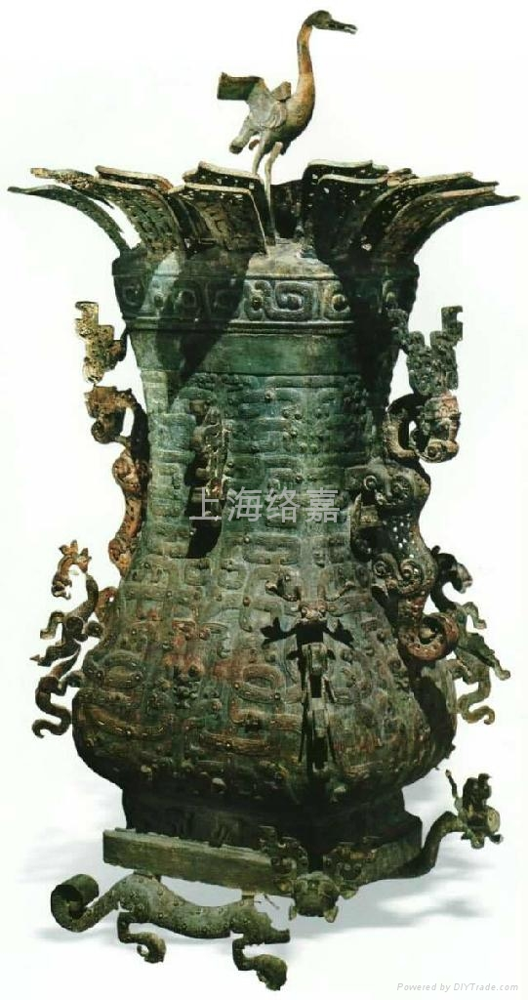
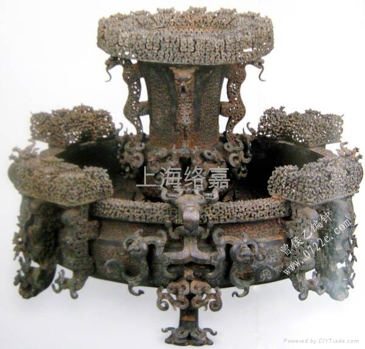
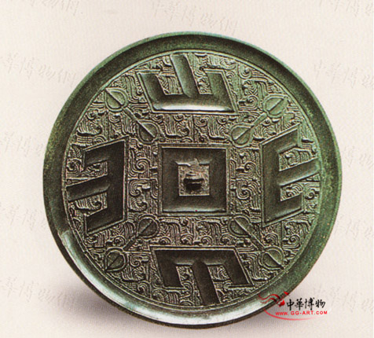
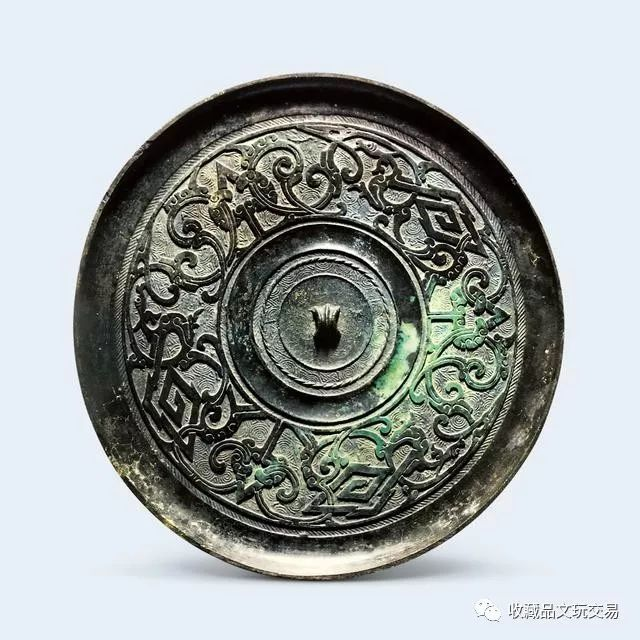
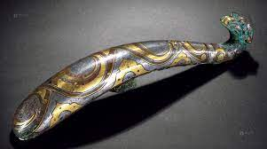
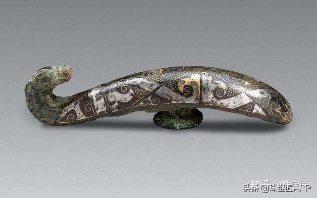
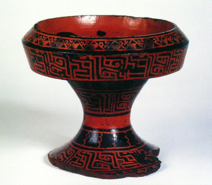
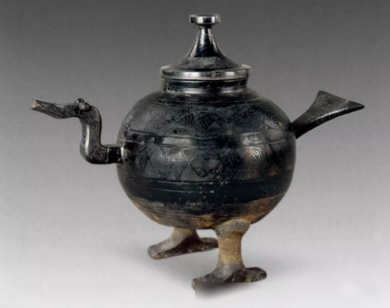
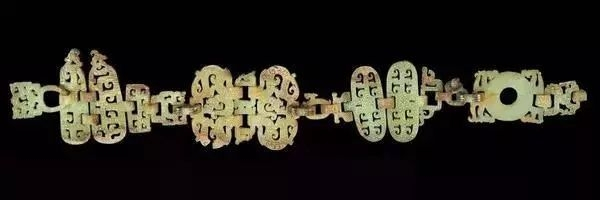

**春秋战国**
----------------------------------------------------------------------------------------
青铜器带钩 铜镜 彩绘陶 漆器 考工记

| 朝代 | 朝代时间 | 社会性质 | 特色 |
| :----  | :----: |:----: |:----: |
| 夏 | 公元前2070年 - 前1600年 | 奴隶社会 | **平实朴素** |
| 商 | 公元前1600年 - 前1046年 | 奴隶社会 | **繁缛瑰奇** |
| 西周 | 公元前1046年 - 前771年 | 奴隶社会 | **严整规矩** |
| 春秋 | 公元前771年 - 前475年 | 奴隶社会 | **清新华丽** |
| 战国 | 公元前475年 - 前221年 | 封建社会 | **清新华丽** |

- ### [春秋战国](#春秋战国)
- ### [曾侯乙墓](#曾侯乙墓)
- ### [莲鹤方壶](#莲鹤方壶)
- ### [金银错**](#金银错**)
- ### [失蜡法**](#失蜡法**)
- ### [鎏金](#鎏金)
- ### [铜镜**](#铜镜**)
- ### [带钩**](#带钩**)
- ### [漆器**](#漆器**)
- ### [夹纻](#夹纻)
- ### [耳杯](#耳杯)
- ### [彩绘陶](#彩绘陶)
- ### [砑花陶](#砑花陶)
- ### [考工记***](#考工记***)
- ### [对考工记天有时地有气材有美工有巧合此四者然后可以为良的看法](#对考工记天有时地有气材有美工有巧合此四者然后可以为良的看法)
- ### [中国丝绸](#中国丝绸)
- ### [春秋战国时期的玉器](#春秋战国时期的玉器)
- ### [春秋战国时期的金银器](#春秋战国时期的金银器)
- ### [夏-秦汉青铜器艺术演进*](#夏-秦汉青铜器艺术演进*)

#### 常见考点
> - 平王东迁，东周开始，是为春秋 西周就有铁器，到战国进入了`铁器时代`
> - 艺术风貌：`清新华丽`
> - 出现了很多`新技法`：模印制范法，`失蜡法`、`嵌错(错金银)`，针刻、`鎏金`、漆绘、麻布胎漆器
> - 从春秋晚期起，工美逐渐`走出庙堂回归生活关注适用`
> - 到战国，主流制作被`清新华丽`全面笼罩，青铜器的`神秘色彩消退，礼仪性质减弱`人的思想空前自由，工美多为表现`人性活动`题材
> - **物勒工名**：(秦国相邦吕不韦的主持下集合门客们编撰的一部杂家名著)吕氏春秋上首次提到了“物勒工名” 所谓“物勒工名”是一种春秋时期开始出现的制度，指器物的制造者要把自己的名字刻在上面，以方便管理者检验产品质量，我们可以理解成刻的意思，物就是所有的器物，在器物上面要刻上制造者的名字。。成书于秦始皇统一中国前夕

#### 曾侯乙墓
> 曾侯乙墓(湖北省随州市)是战国早期，周王族诸侯国中曾国的国君曾侯乙的一座墓葬，其中出土的`曾侯乙编钟`是迄今发现的最完整最大的一套青铜编钟。

#### 莲鹤方壶

> 青铜制盛酒或盛水器，高126cm，1923年出土于河南新郑李家楼郑公大墓
> 中国首批禁止出国（境）展览文物，一收藏于北京故宫博物院青铜馆，一收藏于河南博物院。
> 此壶主体部分为西周后来流行的方壶造型，有盖，双耳，圈足。 从制作工艺上看，莲鹤方壶的铸造采用了圆雕、浅浮雕、细刻、焊接等多种技法，工艺精湛，反映了`春秋时期`的整体风貌，与商周时期的厚重庄严的青铜器风格形成了鲜明的对比
> 盖顶一鸟耸立，张翅欲飞，壶侧双龙旁顾，夺器欲出，壶底两螭抗拒，跃跃欲试，全部格局，在庞然大器的附着上，有离心前进动向，最足象征争求解放、迎接曙光的时代精神

#### 金银错**
> 也叫错金银，`初见于春秋晚期`，流行于两汉，此后仍然不绝如缕，因为贵金属色泽更美丽，对比更强烈，效果最好  
> 制作方法：用尖锐的铁工具在器物表面刻图，镶嵌copper,gold,silver丝片，通常还要用锉石使之平滑不易脱落，提高亮度更加美观。也有铁器错金银也有银器错金
> `平面化`

#### 失蜡法**

> 出现在春秋晚期并且一直流行到现在的制作精密金属漆的方法  
> 制作方法：蜂蜡制成内模 -> 用泥浆敷内模制成外范 -> 高温熔化蜂蜡由预留孔洞排出 -> 注入铜浆 -> 冷却剥去外范  
> 曾侯乙墓出土的`尊盘`最受撑到
> tip: 并没有替代模范法 比较`立体`

#### 鎏金
> 春秋战国器物局部出现了鎏金和鎏银，汉代通体鎏金的青铜器更多。入唐，鎏金银器更为常见。  
> 做法：以金箔调以水银，加热成为液态的金泥，涂在所需装饰的器表，经加热令水银挥发，留下金固着于表面，令器表金光灿烂。

#### 铜镜**

	
	

> 古人鉴容的青铜用具，多呈扁平的圆形，正面光滑明亮，背面或光素或装饰精美，一般中间有钮。装饰通常随镜身一道铸成，战国后也有在背面追加华美高档的装饰  
> `最早`出现在距今公元前2000的`齐家文化`墓葬，`战国中晚期`开始了铜镜最早的艺术高峰，`汉唐`两个高峰之后就不咋地了
> 不同地区的铜镜装饰风格各有特点，比如楚镜装饰满密，通常有四叶、菱形、蟠螭，`山字纹`(湖南最多，四山最多)等，  
> 战国楚八叶四山纹镜 战国金乌扶桑铜镜

#### 带钩**

	
	

> 又名：犀比、犀毗、师比，出现在`西周晚期`，已知最早的青铜带钩出自西周晚期墓葬，`风靡于战国秦汉`  
> 是古人扣接腰带或随身佩挂小件物品的器具。常作微曲的长条形或琵琶形等，首部弯曲，钩背设圆钮  
> 材料以青铜居多，也常见金银玉等，展示型极强，常用鎏金镶嵌错金银等手法装饰倍受上层人士的重视

#### 漆器**

	
	

> 以木(最多)\竹\麻木\纸为胎,用大漆(可以抗酸防腐)髹饰的器物。漆树取漆液去水分滤杂质为生漆 -> 加温精制为熟漆 -> 经处理的熟漆髹饰的器物就是漆器  
> 最早出土于距今六七千年的河姆渡文化遗址，是战国重要的工艺美术门类，黑地红绘的彩绘装饰尤为常见，题材以动物纹居多。`到了两汉最为繁荣，唐以后的观赏性更强`。
> 战国时还有胎上先刷漆灰(以角、骨、砖等粉末调和生漆而成的糊状物)再髹饰的实例。刷漆灰意在使器表更平整
> 漆器种类很复杂，大致归类为以下
1. 素漆器 只有一个颜色 春秋战国之前大致都是这种漆器
2. 描绘漆器 带有画意 比如春秋战国-两汉的彩绘漆器
3. 雕刻漆器 动刀装饰 比如宋元时代的雕漆
4. 镶嵌漆器 比如唐代流行的金银平脱、螺钿，明代的百宝嵌
> 彩绘乐舞漆鸳鸯形盒 彩绘窃曲纹漆豆

#### 夹纻*
> 一种漆器的做法，木胎易裂变，`战国中期`有了在木胎上裱糊麻布的做法，因麻布古称纻，这种方法遂称夹纻
> 后到战国晚期，有开发了一种新做法：用涂漆灰的麻布在木模或者泥模裱糊若干层，干后去模，在麻壳上刷漆，这种漆器使用的完全是麻布胎，所以非常轻便，魏晋以来制作常`车载人抬的佛像`。此技法被传承改进，时至今日依然沿用。

#### 耳杯
> 在现代看来是仿生造型，又称羽觞，一种漆器容器。`战国中晚期`数量已多，如汉更加流行。

#### 彩绘陶
> 彩绘陶在秦汉时期最为风靡，此后仍然不绝如缕，但容器比例降低雕塑性作品比例提高  
> 彩绘陶的图案是在磨光的`器物表面直接绘制`，或先涂底色，然后绘出，与先绘制后焙烧的彩陶不同。

#### 砑花陶

> 一种在战国北方流行的常作为陶明器的暗纹陶(暗纹陶鸭形尊)
> 胎质多较细腻，烧成温度不高，胎呈灰色或灰褐色，表面为黑色。
> 装饰通常在未干透的坯体表面压印和刻划，打磨后图案似隐若现效果极佳。

#### 考工记***
> `第一部系统的手工艺著作`，也是世界最早的合金配比文献是，非一人一时著成，最终成书与战国时代的齐国，现有7100多字，西汉补入`周礼`，从此成为儒家经典的一部分
> 提出“天有时，地有气，材有美，工有巧，合此四者，然后可以为良”, 对应手工业生产所需 时令 环境 材质 技术四个要素
> 考工记将社会职业划分为王公、士大夫、`百工(手工业者)`、商旅、农夫、妇功六种，将百工定义为：审曲面执，以饬五材，以辨民器
> 考工记的重要首先在于它重视发展生产力的思想，总结了当时的制作，该书在中国科技史、工艺美术史和文化史上都占有重要地位。自东汉以来各名家对考工记注疏不断，今日的相关读本和研究更多。

### 对考工记天有时地有气材有美工有巧合此四者然后可以为良的看法
> 天时(越窑)地利材美工巧(明式家具,巧色)

> **考工记介绍+概括意义**: 考工记是第一部系统的手工艺著作，最终成书与`战国时代的齐国`，`西汉`补入`周礼`，从此成为`儒家经典`的一部分，它重视发展生产力思想，总结当时的制作，**在中国科技史、工艺美术史和文化史上都占有重要地位，**考工记把"天有时，地有气，材有美，工有巧，合此四者，然后可以为良"作为设计和造物遵循的基本原则。对后世影响深远，虽为先秦时期所著但至今仍有`实用价值`。

> **天时地气总结**: 在这条原则中，天有时，地有气被放在前两位，可见在当时`天时地利`在工匠心中占有`最基础和根本`的地位。在工匠们日常工作中应首先确保不会违背天地法则才能造出可以为良的物品，这反应了当时`人们对大自然的崇拜`
> **天有时解读**: 。一年四季二十四节气，人们意识到`气候变迁`是影响草木山水的主要因素，所以`天有时`是造物的`首要条件`，<u>比如“凡为弓， 冬析干，而春液角，夏治筋，秋合三材，寒奠体，冰析爵。”即冬天剖木制作弓干，春天浸制牛角配件，夏天制造筋绳，秋天用丝胶、漆组装弓箭，冬天调校，第二年春天再上弓弦，弓箭制造才得以完成。</u>
> **地有气解读**: 中国地大物博，不同地区有不同的地理面貌和气候特征，`土地`的自然特性决定了动植物的根本`属性`，土地也是人的根本，所以`人造物和设计`也自然是`地气的产物`，<u>比如”郑之刀，宋 之斤，鲁之削，吴粤之剑，迁乎其地而弗能为良，地气然也“。认识自然，`遵守自然的规律`，这是设计所必须遵循的`基本准则`，时至今日也是十分宝贵的设计思想和精神。</u>TODO:(例子二景德镇瓷都)，

> **材美工巧总结**: 造物必须依靠一定的材料，使用与材料相应的工艺技术，`材料是基础，技术是保障`。材有美，工有巧缺一不可，所以求材美，树工巧也成了匠人们的`普遍追求`。
> **材有美解读**: 材有美可以代表如美玉，象牙，红木，贵金属等无论在哪个朝代和地区都被世人追捧的`高档美材`或者只有某个地方独产的`特色材料`；也可以指经匠人研究体验找出其`特点的普通材料`，<u>比如竹子虽不名贵也不难得，但韧度高不易折可以用来做簸箕、篮子等</u> TODO: (例子：巧色 竹刻)。对`材料的认知程度`决定了工艺美术的发展`深度`，只有明确造物的需求，然后`根据需求选材`，才能成就材之美。
> **工有巧解读**: 不过成就材之美仅有“美材”可不行，还必须经过精心的加工制作, “工有巧”对“工”的要求是“巧”，巧代表着各种`技法`。不同材料的化学成分和组成结构有着很大差异，所以`因材施技`尤为重要，<u>比如木材的加工工艺因木之质而有锯、刨、削、榫之类的分别，金属材料而有相应的锻、炼、锤打等工艺。</u> TODO:(例子：明式家具)，从材料与工艺的关系看，工艺是加工材料的工艺, 材料是基础，工艺是基于材料的本质属性形成属于自己的程序和方法，所以材料和技术就构成了`互为`的关系。

> **总结**: 对于这句话我们也可以`反过来看`，在观察任何一件可以为良的工艺品时，我们都会感叹加工此物的匠人的精巧手艺，但巧妇难为无米之炊，没有实实在在的物理材料，匠人也无法施展他们的绝技。所有材料究其根本，都是取之自然。天地孕育着自然万物，匠人顺应天地法则而为，因材施工，施工以巧，以成良器。考工记虽然成书与先秦战国，但其中的设计准则依然可以沿用`至今适用性极强`，包含了我国古代先人的大智慧，代表了中国古代工匠的`匠人精神`。

#### 中国丝绸
> 丝绸是个统称，起源于`新石器时代`，最早出土的锦出土于辽宁朝阳的`西周早期墓`，泛指以蚕丝织造的各类纺织品。在中国丝绸地位极高，生产遍布城乡，与国计民生息息相关  
> 丝绸是高级服装的主要面料，装饰内容和面料都体现着`等级制度`，极具展示型，引领着时代装饰的潮流  
> 丝绸同陶瓷一起，成为了中国最为重要的代名词，中国工美影响世界的历史由`周代的丝绸发端`。
> 战国时期鸟纹 龙纹 凤纹 云气纹雏形 对龙对凤

#### 春秋战国时期的玉器

> 春秋战国时玉被赋予了更多的`道德伦理意义`，因圣贤的倡导，中华民族重玉的观念就愈发明确 `君子无故，玉不去身` 管仲认为玉有九德 
> 战国的玉器普遍华丽精巧，器物常呈薄片状，典型如中间有孔的扁平圆形的璧  
> 与西周相比，春秋玉器的和田玉比例大增，至战国(铁器时代)，和田玉成为主流  
> 曾侯乙墓出土的`镂空多节玉佩`造型华贵，是战国玉器的瑰宝

#### 春秋战国时期的金银器
> 直到战国，`银器`才明显增多，此前几乎是金制品一统天下。  
> 技法：`锤揲、錾刻、掐丝、镶嵌、焊缀小金珠`  
> 掐丝：是将金银薄片剪成细条，再搓成丝，把它按某种形状焊接在器物上，便成为镶嵌物的外框。掐丝和焊缀小金朱常搭配使用。

#### 夏-秦汉青铜器艺术演进*
> - **青铜器整个发展从夏到汉总结**: 青铜器开端于夏，基本都是红铜和锡的合金铸造的器物，加锡可以降低熔点和提高硬度增加美感，制作方法有`合范法`和`失蜡法`，青铜器的`铭文`(又称钟鼎文、金文)不仅是无可替代的文献史料，还能为青铜器断代提供依据。夏商西周时期承担着祭祀天地别尊卑的功能。代表了当时最顶尖的生产技术，是最重要的人造物品，是中华文化艺术乃至科学技术的代表。**经过商代和春秋战国两个高峰之后**，汉代走向衰落  
> - **夏代**: 青铜器开始萌芽，风格：`平实质朴`，出现了绿松石镶嵌的兽面纹，青铜艺术走出原始阶段  
> - **商代**: 由于殷人尊神，率民以事神，先鬼而后礼，青铜器用来沟通天地，显示权威，所以青铜器`神秘威严诡异色彩`增加，青铜器兽面纹主题较多, 器物特点，造型厚重，体型硕大，饮酒器比较多  
> - **周代**: 因为重礼仪而薄鬼神，青铜器就用来`明尊卑，别上下`，所以青铜器`礼仪性`增加。风格：`简素平朴工整规矩`+明显的`几何化`倾向+崇尚理性秩序。简化兽面纹、窃曲、重环是主流，铭文加长。`列鼎制度`形成，开始有成套编钟  
> - **春秋时期，战国时代**: 思想空前自由，青铜器回归生活`地位下降`，为了方便清洗，造型空间变化减少，器壁更加`轻薄`，装饰趋向平面化。`铜镜带钩`等日用品发达。`神秘色彩减弱，礼仪性衰退`。风格：`轻扬灵动，清新华丽`+ 动物造型居多(尤其是龙或者变体蟠螭)+实用性增加，漆器虽然繁荣，但是青铜器在上层生活中的地位难以动摇，`仍然是时代艺术的中心`。  
> - **秦汉以后**: `漆器`工艺和`制瓷`工艺繁荣发展。体现了夏商西周时期`社会观念的演进`和`统治阶级的意志`的`青铜器quit`。青铜器的发展代表了华夏早期文明的发展。先秦时期的文化对日后中华民族文化的发展起到了十分重要的奠基作用。

|  属性/朝代   | 商 | 西周 | 春秋战国 |
| :----  | :----: |:----: |:----: |
| 历史文化 | 笃信武术，重视祭祀 | 薄鬼神而重礼仪 | 礼坏乐崩，社会思想活跃 |
| 主要功能目的 | 沟通天地，显示权威 | 明尊卑别上下 | 回归生活，关注适用 |
| 风格面貌 | 威严诡异 | 严整规矩 | 清新华丽 |
| 造型 | 1. 器型硕大体态厚重 2. 饮食器和饮酒器居多 | 1. 酒器锐减食器增多 2. 造型简素器壁轻薄 | 1. 器壁更加轻薄注重适用 2. 动物(写实性 e.g.禽鸟)等新的造型流行 |
| 装饰 | 1. 装饰繁缛布局满密 2. 强调立体效果 | 1. 布局转向简洁 2. 鸟类几何纹样流行 | 1. 装饰趋向平面化(错金银 嵌红铜) 2. 新题材多为龙或者其变体 |
| 工艺 | 合范法 | 合范法 | 合范法 失蜡法 |