**隋唐五代工艺美术**
----------------------------------------------------------------------------------------
绞缬夹缬蜡缬 联珠纹陵阳公样宝相花 越青邢白唐三彩 香囊千秋镜皮囊壶锤揲錾刻 金银平脱螺钿

唐朝历十四世，传二十一代皇帝，前后共`289`年，其与汉朝并称为中国历史上两大强盛王朝之一
| 朝代 | 朝代时间 | 风格 |
| :----  | :----: |:----: |
| 隋 | 公元516年 - 618年 | -- |
| 唐 | 公元618年 - 907年 | 开放包容 大而能化 |
| 贞观之治到开元盛世 | 公元627 - 756年 | 唐太宗李世民 - 唐玄宗李隆基 |
| 五代 | 公元907年 - 960年 |  |

- ### [隋唐五代工艺美术](#隋唐五代工艺美术)
- ### [何稠](#何稠)	
- ### [窦师纶](#窦师纶)	
- ### [凌阳公样**](#凌阳公样*)	
- ### [绞缬](#绞缬)	
- ### [夹缬](#夹缬)	
- ### [蜡缬](#蜡缬)	
- ### [唐代刺绣](#唐代刺绣)	
- ### [宝相花](#宝相花)
- ### [唐三彩**](#唐三彩**)	
- ### [越窑**](#越窑**)	
- ### [秘色瓷](#秘色瓷)	
- ### [邢窑*](#邢窑*)	
- ### [长沙窑*](#长沙窑*)	
- ### [花瓷](#花瓷)	
- ### [绞胎](#绞胎)	
- ### [香囊***](#香囊***)	
- ### [鎏金舞马衔杯皮囊银壶](#鎏金舞马衔杯皮囊银壶)	
- ### [隋唐铜镜](#隋唐铜镜)	
- ### [瑞兽葡萄镜](#瑞兽葡萄镜)	
- ### [千秋镜](#千秋镜)	
- ### [锤揲](#锤揲)	
- ### [錾刻](#錾刻)	
- ### [金银平脱](#金银平脱)	
- ### [螺钿](#螺钿)	
- ### [螺钿紫檀五弦琵琶](#螺钿紫檀五弦琵琶)	
- ### [锦](#锦)	
- ### [唐代丝绸的特点](#唐代丝绸的特点)	
- ### [唐代丝绸的特点](#唐代丝绸的特点)	
- ### [唐代装饰纹样的演变](#唐代装饰纹样的演变)	
- ### [唐代金银器](#唐代金银器)	

#### 常见考点
> - 唐代工美`前吸收，后改造`，`安史之乱`是大唐由盛而衰和工美面貌的`转折点`。唐前期北方造作大大领先于南方，安史之乱后纷纷南迁，南方水平才上来。西域萨珊文化影响比较大 `唐代是工艺美术巅峰`  政府鼓励中西贸易 工艺美术品精美繁多 纺织业极为发达，丝绸最得统治集团重视  政府常要禁断高档工艺品以严肃世风，既是为了抑奢为了维护等级制度 
> - `风格`：`开放包容，大而能化`(色彩纷呈 繁花锦簇 富丽华美 喜动不喜静 喜奢不喜素，造型饱满 体态丰腴)
> - `唐朝印染工艺`：防染(`绞缬 夹缬 蜡缬`)和直接印花 纺织业发达：益州 扬州 定州 两京  唐代刻丝就出现了
> - `唐代陶瓷`：越窑(青瓷) 邢窑(白瓷) `南青北白` 还有黑黄花等釉 `长沙窑的开创釉下彩`  前期立体(风格华丽 异国情调) 后期平面(凸显平和) 总体风格`浑圆饱满`手法多样，多以自然界中植物或动物为范本，也受到同时期金银器皿的影响，一改传统的直线造型模式，以金银器中曲线变化为主
> - `唐代金银器`是中国大批打造金银器`最早`的时代也是中国金银器`最辉煌`的时期，唐前期重要出土地(何家村窖藏)装饰造型(胡瓶，八曲长杯，高足杯)大都和西方有关制作最为精美，唐后期出土地金银器代表(法门寺地宫窖藏)中国因素上升。帝王是金银器最大占有者。**唐代银器往往鎏金 分通体鎏金和金涂** 前期人物题材主题是狩猎纹和伎乐纹后期人物图案减少大多为古代故事及世俗化童子 香囊材质：金银铜铁 玉石
> - `唐代漆器`：大批量制作在后期。彼时`襄州`名声最高。`玄宗时代金银平脱最盛`，漆器加饰金银平脱自属`高档品`。实用性极强 -> 陈设性`观赏性`艺术性的设计
> - 8世纪后期出现了`写实性`花鸟，标志着唐装饰走向`自然`，至此中国装饰题材基本形成了`禽鸟、花卉、几何纹`鼎足而三的格局。
> - 唐代最重要的官署是唐代的`少府监` 丝绸作坊最多`宋`代工艺美术中最重要的官府机构是`少府监`
> - **唐代高级铜镜装饰**: 比如`螺钿`、`金银平脱`、`鎏金`等。
> - **秘色瓷时间**: 晚唐到北宋初期
> - 唐宋是犀皮最为兴盛的时期，此后不绝如缕 

#### 何稠
> 何稠(`北周至唐初`工艺美术家)，祖籍中亚 其父何通为琢玉名家 长期主持宫廷营造制作 设计了“行殿” "六合城"。`仿造波斯金线锦袍`比原作更精美，以`绿瓷仿制玻璃`。

#### 窦师纶
> 唐初平陵人，`丝绸图案设计家`，生性巧绝，爵封凌阳公  
> 设计出的瑞锦宫绫图案章彩齐丽，题材有`对峙、斗羊、翔凤、游麟`等，被称为`陵阳公样`，图案至少流传到`公元9世纪中叶`
> 唐前期对称纹样的联珠圈纹绫锦风靡，采用的就是当时的陵阳公样

#### 凌阳公样**
> 窦师纶(唐初 最好的丝绸图案设计家 因爵封陵阳郡公)设计的纹样
> 他设计的瑞锦、宫绫“章彩齐丽” 题材有“对鸡、斗羊、翔凤、游鳞”, 唐初对称鸟兽图案的丝绸即采用陵阳公样，其图样至少流传到9世纪中叶

#### 联珠纹
> 联珠纹`含义`由一个个小圆珠组成。圆珠或排成条带等形状，或围成圆，以包围主题纹样，成为联珠圈，联珠圈是联珠纹的典型。是`公元6世纪~公元7世纪`后期中国最重要的装饰题材，也是波斯地区重要的装饰纹样，应该传自波斯。常见有翼动物，中土未有的狮子，少见的大象，短窄的胡服，作隆准的胡相，甚至西方神像，与当时传入的`萨珊文化`有关
> 唐前期(7世纪50到80年代)最引人注目而后迅速衰败，紧接着宝相花开始流行。联珠圈圈内主题有翼马、野猪、花角鹿、胡人等偏西洋风的纹饰，构图有单独和对称两种
> `唐人对联珠纹的改造不晚于8世纪`，**外圈是小圆环的双层联珠圈->内层联珠外层卷草的联珠纹->主纹是联珠纹圈锦但是联珠圈是单层卷草文**。体现了中华文明对外来文化的`先吸收后改造`成中国独有风格的特点

	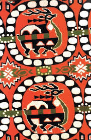
	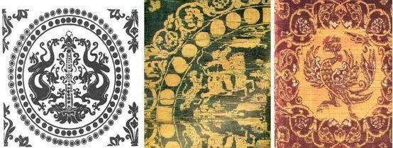
	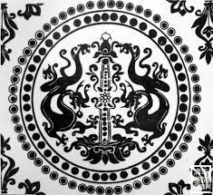
	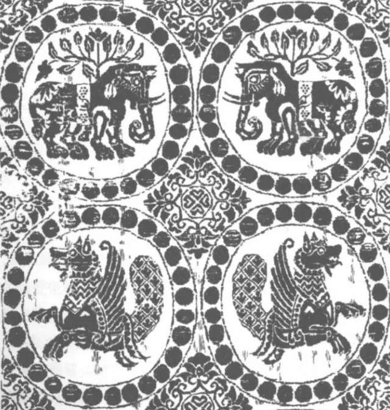
	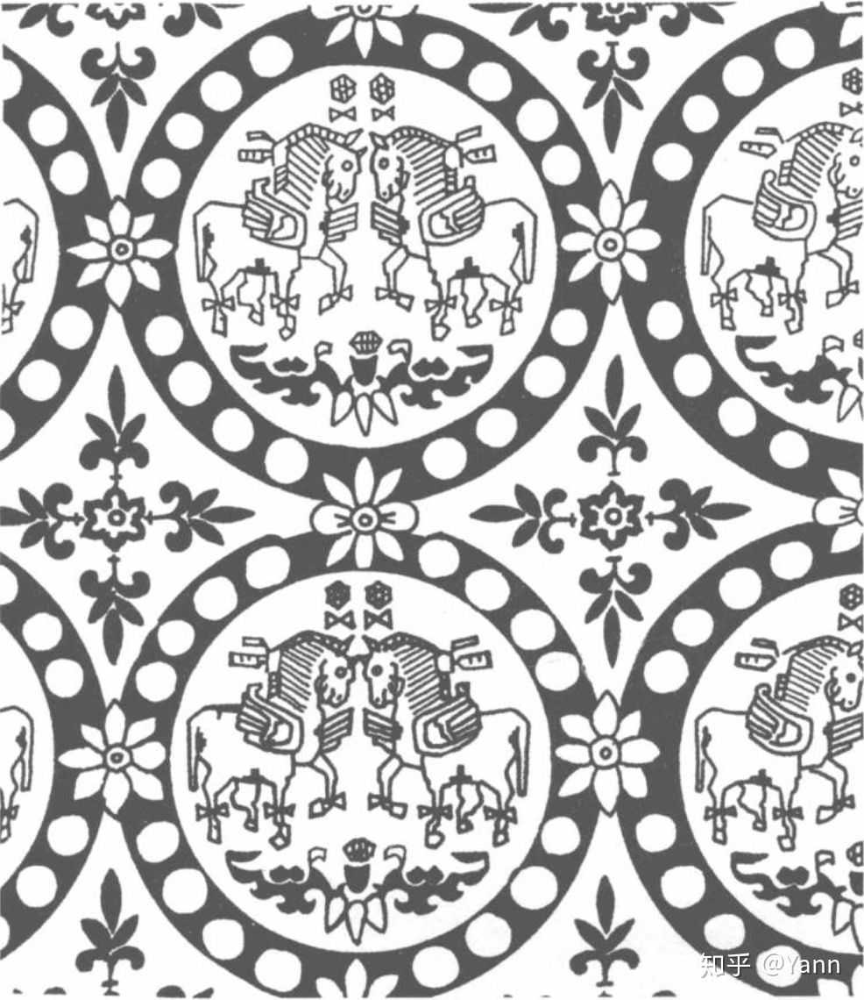

#### 绞缬
> `民间`常用印染方法，`流行于`唐注意`不是始于唐`，类似现在的`扎染`，以线等织物上钉扎出各种形状然后入染，被钉扎部分不染色，故形成了原色花的效果，花纹边缘有`晕染效果`
> 展现天然的意趣，引发不尽的遐想

#### 夹缬
> 最为`精美` 色彩丰富 `发明`于唐玄宗`宫中`
> 做法是两块图案相同的花版夹住按幅宽对折的坯料，而后从两面施染，`pattern对称`
> 唐人好色，多次施染就可以`实现多彩夹缬`

#### 蜡缬
> 现在的`蜡染`，是我国古老的民间传统纺织印染手艺。
> 做法是在坯料上绘画点染或借助镂空花版填涂蜡液，蜡液凝结后先入染，再加热脱蜡，可以得到花地异色的效果。
> 由于蜡染图案丰富，色调素雅，风格独特，用于制作服装服饰和`各种生活实用品`，朴实大方富有民族特色。

#### 唐代刺绣
> 唐代佛教盛行，`绣佛经佛`像成了功德大事也是刺绣的主要内容。尤其是绣像，要尽力表现法相的庄严和西天的繁华

#### 宝相花
> 是中国传统的图案性装饰纹样，大约出现在`唐代中期8世纪大概`
> 从7世纪80年代流行的变体宝相花演变而来。宝相花是种奇妙的组合，结体中早期是荷花后期是牡丹，每个细节都有现实的依据但是合为一体却不能说清到底是哪种花。
> 宝相花这个词出现在北宋，至今依然经常提起，不过所代表的的含义每个时代有所不同。
> 人民大会堂天花板 宝相花纹锦琵琶囊 唐代花鸟纹锦 黄绮地乘云锦

	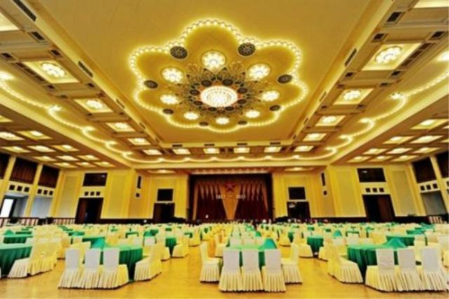
	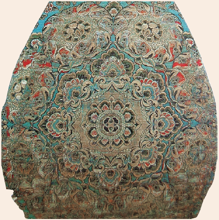
	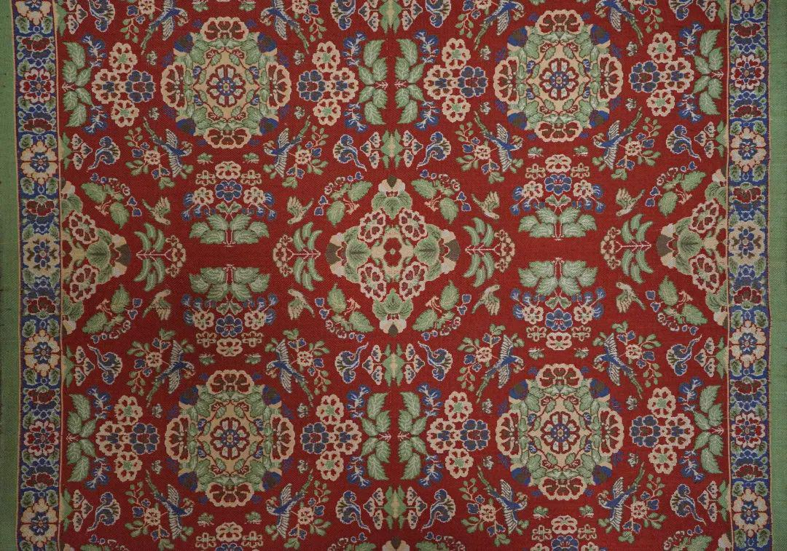
	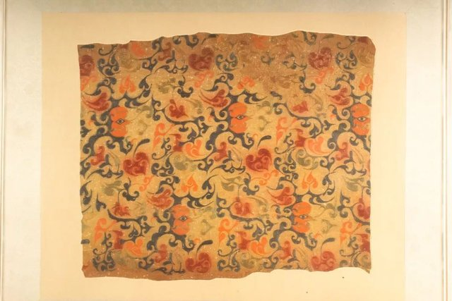

#### 唐三彩**
> 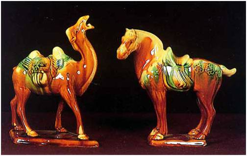
> 低温铅釉的彩釉陶器，胎料(白色瓷土)`两次烧成`。兴于唐高宗，玄宗极盛，此后衰落。唐三彩也作为容器供日常使用，但大多是达官显贵的明器，唐三彩的流行也源于厚葬之风。
> 装饰主要靠釉彩。釉面因多种金属元素而色彩斑斓，铅的增加不仅是釉面更光亮，还降低熔融温度，令呈色的金属元素沁润流动，形成了釉彩淋漓的独特效果。除了釉彩也有模印 刻划 堆贴 绘画
> 在唐代陶瓷中，不仅最华丽，文化内涵也最丰富。繁盛时期胡风弥漫，多体现在雕塑(中亚中双峰骆驼 胡人勇)+容器(胡瓶 双耳扁壶 角杯)

#### 越窑**
> 繁盛于晚唐五代 address浙江的绍兴宁波 主要制青瓷(釉色：青\黄\艾青色)，越窑地位突出，影响甚广。
> 特点：越窑器型丰富规整，不少器物`仿银器造型`。素面居多，但也有刻划印花等各类装饰。越窑青瓷釉面追求玉的质感，匀净而温润。为使瓷釉尽量覆盖胎体，越窑碗盘类常采用`支烧法`。
> 唐代陆羽在《茶经》中形容越窑为`类冰类玉`，在他看来比类银类雪的邢窑要高上一等。
> **唐前期陶瓷立体 后期平面化**
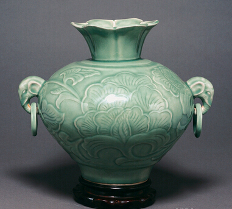

#### 邢窑*
> `河北内丘`，内丘瓶md，历史可以上溯至`北朝`，`唐中期极盛`晚唐衰 最著名的白瓷窑口是邢窑 河北曲阳定窑(发明覆烧产量大)受邢窑的影响继之而起，成为北方著名的白瓷窑 
> 以烧造`素面白瓷`著名。分`粗白瓷`(施化妆土，釉色灰白乳白，常施釉不满)和`细白瓷`(器型周正，胎质紧实，器体莹润，胎色洁白，釉质细腻)两种 “天下无贵贱而通用之”
> 邢窑以底刻“翰林” “盈” 字款的白瓷最为著名，中国已知`最早的薄胎瓷`就发现在此
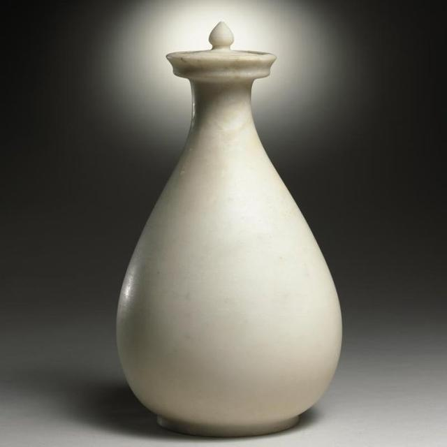

#### 秘色瓷
> (唐代晚期~宋代中期) 秘色瓷是`越窑青瓷`精品之一，`晚唐-北宋中期`的皇家贡品。其名字中的`秘与帝王宫廷有关`，色指种类与颜色无关。组合的词义就是上贡的品类
> 特点：釉面青绿色，温润如玉 常带有金属装饰(金银平脱)  
> 诗人徐寅有云"巧剜明月染春水，轻旋薄冰盛绿云"，陆龟蒙诗曰“九秋风露越窑开，夺得千峰翠色来”来歌咏秘色瓷
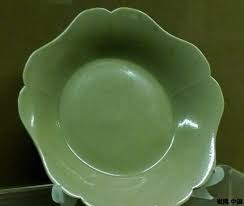

#### 长沙窑*
> 典型的`民间窑厂`(长沙望县) `唐中晚期活跃`衰于五代。最常见的青瓷，颜色不易，釉色青中带黄
> 装饰手法前期流行`褐斑贴花`，之后或由民间匠人随性勾画，以彩绘瓷著称。彩绘`动物题材居多`花卉也不少，颇具生活意味。主要生产民间日用瓷，虽然胎釉制作不甚精良，但是装饰及其丰富，彩绘意义重大。在陶瓷史上地位极高。常见造型：`短流壶`
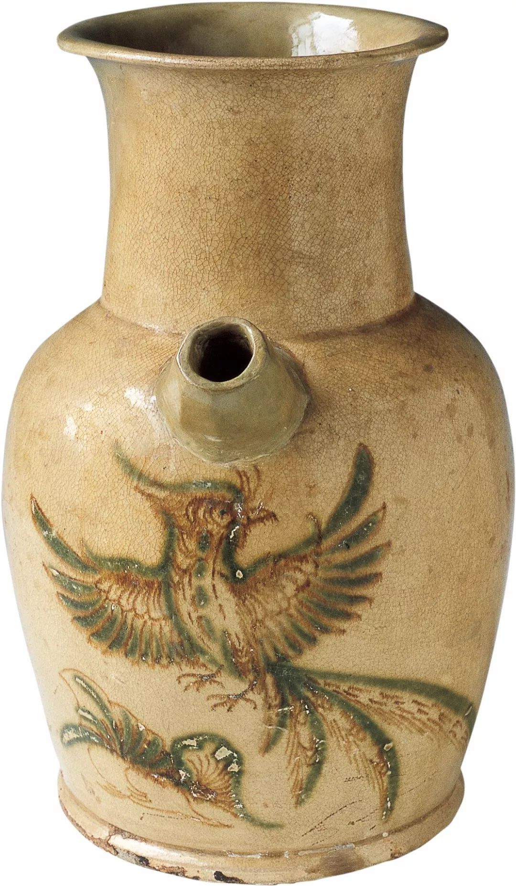

#### 花瓷
> `花瓷是唐人创造的`
> 特点：在深色釉地上，显现或大或小形状各异或整齐或散漫的浅色彩斑，有天然的意趣。

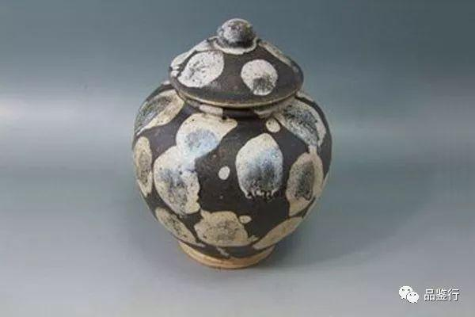

#### 绞胎
> `绞胎是唐人创造的`
> 做法：以白、褐或白、黑两种颜色的瓷土先分别制成泥条然后拧到一起。有时直接以之拉坯，但大多是切割为片，镶贴到一般材料的坯体上，最后上釉烧成。
> 绞胎花纹变化百出如行云流水妙趣恒生。

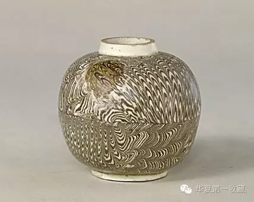

#### 香囊***
> 形态描述：又称“香球” 便于随身携带的`金属焚香`(银居多 铜铁玉石)器具 可开合有铰链的小巧(直径5cm左右)球型 通体镂空花纹
> 满足张扬的唐人随身携带处处熏香，镂空花纹进散香气 采用放射性多方连续式构图，无论从哪个角度看图案都具有整体感，其中镂刻线条最细处仅0.05cm。
> 香囊设计十分巧妙，整体分三层，外层以花纹镂空，为两个半圆，以子母又合为一体。其内又设两层双轴相联的同心圆环。`机关智巧 纵横圆转 而内常平` 像现在的万向支架，无论如何转动都能依靠自身重力保持内置香灰香火不外泄
> 香囊的主要使用对象是`唐代宫廷内的嫔妃贵妇`，一些风流少年也有携挂，随身携带香囊甚至成为了`唐代贵胄的典型标志`。何家村出土的葡萄花鸟纹香囊
> 其设计至今有典范的意义，既实用又美观。
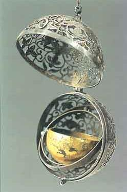

#### 鎏金舞马衔杯皮囊银壶
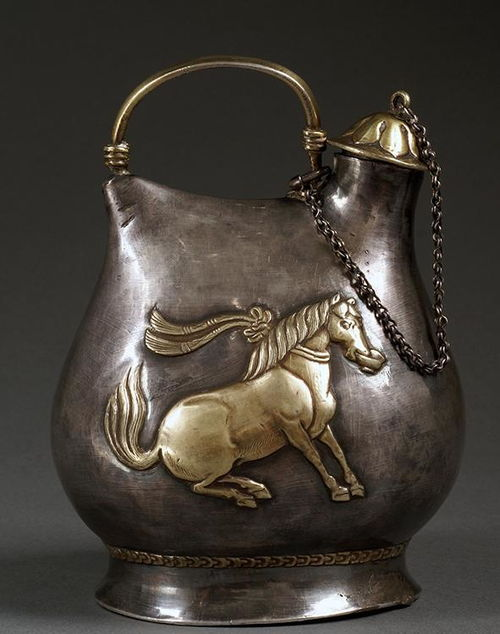

> 是唐代中期金银器的代表杰作。1970年出土于何家村
> 此壶采用的是北方游牧民族使用的皮囊与马镫的综合形式，以锤揲工艺制作。
> 壶腹两侧是舞马图，马身健硕，长鬃披颈，前肢绷直，后肢弯曲下蹲，口中叼着一只酒杯，其上扬的马尾和颈部飘动的绶带显示出十足的动感，侧面体现了唐玄宗生日千秋节的盛大和隆重。

#### 隋唐铜镜
> 隋唐五代铜器，镜最为常见。扬州铸镜业最发达。玄宗时期是中国铜镜史上最辉煌的时代。前期镜体普标较厚重，后期转为轻薄。
> 隋镜通常为圆形，到盛唐有菱花葵花形等。五代圆镜方镜较多。铜镜装饰主题以瑞兽祥禽为主的动物纹最常见。宝相花莲荷牡丹等花卉题材也很多。其中瑞兽葡萄镜最受瞩目
> 前期镜体普遍较为厚重，后期转向轻薄。前期构图相对满密繁复，后期渐渐简化，显得舒展自由。
> 唐代有很多高级的铜镜装饰，比如`螺钿`、`金银平脱`、鎏金等。
> 隋唐五代铜器前期比较旺盛，后来因为铜材较少等原因慢慢衰落。工美的变化总有非艺术的原因
> **瑞兽葡萄镜**: 最引人注目，其图案由高浮雕的瑞兽祥禽和葡萄叶曼及果实组成，繁花锦簇
> 是唐镜中装饰最满密风格甚独特的一类，大约出现在高宗时代，武则天时期最盛。
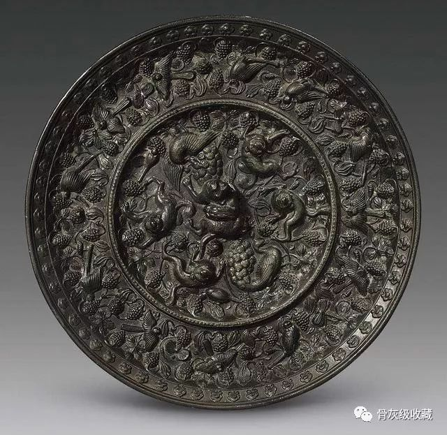

#### 千秋镜
> 唐代的著名铜镜，`唐玄宗生日`(千秋节)的`扬州`贡品。
> 需熔炼六七十道，又称“百炼镜” 背面为`盘龙`(最常见)有时也铸出`千秋等字样`，也有花卉月宫栾雀等装饰。
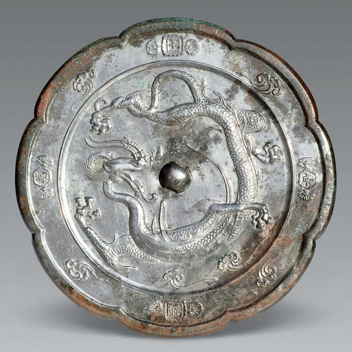

#### 锤揲
> (`唐前期`)金银器常见的装饰手法，`春秋战国`时期最早出现
> 锤子从背面捶打，敲出器形或图案，`图案类似浮雕`，由边缘向中央逐渐隐起
> 是西方金银器的主要成纹手法，遂图案多具`西域风`

#### 錾刻
> 原是`中国碑`等的传统装饰手法，后发展为`金银器常见`的装饰手法。
> 用凿子在正面凿出图案，图案是`纤细的阴线`，图案多具中国风

#### 金银平脱
> 将漆与金属镶嵌相合 高档装修方式(always装饰漆器铜镜瓷) 对两汉贴金箔的弘扬较多适用于漆器，铜镜也有时候用
> 做法: 金银片(剪刻成花纹)paste漆地上 -> 拼成图案 -> 涂漆研磨使之与漆地相平
> 特点：色彩强烈 富丽华美 

#### 螺钿
> 漆器创建装饰手法，`源头`可以上溯至`西周`。用海螺壳或海贝磨成的装饰纹样薄片+宝石铺在漆地上拼接图案 
> 唐代螺钿已经非常发达，雍容华贵，元代黄生兼造的螺钿家具和器皿，制作华贵影大。`明代`以`江千里`制作的螺钿最值得称赞，当时曾有“家家杯盘江千里”之说。
> `螺钿紫檀五弦琵琶`: 木器饰螺钿，是比较常见的高档装饰方法。盛唐的螺钿紫檀五弦琵琶现藏于正仓院，其制作之精，装饰之美令人叹止。

#### 锦
> 锦是两种以上的彩色丝线显花的多重丝绸
> 锦是个形声字，字义为价如黄金的丝绸
> 唐代起，中国传统的`经锦逐渐被纬锦`所取代。纬锦操作方便，利于图案换色和形象表现。唐锦大多色彩丰富，花纹精美，这同西方传入的纬线起花有直接关系。
> 锦长期是声誉做盛的丝绸品，华丽异常，`帝王是主要占有者`，装饰也往往是丝绸乃至工艺美术的代表。
> 颂：章彩奇丽 千华开瑞锦 烂若朝霞之初起，灿如春花之竞发 

#### 唐代丝绸的特点
> 1. 大唐盛世国力强盛，是当时世界第一大国，唐人的审美也自然有着大国气派。唐代丝绸最为最能代表唐工艺美术门类之一，呈现出色彩艳丽，装饰繁多的风貌
> 2. 唐代丝绸水平最高产地是长安洛阳，益州扬州定州也是丝织中心。丝绸`品种`丰富多样，(纱罗绫锦) 锦华贵异常最被看重，帝王是主要占有者。从唐代起经锦被纬锦(操作方便利于图案换色花纹精美)取代了
> 3. 归功于`印染技术`，前三个印染介绍。夹缬可以多次施染，染出绚烂的色彩，popular in 宫廷, 绞缬有奇特的晕染效果和抽象花纹 popular in folk
> 4. `图案装饰`丰富之极。前期西域风盛，后期华夏味儿浓,从抽象走形写实，禽鸟，花卉，几何纹三足鼎立
> `色彩纷呈 繁花锦簇 富丽华美 喜动不喜静 喜奢不喜素，造型饱满 体态丰腴`

#### 唐代丝绸的特点
> 1. 大唐盛世国力强盛，是当时世界第一大国，唐人喜动不喜静，喜奢不喜素的审美也自然有着大国气派。唐代丝绸最为最能代表唐工艺美术门类之一，呈现出色彩艳丽，装饰繁多的风貌
> 2. 唐代丝绸水平最高产地是长安洛阳，益州扬州定州也是丝织中心。丝绸品种丰富多样，纱罗绫锦中锦尤其华贵异常，最被看重，普通百姓难以拥有，帝王才是其主要占有者。随着丝绸之路的发展完善，唐代丝绸受西方各国工美和萨珊文化的影响，经锦逐渐被纬锦取代了。相对于经锦，纬锦在制作上操作更方便，有利于各种图案更换，如此更贴近了唐人对丝绸精美华丽的追求
> 3. 唐代丝绸的装饰面貌能如此繁丽复杂题材万千，主要归功于唐代代表着当时世界顶尖水平的印染技术——绞缬，夹缬和蜡缬。绞缬类似现在的扎染，以线等织物上钉扎出各种形状然后入染以形成原色花的效果，花纹边缘有奇特的晕染效果和抽象花纹，展现出天然的意趣。蜡缬是我国古老的民间传统纺织印染手艺, 利用蜡液常温易凝固的特点，可以得到花地异色的效果，朴实大方富有民族特色。夹缬发明于唐玄宗宫中，做法是两块图案相同的花版夹住按幅宽对折的坯料，而后从两面施染。此种方法可多次施染，极大程度满足唐人好色的需求，是唐代印染技术的精华所在。
> 4. 唐代丝绸装饰内容也一直在丰富和更新。唐代工美大而能化，开放包容的姿态也着重体现在唐代丝绸装饰上。唐代工美前期拥抱西方外来文化，洋风扑面，萨珊文化装饰艺术的典型代表联珠纹在唐前期盛极一时。随着唐人对这些外来文化的不断消化理解重构，唐代工美后期华夏味儿日益浓厚，8世纪以后联珠纹的圆珠已经逐渐被中国风格的卷草文所取代。此时装饰题材逐渐从抽象走向写实，逐渐形成了禽鸟，花卉，几何纹三足鼎立的局面

#### 唐代装饰图案的演变
> 1. 从总体来看，唐朝装饰前期西洋风盛，后期随着唐人不断对外来文化吸收理解改造，唐代工美的华夏味儿日益渐浓
> 2. 唐前期国力强盛，对外商贸往来频繁，但是无论是丝绸瓷器还是金银器都可以见到大量西域特色的装饰纹样。比如带有明显萨珊风格的联珠纹，尤其联珠圈内的主题都很洋气，比如生双翅的翼马，暴露獠牙的野猪头等。此时人物纹很多都带胡相，动物纹地位突出，普遍以浓郁波斯情调的翼兽走兽为主。植物纹样中，一些花卉和西方艺术联系紧密，如忍冬石榴花葡萄等。包括前期盛行的陵阳公样，也是东西艺术交融的产物。这时期的图案大多饱满端庄，造型常常颇挺拔，作品往往追求奇兀，较多含有堂皇高傲的贵族气派
> 3. 此后的潮流渐渐偏向温和清丽，出现较多亲切浅近的平民风范，造型也偏向圆柔。到了唐代中后期，装饰纹样中华夏特点日益明确。`8世纪以后联珠纹的圆珠已经逐渐被中国风格的卷草文所取代`。装饰主题由熊健威武的鸟兽、人物转变为富丽的花朵。人物纹样明显减少，大多都是古代故事以及世俗化的童子。花卉纹样地位上升，大量模仿花卉的器形出现。多数题材偏`写实`，宝相花，翼兽，龙凤等组合虽然奇异但细节都能找到现实依据。动物纹样中，凤凰孔雀鸳鸯等中国风的禽鸟纹样日益重要。至此，中国装饰题材基本形成了禽鸟花卉与几何纹三足鼎立的格局，后代的装饰也大致如此。·

#### 唐代金银器
> 1. 是中国大批打造金银器`最早`的时代也是中国金银器`最辉煌`的时期。帝王是金银器最大占有者。何家村窖藏是唐前期金银器重要出土地，法门寺地宫窖藏是唐后期金银器代表，从他们各自的出土金银器来看，前期西域风盛，制作最为精良，后期经过改造华夏之风更盛。尤其后唐时华夏特点日益明确。花卉地位上升莲藕风气日盛。帝王是金银器最大占有者。
> 2. 唐人设计过不少精巧的金银器，比如如今还能一见的香囊。香囊名词解释
> 3. 唐代银器往往鎏金，有通体鎏金和局部鎏金。通体鎏金顾名思义整个器物最后金光灿灿，唐称金涂。但唐代更常见金银花器，也就是局部鎏金的银器，金银对比效果极其华丽，在迷恋色彩的唐代，无疑更典型。
> 4. 装饰题材： 前期人物题材主要是狩猎纹和伎乐纹，后期人物明显减少，多为人物故事或者世俗化童子。在动物纹中，前期西方翼兽等走兽居多，后期中国风禽鸟纹样日渐重要成为主流。在花卉纹中，前期和西方艺术联系紧密出现不少忍冬葡萄等纹饰，后期莲花荷叶和牡丹居多。花卉纹的变化也很多，有折枝，缠枝，团花和庄重富丽的宝相花。
> 5. 在唐盛期，金银器的造型中国化便已开始。之后华夏特点日益明确，高足杯的演变就是很好的例子。但是后期制作普遍不如前期那么精美。而且唐前期那种富丽堂皇的气派也令后期无法企及。
> 鎏金伎乐纹八棱银杯  鸳鸯莲瓣纹金碗

	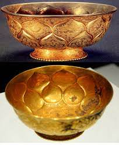
	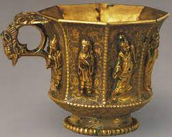

|  属性/朝代   | 前期 | 后期 |
| :----  | :----: |
| 造型 | 胡瓶、八曲长杯、高足杯、把杯等 | 仿莲荷风气兴盛，花形口，花瓣身 |
| 工艺 | 锤揲(成型) -> 錾刻(花纹) -> 鎏金(多花金银器)，錾刻居多 | 錾刻更多 |
| 人物纹 | 狩猎纹、伎乐纹，取题材于帝王权贵的生活，不少人物还作胡相 | 人物图案逐渐减少，多为古代故事和世俗化的童子 |
| 动物纹 | 走兽作主题比较常见，还有带有浓郁西方特色的瑞兽 | 凤凰、孔雀、鸳鸯、鸿雁等中国风禽鸟纹样成为动物纹主流 |
| 植物纹 | 忍冬、石榴、葡萄等 | 莲荷、牡丹、宝相花等 |
| 联珠纹 | 洋，野猪头纹 | 卷草 龙 |

#### 汉唐装饰纹样艺术风格比较
> 唐代相距汉代近四百年，自汉至唐随着朝代更迭变迁社会文明不断进步和对外来文化的借鉴吸收，装饰纹样的艺术风格逐渐呈现出不同的面貌。
> **汉唐(侧重)文化主题介绍**：装饰纹样的总体面貌体现了当代人的审美，不论风格和题材都受时代背景影响。汉代神仙思想流行，`灵动瑰奇`追求神韵的装饰纹样面貌体现了人们神游天地羽化升仙的愿景。唐代`大而能化`的文化包容力和`开放的国策`让`异域文化`被不断吸收改造，成为唐装饰纹样艺术的一部分，唐代很多装饰纹样既保留有西方艺术特色也蕴含中华文化寓意。
> **从装饰纹样题材来讲**: `汉代动物纹最多`，云气纹虽为时代典型纹样，也总是串联瑞兽灵禽等题材构成云虚纹出现。除了绢地茱萸纹，汉代的植物纹很少见，这和创造了宝相花的盛唐形成鲜明对比。总体来说`唐代装饰纹样题材包罗万象，中西交融`。唐代后期`花卉纹`地位最高，许多装饰主题由熊健威武的鸟兽、人物转变为富丽的花朵。
> **装饰纹样风格上**: `汉代`动物形象一般`夸张变形`，强调`动态`，想象出的仙山灵禽纹样体现了神仙思想，`动物形象稚拙但极富生命力`。`唐代`尤其是唐代后期多数题材偏`写实`，`宝相花`，翼兽，龙凤等组合虽然奇异但细节都能找到`现实依据`，致力于营造繁花锦簇`富丽堂皇`的风格。
> **相似之处**: 比起宋代淡雅清秀的审美，汉人唐人显然`都更喜欢动态`的装饰风格，喜欢`满密热烈的装饰布局`。汉唐装饰纹样的艺术风格演进体现了华夏文明生生不息，有容乃大的特点，都对当时其他国家的装饰纹样产生了深远的影响。 

#### 西方文化传入对唐代艺术的影响
> **总论点： 取其精华去其糟粕**
> **唐三彩举例**: 在唐代陶瓷中，不仅最华丽，文化内涵也最丰富。唐三彩是一种`低温铅釉陶器`。玄宗开元盛世时期极盛。其釉面因多种金属元素熔融沁润流动，形成了釉彩淋漓的独特效果。`繁盛时期胡风弥漫`，因此与西方文明联系较多，雕塑和容器也都显露着西域渊源，如中亚中双峰骆驼、胡人勇、胡瓶、双耳扁壶、角杯等。

> **唐代金银器也受西方影响颇深**: 入唐以来，西方人热衷金银器皿的风气传入中国，再加上北方草原的影响，使得金银器数量激增。但西方影响不表现于装饰，而主要反映在`胡瓶、把杯、高足杯和八曲长杯`等造型，不过这些金银器装饰充满了中国风情，做法也主要是中国传统的錾刻

> **联珠纹介绍**: 联珠纹由一个个小圆珠组成，圆珠或排成条带等形状，或围成圆，以包围主题纹样，成为联珠圈。这种装饰纹样起源于`萨珊波斯`，传入中国后风靡天下，大量应用于丝绸、陶瓷和金银器皿上。早期联珠圈纹常有浓郁的西域风，联珠圈内的纹样常见有翼动物，中原未有的狮子、萨珊推崇的野猪头纹等，装饰的人物身着短窄的胡服作胡相，这些装饰的诞生都与当时萨珊文化传入有关。

> **唐代本土改造举例金银器造型汉化**: 唐代秉承博大包容的气度积极汲取西方文化艺术的特色，同时也对其进行了本土化改造。长沙窑等外销瓷吸收了异域文化特色，将异域风情融入产品的同时也注入中国独有的艺术特色，再加上中国当时领先世界的制瓷技术，得到海外各个国家的欢迎和追捧，远销东南亚、南亚、西亚地区，最远抵达非洲，开辟了唐代海上丝绸之路。最晚在8世纪中叶，金银器造型的中国化就已经启动，金银器造型的华夏特点日益明确。比如高足杯的演变，唐代后期高足杯的造型不再像西方高足杯那样挺拔，器物的空间变化减少，造型线逐渐圆润柔和，这些改变完全符合中国人的审美习惯。`八曲长杯 长沙窑 瑞兽葡萄镜`

> **装饰纹样汉化举例联珠纹和装饰主题**: 到了唐代中后期，装饰纹样中华夏特点日益明确，8世纪以后联珠纹的圆珠已经逐渐被中国风格的卷草文所取代，比如由8世纪初由日本遣唐使带回日本现藏于正仓院的卷草舞凤纹锦上就已经不见联珠的踪影。而且锦上的装饰图案是一圈卷草包围着振翅起舞的凤凰，不同于之前的胡相翼兽等，凤凰是完全由华夏文明孕育并有高贵吉祥等文化寓意的本土装饰题材。由此可见，源自波斯的联珠圈纹不断被大唐文化吸收改造，逐渐仅作为一种装饰母题传播，并大唐后期形成了符合唐人审美的富有华夏文明特色的寓意和面貌。卷草纹的上位也侧面体现了8世纪唐代装饰纹样中花卉纹样的大流行。此时和西方艺术联系紧密的忍冬葡萄等纹饰逐渐减少，莲花荷叶和牡丹居多。折枝，缠枝，团花和庄重富丽的宝相花开始流行，凤凰孔雀鸳鸯等中国风的禽鸟纹样日益重要。

> **总结大而能化特点早就大唐盛世和改革开放如何借鉴**: 唐代工艺美术历来备受推崇，在其富丽华美风貌的形成中，吸收外来的文明因素，并且逐步消化改造，起到了关键作用。历史不止一次的证明，交流互鉴对促进艺术文明发展的重要作用，唐代艺术正是在充分吸收西方文化艺术下，才能有`大唐盛世百花齐放`的繁盛面貌。唐代对这些西域装饰艺术进行消化改造，使之逐渐与中国的艺术传统水乳交融，转为养料滋补自身发展。中国是唯一拥有连续文化传统的国度，在漫长的文化发展中，正是这种大而能化的特性让我们的文化能一直延绵不绝任历史沧桑巨变依然繁荣昌盛。唐代对于西方文化的大而能化时至今日依然有启示意义，伴随着`改革开放`，各种异域文化涌入中国，中国也都保持开放接纳的态度。在艺术设计方面，我们如何去消化越来越多的异域元素`取其精华去其糟粕(论点)`，如何用这些精华去发展和突出我们自身的华夏文明特色，是每个参与者都要面对的考验。
