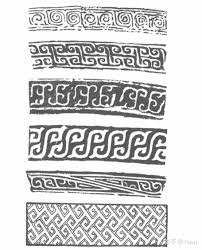

**夏商西周**
----------------------------------------------------------------------------------------
夏商的青铜器 原始青瓷 白陶

也称先秦 `公元前2070~公元前221`，汉代之后衰落
`奴隶社会`从夏延续到春秋战国之交，这个时期以使用青铜器为标志也叫`青铜时代`  
`青铜时代`是史前三代的第二阶段，在欧洲的起止时间是公元前3750-前600年，在中国的起止时间是公元前3000-前700年

| 朝代 | 朝代时间 | 社会性质 | 特色 |
| :----  | :----: |:----: |:----: |
| 夏 | 公元前2070年 - 前1600年 | 奴隶社会 | **平实朴素** |
| 商 | 公元前1600年 - 前1046年 | 奴隶社会 | **繁缛瑰奇** |
| 西周 | 公元前1046年 - 前771年 | 奴隶社会 | **严整规矩** |
| 春秋 | 公元前771年 - 前475年 | 奴隶社会 | -- |
| 战国 | 公元前475年 - 前221年 | 封建社会 | -- |

- ### [二里头文化](#二里头文化)
- ### [殷墟](#殷墟)
- ### [妇好墓](#妇好墓)
- ### [青铜器之酒器](#青铜器之酒器)
- ### [青铜器之鼎](#青铜器之鼎)
- ### [合范法](#合范法)
- ### [青铜器装饰高潮**](#青铜器装饰高潮**)
- ### [三层花纹](#三层花纹)
- ### [兽面纹***](#兽面纹***)
- ### [云雷纹*](#云雷纹*)
- ### [窃曲纹](#窃曲纹)
- ### [巧色](#巧色)
- ### [原始瓷器](#原始瓷器)
- ### [瓷器定义](#瓷器定义)
- ### [青铜器在夏商周的发展和变化](#青铜器在夏商周的发展和变化)
- ### [青铜器在夏商周的演进](#青铜器在夏商周的演进)
- ### [原始社会夏商西周工艺美术总结](#原始社会夏商西周工艺美术总结)

#### 常见考点
> - **商**：礼记表记里面写到：`殷人尊神，率民以事神，先鬼而后礼`。商人奉玄鸟为始祖，尊鬼神而轻礼义，祭祀`庄严又诡异`。青铜器是`统治阶层炫耀`财富显示权威的宝物，还是他们沟通天地，联络神人的法器，此时的青铜器充满了`威严诡异`的色彩。  
> - **西周**：尚鬼神的观念逐渐淡薄，奢靡风气被压，酗酒被禁，以嫡长继承为核心的`宗法制度`确立。周人`崇尚礼乐`，处处体现着`森严的等级`，礼乐的终极目的`协调贵贱尊卑，维护上下秩序`。此时工艺美术仍然以`青铜器`为代表，装饰转向平朴，纹样有单纯化，几何化的趋向，神秘诡异的色彩逐渐隐退，器壁趋于轻薄，创建了`严整规矩`的新风貌，酒器数量锐减，食器增加。`列鼎制度`形成并开始铸造编钟。
> - 商周青铜器造型装饰对其他工艺美术品类影响很大，主要原因：青铜器所占据的`文化核心地位`
> - **青铜器第一个高峰**: 商晚期到西周早期
> - 青铜器材料难得不易制作，so夏商西周`陶器`仍然是主要的容器类型 商中期`白陶`流行
> - 青铜器在红铜中加入锡是为了：降低熔点，提高硬度
> - 毛公鼎铭文最长为499字
> - 两宋对于商周青铜器造型的模仿尤盛
> - 商代中期出现原始青瓷
> - 西周的礼仪通常是各王朝制度的模板。
> - 西周就已经出现铁器了。钟的出现已经晚到西周中期 窃曲纹西周早期
> - 由夏商西周的青铜艺术发展历程：平实质朴 -> 繁缛诡奇 -> 严肃规整

#### 二里头文化
> 二里头遗址(河南洛阳)和二里头文化成为公认的探索`夏`文化的关键性研究对象。
> 对于夏文华，二里头文化和河南龙山文化是主要研究对象

#### 殷墟
> 是中国`商朝后期都城`遗址，位于`河南安阳`,殷墟因发掘`甲骨文`而闻名于世。
> `宫殿宗庙遗址`是殷墟最重要的遗址和组成部分，包括宫殿、宗庙等建筑基址80余座，`包括妇好墓`

#### 妇好墓
> 这是迄今为止发现的唯一一座保存完整的商王室成员墓葬，也是唯一能与甲骨文联系并断定年代、墓主人及其身份的商代王室成员墓葬

#### 青铜器之酒器
> 酒器最多种类最繁，商晚期达到巅峰，入周以后因为政府禁酒so地位下降。
> 商晚期觚是青铜酒器甚至青铜器的主体。尊是大中型的盛酒器物，有名的青铜双羊尊。
> 造型往往联系着功用，因为需要手持，酒器通常小而轻便，贮酒器则体量较大而且常有盖。  

#### 青铜器之鼎
> 鼎作为礼器的中心，造型通常规矩周正，装饰设计追求庄重肃穆，很早就被赋予明尊卑别上下意义，用来烹饪或祭祀。
> 商代后母戊鼎 西周大小有序的列鼎/钟
> 因为禁酒令，西周青铜器主要为食器的组合。

#### 后母戊方鼎

> 是商代晚期的青铜器，是商王为祭祀其母后戊铸造的方鼎  
> 1939年出土于河南安阳，高133cm，重800多kg。后母戊鼎鼎身四周有精巧的蟠螭纹和兽面纹，让此鼎显得格外庄重。  
> 是现存中国已知最大的青铜容器，现藏于中国国家博物馆中。

#### 合范法
> 合范法是青铜器具`最早期`的制作方法。  
> 其工序要经过如下六道工序。  
> 1. `制内模`：先刻成刻线纹饰的泥制内模
> 2. `制外范`：再用泥于内模上压出外范，并切为几块
> 3. `制内范`：把内模刮去一层，成为内范，刮下的厚度即将铸器物的厚度
> 4. `合范`：内外范经阴干、烘烤后，固定合范，用泥加固，留出浇口，铸造大型器物还要留出排气、排渣口
> 5. `浇铸`：为防止铸造中的冷隔，模范须烘烤预热，而后浇注铜液
> 6. `修整`：铜液冷却后，打碎外范，取出内范，再对铸件打磨修整

#### 青铜器装饰高潮
> 青铜器装饰高潮出现在`商晚到西周早`。
> 器物`装饰满密 繁缛复杂`，动物纹是装饰的主体，相对现实动物虚幻的题材更多比如龙凤，其中狞厉威严的兽面纹最风靡。
> `强调立体效果`是此时期装饰的突出现象，比如，三层花纹(如下) 或 凸起的扉棱和圆雕的动物附件。

#### 云雷纹*

	
	

> 常见于`商代中晚期~西周早期`的几何纹样。
> two type：曲线的云纹 & 折角直线的雷文，他们由回旋的线条组成，通常用作主题纹样的地纹，间或大面积的出现在器物上，甚至作为装饰的主题

#### 兽面纹***

	
	

> 兽面纹是商代到西周早期最重要的装饰题材，通常用为`主题`，总是单独纹样出现在`最醒目的位置`
> 主要根据角或耳的形状，有牛头羊头虎头等不同类型，皆以鼻梁居中，`左右严格对称`，双目炯炯震人心魄。兽面纹有着重要的象征意义，或以为是图腾观念的遗留，或相信是祭祀的牺牲，也有人认为是被神化和改造的动物形象
> 宋代以来一般称饕餮，认为在表现一种有首无身且贪婪的食人怪物.

#### 三层花纹
> 三层花纹常以云雷纹做地，主纹是高出地纹的动物纹样，其上再加饰纤细线纹，形成了商晚期极盛的三层花纹。三层花纹强调`立体`的装饰效果，风行与商晚期到西周早期。

#### 其他动物纹
> 龙纹盛行于商和西周早期，或作兽面纹的组成部分，或以二方连续等形式作为独立的装饰。有的躯体延展，有的则卷曲，还有双龙纠缠等多种形式。
> 鸟纹最初只是青铜器的辅助装饰，商晚期变为装饰主题之一，西周早中期成为重要的装饰主题并以圆雕的形式成为造型的重要因素。鸟纹往往较大，形象富丽华美。大家都知道凤鸣岐山的典故，周人崇尚凤鸟，专家认为鸟纹就是在表现凤。

#### 窃曲纹

> `西周`典型的青铜器装饰纹样，流行于`周代早期~春秋早期`, 原本也是一种动物纹样，应由兽面纹、龙纹、鸟纹演化而来。
> 窃曲纹如一横向的S，中央有目。通常左右排列，取`二方连续`的构图，显得严整有序。

#### 巧色
> 也称俏色，是玉石器雕琢的特殊手法，是衡量玉工巧拙的标尺。玉材很贵又常带杂色，将杂色设计制作为作品所需的部分，这就是巧色。

#### 原始瓷器
> 出现在`商代中期`，以粉碎后的瓷石制坯，烧成温度约1200，器表多施釉
> 原始瓷器在表面施有一层玻璃质的釉。此釉含草木灰和石灰石以及少量黏土，在入窑烧焙时熔化，形成玻璃状物质覆盖于坯体表面，不同烧造氛围烧出的颜色略有不同，釉色常为青或青黄，统称为青釉
> 多为容器，比陶器坚固，吸水性很低。

#### 瓷器定义
> 1. 胎料必须是瓷土，瓷土的成分主要是`高岭土`，并含有长石、石英石和莫来石成分；含铁量低。经过高温烧成之后，胎色白，具有透明或半透明性，胎体`几乎不吸水` 胎体质地坚实，叩击声音清脆
> 2. 瓷器的胎体必须经过`1200℃～1300℃的高温`焙烧，才具备瓷器的物理性能。各地瓷土不同，烧成温度也有差异，要以烧结为准。
> 3. 瓷器表面必须是在高温之下和瓷器一道烧成的玻璃质釉
> tips: `瓷器诞生在东汉`，浙江上虞地区烧造最盛，被称为`越窑`，两宋是高峰，自从出现便成为了陶瓷文化中心，至今还是餐饮界的主要类型。
> 陶器用陶土烧造，有吸水性，而且烧造温度低于瓷器800-900，很少有超过1000度，瓷器比陶器坚固

#### 青铜器在夏商周的发展和变化
> - 夏鼎是德行的象征、军权的化身，直至商周秦汉依然备受推崇。夏青铜器装饰较少，兽面纹是流行的主体，神秘诡异的风格特征已经显露。
> - 商代`酒器`众多。`商中期`器物明显较夏`厚重`，礼器更加丰富，装饰转为满密繁缛开始趋于`立体化`，`动物纹`是装饰的主体，渲染`神秘诡异`的气氛，胎体往往`极厚重`。   
> - 商晚期到西周早期(青铜器装饰高潮)：商代晚期因为酷爱饮酒所以酒器更加繁荣发达，大型器物数量颇多，作为礼器的中心，`鼎`尤其巨大，最著名的`后母戊方鼎`。
> - 西周中晚期：西周进入`中期`青铜器的新风貌也发展成熟。青铜器`酒器锐减而食器增多`，以食器为中心的礼器组合逐渐完备，列鼎制度产生，又开始铸造成组配套的编钟。
	>> + 装饰：渐渐主要变为牛头和作为周族图腾的`凤鸟`。与`薄鬼神而重礼仪`的观念想关联，趋于`简素平整`，兽面纹慢慢`简化`，`窃曲`和多种`几何纹`样成为时代的典型。与题材的变化相适应，`二方连续`则是最具有代表性的构图方式
	>> + 造型：不再追求复杂的空间变化，而是`趋向规矩整齐`，`器壁趋于轻薄`。
> - `总结`：造型单纯装饰平朴器类减少都意味着`艺术的衰落`，从`西周中期`开始，青铜器走下了第一个艺术巅峰。夏商西周青铜器的`装饰`走过了一个由`简陋到繁丽，再趋向单纯`的历程。由平实质朴到繁缛诡奇再到严肃规整，这是夏商西周的青铜艺术发展历程。
> - `启发`： 工艺美术是为人生产的，而人的喜恶受时代各个因素的影响。体现统治集团意志的官府制作一直都是主流。朝代的更迭并不意味着工艺美术的风貌会被迅速扭转，*前代的造型装饰会被延续和继承*。新统治集团的新意志新政策会引发新风格的诞生和成熟。

#### 青铜器在夏商周的演进
> - 青铜器基本都是红铜和锡的合金铸造的器物，加锡可以降低熔点和提高硬度增加美感 制作方法有合范法和失蜡法。青铜器在夏商西周时期代表了当时最顶尖的生产技术，是最重要的人造物品，是当时工艺美术的核心品类。大致跨越了中国古代的奴隶社会，有着一千多年的发展历史，被称之为青铜时代。
> - 夏代 青铜器开始萌芽，体现出平实质朴的风格，青铜器装饰较少，器物类型普遍为工具兵器和牌示等。出现了绿松石镶嵌的兽面纹，神秘诡异的风格特征已经显露，青铜艺术走出原始阶段  
> - 商代由于殷人尊神，率民以事神，先鬼而后礼，青铜器用来沟通天地，显示权威，所以青铜器`神秘威严诡异色彩`增加。`商中期`器物明显较夏`厚重`，礼器更加丰富，装饰转为满密繁缛开始趋于`立体化`，`动物纹`是装饰的主体，兽面纹非常流行。这时期的青铜器装饰常常渲染`神秘诡异`的气氛，胎体往往`极厚重`，器体型也普遍硕大。   
> - 商晚期到西周早期是青铜器装饰高潮，`商代晚期`因为酷爱饮酒所以`酒器`更加繁荣发达，大型器物数量颇多，作为礼器的中心，`鼎`尤其巨大，最著名的`后母戊方鼎`。后母戊方鼎是商代晚期的青铜器，是现存中国已知最大的青铜容器，现藏于中国国家博物馆中，是商王为祭祀其母后戊铸造的方鼎，1939年出土于河南安阳，高133cm，重800多kg。后母戊鼎鼎身四周有精巧的蟠螭纹和兽面纹，让此鼎显得格外庄重。
> - 周人重礼仪而薄鬼神，青铜器就用来明尊卑，别上下，所以青铜器`礼仪性`增加。装饰呈现`简素平朴工整规矩`的风格，明显的几何化倾向体现周人崇尚理性秩序。简化兽面纹、窃曲、重环慢慢成为主流，与题材的变化相适应，`二方连续`则是最具有代表性的构图方式。造型：不再追求复杂的空间变化，而是`趋向规矩整齐`，`器壁趋于轻薄`。西周实行禁酒令，青铜酒器锐减而食器增多，以食器为中心的礼器组合逐渐完备，列鼎制度产生，又开始铸造成组配套的编钟。
> - 造型单纯装饰平朴器类减少都意味着`艺术的衰落`，从`西周中期`开始，青铜器走下了第一个艺术巅峰。夏商西周青铜器的`装饰`走过了一个由`简陋到繁丽，再趋向单纯`的历程。由平实质朴到繁缛诡奇再到严肃规整，这是夏商西周的青铜艺术发展历程。
> - 从夏商西周青铜器的发展和演进我们可以受到很多启发：工艺美术是为人生产的，而人的喜恶受时代各个因素的影响。体现统治集团意志的官府制作一直都是主流。朝代的更迭并不意味着工艺美术的风貌会被迅速扭转，前代的造型装饰会被延续和继承。新统治集团的新意志新政策会引发新风格的诞生和成熟。

#### 原始社会夏商西周工艺美术总结
> - **功能和美观的统一**：工艺美术造作的第一原则就是适用性原则，造型满足日常生活和显示权威的需要，装饰也含有功利目的。这种功能和美观的统一延续至今，现代设计师依然追求功能和美学的统一。
> - **技术对艺术的制约**：原始社会工艺美术主要是陶器，到了夏商西周就变成了青铜器，之后制瓷技术发展，中国工美的主要品类又变成了瓷器。由此可见技术的发展引领者工美的发展。
> - **造型和装饰仍然被后世沿用**:比如陶碗的造型以及比例尺寸，宋代之后的瓷器也多仿照之前的青铜器和玉器，这些经典的工艺美术都成为今日设计的素材和灵感来源。
> - 工艺美术为人生产，人的喜欢讨厌取舍决定这作品的面貌，人受到政治宗教观念的制约，统治阶级的意志对政治宗教起决定性作用。王朝的更迭不能令工美面貌迅速改变，大批前代的造型装饰都会被后代延续，但新王朝带来的新风貌一定会在结合或改造前朝风格的基础上逐渐显现出来