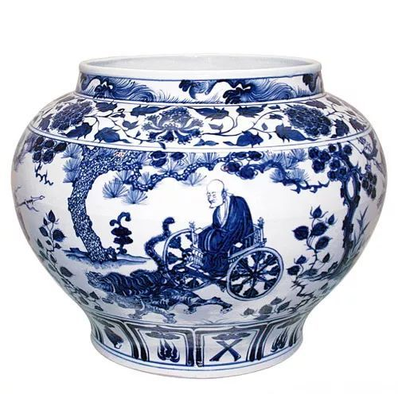
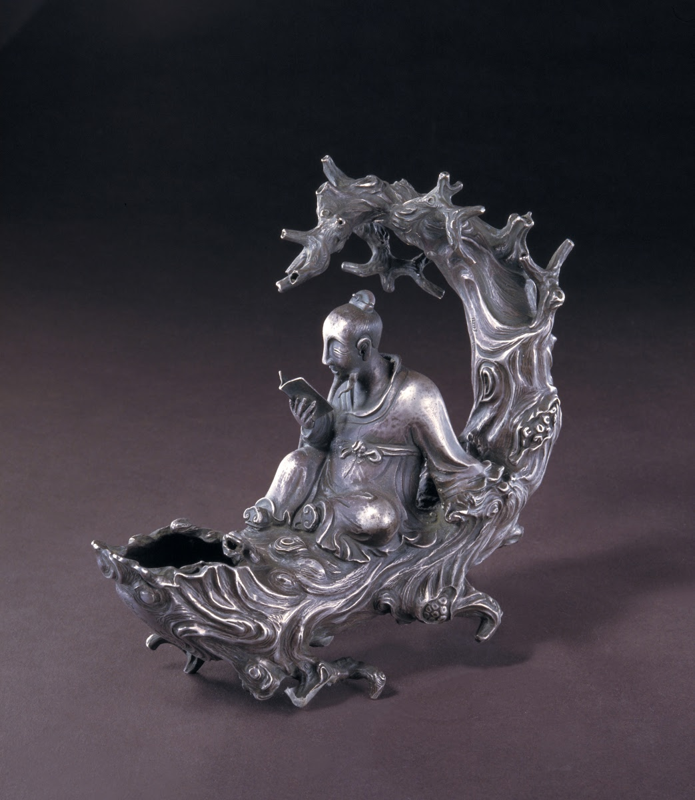

**元代工艺美术**
----------------------------------------------------------------------------------------

| 朝代 | 朝代时间 | 风格 |
| :----  | :----: |:----: |
| 大蒙古国 | 公元1206年 - 1271年 | 元太祖铁木真统一蒙古，立国位于漠北的蒙古草原，定国号为“大蒙古国” |
| 元代 | 公元1271年 - 1368年 | 元世祖忽必烈建都汉地，将国号改为大元，直到1368年元惠宗出亡为止，共`九十七`年，是严格意义上的元朝历史 |
| 北元 | 公元1368年 - 1388年 | 朱元璋建立明朝，随后北伐驱逐元廷攻占大都。此后元廷退居漠北，史称北元 |

- ### [织金锦](#织金锦)	
- ### [满池娇](#满池娇**)	
- ### [元代丝绸图案](#元代丝绸图案)	
- ### [浮梁磁局](#浮梁磁局)	
- ### [青花瓷***](#青花瓷***)	
- ### [釉里红](#釉里红)	
- ### [蓝釉瓷和红釉瓷](#蓝釉瓷和红釉瓷)	
- ### [卵白釉瓷](#卵白釉瓷)	
- ### [哥窑](#哥窑)	
- ### [雕漆](#雕漆)	
- ### [元代金银器](#元代金银器)	
- ### [朱碧山和朱碧山小银塑](#朱碧山和朱碧山小银塑)	
- ### [戗金银](#戗金银)	
- ### [青白瓷](#青白瓷)	
- ### [渎山大玉海**](#渎山大玉海**)	
- ### [中国青花瓷的起源与发展](#中国青花瓷的起源与发展)	
- ### [元青花与蒙古族的关系](#元青花与蒙古族的关系)	
- ### [华夏文化对青花瓷的影响](#华夏文化对青花瓷的影响)	
- ### [元青花与伊斯兰文化艺术的关系](#元青花与伊斯兰文化艺术的关系)	
- ### [宋元工艺美术的比较](#宋元工艺美术的比较)	

> **风格**: `精丽华贵`——`含蓄变为豪放`，`素雅转向繁盛`。不再留恋清水出芙蓉,官府追求的精美华贵
> **背景**: `多元文化并存`(草原文化、渔猎文化、农耕文化)，当时工美受到蒙古统治阶级`颜色好尚，数字观念，迁徙生活，饮食习惯`等影响。主要掌握`蒙古文化 伊斯兰文化 华夏文化`对工艺美术的影响。元以来`棉布大有发展`，元代`蓝白风靡`应该源自蒙古族苍狼白鹿的著名传说，贵红达官贵族的丝绸常常是红色，褐色丝绸是元代官府作坊最多的产品。
> **浮梁磁局**：官府瓷器作坊，浮梁磁局所在的`景德镇`成就最高，其瓷都的地位已经确立。元代`前期`蒙古统治阶层对瓷器非常`冷漠`，不过随着久居中原生活形态逐渐改变，瓷器在他们心中的地位`逐渐变得重要起来`。元代陶瓷畅销海外国际影响甚大。
> **漆器**：晚期是雕漆的高峰。`张成、杨茂`是大师。
> **纻丝**: `纻丝即后世的缎`，表面的浮线较长，光滑平整柔软亮泽，是最能体现丝织物的优点。
> **元代棉织业**: 促进了中国人服用面料的革命，柔软耐用价廉的棉布逐渐取代麻葛成为平民老百姓的主要服用面料。
> 八吉祥题材首见于元代: 轮罗伞盖花罐鱼肠 明清更为流行

#### 织金锦**
> 元代重要的丝绸品种 `纳石失`，唐初的`何稠`是已知织`造织金锦的第一人`。唐后期国内普及元代世界普及。
> 织金锦图案以片金线或捻金线织出，效果富丽华美，织金锦分为纳石失(少但等级高，名声大)+金段子
> 织工来自西域穆斯林及其后裔。制作工艺装饰特点都有浓厚的伊斯兰情调
> **蒙古君王对织金锦非常喜爱的原因**: 不仅生前使它不离左右，死后还要以它遮覆棺木，装饰马车。对伊斯兰文明的亲近是蒙古上层喜爱织金锦的重要原因，从而导致元代社会对织金锦的追捧。

#### 元代丝绸图案
> 装饰图案基本都承袭宋金两代，受伊斯兰教影响`构图`往往十分`满密`。
> 花卉题材多为传统的缠枝、折枝、团花等，一年景、宝相花扔大量出现。动物纹也常见团龙团凤，花鸟图案颇多，异域风情题材常见于纳石失和撒答刺欺。
> 元代装饰常有`吉祥寓意`，比如八宝(珠 钱 祥云 书 画 灵芝 元宝 金银锭)十分流行

#### 满池娇**

> 元青花满池娇是最常见的装饰主题。`图案定型于文宗的御衣图案`。`词名初见南宋`
> 装饰图案 `池塘小景`(莲花荷叶盛开，配以鸳鸯戏水)，显得清新秀美，与契丹民族春水题材有关  
> `八大吉祥题材`首见于元代: `轮罗伞盖花罐鱼肠` 明清更为流行

#### 浮梁磁局
> 今日的`景德镇`，元代是浮梁州，`元15年`设立了浮梁磁局，为皇家造瓷。
> 浮梁磁局的产品`代表了元代陶瓷的最高水平`，以`卵白釉`瓷居多。
> `以磁石加高岭土的二元配方`是元代景德镇的创造，将高岭土引进瓷胎意义巨大，采掘容易，扩大了磁石的使用面，减少了变形，降低了成本，改善了瓷器的物理性能。

#### 青花瓷***

	
	
	

> **青花瓷介绍**:主要因为蒙古人尚白尚蓝，所以入元后，尤其元代后期蒙古族上层慢慢对瓷器重视起来，青花瓷大量涌现。 以氧化钴为呈色剂。在胎体上描绘纹饰。再罩以透明釉，再次高温烧成的`釉下彩瓷器`。`白底蓝花` 装饰紧密，将花纹组成若干条带环绕器身，因为7和蒙古族的丧葬与元代的刑罚有关，而9层装饰却不少，这与蒙古族重九有关。典型的青花瓷所用原料钴料一般源自进口，故装饰比其他瓷器繁密，不仅要极尽人工雕琢之能事，还要竭力炫耀材料的高贵奢华。青花瓷是元代陶瓷的最大贡献，奠定了景德镇瓷都的地位。将中国陶瓷从素瓷带入了彩瓷时代，具有划时代意义，是中国陶瓷发展史上的里程碑。
> **卵白釉瓷**: `元代`景德镇窑`创烧`的一种高温釉。因为元代国俗商白，所以元代后期风靡天下，因釉质乳浊失透，呈色白而微青，有如鹅卵，所以叫卵白釉瓷。因较考究的卵白釉常印有相对的枢府二字，这一般都是官府定制，又称`枢府瓷`

#### 釉里红

> `元代`景德镇民间的`创造`，出现于`元晚期`，制作方法与青花瓷相似但是`呈色剂为氧化铜`
> 釉里红很稀少有工艺上的道理，因为铜对`窑温`和火焰性质`太敏感`，稍有不妥就会使图案呈色变异。
> 明洪武以后，釉里红才形成自身风格，康熙雍正时期才打到成熟的阶段。

#### 哥窑
> 至少主要烧造在`元末明初`。哥窑产品`努力模仿宋代官窑`，故元末人说：近日哥哥窑，绝类古官窑。
> 哥窑的窑址应该在`杭州或者龙泉`一带，其釉色有粉青、月白、米黄之别。也有紫口铁足。常带有丰富的开片，俗称金丝铁线。
> 高足杯和折腰碗、盘是有代表性的器型，或祭祀品或日用品。`不少是浮梁磁局的贡品`。器内有印花的图案，缠枝的莲花，菊花是最常见的题材。

#### 雕漆**
> 相传始于唐，`入元后盛`成为漆器的代表
> making method: 在漆胎上一层层涂几十遍乃至上百遍大漆在漆胎上，阴干后快速雕刻图案
> 雕漆是个类名 分为 `剔红(数量最多影响最大)、剔犀、剔黑、剔彩`。
> 令`两宋`雕漆久享盛誉的是`剔红`。元代是雕漆的顶峰，出现了`张成 杨茂`两个巨匠

#### 元代金银器
> 元代金银器为`金银铜铁`四类，金银器最得统治阶层喜爱。元代饰用金银器之盛`旷古未有`，这也统治阶层是蒙古游牧民族自古的理念有关，几乎所有家具，宫饰，衣饰，炊具甚至马槽都会有金银装饰。
> 金银器的装饰主题以`花卉`居多，形象一般和两宋差别不大。每取折枝和团花的构图，缠枝较少。元代著名银工是`朱碧山`，因他常年和名流来往，所以他的作品都有浓郁的书卷气

#### 朱碧山

> 元代著名金银器工艺家，以造型复杂的`酒具和小雕塑`享誉，和当时名流常有来往，他的作品都带有浓郁的`书卷气`。
> 表现张骞寻找黄河源头故事的酒杯。可以盛酒，造型典雅，工艺精湛。

#### 渎山大玉海**

> 元代玉器 即黑玉酒瓮 造成1266年初，是当时最重要的内廷贮酒器，<u>是现存`最大的古代玉容器`，现藏于`北京团城`</u>
> <u>器型雄武硕大，高70cm，口径135-180cm，重约3500kg。玉材取自`河南南阳的独山`。</u> 呈色青黑，杂以白色斑纹，外壁碾琢波涛中的龙，马，鹿犀等异兽。

#### 中国青花瓷的起源与发展
> **青花瓷介绍**: 以氧化钴为呈色剂。在胎体上描绘纹饰。再罩以透明釉，再次高温烧成的`釉下彩瓷器`。`白底蓝花` 装饰紧密，将花纹组成若干条带环绕器身，典型的青花瓷所用原料钴料一般源自进口，故装饰比其他瓷器繁密，不仅要极尽人工雕琢之能事，还要竭力炫耀材料的高贵奢华。青花瓷是元代陶瓷的最大贡献，奠定了景德镇瓷都的地位。将中国陶瓷从素瓷带入了彩瓷时代，具有划时代意义，是中国陶瓷发展史上的里程碑。
> **青花瓷为什么在元后期大量涌现**: 原始青花于唐宋已初见端倪，不过在当时不像白瓷青瓷那样受人喜爱所以发展受限，无论从质量上或数量都上都未形成气候。元代统治阶级属于游牧民族，游牧民族因为常年迁徙跋涉更喜欢容易携带的金银器，对陶瓷并没有宋代统治阶级和文人士大夫那样痴迷和喜爱，`所以元代前期瓷器发展并不如意`。随着长期久居中原，`生活习惯的改变`和蒙古族`尚白尚蓝`的本性，使得青花瓷在元后期才大量涌现，并在`伊斯兰装饰文化`的影响以及中国传统造型形制、装饰图案以及制瓷技术等诸多条件下迅速成熟。典型的元代青花应为`1328`年以后的作品。
> **青花造型和装饰**: 青花瓷在元代器型普遍`偏大`，`装饰满密`，尤其后期装饰受到不少元杂剧的影响，出现了大量人物`故事画片`如鬼谷下山，三顾茅庐等。
> **明清青花瓷**: 元代以后的统治者也都酷爱青花瓷，青花瓷也在明清一度成为最重要和最具代表性的瓷器类型，产量极高。明代青花瓷大致可分为三个时期：`永宣青花、成虹青花和嘉万青花`。其中永宣青花端庄凝重，呈色深沉，成就最高。清代青花瓷在`康雍乾水平较高`，乾隆后期国力衰退青花水平渐低。明清还发明了釉下彩和釉上彩相结合的`斗彩`，也称逗彩。<u>欧洲人也常以收藏了中国的青花瓷来显示自己的地位和富有。据说15世纪的萨克森国王，竟用4队禁卫军像临近君主换取12个青花瓷瓶来取悦皇后，可见青花瓷是全世界都有极高的地位。</u>

#### 元青花与蒙古族的关系
> 元是蒙古族建立的王朝，统治阶层是长期居住于中国北方草原的游牧民族，他们的文化、审美、数字观念和生活习性自然是影响元代青花瓷的发展和成熟的重要因素。
> 蒙古民族自古尚白尚蓝，所以当他们逐渐意识到瓷器之美时，青花瓷便脱颖而出艳压各种宋代推崇的青瓷白瓷，成为了最具代表性的风靡天下的中国瓷器。
> 从造型上来讲，蒙古族的生活习性让元青花的造型体现了和宋代大相径庭的面貌。蒙古族属于游牧民族，即便已经入主中原却依然保留了迁徙巡游的习惯，长期的迁徙让他们更倾心于便于携带的器型，比如四系扁瓶，八棱制式的梅瓶，玉壶春瓶等。元青花不同于宋瓷的精巧秀丽，更多的青花大盘口径平均可达40cm左右，最大可达71cm，碗的口径也常达30cm，这与蒙古族粗狂豪放的饮食相关。
> 元青花的装饰也和蒙古民族独特的数字观念有着密不可分的关系。比如元青花典型的作品通常装饰满密，装饰带通常很多，但唯独没有7层的，而9层居多。这与元代重九恶七的习俗相关。忽必烈时期定了一条刑罚制度，整数减三即“天绕一下，地绕一下，我绕一下”，七便自此与刑罚相关，此外7和蒙古族的丧葬有关，7成了不吉利的数字。而9是阳数之极，代表着至上的地位。

#### 华夏文化对青花瓷的影响
> 华夏文化对青花瓷的影响主要体现在`制瓷技术、传统装饰题材和世俗故事`上。
> **制瓷技术**: 是华夏民族独有的，元代在景德镇设立的浮梁磁局，是官方唯一的瓷器生产管理机构。如果没有汉人工匠几百年来的探索和创造，如`釉下彩技术的发明`，`白瓷的烧造`、`高岭土的配置等`，青花瓷的诞生和辉煌成就难以想象。
> **装饰题材**: 虽然青花瓷的造型和装饰也受到蒙古文化和`伊斯兰文明`的感染和影响，但主要的装饰题材却依然很大程度上延续了中国的题材纹样，而且越到后期这种趋势越明显。比如花卉纹多以牡丹花作为主题，山石海水纹常以二方连续的形式作为边饰，`鸳鸯、满池娇`则更带有浓郁的汉文化艺术的意味。
> **戏剧题材**: 元代戏剧风靡，文学艺术与陶瓷工艺相互影响的关系在元代青花瓷器上表现得相当突出，比如主要的题材有`鬼谷子下山，萧何月下追韩信，刘备三顾茅庐，昭君出塞`等。

#### 元青花与伊斯兰文化艺术的关系
> 从元代工美总体面貌来看，元代工美是被伊斯兰文化影响最大最深的一个时代，十二世纪的土耳其陶中便可见到与青花瓷的相似之处。元代是由蒙古族建立的王朝，从1219年西征起，蒙古人就对伊斯兰文明兴趣浓厚。从此，许多西方穆斯林东迁，大批伊斯兰世界的工匠和产品涌入国内，当然也对元代最典型的工美代表青花瓷有着不小的影响。
> 青花瓷器早期所用钴料大都是伊斯兰地区的波斯料苏麻离青，成文是高铁低锰，故青花色调非常浓艳，被称之为波斯蓝。青花瓷体现出的蓝、白两色既是蒙古族世代喜爱的颜色，也是阿拉伯、伊斯兰教地区所崇尚的颜色，伊斯兰地区各地清真寺的穹顶、门柱门楣以及外墙都不同程度地装饰着蓝色，蓝色和白色成为这些民族满足宗教、王权和风俗需要的色彩。
> 从装饰来讲，元青花装饰受到伊斯兰文明的影响主要体现在构图上。元青花装饰的构图方式是将花纹组成条带，层层环绕器身形成所谓的装饰带，突出特点构图满密，装饰繁多。这种构图方式与宋金典范截然不同，却和伊斯兰艺术如出一辙。伊斯兰文化反对偶像崇拜，所以伊斯兰文化的图案装饰中，采用的题材是植物花卉，常采取繁缛的缠技植物图案。这种特征和审美取向同样体现在了元青花上。
> 青花瓷器的器型大量吸收了伊斯兰风格。如执壶、扁壶、长颈瓶。中国国家博物馆收藏的青花花果纹执壶，形态新颖，造型精巧，阿拉伯人使用此种执壶洗手或浇花，我国穆斯林称此种执壶为“汤瓶壶”，并常作为清真食品的标志而印在清真牌上。穆斯林"以手撮入口中而食"的饮食习惯使得伊斯兰地区人民更喜欢大盘大碗大罐等器型，这和蒙古族豪放的饮食习惯不谋而合，所器型硕大成为了元青花的突出特征，饮食器尤其如此。
> 元代开始，中国与西域世界的主要交流对象是阿拉伯——伊斯兰地区，交流的主打产品往往是通过青花瓷来完成的。在中世纪的伊斯兰地区，青花瓷是一种珍贵的财富。青花瓷业发展过程中不断引进、吸收外来技术和文化艺术，是中国与伊斯兰教地区文化与经济交流的结晶。

#### 宋元工艺美术的比较
> 中心论点：宋代典雅优美，元代精力华贵 从颜色 装饰 图案来比较分析
> 1. 由宋元工艺美术风格的迥异引出这种转变的由来，也就是统治阶层文化背景的巨大差异
> 2. 宋代由于高度的社会文化以及西域文明隔绝的地理环境，从而形成了几乎看不到外来文化影响，典雅优美富含文化精神和哲学思考，带有浓重的华夏文化之风的工艺美术风格。元是蒙古人起家军事制度造就大帝国，联络了不同地域的艺术特色并将其融入其中。所以其工艺美术熊放气派带有异域特色、混血风貌的工美特色。
> 自宋代起，文人士大夫社会地位极高，民间工美经常分离出一些专为士大夫制作的高档品
> 3. 颜色：宋和谐单纯，素罗素纱，装饰本色提花。元代色彩艳丽,尚白尚蓝，比如金锦风靡天下
> 4. 陶瓷：宋青釉占比大，作品滋润柔和。 元代喜欢广袤的蓝天白云，尚白尚蓝。对比鲜明的青花瓷横空出世。
> 5. 造型：宋器物普遍弧度较小少锐利转折少装饰附件，日用品大多清新小乔精致，陈设器和祭祀器古雅庄重。元代器物普遍器型大餐饮器具尤是，风格普遍威武熊放，造型便于携带，很强的异域色彩。
> 6. 装饰：宋代装饰是对和谐淡雅的追求，比如宋瓷之美凝聚于造型和釉质，装饰少，构图疏朗，浓郁的文人气息。元代装饰显露对华贵繁丽的崇尚，装饰满密，与伊斯兰装饰艺术关系密切。
> 7. 总结：再说一遍宋代的文化底蕴和元代对华贵的追求。宋代文化精神早就两宋陶瓷的艺术巅峰，但是以为单纯简洁就有审美疲劳。元代文化不及宋代但是融入了多种文化，使得中国工艺美术在这一时期更加丰富博大。
> 8. 当代追求：宋代对于自身文化的精透 + 元代融入各种文化精髓

> 宋代文人地位空前绝后，抑武修文的国策对工艺美术影响重大，士大夫高雅严谨的审美情趣造就了宋代工艺美术的典雅优美。元代的蒙古族统治阶级开创了一个疆域辽阔的大帝国，元代工艺美术在多元民族文化的交流和融合中孕育壮大，逐渐呈现出精力华贵的面貌。虽然宋元两代的工艺美术有传承和联系，但两代统治阶级文化背景和民族信仰的巨大差异，最终使得宋元两代审美方向截然相反，这是导致宋元工艺美术风格迥异的根本原因。
> 宋人追求和谐单纯，古朴清淡的色彩风格，元人善用灿烂绚丽，对比鲜明的颜色搭配。在织物方面，宋代的素罗素纱占有很大比例，若带装饰，也多为本色提花，而元代织金锦风靡天下，图案常以金线织出，效果富丽华美。在陶瓷方面，宋瓷中青釉占很大一部分，宋人启用石灰碱釉来加厚釉层，令器物有如玉般纯粹温润的质感。玛瑙入釉的汝窑釉色天青堆脂莹润，龙泉梅子青釉因丰盈滋润像雨水淋过的青梅而得名，虽都是青色，但宋人通过细微的颜色差异营造出的自然之美却千变万化富有生机。元人生活在广袤的蓝天白云之下，尚白尚蓝使他们的颜色习尚，由此青花瓷横空出世，以对比鲜明的白底蓝花或蓝底白花取代了宋代推崇的青瓷，风靡全世界。
> 宋元两代器物造型差异显著。宋代器物普遍弧度较小，少锐利转折和装饰附件，重视和谐舒适的比例关系。日用品大多洗练清新，精致的小型器物广受欢迎，陈设器和祭祀器的仿古之风尤其盛行。蒙古族的生活习性让元青花的造型体现了和宋代大相径庭的面貌，长期的迁徙让他们更倾心于便于携带的器型，比如四系扁瓶，八棱制式的梅瓶等。粗狂豪放的饮食习惯使得元青花中大盘大碗尤为常见。宋人善于从自然中寻找灵感，比如宋瓷的常见器型瓜棱瓶便是将植物的仿生形态运用到瓷器的造型当中。元人对伊斯兰文明兴趣浓厚，元青花的器型大量吸收了伊斯兰风格，如执壶、扁壶、长颈瓶都是伊斯兰独有的器物造型。
> 从装饰特点来看，宋代装饰体现出对和谐淡雅的追求，题材虽然丰富，但总体装饰风格来却平和简素，素面器物、素面织物很多，即使稍加装饰，构图也大多疏朗，形象潇洒，体现着浓郁的文人气息。从汝瓷开始，宋瓷之美已更多地凝聚于造型和釉质，南宋的龙泉青瓷甚至舍弃了精美的开片，登上了静穆的巅峰。相比之下元代装饰则显露出对华贵繁丽的崇尚，受伊斯兰装饰特点影响，元代很多器物装饰繁多。虽然植物花卉题材依然是主流，只不过构图变得满密，花头也常见正面。官府产品追求精丽，如纳石失，特别强调材质的高贵，痴迷于以金、玉、珠宝做各种装饰
> 宋代崇尚自然之韵，提倡“天人合一”的审美理念，新儒学取得了主导地位，引领着宋代工艺美术开创了典雅优美的一代新风。宋又偏安一隅，少数民族成为政权的威胁，这种现状让宋人追求民族精神，使其工艺呈纯粹的汉族风格，让中国人的审美走到了认为“初发芙蓉”比“错彩镂金”更美的更高审美境界，但同时也导致宋代的工艺美术显得清秀有余而气魄不足，工艺品和实用器各自独立，在装饰上过于追求单纯简净造成审美疲劳。蒙元统治集团无法完全理解宋代文人典雅单纯的自然审美，却因对其他民族文化的吸收，为艺术注入新鲜血液，使得中国工艺美术变得更加丰富博大，并积极参与国际贸易，丝绸和瓷器远销海外，仿制中国工艺品逐渐在许多国家和地区变为时尚，元青花就是典型。
> 时至今日，宋元两代工美的变化历程对当代艺术设计依然有启示意义，我们既要向宋代那样专注对自身文化的研究精透，也要向元代一样开放眼界博采他山之石，如此才能将当代设计的本土化和国际化更好的融合。

| 属性 朝代 | 宋 | 元 |
| :----  | :----: |:----: |
| 艺术风格 | 典雅优美 | 精力华贵 |
| 器物造型 | 简素小巧 | 硕大厚重 |
| 颜色好尚 | 讲求和谐 | 注重对比 |
| 装饰特征 | 构图疏朗 | 构图满密 |
| 图案纹样 | 花卉纹居多，花头多取侧面清新柔婉 | 传统花纹，花头多取正面，磅礴大气 |